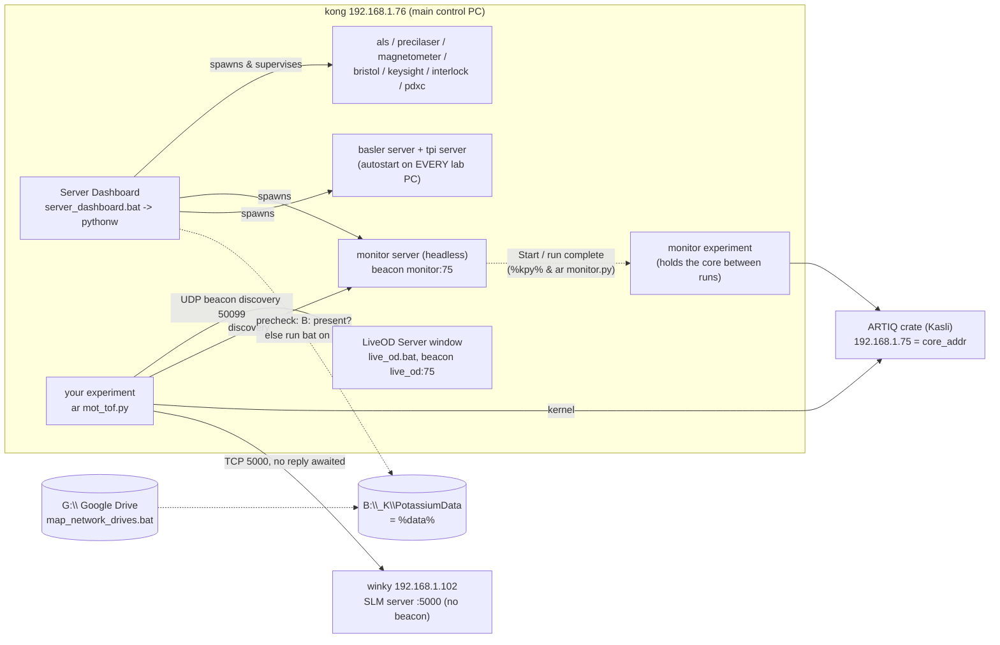

# Agent 01 report — Startup, PCs and network

Scope: everything between "the power came back" and "I can submit an experiment": which PC runs what, the Server/Client Dashboards, the LiveOD Server launch, the monitor server, every `kexp/_bat` launcher and shortcut, environment variables, the data drive, `kexp/config/ip.py`, `LAN_devices.csv`, beacon discovery as the code uses it, firewall, Remote Desktop vs console, and the `art` startup timer.

Evidence base: k-exp HEAD c8faf77 and wax HEAD acc4621 (both 2026-09-27, both **shallow clones**: k-exp history reaches back to about 2026-09-10 (fc47c68) and wax to 2026-09-24 (55068f8), so "since" dates earlier than that cannot be established here). `beacon` is not in the container. The private `ucsb-amo/code` repo is not attachable, but GitHub code search returned three short fragments of it (`setup/pc_setup.json`, `setup/setup.ps1`, `AGENTS.md`); those are cited as "code repo (GitHub search fragment)".

Confidence labels: **confirmed** (code/test shows it), **inferred** (strongly implied; basis given), **needs a human**.

---

## 1. operator_summary

The K machine is driven from one Windows PC, **kong** (`192.168.1.76`). Before any experiment can run you need two programs open on kong: the **Server Dashboard** (one window that starts and watches every small "server" program that talks to a piece of hardware: lasers, interlock, magnetometer, wavemeter, power supplies, cameras, picomotor, and the monitor server behind the Device Control GUI), and the **LiveOD Server** (the camera and data-saving window). Both depend on the shared data drive `B:` being mapped and on the lab network cable (`192.168.1.x`) being up; if either is missing when you start them, they quietly start less than you expect. After a power cut, also put the hardware in a known state with **Run MOT Observe** and make sure the Device Control status reads **Monitor ready**. Then you type `ar <experiment>.py` in a `kpy` terminal. The SLM has its own server on a separate PC (winky, `192.168.1.102`) that must be started at that PC's own screen, not over Remote Desktop.

---

## 2. mental_model

**Everyday comparison.** Think of kong as a restaurant kitchen at opening time. The Server Dashboard is the head chef who, when the lights come on, calls in each station cook (ALS laser, Precilaser, interlock, magnetometer, ...) and keeps an eye on whether each is at their station (the coloured light, "LED", on each panel). Each cook shouts their name and table number into the dining room every half second (the UDP "beacon"), so waiters (experiments, GUIs on other PCs) can find them without a seating chart. The LiveOD Server is the photographer and archivist. The **monitor** is the night porter who holds the keys to the hardware between services: its *office* (the monitor server) opens with the kitchen, but the porter himself (the monitor experiment) only clocks in when someone presses Start or when a run ends. The shared data drive `B:` is the pantry: if it is locked when the kitchen opens, no cook will start.



---

## 3. how_to

### 3.0 Candidate section: **Operator cheat sheet — startup and health checks**

Order matters: each line depends on the ones above it. "What healthy looks like" is the exact text/colour the code produces.

| # | Where | Do | Healthy looks like | If not |
|---|---|---|---|---|
| 0 | Rack, crate, switch | Power is back; network switch and ARTIQ crate on. (ARTIQ mains is switched by ethernet relay 1, and the code treats relay *energised* = ARTIQ *off*.) | `ping 192.168.1.75` answers from kong | needs a human (physical); see relay note in 5.12 |
| 1 | kong, logged in as the lab user | Check the lab adapter: `ipconfig` shows `192.168.1.76` | the Server Dashboard status bar later shows `kong  192.168.1.76` | if the adapter is down, nothing autostarts (demon D1) |
| 2 | kong | Google Drive running (`G:\Shared drives\...` visible); `B:` mapped: `dir B:\_K\PotassiumData` | directory lists | run `"G:\Shared drives\Weld Lab Shared Drive\Infrastructure\map_network_drives.bat"` by hand (the path in `kexp/config/ip.py:40`) |
| 3 | kong | Start **Server Dashboard**: `%bat%\server_dashboard.bat`, or type `dashboard` in any terminal (the `Dashboard.lnk` shortcut), or in a kpy terminal `python -m kexp.util.dashboard.server_dashboard_app` (use this last form if the window does not appear: it shows the traceback) | window title `kexp Server Dashboard - kong`; status bar `● 10 running   ○ 0 idle`, `data dir OK`, `kong  192.168.1.76`; every panel's LED green; conn badge `OK` on panels that have one | LED grey + `[ERR] DATA_DIR ... — cannot start` in the Log dock → step 2, then Servers menu → `Start autostart set (10)` |
| 4 | kong, Device Control panel (bottom of the dashboard) | Nothing yet — check its header LED | header LED green (= monitor *server* process alive). Status row pill red `Monitor not running` with the notice `Monitor not running: edits are not applied until it is started` and a **Start** button: this is **normal right after a dashboard start** (the monitor experiment is never auto-started) | pill `Monitor server unreachable` → the monitor server is down: header Start |
| 5 | kong | Start **LiveOD Server**: `%bat%\live_od.bat` (or `python -m kexp.util.live_od.gui.main_window`) | window title `LiveOD Server`; status strip grey pill `Idle` and `Next run: 83xxx`; log line `liveOD server listening on tcp://0.0.0.0:<port>` | `Next run: (unavailable)` → run-ID file on `B:` not readable (step 2) |
| 6 | kong, Device Control | After a power cut: **Run MOT Observe** (the `Run MOT Observe` button on the red untrusted banner, `waxx/util/guis/device_summary.py:263`, or the MOT Observe card in the Sequences tab, `sequences_panel.py:177`), or `ar mot_observe.py` in `%code%\k-exp\kexp\experiments\tools`, or `mot_observe.bat` | the run ends; the monitor is restarted by the run's end; pill turns green `Monitor ready` | pill stays red → click **Start** in the notice |
| 7 | winky (SLM PC), at its own screen | `wax\waxx-src\waxx\control\slm\server\server.bat` | console prints `LUT Loaded Successfully.`, `SLM Cleared to Blank Pattern.`, `Server listening on 192.168.1.102:5000...` | `Error: Failed to load LUT!` → see Demons (Remote Desktop) |
| 8 | any lab PC, kpy terminal | `cd %code%\k-exp\kexp\experiments\default_experiments` then `ar mot_tof.py` | prints `Run ID: 83xxx`; **no** lines starting `Failed to connect to Monitor`, `[PDXC] WARNING`, `Failed to connect to HMR Magnetometer server`, `[LiveOD] WARNING` | each of those means one server from step 3/5 is missing (section 6) |

Codes: step 3 (`kexp/_bat/server_dashboard.bat:7`; `server_dashboard_app.py:302-305` title; `waxx/util/dashboard/dashboard_window.py:741,810,813` status bar; `dashboard_window.py:782-783` counts text) — confirmed. Step 4 (`waxx/util/guis/device_control_gui.py:2069-2076`, `waxx/util/guis/device_summary.py:50-52`; `waxx/util/guis/monitor_server_headless.py:94-99` never auto-starts the monitor experiment) — confirmed. Step 5 (`kexp/config/live_od.py:86`; `waxx/util/live_od/gui/status_strip.py:28,142`; `waxx/util/live_od/live_od_server.py:767`; `main_window.py:514-519`) — confirmed. Step 6 (`kexp/experiments/tools/mot_observe.py:1-14`; `kexp/config/ip.py:65-67`; monitor restart on "run complete" `waxx/util/guis/monitor_server_headless.py:213-214`) — confirmed that the button runs this file; "monitor restarts after it" inferred from `waxx/base/expt.py:417-423` (end_wax → `signal_end`). Step 7 (`waxx/control/slm/server/slm_server.py:209,211,218`, `run_server.py:168`) — confirmed. Step 8 (`kexp/base/clients.py:22,31`, `kexp/control/misc/pdxc_apd_stage.py:41`, `waxx/base/expt.py:180,190`) — confirmed. Step 0/1/2 physical order — needs a human.

### 3.1 Start the Server Dashboard (kong)

1. Any of:
   - Double-click `%code%\k-exp\kexp\_bat\server_dashboard.bat` (`%bat%\server_dashboard.bat`). It runs `call %kpy%`, `cd %code%\k-exp`, `start "" pythonw -m kexp.util.dashboard.server_dashboard_app %*` (`kexp/_bat/server_dashboard.bat:5-7`) — confirmed. `pythonw` means **no console window**: if Python fails while importing, you see nothing at all (demon D2).
   - Start-menu search / terminal: the shortcut is now called **`Dashboard`** (`kexp/_bat/shortcuts/Dashboard.lnk` → `%code%\k-exp\kexp\_bat\server_dashboard.bat`). The `Server Dashboard.lnk` and `Client Dashboard.lnk` shortcuts were deleted on 2026-09-27 (commit c04c97b) — confirmed.
   - From a kpy terminal: `python -m kexp.util.dashboard.server_dashboard_app [--host-ip 192.168.1.76] [--include id1,id2] [--exclude id1,id2] [--no-autostart]` (`server_dashboard_app.py:3-8,108-114`) — confirmed. Running it this way shows import errors in the terminal.
2. The window appears **before** any server starts; after 1.2 s (one beacon round, so a server someone started by hand is recognised and marked EXTERNAL instead of started twice) it starts the autostart set (`server_dashboard_app.py:318-323`, `dashboard_window.py:425-443`) — confirmed.
3. Each server first passes a data-drive precheck on a worker thread (`waxx/util/dashboard/server_supervisor.py:340-383`) — confirmed.
4. Healthy: all LEDs green, status bar `● 10 running   ○ 0 idle   data dir OK   kong  192.168.1.76   log`.
5. Recover a single server: panel header **Start** (IDLE/CRASHED/EXTERNAL), **Stop** (RUNNING/STARTING), **Restart** (`waxx/util/dashboard/panel_header.py:199-212`) — confirmed. Recover all: status-bar counts button or Servers menu → `Start autostart set (N)`; `Stop all running servers` asks `Stop all servers?` first (`dashboard_window.py:690-713`) — confirmed.
6. The monitor server has no panel of its own. Its LED and Start/Stop/Restart are on the **Device Control** panel's header (since 2026-09-27, commit 69509c8; `server_dashboard_app.py:61-82,144-167`). Stop and Restart ask first, with the text quoted in 6.x, because the monitor server is killed at once together with the monitor experiment — confirmed (`tests/test_dashboard_monitor_controls.py`).

### 3.2 Start the LiveOD Server (kong)

1. `%bat%\live_od.bat` (`call %kpy%`, `cd %code%\k-exp\kexp\util\live_od\gui`, `python main_window.py`; `kexp/_bat/live_od.bat`) or `python -m kexp.util.live_od.gui.main_window` (`kexp/util/live_od/gui/main_window.py:1-23`) or the `LiveOD Server` shortcut — confirmed. This one runs with `python` (a console window stays open; closing that console closes the cameras: `waxx/util/live_od/gui/main_window.py:931` "Console handler installed: closing this console closes the cameras.") — confirmed.
2. `python -m waxx.util.live_od.gui.main_window` refuses: `waxx's liveOD window has no lab configuration of its own. Start it through the lab's launcher -- kexp: \`python -m kexp.util.live_od.gui.main_window\` or _bat/live_od.bat.` (`waxx/util/live_od/gui/main_window.py:1434-1437`) — confirmed.
3. Healthy: title `LiveOD Server`, grey `Idle` pill, `Next run: <id>`. There is **no** "Mother is watching..." line any more (section 11).
4. Rule from the migration plan: never restart liveOD mid-run; check the status strip is not `Running`/`Saving` (`waxx/util/live_od/MIGRATION_PLAN.md` rule 5) — confirmed (doc).

### 3.3 Start the monitor (Device Control)

1. After the dashboard starts, the monitor **server** runs but the monitor **experiment** does not, by design: "Starting automatically would interrupt any experiment already running on the hardware when the dashboard is (re)started" (`waxx/util/guis/monitor_server_headless.py:94-99`) — confirmed.
2. Start it: the **Start** button in the notice beside the status pill, or right-click the pill → `Start monitor experiment` (`device_control_gui.py:2043-2060`; `device_summary.py:121-175`) — confirmed. If the monitor was interrupted by a run, or liveOD says a run is in progress, Start asks `Start monitor` / "An experiment probably holds the core device ... Start the monitor anyway?" (`device_control_gui.py:2168-2190`) — confirmed.
3. It also starts by itself when any experiment ends (`run complete` message, `monitor_server_headless.py:213-214`) — confirmed.
4. The monitor server launches the monitor experiment with the shell command `%kpy% & ar <path to kexp\experiments\tools\monitor.py>` (`waxx/util/device_state/monitor_manager.py:84-86,245-247`; path `kexp/config/ip.py:64`) — confirmed. So `ar` must be findable on kong's PATH (3.5).

### 3.4 Submit an experiment

1. Open a kpy terminal (Windows Terminal profile `kpy`, which opens `cmd /k %kpy%`; PC-Setup) — needs a human for the profile details (code repo).
2. `cd %code%\k-exp\kexp\experiments\default_experiments` then `ar mot_tof.py` (file exists: `kexp/experiments/default_experiments/mot_tof.py`) — confirmed.
3. `ar` is the shortcut `kexp/_bat/shortcuts/ar.lnk`: target `%code%\.venv\Scripts\artiq_run.exe`, arguments `--device-db %db%` (strings of `ar.lnk`) — confirmed. It works from any terminal only after `setup_shortcuts.ps1` put the shortcuts folder on the machine PATH and `.LNK` in PATHEXT (`kexp/_bat/setup_shortcuts.ps1:1-9,97-135`) — confirmed.
4. `art <file>.py` does the same with a startup timeline (3.9).

### 3.5 One-time PC setup pieces this area owns

1. `bootstrap_pc.ps1` one-liner (as yourself, not admin): `powershell -NoProfile -ExecutionPolicy Bypass -Command "irm https://raw.githubusercontent.com/ucsb-amo/k-exp/main/kexp/_bat/bootstrap_pc.ps1 | iex"` (`kexp/_bat/bootstrap_pc.ps1:9`). Installs Git with winget if missing, picks the code folder (`-CodeDir`, else machine `%code%`, else asks, default `%USERPROFILE%\code`), clones `https://github.com/ucsb-amo/code.git`, converts an old non-git code folder in place after listing the files it would replace, then runs `code\setup\setup.ps1`. Options `-CodeDir`, `-NoSetup`, `-Yes` (`bootstrap_pc.ps1:17-22,46-130`) — confirmed. What `setup.ps1` does — needs a human (code repo; fragment shows steps `envvars    code, kpy, db, dbtest, bat, data; LLVM on PATH; the lab shortcuts [admin]`, `venv`, `terminal`, `verify`).
2. `setup_shortcuts.ps1` (elevated): `powershell -NoProfile -ExecutionPolicy Bypass -File "%code%\k-exp\kexp\_bat\setup_shortcuts.ps1"` [-WhatIf] [-ExcludeRestOfCode]. Appends `%code%\k-exp\kexp\_bat\shortcuts` to the **end** of the machine PATH as REG_EXPAND_SZ, adds `.LNK` to system (and user, if present) PATHEXT, adds the folder to the Windows Search index; backs up to `%LOCALAPPDATA%\kexp\env_backup_HKLM_<stamp>.reg` and `search_rules_backup_<stamp>.txt`; broadcasts WM_SETTINGCHANGE (`setup_shortcuts.ps1:22-27,38-40,97-150,152-319`) — confirmed. Requires machine-scope `%code%` (`setup_shortcuts.ps1:84-88`) — confirmed.
3. `set_adapter_ip.bat` (Start-menu `Set Adapter IP`): self-elevates, then runs `%code%\beacon\beacon\network\set_adapter_ip.ps1`, which uses `%code%\beacon\beacon\network\LAN_devices.csv` (MAC → IP) (`kexp/_bat/set_adapter_ip.bat:8-60`) — confirmed that the .bat does this; what the .ps1 does — needs a human (beacon). The copy at `kexp/util/network/LAN_devices.csv` is **not** the one it reads; nothing in k-exp or wax reads that copy (grep) — confirmed.
4. Firewall: see 4.6 and section 11 (Network-and-Firewall-Setup verdicts).

### 3.6 SLM server on winky (192.168.1.102)

1. Sit at winky's own screen, or connect with something that shows the real screen (VNC, TeamViewer, AnyDesk, Chrome Remote Desktop). Not Windows Remote Desktop (Demons page; `waxx/control/slm/server/server.bat:5-11`) — best explanation per Demons page; hand-back code confirmed.
2. Run `server.bat` (`%code%\wax\waxx-src\waxx\control\slm\server\server.bat`). It reads `query session`; if the session name starts with `rdp`, it runs `tscon <id> /dest:console` elevated (your RDP window closes), waits up to 30 s for the console, then waits up to 20 s for Windows to see ≥ 2 displays, then `call %kpy%` and `python run_server.py` (`server.bat:13-62`) — confirmed.
3. Server binds `192.168.1.102:5000`, no beacon (`run_server.py:10-11`) — confirmed. It re-initialises the SLM (and LUT) every 3600 s when idle ≥ 20 s (`run_server.py:14-15,140-161`) — confirmed.

### 3.7 Look at the machine from another PC

1. Client Dashboard: `%bat%\client_dashboard.bat` (`start "" pythonw -m kexp.util.dashboard.client_dashboard_app`), starts no servers; panels: Device Control, Ethernet Relay, Remote Control, Keysight, TPI, Bristol, Camera Viewer (visible), ALS, Precilaser, HMR Magnetometer, Interlock (read-only view) (hidden by default) (`kexp/_bat/client_dashboard.bat`, `kexp/util/dashboard/client_registry.py:30-132`) — confirmed.
2. LiveOD remote viewer: `%bat%\live_od_viewer.bat`, the `Viewer (LiveOD)` shortcut, or `python -m kexp.util.live_od.gui.remote_viewer_window [ip] [port]` (`kexp/util/live_od/gui/remote_viewer_window.py:1-19`). It finds liveOD by the beacon `live_od_broadcast[:<hw id>]` (`waxx/util/live_od/gui/remote_viewer_window.py:327-336`) — confirmed.
3. Camera Viewer without a server: `%bat%\camera_viewer.bat` → `python -m beacon.camera.viewer.app` — confirmed (beacon internals needs a human).
4. Do **not** start the Server Dashboard (`Dashboard` shortcut) on another lab PC unless you mean it: it autostarts a Basler server and a TPI server on **every** `192.168.1.x` PC (4.4, bug F5).

### 3.8 When the data drive is missing

1. Symptom: dashboard status bar `data dir UNREACHABLE` (red); each server panel's Log shows `[ERR] DATA_DIR unreachable; map-network-drives bat not found at G:\Shared drives\Weld Lab Shared Drive\Infrastructure\map_network_drives.bat — cannot start` and its LED stays grey.
2. Fix: start Google Drive (so `G:` exists), run the map bat, check `dir B:\_K\PotassiumData`, then Servers → `Start autostart set (10)`. The dashboard does not retry by itself (`server_supervisor.py:385-405`: stays IDLE "so a later click retries") — confirmed.

### 3.9 Timed run with `art` and how to read it

1. `art <file>.py [artiq_run args] [--timing-json <path>] [--check-hooks]` (`kexp/_bat/shortcuts/art.bat:2-5`). It runs `"%code%\.venv\Scripts\python.exe" "%code%\wax\waxx-src\waxx\util\profiling\startup_timer.py" --host-steps-file "%code%\k-exp\kexp\util\profiling\startup_steps.py" --device-db "%db%" %*` — confirmed. It does **not** need `%kpy%` (calls the venv python directly) — confirmed.
2. The experiment runs for real (same hardware activity as `ar`) (`startup_timer.py:8-10`) — confirmed.
3. `art --check-hooks` runs nothing and prints `  ok       <hook>` / `  MISSING  <hook>` per hook; exit code 1 if any missing (`startup_timer.py:419-424`) — confirmed.
4. Floor measurement: `art %code%\wax\waxx-src\waxx\util\profiling\baseline_bare.py` (core.reset only; `baseline_bare.py:1-19`) — confirmed.
5. Reading the report (printed to **stderr** at exit, even when the run raises; `startup_timer.py:300-396,429-432`): see 5.20.

---

## 4. reference_facts

### 4.1 PCs and what runs where

| Name | Lab IP | Role (what the code says) | Evidence | Confidence |
|---|---|---|---|---|
| kong | 192.168.1.76 | Main control PC. The only host in the dashboard autostart table: runs all hardware-owning servers, the monitor server, and (by practice) the LiveOD Server. SRS and PDXC server IPs are kong. Lab user folder `C:\Users\jarjarbinks` | `kexp/util/dashboard/dashboard_hosts.py:28-38`; `kexp/config/ip.py:75,113-114`; `kexp/util/network/LAN_devices.csv:3`; `.lnk` files made on host "kong" point into `C:\Users\jarjarbinks\code`; `kexp/_bat/skynet.bat:18` | confirmed (IP, autostart); inferred (user name) |
| ARTIQ crate (Kasli) | 192.168.1.75 | `core_addr` of the K device db, therefore hardware id `75` | `kexp/util/db/device_db.py:3`; `LAN_devices.csv:2`; `_bat/dashboard/start_moninj_proxy.bat` | confirmed |
| ARTIQ test crate | 192.168.1.86 | A second crate; a device db pointing at it gives hardware id `86` (the example in `hardware_id.py`) | `LAN_devices.csv:13`; `waxx/util/comms_server/hardware_id.py:8-9` | confirmed (listing); which PC drives it: needs a human (krool has a reserved .93 "krool ethernet for connection to test crate", `LAN_devices.csv:20`) |
| krool (phys-10krool) | 192.168.1.79 (+ .93 reserved) | Analysis / second PC; user `C:\Users\bananas` | `LAN_devices.csv:6,20,50`; `.lnk` host fields | confirmed (listing); role needs a human |
| winky | 192.168.1.102 | SLM PC: SLM server binds `192.168.1.102:5000` | `LAN_devices.csv:27`; `waxx/control/slm/server/run_server.py:10-11`; `waxx/control/slm/slm.py:15` | confirmed |
| chunky | 192.168.1.90 ("chunky (machine usb hub)"); Broida "chunky (ry laser table)" | Old shortcuts (`LiveOD Server`, `MOT Observe`, `FIx Run ID`, tray-launcher ones) were made on "chunky" with user `C:\Users\scientist` | `LAN_devices.csv:17,55`; `.lnk` strings | confirmed (listing); what it runs now: needs a human |
| USB-over-network hubs | lanky .84, "new lab usb hub" .104, wanderer0 .111 | Listed as USB hubs on the LAN | `LAN_devices.csv:11,29,36` | confirmed (listing); how cameras/serial reach kong through them: needs a human |
| Other named PCs | tiny .95, sheck .114, koopa dongle .118, rambi .119, goomba .120, toad .121 | Listed only | `LAN_devices.csv:22,39,43-46` | confirmed listing only |
| "camera PC" | — | No code names a separate camera PC. liveOD opens its cameras locally (`use_camera_host=False`, CameraNanny), so liveOD must run on the PC the cameras are plugged into | `kexp/config/live_od.py:78-81` | inferred; which PC holds the cameras physically: needs a human |

### 4.2 `kexp/config/ip.py` in full (file has a UTF-8 BOM, line 1)

| Name | Value | Line | Notes |
|---|---|---|---|
| `EMAIL_CREDENTIALS_FILEPATH` | `G:\Shared drives\Tweezers\Environments and Profiles\email_notification_gmail_credentials.txt` | 5 (from `waxx/config/ip.py:6`) | run-done emails; needs G: |
| `INTERLOCK_EMAIL_CREDENTIALS_FILEPATH` | `G:\Shared drives\Tweezers\Environments and Profiles\interlock_gmail_credentials.txt` | 6 | |
| `DATA_DIR` | `os.getenv("data")` | 9 | `None` if unset |
| `_CODE_DIR` | `os.getenv("code")` | 10 | |
| `_safe_join` | returns `None` if base is `None` | 13-23 | silent `None` paths (see 5.5) |
| `EXPT_PACKAGE_DIR` | `%code%\k-exp\kexp` | 26 | |
| `LOG_DIR`, `SERVER_LOG_DIR`, `CLIENT_LOG_DIR` | `%data%\_logs`, `\_logs\server`, `\_logs\client` | 33-35 | |
| `EXPT_PARAM_RELPATH`, `BASE_CLASS_RELPATH`, `PATHS` | `config\expt_params.py`, `base`, tuple | 36-38 | used by DataSaver (`kexp/config/live_od.py:70`) |
| `MAP_BAT_PATH` | `"G:\Shared drives\Weld Lab Shared Drive\Infrastructure\map_network_drives.bat"` (with quotes) | 40 | commented alternative `map_fake_network_drive.bat` line 41 |
| `FIRST_DATA_FOLDER_DATE` | 2023-06-22 | 42 | |
| `server_talk` | `waxa.data.server_talk(data_dir=DATA_DIR, run_id_relpath="run_id.py", roi_spreadsheet_replath="roi.xlsx", ..., on_data_dir_disconnected_bat_path=MAP_BAT_PATH)` | 44-48 | the run-ID file is `%data%\run_id.py` |
| `MONITOR_STATE_FILEPATH` | `%data%\device_state_config_<hw id>.json` (kong: `device_state_config_75.json`); `%data%\device_state_config.json` if hardware id unresolvable | 55-62 | computed **at import**, runs the device db |
| `MONITOR_EXPT_PATH` | `%code%\k-exp\kexp\experiments\tools\monitor.py` | 64 | |
| `RESET_STATE_EXPT_PATH` | `...\experiments\tools\mot_observe.py` | 67 | "Run MOT Observe" |
| `AUTO_TOF_EXPT_PATH`, `RUN_LOOP_EXPTS` | `...\tools\auto_tof.py`; `{'auto_tof': ('BEC TOF loop', ...)}` | 71-72 | |
| `SRS_CONTROL_IP` | 192.168.1.76 | 75 | also the ALS panel's `ip` (`kexp/util/guis/lasers/als/als_panel.py:39-45`) |
| `SRS_DC205_SERVER_PORT`, `SRS_DC205_COM` | 5555, COM10 | 76-77 | not in the dashboard; `dc205_server.bat` |
| `SRS_SR560_SERVER_PORT`, `SRS_SR560_COM` | 5556, COM9 | 78-79 | `sr560_server.bat` |
| `ETHERNET_RELAY_IP`, `_PORT` | 192.168.1.109, 2101 | 82-83 | relay: 1 ARTIQ main power, 2 magnet inhibit, 3 K source, 4 ARTIQ satellites (`kexp/control/ethernet_relay.py:9-12`) |
| `ALS_COM` | COM6 | 86 | |
| `PRECILASER_COM` | COM20 | 89 | |
| `MAGNETOMETER_COM` | COM33 | 92 | |
| `MAGNETOMETER_REFERENCE_CSV_PATH` | `%data%\magnetometer_reference.csv` | 93 | |
| `INTERLOCK_COM` | COM5 | 96 | |
| `WAVEMETER_MOGLABS_IP` | 192.168.1.94 | 99 | |
| `BRISTOL_WAVEMETER_IP` | 192.168.1.105 | 102 | |
| `KEYSIGHT_SUPPLIES` | `(170, '192.168.1.77')`, `(500, '192.168.1.78')` | 105-108 | CSV calls .77 "160A Keysight" (`LAN_devices.csv:4`): mismatch, needs a human |
| `DEVICE_ID_KINESIS_REF_BEAM_WAVEPLATE_ROTATOR` | 27500961 | 111 | |
| `PDXC_SERVER_IP`, `PDXC_COM` | 192.168.1.76, COM40 | 114-115 | |
| `AWG_IP` | `TCPIP::192.168.1.83::inst0::INSTR` | 119 | one connection at a time; held by the monitor server between runs |
| `WHITELIST_PATH` | `%data%\remote_whitelist.json`, else next to ip.py | 122-126 | remote control |

All confirmed from `kexp/config/ip.py`. History: only two commits in reach (fc6b15c 2026-09-26 added reset/run-loop paths; fc47c68 2026-09-10).

### 4.3 Environment variables

| Var | Set to (per `code/setup/pc_setup.json`, GitHub search fragment) | Read by (code) | If unset/wrong | Confidence |
|---|---|---|---|---|
| `code` | the code folder, e.g. `C:\Users\<you>\code` | `kexp/config/ip.py:10` (monitor/reset/loop paths); every `.bat` (`%code%\...`); `ar.lnk`, `art.bat`; `setup_shortcuts.ps1:84`; `waxx/util/device_state/generate_state_file.py:24`, `update_state_file.py:30`, `gui.py:18` (`Path(os.getenv('code'))`, TypeError if unset); `bootstrap_pc.ps1:63` | monitor server exits with `MONITOR_EXPT_PATH is None ...` (6.4); .bats fail with bad paths | confirmed |
| `kpy` | `%code%\.venv\Scripts\activate` (a .bat, not an interpreter) | every `.bat` (`call %kpy%`); the monitor launch command `%kpy% & ar <expt>` (`monitor_manager.py:84-86`); `server.bat:45` on winky | monitor experiment fails to launch (6.5) | confirmed |
| `db` | `%code%\k-exp\kexp\util\db\device_db.py` | `ar.lnk` (`--device-db %db%`); `art.bat`; `waxx/util/comms_server/hardware_id.py:46` (hardware id → beacon ids and the state-file name); `_bat/dashboard/start_artiq_master_only.bat` | no hardware id: unscoped ids `monitor`/`live_od` and unscoped state file (5.6, D9) | confirmed |
| `dbtest` | `...\device_db_test.py` | nothing in k-exp or wax; the file is not in the k-exp repo (`kexp/util/db/` holds only `device_db.py`) | nothing | confirmed (no reader); purpose needs a human |
| `bat` | `%code%\k-exp\kexp\_bat` | nothing in code (convenience: `cd %bat%`) | nothing | confirmed |
| `data` | `B:\_K\PotassiumData\` (trailing backslash) | `kexp/config/ip.py:9`; `waxa/data/server_talk.py:17` default; `waxa/data/data_saver.py:1195`; `waxa/browser/browser_window.py:3956`; `kexp/util/guis/interlock/interlock_server.py:264` (`data` or `DATA_DIR`); `kexp/util/live_od/camera_mother.py:16`; `waxx/util/device_state/generate_state_file.py:25`; `magnetometer_gui_arduino.py:70` (`DATA`, same var on Windows) | `DATA_DIR is not configured — cannot start` for every dashboard server (6.2) | confirmed |
| `WAXA_DATA_UNC` | `\\bananastand.physics.ucsb.edu\anewstart` | **nothing** in k-exp or wax at HEAD (grep; GitHub code search finds the name only in `code/setup/pc_setup.json`) | nothing | confirmed |
| `WAX_VERBOSITY` | (not set by setup) | `waxx/util/console.py:28` | default NORMAL | confirmed |
| `CLAUDE_CONFIG_DIR` | set by `skynet.bat` to `C:\Users\jarjarbinks\.claude` | Claude Code | — | confirmed |

Machine scope matters: `setup_shortcuts.ps1` refuses unless `code` is machine-scope (`:84-88`); the dashboard's children inherit the dashboard's environment (`kexp/util/guis/device_state_gui/monitor_server_headless.py:45-49` "The dashboard inherits its environment from whatever launched it") — confirmed.

### 4.4 Server Dashboard registry and autostart (kong)

`HOST_AUTOSTART_SERVERS` (`kexp/util/dashboard/dashboard_hosts.py:22-39`): `"*": ["basler", "tpi"]` (every PC whose IP resolves to `192.168.1.x`), `"192.168.1.76": ["als","precilaser","monitor","magnetometer","bristol","basler","keysight","interlock","pdxc"]`. Union on kong = all 10 specs (`waxx/util/dashboard/host_config.py:98-115`) — confirmed.

| id | Panel label | Command (`sys.executable` = the dashboard's `pythonw.exe`) | Beacon id used for EXTERNAL check | COM | Graceful stop (client) | Stop timeout | Line |
|---|---|---|---|---|---|---|---|
| als | ALS Laser | `-m kexp.util.guis.lasers.als.als_server` | `als_laser` | COM6 | yes (ALSGuiClient) | 1.5 s | `server_registry.py:68-81` |
| precilaser | Precilaser | `-m kexp.util.guis.lasers.precilaser.precilaser_server` | `precilaser` | COM20 | yes | 1.5 s | 82-95 |
| monitor | Monitor (no panel; controls on Device Control header) | `-m kexp.util.guis.device_state_gui.monitor_server_headless` | **none** | — | **no** (killed) | 3.0 s | 96-112 |
| magnetometer | HMR Magnetometer | `-m kexp.util.guis.magnetic_field_monitor.magnetometer_hmr_server` | `magnetometer` | COM33 | yes (HMRClient) | 1.5 s | 113-128 |
| bristol | Bristol Wavemeter | `-m kexp.util.guis.wavemeter_monitor.bristol.bristol_server` | `bristol_wavemeter` | — | no | 1.5 s | 129-141 |
| basler | Basler server · Camera Viewer | `-m beacon.basler.server_headless` | **none** | — | no | 3.0 s | 142-154 |
| keysight | Keysight Supplies | `-m kexp.util.guis.keysight_monitor.keysight_server_headless` | `keysight` | — | no | 1.5 s | 155-167 |
| interlock | Interlock | `-m kexp.util.guis.interlock.interlock_server` | `interlock` | COM5 | yes (InterlockClient) | 4.0 s | 168-182 |
| pdxc | PDXC Picomotor | `-m kexp.control.serial.server.pdxc_server` | `pdxc` | COM40 | yes (PDXC_Client) | 1.5 s | 183-197 |
| tpi | TPI Signal Generators | `-m beacon.tpi.server` | **none** | — | no | 1.5 s | 198-211 |

Defaults for every spec: `restart_on_crash=False` (a crashed server stays red), `requires_data_dir=True` (every server, the interlock included, waits for the data-drive precheck) (`waxx/util/dashboard/panel_spec.py:143-150`) — confirmed. Extra client panels on the server dashboard: `device_control`, `remote_control`, `ethernet_relay` (`server_dashboard_app.py:55-59`) — confirmed.

### 4.5 Discovery ids, ports and what `hardware_id` does

| Thing | Value | Evidence | Confidence |
|---|---|---|---|
| Discovery (beacon) UDP port | 50099 (`beacon.discovery.DISCOVERY_PORT`, re-exported) | `waxx/util/comms_server/__init__.py:3`; value only in the comment `waxx/util/comms_server/state_broadcast.py:24-25` and wiki | inferred (value lives in beacon: needs a human) |
| Beacon period | "every 0.5 s" | comments `server_supervisor.py:173-174`, `dashboard_window.py:428-429` | inferred |
| Device-state push | UDP 50100 to `192.168.1.255` (directed broadcast) | `state_broadcast.py:26-27,48` | confirmed |
| Hardware id | last octet of `core_addr` from the device db at `%db%` (executed with `runpy`, cached by file mtime, ~5 ms); `None` if `db` unset, file missing, exec fails, no `core_addr`/`device_db["core"]["arguments"]["host"]`, or octet not 0-255 | `hardware_id.py:38-116` | confirmed |
| Scoped ids | `monitor:<hw>`, `live_od:<hw>`, `live_od_broadcast:<hw>`; plain base id when no hw id | `hardware_id.py:119-136`; `live_od_server.py:96`; `live_od_broadcaster.py:58` | confirmed |
| On kong | `monitor:75`, `live_od:75`, `live_od_broadcast:75` | `device_db.py:3` + above | inferred (assumes kong's `%db%` is the repo file) |
| Unscoped ids | `als_laser`, `precilaser`, `magnetometer`, `bristol_wavemeter`, `keysight`, `interlock` (TCP 5570 fixed), `pdxc` | `waxx/util/guis/als/als_server.py:129`, `precilaser_server.py:91`, `hmr_magnetometer_server.py:178`, `bristol_wavemeter_server.py:24`, `keysight_server.py:40`, `kexp/util/guis/interlock/interlock_server.py:64,124`, `waxx/control/misc/pdxc.py:33,519` | confirmed |
| Client lookup without hw id | prefix discovery for 1.5 s; exactly one match → use it; zero or several → `RuntimeError` (clients) or `None` (viewers, retry) | `hardware_id.py:148-198` | confirmed |
| Duplicate refusal | monitor server only: `discover(monitor:<hw>, 1.5 s)` before starting | `waxx/util/guis/monitor_server_headless.py:234-251`; windowed `monitor_server_gui.py:1005-1019` | confirmed; liveOD has no such check |
| beacon names the code calls | `beacon.discovery` (`NetServer`, `NetClient`, `discover`, `discover_prefix`, `DISCOVERY_PORT`), `beacon.discovery.server.NetServer`, `beacon.discovery.client` (`NetClient`, `discover`, `discover_prefix`); `NetClient._rediscover(timeout=2.0)`; `NetServer._start_beacon/_stop_beacon`, attribute `_waxx_port`; modules run: `beacon.basler.server_headless`, `beacon.basler.server_gui`, `beacon.basler.gui`, `beacon.basler.cameras_gui`, `beacon.camera.viewer.app`, `beacon.tpi.server`, `beacon.tpi.gui`; file `%code%\beacon\beacon\network\set_adapter_ip.ps1` + `LAN_devices.csv` | `grep` over k-exp and wax; `comm_server.py:40-45`, `comm_client.py:45-49`, `live_od_server.py:761-766` | confirmed that the code calls these; their behaviour: needs a human |

### 4.6 Ports a firewall must pass (lab subnet only)

| Port | Proto | Direction on | Who | Fixed? | Evidence |
|---|---|---|---|---|---|
| 50099 | UDP | inbound on every PC that *looks for* servers (clients, and kong itself for EXTERNAL detection and for liveOD/monitor lookups) | beacon discovery | fixed | 4.5 (inferred value) |
| 50100 | UDP | inbound on every PC running a Device Control GUI | monitor state push | fixed | `state_broadcast.py:26` |
| 49152-65535 | TCP | inbound on server PCs | OS-assigned server ports; pyzmq `bind_to_random_port` default range (liveOD REP, broadcaster) | dynamic | `live_od_server.py:761`; `comm_server.py:40-41` (`port=0`) |
| 5570 | TCP | inbound on kong | interlock server | fixed (outside the ephemeral range) | `interlock_server.py:64` |
| 5000 | TCP | inbound on winky | SLM server | fixed | `run_server.py:11` |
| 5555 / 5556 | TCP | inbound on kong | SRS DC205 / SR560 servers (not in dashboard) | fixed | `ip.py:76,78` |
| 2101 | TCP | outbound from kong to .109 | ethernet relay | fixed | `ip.py:83` |
| 1382 | TCP | outbound to core | ARTIQ core analyzer (tests) | fixed | `kexp/experiments/test/analyzer_fetch_test.py:37` |

Program identity: the Server Dashboard runs as **`pythonw.exe`** and starts every server with its own `sys.executable`, so every supervised server is `%code%\.venv\Scripts\pythonw.exe`, not `python.exe` (`server_dashboard.bat:7`, `server_registry.py:36`) — confirmed. LiveOD, `ar`, `art` and the SLM server run under `python.exe`/`artiq_run.exe` — confirmed.

### 4.7 Launchers in `kexp/_bat` (status as of c8faf77)

| File | Runs | Status | Evidence |
|---|---|---|---|
| `server_dashboard.bat` | `start "" pythonw -m kexp.util.dashboard.server_dashboard_app %*` | **current** (pythonw since 2026-09-24, ac3a6c6) | file |
| `client_dashboard.bat` | `start "" pythonw -m kexp.util.dashboard.client_dashboard_app %*` | current | file |
| `live_od.bat` | `python main_window.py` in `kexp\util\live_od\gui` | current | file |
| `live_od_viewer.bat` | `python remote_viewer_window.py` | current | file |
| `camera_viewer.bat` | `python -m beacon.camera.viewer.app` (viewer only) | current | file |
| `data_browser.bat` | `python kexp\util\data_browser\data_browser.py` | current | file |
| `mot_observe.bat` | `ar mot_observe.py` in `experiments\tools` (the reset-state experiment) | current | file |
| `background_field.bat` | `ar background_field.py` in `experiments\tools` | current (a real run) | file |
| `device_control_gui.bat` | standalone Device Control GUI | current (client only) | file |
| `regenerate_device_state_file.bat` | `generate_state_file.py` → writes `MONITOR_STATE_FILEPATH` directly | current, careful: bypasses the monitor server | `kexp/util/guis/device_state_gui/generate_state_file.py:1-14` |
| `monitor_server_gui.bat` | windowed monitor server | legacy duplicate of the dashboard's headless one; refused if one runs | file; `monitor_server_gui.py:1005-1019` |
| `als_server.bat`, `precilaser_server.bat`, `bristol_wavemeter_server.bat`, `magnetometer_server.bat` | the same servers the dashboard runs | legacy standalone; dashboard marks them EXTERNAL (beacon ids exist) | files |
| `als_gui.bat`, `precilaser_gui.bat`, `bristol_wavemeter_gui.bat`, `magnetometer_gui.bat`, `magnetometer_arduino_gui.bat`, `keysight_gui.bat` (vxi11 direct to the supplies), `interlock_gui.bat` (spawns its own interlock server child), `ethernet_relay_gui.bat`, `remote_control.bat`, `detuning_plotter.bat`, `ODT_picomotor_control.bat` | standalone GUIs | legacy/occasional | files; `interlock_gui.py:1-18` |
| `basler_gui.bat` | `start "Basler Server" cmd /k python -m beacon.basler.server_gui` then `python -m beacon.basler.gui` | **starts a second Basler server** if the dashboard runs one (no beacon id → no EXTERNAL detection) | file; 4.4 |
| `tpi_gui.bat` | `start "TPI Server" cmd /k python -m beacon.tpi.server` + GUI | same double-start risk | file |
| `dc205_server.bat`, `sr560_server.bat` | SRS servers (fixed ports 5555/5556) | not in dashboard | files |
| `fix_run_id.bat` | `python %code%\wax\waxa-src\waxa\data\increment_run_id.py` | **broken: target does not exist** | `ls wax/waxa-src/waxa/data` |
| `set_adapter_ip.bat` | elevated `%code%\beacon\beacon\network\set_adapter_ip.ps1` | current (needs beacon) | file |
| `setup_shortcuts.ps1`, `bootstrap_pc.ps1` | PC setup | current (2026-09-26 / 09-27) | files |
| `skynet.bat` | `runas /savecred /user:skynet` a cmd that maps `B:` read-only (`net use B: \\bananastand.physics.ucsb.edu\anewstart /persistent:no`), sets `CLAUDE_CONFIG_DIR`, `call %kpy%`, runs `claude` | current (Claude Code as read-only user on kong) | file |
| `skynet_log_sync.bat` | robocopy `C:\lab\skynet_log` → `G:\Shared drives\Tweezers\Other\skynet_log` (never deletes), log `C:\lab\skynet_log_sync.log` | current (Task Scheduler) | file |
| `delete_artiq_dataset_garbage.bat` | `del /s /q dataset_db.mdb dataset_db.mdb-lock` under `%code%\k-exp` | legacy artiq_master cleanup | file |
| `tray_launcher.bat`, `_start_all_tray_launcher_scripts.bat`, `_restart_all_tray_launcher_scripts.bat`, `_terminate_tray_launcher_scripts.bat`, `auto-launch/autolaunch-interlockGUI.bat` | `launcher run/start/restart/terminate` over `%USERPROFILE%\.tray_launcher\scripts\*.bat` | **legacy** ("nothing runs them", code repo AGENTS.md fragment); `tray-launcher==1.0.9` still pinned in the code repo `pyproject.toml` fragment, so they still work if clicked | files; GitHub search | 
| `dashboard/start_artiq_dashboard.bat` (+ `_master_only`, `_dashboard_only`, `start_moninj_proxy.bat`, `start_artiq_coreanalyzer_proxy.bat`) | `artiq_master --device-db %db% --repository %code%\k-exp\kexp --experiment-subdir experiments`, `artiq_dashboard`, `aqctl_moninj_proxy 192.168.1.75`, `aqctl_coreanalyzer_proxy 192.168.1.75` (after `B:` / `cd %data%`) | **legacy/retired** ("do not use them", AGENTS.md fragment) | files |
| `watcher/*` | `artiq_run preview_experiment.py`, `python watch_for_ods.py` in `kexp\analysis\preview` | **dead: `kexp/analysis/preview` does not exist** | `ls` |
| `old/*` | `util\guis\{dac_als,dac,dds,ttl}\*.py` | **dead: moved to `util/guis/_old`** | `ls` |
| `spot_finder.bat.lnk`, `spot_finder.lnk` | `kexp\calibrations\SLM_spot_finder\spot_finder.bat`; `wax\waxx-src\waxx\control\slm\spot_finder\spot_finding.bat` | current / older tool | `.lnk` strings |
| `kexp/_bat/__init__.py` | empty | — | |

### 4.8 Shortcuts (`kexp/_bat/shortcuts`, on PATH via `setup_shortcuts.ps1`)

Names you can type or search: `ar`, `art` (`art.bat` wins over `art.lnk` because `.BAT` precedes `.LNK` in PATHEXT: inferred), `Dashboard` (→ `server_dashboard.bat`), `LiveOD Server`, `Viewer (LiveOD)`, `Device Control GUI`, `Data Browser`, `MOT Observe`, `Background Field`, `Regenerate State File`, `Set Adapter IP`, `FIx Run ID` (sic, broken target), `Ethernet Relay GUI`, `Magnetometer GUI`, `Basler GUI`, `TPI GUI`, `Bristol Wavemeter GUI`, `Bristol Wavemeter Server`, `Detuning Plotter`, `Start/Restart/Terminate All Tray Launcher Scripts` (legacy). Icon `banana.ico`. Removed 2026-09-27: `Server Dashboard`, `Client Dashboard` (c04c97b).

Shortcuts whose only stored target is a per-user absolute path (no `%code%` form), so on another PC they rely on Windows' relative-path fallback: `Detuning Plotter`, `Device Control GUI`, `Ethernet Relay GUI` (C:\Users\bananas), `FIx Run ID`, `LiveOD Server`, `MOT Observe` (C:\Users\scientist), `art.lnk`, `spot_finder.bat.lnk`, `TPI GUI` (C:\Users\jarjarbinks) — confirmed from `.lnk` strings; whether they resolve on kong: needs a human.

### 4.9 Where the logs are

| Process | File | Evidence |
|---|---|---|
| Server Dashboard (and every server's output, tagged `[OUT]`/`[ERR]`) | `%data%\_logs\server\dashboard__<host lowercase>.log` (+ `.fault` for native crashes), rotating 5 MB × 5 | `server_dashboard_app.py:173`; `logging_setup.py:190-196,259`; `server_supervisor.py:629-637` |
| Monitor server | `%data%\_logs\server\monitor__kong.log`; ops journal `%data%\_logs\ops_journal\` | `kexp/.../monitor_server_headless.py:62,82` |
| Interlock server | `%data%\_logs\server\interlock__kong.log` | `interlock_server.py:44` |
| ALS / HMR servers | `%data%\_logs\als_server.log`, `%data%\_logs\hmr_magnetometer_server.log` | `kexp/util/guis/lasers/als/als_server.py:7`; `magnetometer_hmr_server.py:17` |
| Client Dashboard / standalone GUIs | `%data%\_logs\client\dashboard__<host>.log` | `logging_setup.py:278` |
| Fallback when `%data%\_logs` is not writable at start | `%LOCALAPPDATA%\kexp\dashboard\_logs\{server,client}\` (+ status-bar boot warning for 10 s) | `logging_setup.py:97-131`; `dashboard_window.py:366-368` |
| LiveOD | `~\.waxx\logs` (per user, local disk) + in-memory ring answered by `GET_LOG` | `waxx/util/live_od/log.py:1-33` |
| setup_shortcuts backups | `%LOCALAPPDATA%\kexp\` | `setup_shortcuts.ps1:39` |

All confirmed.

### 4.10 Status vocabulary

- Supervisor LED (panel header; tooltip is the state name title-cased): IDLE grey `#777777`, STARTING/STOPPING amber `#d4a017`, RUNNING green `#2e8b57`, EXTERNAL **the same green** (tooltip `External`), CRASHED/FAILED red `#b22222` (`waxx/util/dashboard/theme.py:43-62`; `panel_header.py:199-212`) — confirmed. FAILED only after 5 crashes in 60 s with auto-restart on, which no kexp spec enables (`server_supervisor.py:222-225,600-617`) — confirmed.
- Conn badge (panels with a client): `OK` connected, `--` disconnected ("server not running"), `…` connecting ("waiting for the server to answer"), `ERR` (tooltip `discovery: <exception>`) (`panel_header.py:214-220`; `server_link.py:111,146,168`) — confirmed.
- Status bar: `● N running   ● N busy   ● N crashed   ○ N idle` (EXTERNAL counts as running), `data dir OK` / `data dir UNREACHABLE` (probe every 30 s), `<hostname>  <lab ip or unknown>`, `log` (`dashboard_window.py:720-814`) — confirmed.
- Device Control monitor pill: `Monitor ready` (green), `Monitor starting…` (amber), `Monitor not running` (red), `Monitor server unreachable` + `click the status to retry` (`device_control_gui.py:2068-2076,2140-2144`) — confirmed. Notices: `Monitor server unreachable: edits do not reach the hardware`, `Monitor interrupted: an experiment was likely submitted`, `Monitor not running: edits are not applied until it is started` (`device_summary.py:50-52`) — confirmed. Sub-state words: running, starting up, never started, interrupted by an experiment run, exited, failed, preflight failed, stopped on request (`device_control_gui.py:1448-1457`) — confirmed.
- LiveOD status strip pills: Idle, Camera…, Old grab…, Running, Saving, Saved, Done, Aborting, Aborted, No reply, Exited, Stalled, Error (`status_strip.py:27-41`) — confirmed.

### 4.11 Discovery waits an experiment pays when a server is missing

Monitor 3.0 s (`comm_client.py:63`), PDXC stage 3.0 s (`pdxc_apd_stage.py:36`), HMR magnetometer 3.0 s (`hmr_magnetometer_client.py:60`), liveOD 10.0 s (`live_od_client.py:53`). With nothing running an experiment spends about 19 s in `Clients.__init__` before it fails or warns — inferred (sum of timeouts; beacon's exact wait semantics need a human).

---

## 5. expert_nuances

**5.1 How the dashboard decides "this is kong".** `resolve_host_ip()` tries `--host-ip`, then every IPv4 address `socket.getaddrinfo(socket.gethostname())` returns, taking the **first** that starts with `192.168.1.`; then a UDP `connect(("192.168.1.1", 1))` and reads the local address (no packet is sent). If both fail it returns `None` (`waxx/util/dashboard/host_config.py:53-88`) — confirmed. `load_autostart_set(None)` returns an **empty set: not even the `"*"` entry** (`host_config.py:106-107`) — confirmed. So a dashboard started while the lab adapter is down autostarts nothing, and its status bar shows `kong  unknown` (`dashboard_window.py:301,741`) — confirmed. A PC with two `192.168.1.x` addresses (krool has .79 and a reserved .93) gets whichever `getaddrinfo` lists first — confirmed code; ordering on Windows: needs a human. A laptop on a home router that also uses `192.168.1.x` is treated as a lab PC (autostarts `basler`, `tpi`) — inferred.

**5.2 Autostart order and double-start protection.** Panels are built, the window shows, then after 1200 ms `_do_autostart` calls `start()` on each id in sorted order (`server_dashboard_app.py:314,322-323`; `dashboard_window.py:425-443`) — confirmed. `start()` first calls `check_external()`: a zero-timeout lookup in the beacon registry cache for the spec's `server_id` (`server_supervisor.py:170-181,294-317,328-360`) — confirmed. Only specs with a `server_id` get this protection; **monitor, basler and tpi have none** (`server_registry.py:96-112,142-154,198-211`) — confirmed. EXTERNAL is drawn in the same green as RUNNING (`theme.py:47,61`) — confirmed; only the tooltip `External` tells them apart.

**5.3 The data-drive precheck gates every server.** `requires_data_dir=True` is the `ServerSpec` default and no kexp spec overrides it (`panel_spec.py:150`; `server_registry.py`) — confirmed, so the interlock, lasers and wavemeter cannot start while `%data%` is missing. The precheck (worker thread) calls `data_dir_guard.ensure_data_dir()`: path exists → go; else if the map bat exists, run it once, `shell=True`, `CREATE_NO_WINDOW`, `timeout=30`, then re-check; failure reasons `bat_missing`, `remap_failed`, `data_dir_unset`, `exception:...` (`waxx/util/dashboard/data_dir_guard.py:136-218`) — confirmed. On failure the supervisor logs one `[ERR] ...` line (identical messages throttled) and returns to **IDLE, not CRASHED**, and never retries on its own (`server_supervisor.py:385-405`) — confirmed.

**5.4 Two different drive-remap code paths.** Dashboard processes use `data_dir_guard` (30 s timeout). Every other process that touches data — `ar` experiments (DataSaver), liveOD, notebooks — goes through `waxa.data.server_talk.check_for_mapped_data_dir()`, which defers to `data_dir_guard` **only if that process configured it**; otherwise it prints `Data dir (B:\_K\PotassiumData\) not found. Attempting to re-map network drives.` and runs the bat with `subprocess.run(cmd, creationflags=CREATE_NO_WINDOW)` and **no timeout** (`waxa/data/server_talk.py:132-160`) — confirmed. The Client Dashboard never configures `data_dir_guard` (`kexp/util/dashboard/client_dashboard_app.py:38-49`) — confirmed. `WAXA_DATA_UNC` is not read anywhere (4.3) — confirmed.

**5.5 `pythonw` everywhere under the dashboard (since 2026-09-24, ac3a6c6).** The dashboard has no console. Its own imports (`PyQt6`, `waxx.util.dashboard.*`, `kexp.util.dashboard.server_registry` → `kexp.config.ip` → `waxa.data.server_talk`, device-db exec) run at module import, **before** `configure_server_logging()` installs the log file and the `sys.excepthook` that routes uncaught exceptions to the log (`server_dashboard_app.py:26-105,170-175`; `logging_setup.py:210-218`) — confirmed. A failure there leaves no window and no log. Children are started with `sys.executable`, i.e. `pythonw.exe` too (`server_registry.py:36`) — confirmed. Their `stderr` (logging) reaches the Log dock line by line, but `print()` to a pipe is block-buffered, so print-based servers show up late or only at exit (the reason given in `waxx/util/device_state/monitor_manager.py:3-10`; no spec sets `PYTHONUNBUFFERED` in `env_extra`) — confirmed code, the delay itself inferred.

**5.6 `_safe_join` turns missing env vars into `None`, not errors.** `kexp/config/ip.py:13-23` — confirmed. The kexp monitor server launchers check the two that matter and say which variable to fix; the headless one exits 1 if `MONITOR_EXPT_PATH` is `None`, and only logs an error if `MONITOR_STATE_FILEPATH` is `None` (`kexp/util/guis/device_state_gui/monitor_server_headless.py:40-80`) — confirmed.

**5.7 Hardware id, beacon names and the state-file name are one decision.** `get_core_addr()` executes the file at `%db%` with `runpy` (≈5 ms, cached by `(path, mtime)`, failures not cached so a db being edited is retried) (`hardware_id.py:38-78`) — confirmed. Any failure → `None` → unscoped beacon ids (`monitor`, `live_od`) **and** the unscoped state file `%data%\device_state_config.json` instead of `device_state_config_75.json` (`kexp/config/ip.py:55-62`) — confirmed. Only a `[hardware_id] ...` WARNING is logged (`hardware_id.py:51,71,90,111-114`) — confirmed. `ip.py` computes this once at import, so a long-lived process keeps the path it started with — confirmed.

**5.8 Monitor server vs monitor experiment.** The server (dashboard child) is the single writer of the device-state JSON and answers the Device Control GUIs; the experiment (`monitor.py`, launched by the server as `%kpy% & ar <path>` with `shell=True`) holds the ARTIQ core between runs (`monitor_manager.py:84-86,222-260`) — confirmed. The server never starts the experiment on launch (`monitor_server_headless.py:94-99`) — confirmed; it starts it on a client `reset`, on a `run complete` message (any experiment's end), or when a run loop / reset run ends (`monitor_server_headless.py:150-216`) — confirmed. When another experiment takes the core, the monitor process dies with `WinError 10054` / "forcibly closed by the remote host" and is classified `interrupted_by_run`, logged at INFO as expected (`monitor_manager.py:70-72,292-302`) — confirmed. Stop/Restart from the Device Control header kill the server's whole process tree at once (no graceful protocol: the monitor spec has no `client_factory`), including the monitor experiment (`server_supervisor.py:412-437`; `server_dashboard_app.py:68-82`) — confirmed.

**5.9 What `ar` needs to resolve.** The shortcuts folder is appended to the **end** of the machine PATH (`setup_shortcuts.ps1:107-112`) — confirmed, so any `ar.exe`/`ar.bat` earlier on PATH (e.g. a MinGW/MSYS2 or Strawberry Perl `bin`, which ship GNU `ar`) would win — inferred. The monitor server's failure report prints `'ar'/'artiq_run' on PATH = <path or <NOT FOUND>>` and the four variables `%kpy% %code% %db% %data%` exactly as the process sees them (`monitor_manager.py:88-98`) — confirmed; use it to check. `ar.lnk` passes `--device-db %db%`; plain `artiq_run` without it would look for `device_db.py` in the current folder (ARTIQ default) — inferred.

**5.10 Closing the Server Dashboard stops everything, without asking.** `closeEvent` saves the layout, sends every server a stop request, blocks on a modal for COM-owning servers (`ComShutdownDialog`: `Force kill remaining` / `Cancel close`), then waits `max(1500 ms, largest stop timeout)` and `taskkill /T /F`s the survivors (`dashboard_window.py:1141-1226`; `server_supervisor.py:647-704`) — confirmed. No "are you sure" dialog exists for the window close (the only `QMessageBox.question` in the window is `Stop all servers?`, `dashboard_window.py:698-713`) — confirmed. The `com_shutdown_dialog.py` docstring still says it sends CTRL_BREAK; the code sends the protocol shutdown (`request_terminate`) — confirmed (stale docstring).

**5.11 Per-host layouts.** Saved in `QSettings("kexp", "dashboard")` under `dashboard/<server|client>/<host ip>/...`; a host whose IP did not resolve uses the key `unknown` (`dashboard_window.py:301,343,820-822`) — confirmed. `dashboard_layout.py` is only the default, applied the first time and on `Layout → Reset to default layout` (`kexp/util/dashboard/dashboard_layout.py:1-6`) — confirmed. The repo-root `dashboard_layouts.lnk` points at `G:\Shared drives\Tweezers\Environments and Profiles\dashboard` (strings) — confirmed; its use (saved layout JSONs?) needs a human.

**5.12 ARTIQ power through the ethernet relay is inverted.** `artiq_main_on()` calls `turn_off_relay_by_index(1)`, `artiq_main_off()` turns relay 1 on; same for satellites (relay 4). `restart_artiq()` toggles satellites (on 3 s, off), waits 5 s, then toggles main (`kexp/control/ethernet_relay.py:9-15,37-81`) — confirmed. Hence ARTIQ is powered while the relay is de-energised; after a power cut the crate should come up by itself — inferred (wiring: needs a human). The subclass uses `self.__board`, which only works because the waxx parent class is also named `EthernetRelay` (same name-mangled attribute `_EthernetRelay__board`) (`kexp/control/ethernet_relay.py:17-18`; `waxx/control/ethernet_relay.py:279,290`) — confirmed.

**5.13 Where each experiment-side client fails, and how loudly** (`kexp/base/clients.py:16-50`):
- Monitor: any exception → `print("Failed to connect to Monitor: ...")`, `self.monitor` never set; later `hasattr(self,'monitor')` checks silently skip `init_monitor`, the run fence (`announce_run`), and the end-state report + monitor restart (`waxx/base/expt.py:157-159,201-209,350,417-423`) — confirmed.
- PDXC APD stage: constructor failure always only warns and disables the stage for the run, regardless of `raise_on_error` (`kexp/control/misc/pdxc_apd_stage.py:36-44,51-52`) — confirmed.
- HMR magnetometer: `RuntimeError` → print and `HMRDummy()`, which returns 0.0 for every read (`clients.py:28-32`; `hmr_magnetometer_client.py:43-55`); `Control.read_magnetometer` stores that 0.0 in `data.b` each time it is called (`kexp/base/control.py:146-151`) — confirmed.
- LiveOD: raise iff `setup_camera` is true; warn otherwise; skipped entirely with `suppress_live_od=True` (`clients.py:34-50`) — confirmed.

**5.14 Monitor/other client retries.** `CommClient.send_message` makes 2 attempts; after the first failure it re-discovers the server (2 s) and retries; the final failure returns `None` with no print (callers turn it into a red indicator) (`waxx/util/comms_server/comm_client.py:17-54`) — confirmed. LiveODClient re-discovers on a failed request (`live_od_client.py:99-125`) — confirmed.

**5.15 State push is best effort.** The monitor server broadcasts every applied change to UDP `192.168.1.255:50100`; send errors are swallowed (`state_broadcast.py:42-52`) — confirmed. A Device Control GUI whose `StateListener` cannot bind port 50100 returns silently from its thread (`state_broadcast.py:86-90`) — confirmed; the GUI then only refreshes on the 10 s safety reconcile or its own edits (`device_control_gui.py:64,2993-2995`) — confirmed. A version gap triggers a full `get_state` over TCP (`device_control_gui.py:2905-2914`) — confirmed.

**5.16 Duplicate servers.** The monitor server refuses a second instance for the same hardware id (`monitor_server_headless.py:238-251`) — confirmed. The interlock server uses a Windows named mutex to prevent two instances (`kexp/util/guis/interlock/interlock_gui.py:12-16`, docstring) — confirmed (docstring). liveOD has **no** duplicate check (grep of `live_od_server.py`, `gui/main_window.py`) — confirmed; two liveOD windows with the same `%db%` both advertise `live_od:75`. Which one a client gets is beacon behaviour — needs a human.

**5.17 Log-directory choice is made once.** `_resolve_log_dir` probes `%data%\_logs\<kind>` at the first `configure_*_logging` call; if it is not writable, the process logs to `%LOCALAPPDATA%\kexp\dashboard\_logs\` for its whole life, even after `B:` is remapped by the precheck (`logging_setup.py:102-131`) — confirmed; the warning is shown in the status bar for 10 s only (`dashboard_window.py:366-368`) — confirmed.

**5.18 SLM server and Remote Desktop.** `server.bat` parses `query session` for the line starting `>`; a session name beginning `rdp` triggers `Start-Process tscon.exe -ArgumentList '<id>','/dest:console' -Verb RunAs`, then up to 30 × 1 s for the session to become `console`, then up to 20 × 1 s for `System.Windows.Forms.Screen.AllScreens.Count >= 2` (`waxx/control/slm/server/server.bat:13-78`) — confirmed; added 2026-09-26 (7003175) — confirmed. The SLM server has no beacon and binds `192.168.1.102` explicitly (`run_server.py:10-11`) — confirmed. The experiment-side `waxx.control.slm.SLM` sends commands without a `"seq"`, so it gets no reply and does not wait (`waxx/control/slm/server/slm_protocol.py:13-23`) — confirmed; the Demons page statement still holds.

**5.19 `setup_shortcuts.ps1` subtleties.** Reads PATH raw (unexpanded) from the registry and appends one entry (never `setx`, which truncates at 1024 chars) (`setup_shortcuts.ps1:12-17,97-114`) — confirmed. A user-level PATHEXT replaces the system one, so it edits both; elevating as a *different* admin account edits that account's HKCU, not the lab user's (`:116-135`) — confirmed. Windows Search indexing goes through the crawl-scope COM API; "the indexer picks up new locations within a few minutes" (`:152-319`) — confirmed.

**5.20 Reading an `art` startup timeline.** Printed to stderr at process exit (`startup_timer.py:300-396,429-432`) — confirmed:
- Header `STARTUP TIMELINE   (t = seconds since this process started)`; each line is `t=<start>  <duration> s  <name>` (indented by nesting) or a mark `t=<start>               * <mark>`; entries under 1 ms are left out.
- Marks: `artiq_run imported`, `prepare() done / compile start`, `kernel started`, `first RPC from kernel`, `run() returned / analyze start`, `analyze() done`.
- Spans: `import experiment file (+kexp, waxx, ...)`, `import + build()`, the kexp host steps `Base.__init__`, `prepare_devices`, `wavemeter frame (TCP connect)`, `Clients.__init__ (server discovery)`, `set_apd_stage`, `finish_prepare`, `liveOD INIT_RUN`, `liveOD WAIT_CAM_READY`, `liveOD END_RUN` (`kexp/util/profiling/startup_steps.py:11-22`), the waxx ones `monitor.init_monitor`, `init_xvars`, `generate_assignment_kernels`, `end_wax`, `monitor.update_device_states` (`startup_timer.py:187-194`), one `discover '<server_id>'` span per beacon client built (`:215-220`), and the compiler/core spans `Core.compile (total)`, `stitch_call (parse entry)`, `stitcher.finalize (...)`, `Module (validators + IR)`, `target.compile (...)`, `LLVM optimize`, `link (ld.lld subprocess)`, `strip (llvm-strip subprocess)`, `connect to core device`, `upload kernel`, `start kernel`, `kernel running (serve RPCs until exit)`, `notify_run_end`, `close_devices` (`:237-296`).
- `SUMMARY`: `python + artiq_run imports`, `experiment imports (kexp etc.)`, `build()`, `prepare()`, `compile (all kernels)`, `upload kernel`, `kernel start -> first RPC`, `kernel running`, `analyze() (end_wax etc.)`, `total process`, and `>> submission -> kernel running`; then `kernels compiled: N    RPCs served: M (x s host time inside RPC handlers)`, counts (`elf_bytes`, `embedded_functions`, `typed_attributes`), a `DDS INIT [<why>]: full init on k of n channels, ... ms on the core device` line when `AD9910FastInit` ran, `RPC bursts (>=50 back-to-back RPCs, e.g. the per-shot param push)`, and `COMPILED FUNCTIONS BY MODULE` (top 14).
- How to read it for startup health: a `discover '<id>'` span close to 3 s (monitor, magnetometer, pdxc) or 10 s (`live_od:75`) means that server was **not** found; a normal lookup is short (inferred from the timeouts in 4.11). `Base` import alone costs about 1.1 s (`kexp/__init__.py:6-9`) — confirmed (docstring number). The per-shot parameter push is "one ~300-RPC burst" (`startup_timer.py:167`) — confirmed (comment). No recorded "normal" totals exist in the repos or history in reach — needs a human (run `art mot_tof.py` and `art baseline_bare.py` once on a healthy day and keep the numbers).
- `--timing-json <path>` appends one JSON line per run (`:378-396`); `[startup_timer] WARNING: hook targets not found (ARTIQ changed?): [...]` when an ARTIQ upgrade moved a hooked function (`:425-427`) — confirmed.

**5.21 Legacy launchers still work if clicked.** `tray-launcher==1.0.9` is still pinned (code repo `pyproject.toml` fragment) — confirmed via GitHub search; `artiq_master` launchers still reference the live device db and `%data%` — confirmed (files). The code repo's AGENTS.md says "`artiq_master` / `artiq_dashboard` are **retired** — do not use them" and "The `_bat/dashboard/start_artiq_*.bat` launchers still exist but nothing runs them. Same for the tray launcher." — confirmed (GitHub search fragment).

**5.22 `dashboard_hosts.py` comment is on the wrong entry.** The comment `# Lab control PC - runs every hardware-owning server.` sits above `"*": ["basler", "tpi"]`, not above `"192.168.1.76"` (`dashboard_hosts.py:23-27`) — confirmed.

**5.23 `generate_state_file` writes around the monitor server.** `regenerate_device_state_file.bat` writes `MONITOR_STATE_FILEPATH` directly (`kexp/util/guis/device_state_gui/generate_state_file.py:1-14`), while the monitor server calls itself the single writer of that JSON (`state_broadcast.py:3-4`) — confirmed; the consequence is the monitor agent's area.

---

## 6. loud_failures

Each entry: where you see it → verbatim text (template, then a plausible example where it has f-string parts) → cause → fix. All texts confirmed at the cited lines.

**6.1 Experiment terminal: liveOD not found** (`kexp/base/clients.py:45-50`)
```
RuntimeError: [LiveOD] Could not connect to LiveOD server: {e}
Check that the LiveOD server window is running on the control PC.
To run without a LiveOD server, pass suppress_live_od=True (and setup_camera=False) to Base.__init__.
```
`{e}` is whatever discovery raised: beacon's own timeout message for `live_od:75` after 10 s (text is beacon's: needs a human), or one of the 6.2 texts. Cause: no LiveOD Server window on kong, it is on another hardware id, or UDP 50099 is blocked on this PC. Fix: start `live_od.bat` on kong (3.2); check the beacon test (11, Network page); for a no-camera run pass `suppress_live_od=True, setup_camera=False`. With `setup_camera=False` the same situation only prints (6.12).

**6.2 Experiment terminal / GUI: ambiguous or missing server without a hardware id** (`waxx/util/comms_server/hardware_id.py:169-178`)
```
[hardware_id] No '{base_id}' server discovered on the subnet and no hardware id available (env var 'db' unset). Start the server, or set 'db' to this branch's device_db.py.
```
```
[hardware_id] Multiple '{base_id}' servers found on the subnet ({matches}) but this machine has no hardware id to pick the right one. Set env var 'db' to this branch's device_db.py.
```
Example: `[hardware_id] Multiple 'monitor' servers found on the subnet (monitor:75, monitor:86) but this machine has no hardware id to pick the right one. Set env var 'db' to this branch's device_db.py.` Cause: `%db%` unset/unreadable on this PC. Fix: set `db` machine-wide to `%code%\k-exp\kexp\util\db\device_db.py`, open a new terminal.

**6.3 Experiment terminal: no client but data wanted** (`waxx/base/expt.py:183-187`)
```
RuntimeError: No liveOD server connection found. Start the liveOD GUI before running experiments.
```
Reached only when `live_od_client` is absent (e.g. `suppress_live_od=True`) while `save_data` and `setup_camera` are both true. Fix: drop `suppress_live_od`, or set `save_data=False`.

**6.4 Server Dashboard, Log dock (panel stays grey): data drive** (`waxx/util/dashboard/server_supervisor.py:373-381,400`)
```
[ERR] DATA_DIR unreachable; map-network-drives bat not found at {bat_path} — cannot start
[ERR] DATA_DIR still missing after running {bat_path} — cannot start
[ERR] DATA_DIR is not configured — cannot start
[ERR] DATA_DIR unreachable ({reason}) — cannot start
```
Example: `[ERR] DATA_DIR unreachable; map-network-drives bat not found at G:\Shared drives\Weld Lab Shared Drive\Infrastructure\map_network_drives.bat — cannot start`. Causes in order: Google Drive not running (no `G:`), bat ran but `B:` still missing (credentials, NAS down), `%data%` unset for the dashboard process, bat hung > 30 s (`exception:TimeoutExpired(...)`). Fix: 3.8.

**6.5 Server Dashboard Log: process could not be spawned** (`server_supervisor.py:574`)
```
[ERR] failed to start: {cmd}
```
Example: `[ERR] failed to start: ['C:\\Users\\jarjarbinks\\code\\.venv\\Scripts\\pythonw.exe', '-m', 'beacon.tpi.server']`. LED red (CRASHED). Cause: the interpreter path is gone (venv rebuilt while the dashboard ran). Fix: restart the dashboard.

**6.6 Server Dashboard Log / `monitor__kong.log`: second monitor server** (`waxx/util/guis/monitor_server_headless.py:241-250`)
```
A monitor server for '{server_id}' is already running at {ip}:{port}. Refusing to start a second server for the same hardware.
```
Example: `A monitor server for 'monitor:75' is already running at 192.168.1.76:52817. Refusing to start a second server for the same hardware.` The process exits 1, so the Device Control header LED goes red (CRASHED). Windowed variant: dialog titled `Monitor server already running` with `A monitor server for 'monitor:75' is already running at 192.168.1.76:52817.\n\nRefusing to start a second server for the same hardware.` (`waxx/util/guis/monitor_server_gui.py:1005-1019`). Cause: a monitor server for the same hardware id already runs (another dashboard, `monitor_server_gui.bat`, or another PC whose `%db%` has the same `core_addr`). Fix: find it (the message gives IP:port), close that one or use it.

**6.7 Monitor server startup: env vars** (`kexp/util/guis/device_state_gui/monitor_server_headless.py:40-80`)
```
MONITOR_EXPT_PATH is None: the 'code' environment variable (%code%, the workspace root) is not set for this process, so the monitor experiment path could not be built. The dashboard inherits its environment from whatever launched it — check %code% there.
```
```
MONITOR_STATE_FILEPATH is None: the 'data' environment variable (%data%, the data drive) is not set or the drive is not mapped, so the device-state JSON path could not be built. Every device-state read/write from the Device Control GUI will fail until it is.
```
```
Exiting: without the monitor experiment path the monitor server could never start the monitor. Environment: %code% = {code}, %data% = {data}, %db% = {db}
```
(unset values print as `<UNSET>`). Note `MONITOR_STATE_FILEPATH` is `None` only when `%data%` is unset, not when the drive is unmapped (`_safe_join` does not check existence, `kexp/config/ip.py:13-23`), so the message's "or the drive is not mapped" is inaccurate. Fix: set the variable machine-wide, sign out/in or restart the dashboard from a fresh shell.

**6.8 Monitor experiment will not start** (`waxx/util/device_state/monitor_manager.py:148-210,262-330`)
```
Cannot start the monitor experiment:
  - the monitor experiment file does not exist: {path} -- check the path config and that the data/code drives are mapped for this user.
  attempted command: %kpy% & ar {path}
  %kpy% = {value or <UNSET>}
  %code% = ...
  %db% = ...
  %data% = ...
  'ar'/'artiq_run' on PATH = {path or <NOT FOUND>}
  working directory = {cwd}
```
```
Monitor experiment FAILED (exit code {n}).
  experiment file: {path}
  command: %kpy% & ar {path}
  likely cause: {hint}
  last {k} line(s) of monitor output:
    | ...
```
Hints (verbatim, `monitor_manager.py:39-65`): `the shell could not resolve the launch command -- the lab environment variables (%kpy%) or the shortcuts folder holding 'ar' are missing from this process's environment. See the environment block below.` / `the ARTIQ core device did not answer -- check that the Kasli is powered and reachable, and that no other process is holding the core device.` / `the device database could not be read or is missing a device -- check that %db% points at a valid device_db.py.` / compile, import, syntax, RTIOUnderflow hints. Also `Monitor experiment exited on its own with code 0 -- the hardware is no longer being held in the monitor idle state.` (WARNING). Not a failure: `Monitor interrupted (exit code {n}) -- the core device connection was closed. Expected if an experiment was just submitted.` (INFO). Fix per hint; after a power cut the Kasli-not-answering hint is the common one (wait for the crate, `ping 192.168.1.75`).

**6.9 Device Control panel status row**
`Monitor server unreachable` / `click the status to retry` and the notice `Monitor server unreachable: edits do not reach the hardware` (`device_control_gui.py:2140-2144`; `device_summary.py:50`). Cause: monitor server not running or not discoverable (`monitor:75` not heard: server down, firewall on UDP 50099, or this PC's `%db%` gives a different id). Fix: Device Control header **Start** on kong; check `%db%`.

**6.10 Monitor Stop/Restart confirmations** (`kexp/util/dashboard/server_dashboard_app.py:71-82`) — titles `Stop the monitor server` / `Restart the monitor server`; texts begin `Stop the monitor server process?` / `Restart the monitor server process?` and say `It is killed at once, together with the monitor experiment it runs: an op or ramp playing out is cut off where it is.` Restart adds `The new server does not start the monitor: start it from the Device Control status row.`

**6.11 LiveOD launched from waxx directly** (`waxx/util/live_od/gui/main_window.py:1434-1436`)
```
waxx's liveOD window has no lab configuration of its own. Start it through the lab's launcher -- kexp: `python -m kexp.util.live_od.gui.main_window` or _bat/live_od.bat.
```

**6.12 Experiment terminal, run continues (loud text, quiet consequence)** — each means a server from the dashboard was not found; see demons D5-D7.
```
Failed to connect to Monitor: {e}
```
(`kexp/base/clients.py:22`)
```
[PDXC] WARNING: no connection to the PDXC stage server: {e}
       APD stage control is disabled for this run. Start the PDXC server on the control PC if you need it.
```
(`kexp/control/misc/pdxc_apd_stage.py:41-43`)
```
Failed to connect to HMR Magnetometer server: {e}
```
(`kexp/base/clients.py:31`)
```
[LiveOD] WARNING: Could not connect to LiveOD server: {e}
Running experiment without LiveOD (setup_camera=False).
Start the LiveOD server window if imaging is needed.
```
(`kexp/base/clients.py:39-43`)
```
[LiveOD] WARNING: No liveOD server connection — data will not be saved (setup_camera=False).
```
(`waxx/base/expt.py:189-191`)
```
[Monitor] note: could not announce this run to the monitor server ({e!r}); composite ops are not fenced for it.
```
(`waxx/base/expt.py:208-209`)

**6.13 Data drive from experiments / liveOD / notebooks** (`waxa/data/server_talk.py:148-160`)
```
Data dir ({data_dir}) not found. Attempting to re-map network drives.
Data dir still not found. Are you connected to the physics network?
Network drives successfully mapped.
```
Example: `Data dir (B:\_K\PotassiumData\) not found. Attempting to re-map network drives.` Cause/fix as 6.4; this path has no timeout (bug F9).

**6.14 `fix_run_id.bat` / `FIx Run ID` shortcut** (`kexp/_bat/fix_run_id.bat`)
```
python: can't open file 'C:\\Users\\jarjarbinks\\code\\wax\\waxa-src\\waxa\\data\\increment_run_id.py': [Errno 2] No such file or directory
```
(standard CPython text; the path depends on `%code%`). The .bat has no `pause`, so a double-clicked window closes at once. Cause: the script does not exist in wax. Fix: none in the repo; run-ID handling is the data agent's area.

**6.15 `setup_shortcuts.ps1`** (`kexp/_bat/setup_shortcuts.ps1:47,86-87,93,70,126,280,314,318`)
```
Run this from an elevated PowerShell (PATH and PATHEXT are machine-wide), or pass -WhatIf to preview.
%code% is not set machine-wide; set it first (PC-Setup step 3), e.g. [Environment]::SetEnvironmentVariable('code', 'C:\Users\<you>\code', 'Machine')
Shortcuts folder not found: {dir} (is %code% = {code} right?)
reg export of {HKLM\...} failed ({n}); nothing changed
WARNING:   system PATHEXT is missing; not creating one, check this PC by hand
WARNING:   Windows Search unavailable, skipped ({message}). Is the WSearch service running?
WARNING:   shortcuts folder is still not in the index scope; add it by hand in Control Panel > Indexing Options > Modify
```
Note "PC-Setup step 3": environment variables are step **4** on the current PC-Setup page (stale cross-reference).

**6.16 `bootstrap_pc.ps1`** (`kexp/_bat/bootstrap_pc.ps1:37,42,50,57,91,112,122`)
```
This is running as SYSTEM. Run it as the lab user, in a normal terminal.
winget is missing: install "App Installer" from the Microsoft Store (or update Windows), then run this again.
Git did not install (winget exited {n}). Install it from https://git-scm.com, then run this again.
{CodeDir} is a clone of {origin}, not of code. Choose another folder with -CodeDir, or sort it out by hand.
Stopped before the checkout. The folder now has a .git with origin set; nothing else changed.
git {args} exited {n}
This version of code has no setup\setup.ps1 yet: follow the PC Setup page on the k-exp wiki.
```

**6.17 `set_adapter_ip.bat`** (`kexp/_bat/set_adapter_ip.bat:25-60`)
```
ERROR: set_adapter_ip.ps1 not found in %code%\beacon\beacon\network
ERROR: LAN_devices.csv not found in %code%\beacon\beacon\network
Script completed with errors.
Script completed successfully.
```
(the path is shown expanded). Cause: beacon repo missing or older. "Script completed successfully." only means `powershell -File` exited 0.

**6.18 SLM server launcher on winky** (`waxx/control/slm/server/server.bat:17-19,44,52-53,58-60`; `slm_server.py:211`)
```
This is a Remote Desktop session: the SLM is not visible from here.
Handing the session to the PC's own screen. Accept the admin prompt;
your Remote Desktop window will close and the server starts on the PC.
The session is still not on the PC's own screen ({name}). Not starting the server.
Start it at the PC, or from an Administrator prompt run: tscon {id} /dest:console
Windows sees only {n} display(s): the SLM is not showing up as a monitor.
Not starting the server, since it could not reach the SLM. Check the HDMI cable,
the controller LED (solid green = OK), and Settings - Display - Detect.
Error: Failed to load LUT!
```
Good start: `Windows sees 2 displays. Starting the SLM server.`, `LUT Loaded Successfully.`, `SLM Cleared to Blank Pattern.`, `Server listening on 192.168.1.102:5000...`.

**6.19 `art`** (`waxx/util/profiling/startup_timer.py:426`)
```
[startup_timer] WARNING: hook targets not found (ARTIQ changed?): ['CommKernel._serve_rpc']
```
The run proceeds; the timeline lacks those spans.

**6.20 `hardware_id` warnings (logged, not raised)** (`hardware_id.py:51,71,90,111-114`)
```
[hardware_id] device db path '{db_path}' does not exist
[hardware_id] could not load device db '{db_path}': {exc}
[hardware_id] no usable core_addr found in '{db_path}'
[hardware_id] core_addr '{core_addr}' has no valid numeric host octet; falling back to unscoped id
```
Consequence is silent (D9).

**6.21 Misleading error at monitor-server stop** (`waxx/util/comms_server/comm_server.py:94-100`)
```
Error sending stop signal to UDP server: {e}
```
`stop()` calls `sendall` on a socket it never connected, so this prints on every clean stop of a `UdpServer` (the windowed monitor server); it is harmless — inferred (Python raises on `sendall` of an unconnected TCP socket; exact WinError text: needs a human).

---

## 7. demon_candidates

**D1. The dashboard started before the lab network: nothing autostarts, everything looks calm.**
Evidence: `resolve_host_ip()` returns `None` when no `192.168.1.x` address is active (`host_config.py:66-88`); `load_autostart_set(None)` returns `set()` without applying `"*"` (`host_config.py:106-107`); panels still build and sit grey (IDLE); status bar `kong  unknown`; the only record is `Host IP resolved: None (hostname=kong)` and `Autostart set: []` at INFO in `dashboard__kong.log` (`server_dashboard_app.py:181-186`). After a power cut the PC can finish booting before the switch, and a dashboard started at login would hit this. Also: the saved layout is keyed on the IP, so the layout falls back to defaults under `unknown` (`dashboard_window.py:820-822`).
Confidence: code *seen and confirmed*; the power-cut scenario is the *best explanation — still needs checking* (whether the dashboard is started at login at all: needs a human).

**D2. The Server Dashboard "does nothing" when double-clicked.**
Evidence: `server_dashboard.bat:7` uses `start "" pythonw`; imports at `server_dashboard_app.py:26-105` run before logging/excepthook are set up (`:173`, `logging_setup.py:210-218`). Any import-time exception (missing package after a `uv sync`, a syntax error in `kexp.config.*` or in a registry module, a broken `%code%`) kills the process with no window and no log line. The console window of the .bat closes immediately in every case, so success and failure look the same for the first seconds. Since 2026-09-24 (ac3a6c6). Same for `client_dashboard.bat`.
Confidence: *seen and confirmed* in code; not observed in a report.

**D3. `B:` missing at start: all servers stay grey, including the interlock, and nobody retries.**
Evidence: `requires_data_dir=True` default for every spec (`panel_spec.py:150`); precheck failure → IDLE, one throttled `[ERR]` line per server (`server_supervisor.py:385-405`); no timer retries it. The status-bar `data dir UNREACHABLE` label is re-probed every 30 s (`dashboard_window.py:752-756`) and will turn to `data dir OK` once `B:` is back, while the servers stay stopped: the healthy-looking label then contradicts the grey panels. Fix is Servers → `Start autostart set (10)`.
Confidence: *seen and confirmed* (code); the interlock-safety implication needs a human.

**D4. "Monitor server running" is not "monitor running".**
Evidence: after any dashboard (re)start the Device Control header LED is green (server process alive) while the pill is red `Monitor not running` (sub-state `never_started`) (`monitor_server_headless.py:84-99`; `device_control_gui.py:2074-2076`). Clicks on Device Control are then not applied (`device_summary.py:52`). By design, to avoid stealing the core from a running experiment. It self-heals after the next experiment ends (`run complete`).
Confidence: *seen and confirmed* (code + in-code rationale).

**D5. Runs without the magnetometer server record B = 0.**
Evidence: `HMRDummy` returns `0.0`/zeros (`waxx/util/guis/HMR_magnetometer/hmr_magnetometer_client.py:43-55`); `Clients` swaps it in after one print (`kexp/base/clients.py:28-32`); `Control.read_magnetometer` stores the value into `data.b` (`kexp/base/control.py:146-151`). The saved file then carries plausible-looking zeros, not NaN, and nothing in the file says the magnetometer was a dummy.
Confidence: *seen and confirmed* (code); how often `read_magnetometer` is used in current experiments: the data agent should check.

**D6. Runs without the monitor server: one print, then no fence, no end state, stale Device Control.**
Evidence: `Failed to connect to Monitor: {e}` (`clients.py:18-22`); every later monitor step is skipped under `hasattr(self,'monitor')` (`waxx/base/expt.py:157,203,350,417`). The monitor server never hears about the run, so the device-state file keeps the pre-run values and Device Control shows them as current; the monitor is not restarted afterwards. Typical trigger: dashboard not started yet after a power cut, or started with D1/D3.
Confidence: *seen and confirmed* (code); the Device Control appearance afterwards: monitor agent to confirm.

**D7. APD stage silently not moved when the PDXC server is missing.**
Evidence: `APDStageClient.__init__` catches every exception and prints the `[PDXC] WARNING` text, whatever `raise_on_error` is; later calls print `[PDXC] WARNING: not connected -- skipping {what}.` (`kexp/control/misc/pdxc_apd_stage.py:36-52`). A run that needs the APD pickoff moved (or moved out) proceeds with the stage wherever it was.
Confidence: *seen and confirmed* (code); physical consequence needs a human.

**D8. Device Control on another PC lags by up to 10 s when UDP 50100 is blocked.**
Evidence: state pushes go to `192.168.1.255:50100` (`state_broadcast.py:26-27`); the Network page opens only 50099; `StateListener.run` returns silently if it cannot bind (`state_broadcast.py:86-90`); a blocked inbound datagram is simply never seen; the GUI still refreshes via the 10 s reconcile (`device_control_gui.py:64,2993-2995`). Symptom: a change made on kong appears on the other PC's GUI 0-10 s later; your own edits look instant.
Confidence: *best explanation — still needs checking* (firewall behaviour for directed broadcasts on the client: needs a human).

**D9. A bad `%db%` silently changes the monitor's name and its state file.**
Evidence: any failure in `get_core_addr()` → `None` → server id `monitor` (not `monitor:75`) and `MONITOR_STATE_FILEPATH = %data%\device_state_config.json` (not `_75.json`) (`hardware_id.py:38-116`; `kexp/config/ip.py:55-62`). Only a WARNING in the server's log. Clients whose `%db%` works look for `monitor:75` and report `Monitor server unreachable`; a monitor server started with the bad db reads/writes a different, possibly old, state file.
Confidence: *seen and confirmed* (code); not observed.

**D10. Two liveOD windows with the same hardware id.**
Evidence: no duplicate guard in liveOD (5.16); both beacon `live_od:75`; experiments take whichever `NetClient` resolves (beacon behaviour); each liveOD reserves run IDs from the same `%data%\run_id.py`. The `[server_talk] WARNING: run ID ... maps to 2 data files` collision warning (E12 in the question bank) names "two liveOD servers" as a cause. A liveOD on krool with `%db%` = the kong device db is enough.
Confidence: *best explanation — still needs checking*.

**D11. Double Basler or TPI server.**
Evidence: `basler` and `tpi` specs have no `server_id`, so `check_external()` cannot see a server started by `basler_gui.bat`/`tpi_gui.bat` (`server_registry.py:142-154,198-211`; `server_supervisor.py:294-317`); `basler` and `tpi` autostart on every lab-subnet PC (`dashboard_hosts.py:24-27`). Two Basler servers contend for the same USB cameras (and with liveOD). Symptom depends on beacon (needs a human).
Confidence: *seen and confirmed* (the missing protection); effect *best explanation*.

**D12. Windowed monitor server already running → red LED on Device Control while everything works.**
Evidence: monitor spec has no `server_id` (no EXTERNAL detection); the dashboard's headless server finds the existing beacon, logs 6.6 and exits 1 → CRASHED (red) (`monitor_server_headless.py:238-251`; `server_supervisor.py:584-590`). Device Control itself still talks to the windowed server, so the pill can read `Monitor ready` beside a red header LED.
Confidence: *seen and confirmed* (code path); not observed.

**D13. SLM over Remote Desktop** (existing Demons entry). Code-confirmed parts: `Error: Failed to load LUT!` path (`slm_server.py:206-211`); experiments send without `"seq"` and never wait (`slm_protocol.py:13-23`); hourly re-init (`run_server.py:14-15`). `server.bat` hand-back added 2026-09-26 (7003175) and, per the Demons page, not yet tried on winky.
Confidence: as on the Demons page (best explanation for the RDP cause).

**D14. Logs go to the local disk for the whole session if `B:` was missing at start.**
Evidence: `logging_setup._resolve_log_dir` chooses once (`logging_setup.py:102-131`); the notice shows 10 s in the status bar (`dashboard_window.py:366-368`). Someone looking in `B:\_K\PotassiumData\_logs\server\` later finds no entries for that session.
Confidence: *seen and confirmed* (code).

**D15. `Dashboard` typed on the wrong PC starts servers there.**
Evidence: `Dashboard.lnk` is on every PC's PATH after `setup_shortcuts.ps1`; it opens the **Server** Dashboard (`Dashboard.lnk` → `server_dashboard.bat`), which autostarts `basler` + `tpi` on any lab-subnet PC (`dashboard_hosts.py:24-27`). Since the Client/Server Dashboard shortcuts were removed (c04c97b, 2026-09-27), `Dashboard` is the only dashboard shortcut left.
Confidence: *seen and confirmed* (files); effect *best explanation*.

**D16. Server `print()` output shows up late in the Log dock.**
Evidence: children are pipes without `PYTHONUNBUFFERED`; the reason is spelled out in `monitor_manager.py:3-10`. Servers that print (rather than log) appear frozen in the Log dock while running fine, and their last lines before a crash may never appear.
Confidence: *best explanation — still needs checking* per server.

---

## 8. symptoms

| Where you look | What you see (verbatim) | What you expected | What is really going on | Misleading signal | Ref |
|---|---|---|---|---|---|
| kong desktop | You double-click the Dashboard shortcut or `server_dashboard.bat`; a black window flashes; nothing else | the `kexp Server Dashboard - kong` window | Python died while importing (pythonw, no console) | the flash looks like any normal launch | D2; run `python -m kexp.util.dashboard.server_dashboard_app` in a kpy terminal |
| Server Dashboard | all panels grey, status bar `○ 10 idle`, host `kong  unknown` | `● 10 running` | lab adapter was down at start: autostart set empty | no error anywhere; `data dir OK` may be showing | D1 |
| Server Dashboard | all panels grey; Log dock lines `[ERR] DATA_DIR unreachable; map-network-drives bat not found at G:\...\map_network_drives.bat — cannot start`; later status bar `data dir OK` | servers running | `B:`/`G:` missing when the precheck ran; no retry | `data dir OK` after the drive returns | D3, 6.4 |
| Device Control (in dashboard) | header LED green; pill red `Monitor not running`; notice `Monitor not running: edits are not applied until it is started` | pill `Monitor ready` | monitor experiment never started (by design) | the green LED | D4 |
| Device Control | header LED red; pill `Monitor ready` | green LED | a windowed/other monitor server owns `monitor:75`; the dashboard's copy refused | the red LED | D12, 6.6 |
| Device Control on krool | pill `Monitor server unreachable` / `click the status to retry` | `Monitor ready` | kong's server is `monitor:75`; krool's `%db%` unset or different; or UDP 50099 blocked | the monitor works fine from kong | D9, 6.2, 6.9 |
| Device Control on another PC | values change 0-10 s after someone edits on kong | instant | UDP 50100 blocked on this PC | your own edits look instant | D8 |
| Experiment terminal | `Failed to connect to Monitor: ...` then the run proceeds normally | run with monitor fence | monitor server not running | run "works" | D6 |
| Experiment terminal | `Failed to connect to HMR Magnetometer server: ...` | — | magnetometer dummy: field recorded as 0 | the run and the file look normal | D5 |
| Experiment terminal | `[PDXC] WARNING: no connection to the PDXC stage server: ...` | stage moved | stage untouched for this run | run proceeds | D7 |
| Experiment terminal | ~10 s pause at start, then `RuntimeError: [LiveOD] Could not connect to LiveOD server: ...` | `Run ID: 83xxx` | liveOD window not running on kong (or blocked beacon) | — | 6.1 |
| Experiment terminal | starts ~19 s slower than usual, several `Failed to connect ...` lines | quick start | Server Dashboard not running at all | — | 4.11 |
| `art` output | `discover 'live_od:75'` span ≈ 10 s, or `discover 'monitor:75'` ≈ 3 s | short spans | that server was not found | the run may still proceed | 5.20 |
| LiveOD window | status strip `Next run: (unavailable)` | `Next run: 83xxx` | `server_talk.get_run_id()` raised: run-ID file on `B:` unreachable | window otherwise looks ready | `main_window.py:514-519` |
| LiveOD console | no "Mother is watching..." line ever appears | the wiki says it should | that line no longer exists in the code | — | section 11 |
| FIx Run ID shortcut | a window flashes and closes | run ID fixed | the target script does not exist | — | 6.14 |
| SLM server window (winky) | `Blink SDK was successfully initialized.` then `Error: Failed to load LUT!`; commands still echo `Received command: ...` | `LUT Loaded Successfully.` | started from Remote Desktop (best explanation) | the success line and the 1920x1200 size | D13 |
| B:\_K\PotassiumData\_logs\server | no dashboard entries for today | today's log | `B:` was missing when the dashboard started: logs are under `%LOCALAPPDATA%\kexp\dashboard\_logs` | — | D14 |
| krool | a Basler server and a TPI server appeared on krool | nothing | someone typed `Dashboard` on krool | the Server Dashboard window looks normal | D15 |

