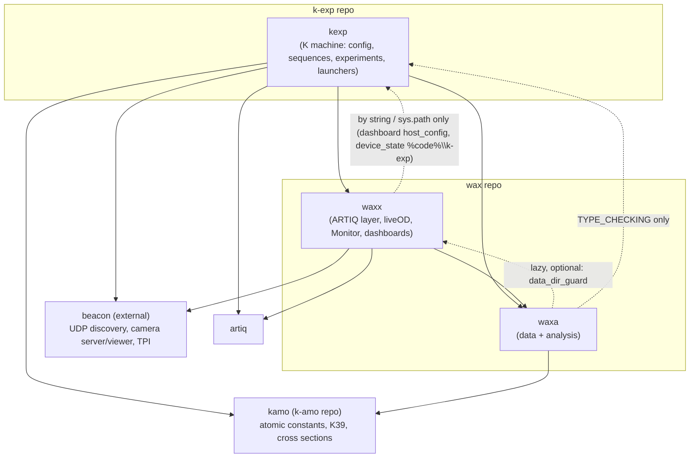

# Report 02 — Package layering and the code map

Agent 02. Sources: k-exp @ c8faf77 (2026-09-27), wax @ acc4621 (2026-09-27), wiki clone @ a109f57. Both code repos in this container are **shallow clones** (k-exp: 66 commits, graft roots fc47c68 2026-09-10, 5c86c33 2026-09-23, c5fd0b0 2026-09-24; wax: 53 commits, oldest 2026-09-24), so "first seen" dates earlier than those are not available from git here; dates below come from commits or from dated docstrings.

Confidence labels: **confirmed** (code/test shows it), **inferred** (strongly implied; basis given), **needs a human**.

Paths are written `k-exp/...` and `wax/...` relative to `/home/user`.

---

## operator_summary

Our code is three Python packages stacked on top of each other. `kexp` is the potassium machine itself: which AOM sits on which DDS channel, our parameter values, our coil/tweezer/lightsheet classes, the MOT and imaging sequences, and every experiment file. `waxx` is the ARTIQ layer that any cold-atom lab could reuse: the scan loop, the device wrapper classes (DDS, DAC, TTL), camera drivers, liveOD, the Monitor and the dashboards. `waxa` is the data-and-analysis layer: loading a run with `atomdata`, fitting, the data browser, saving HDF5 files. The rule is one-way: `kexp` may use `waxx` and `waxa`, `waxx` may use `waxa`, and `waxa` uses neither (confirmed by import scan and tests, details below). Two outside packages matter a lot: `beacon` (how programs find each other on the lab network; not in this container) and `kamo` (atomic-physics constants that `waxa`'s fitting imports). If you want the MOT sequence, open `k-exp/kexp/base/cooling.py`; if you want to know where anything else lives, use the "Where does X live?" table in `reference_facts`.

## mental_model

**Everyday comparison: a restaurant.**
- `waxa` is the **records office**: it can read and file every order ever cooked (run data), and do the bookkeeping (fits, plots). It never needs to know how the kitchen is wired, so you can take its binders home (analysis laptop).
- `waxx` is **generic kitchen equipment plus the standard way any kitchen runs service**: stoves (DDS/DAC/TTL wrappers), the ticket rail (the scan loop), the pass camera (liveOD), the front-of-house screen (dashboards, Device Control GUI). It is sold to any restaurant; it must not mention our menu.
- `kexp` is **this restaurant**: the menu (experiments), the recipes (cooling/imaging sequences), which burner is labelled "imaging AOM" (`config/*_id.py`), house seasoning amounts (`ExptParams`).
- `Base` is the **head chef at the start of service**: hires one of each helper (the mixins), wires every burner by name, calls the pass (liveOD), the maître d' (Monitor), and only then says "service".
- `beacon` is the **building's intercom directory** supplied by another company: every program shouts "I am `live_od:75`, I'm on port N" and others look it up. We only know the names we call on it.
- `kamo` is the **reference cookbook of physical constants** (potassium mass, cross sections) that even the records office opens.

**Dependency direction (what may import what), as the code is today:**



Dashed arrows are the exceptions to the clean picture (see `expert_nuances`).

## how_to

### 1. Find where something is defined
1. Look it up in the **Where does X live?** table (`reference_facts` §4.6).
2. Or in VS Code put the cursor on the name and press **F12** (Go to Definition). This works through the lazy `__init__`s because each has a `TYPE_CHECKING` import block for editors (`k-exp/kexp/__init__.py:21-30`, `wax/waxa-src/waxa/__init__.py:7-15`, `wax/waxx-src/waxx/control/__init__.py:8-12`) — confirmed.
3. If F12 lands in a 12-line file under `kexp/util/live_od/`, that file is an **alias**: the real code is the same path under `waxx/util/live_od/` (e.g. `k-exp/kexp/util/live_od/live_od_client.py:9-13` replaces itself in `sys.modules` with `waxx.util.live_od.live_od_client`) — confirmed. Open the waxx file instead.
4. From a terminal (kpy): `python -c "import waxa.units, inspect; print(inspect.getsourcefile(waxa.units))"` prints the real file of any module (inferred; standard Python).

### 2. Decide where new code goes
1. Does it name K-machine hardware, a channel, a port, an IP, a COM port, a camera serial, or a K-specific parameter value? → `kexp/config/` (values) or `kexp/control/` (a composite device class) or `kexp/base/` (a sequence stage on `self`).
2. Is it an experiment? → `kexp/experiments/<your folder>/`.
3. Would another ARTIQ lab want it unchanged (a device wrapper, a GUI framework piece, liveOD)? → `waxx/`. It must not `import kexp`; take lab values as arguments or through a config object the kexp launcher passes in (the liveOD pattern: `waxx/util/live_od/config.py` + `kexp/config/live_od.py:35-87`) — confirmed.
4. Is it about reading or analysing saved data, and must run on a laptop with no ARTIQ? → `waxa/` (analysis per measurement type goes in `waxa/analysis/<name>/`, see the recipe in `wax/waxa-src/waxa/analysis/__init__.py:30-37`) — confirmed. Note that K-specific analysis currently also lives in `kexp/analysis/` and needs ARTIQ (see nuances).

### 3. Add a module to `waxx/util/live_od/`
1. Create `wax/waxx-src/waxx/util/live_od/<name>.py`.
2. Create the matching alias `k-exp/kexp/util/live_od/<name>.py` with the 12-line alias body (copy any existing alias, e.g. `k-exp/kexp/util/live_od/log.py`). Otherwise `k-exp/tests/test_live_od_migration.py::test_every_waxx_module_has_an_old_path_and_vice_versa` fails (it compares the module trees; only `config` is exempt, line 49) — confirmed; this is exactly how commit 9ab9027 (2026-09-26) was triggered ("B21").
3. Keep `waxx/util/live_od/__init__.py` and `kexp/util/live_od/__init__.py` free of module-level imports (rule 2, `MIGRATION_PLAN.md:47-48`) — confirmed.

### 4. Check an import stays light / never pulls in kexp (the tests' own pattern)
```
python -c "import sys; from waxx.util.live_od.live_od_client import LiveODClient; print([m for m in ('kexp','PyQt6','numpy','waxa','pylablib','scipy') if m in sys.modules])"
```
An empty list `[]` is the pass condition used by `k-exp/tests/test_live_od_migration.py:96-101` — confirmed.

### 5. Import lazy names correctly
- Use `from kexp import Base, cameras, img_types` (explicit names). Do **not** use `from kexp import *`: it picks up none of the lazy names in a fresh process (`k-exp/kexp/__init__.py:15-16`), and what it picks up depends on what was accessed earlier in the same process (verified with a toy package: a fresh star-import got `[]`, after one attribute access it got `['Base', 'sub']`) — confirmed (Python semantics + toy test).

### 6. Open the data browser on a machine without ARTIQ (workaround)
`_bat/data_browser.bat` runs `k-exp/kexp/util/data_browser/data_browser.py`, which imports `kexp.config.ip` (→ ARTIQ, beacon, and executes `%db%`). The browser itself only needs a data folder:
```
python -c "from waxa.browser import launch; launch(r'B:\_K\PotassiumData')"
```
`launch(data_dir)` is `wax/waxa-src/waxa/browser/browser_window.py:3936` — confirmed signature; that it runs without ARTIQ is **inferred** (waxa.browser imports no artiq/kexp in the import scan).

### 7. Set up the environment
Follow the PC Setup page (clone list, env vars, `uv venv --python 3.13 --prompt kpy`, `uv sync` in `%code%`). The workspace definition (`%code%\pyproject.toml`, `uv.lock`) is in the private `code` repo, not in this container — needs a human to verify. What the code itself requires is in `reference_facts` §4.3–4.4.

## reference_facts

### 4.1 Dependency direction (runtime imports), measured by an AST scan of every module outside `kexp/experiments` and `_old`

| From → To | Runtime imports? | Evidence | Confidence |
|---|---|---|---|
| waxx → kexp | **None** as Python imports. Exceptions by *string*/path: `waxx/util/dashboard/host_config.py:14-18` imports modules named by the lab at `configure()` time (dependency injection); `waxx/util/device_state/generate_state_file.py:24-26`, `gui.py:18-20`, `update_state_file.py:30-32` build `%code%\k-exp` and `sys.path.insert` it. Only liveOD and the Camera Viewer panel are *tested* never to import kexp (`k-exp/tests/test_live_od_migration.py:87-93`, `wax/waxx-src/tests/test_camera_viewer_panel.py:16-26`). | grep of `^\s*(from|import) kexp` in waxx finds only a docstring line (`update_state_file.py:10`) | confirmed |
| waxa → kexp | TYPE_CHECKING only (`waxa/atomdata.py:13-16`, `atomdata_base.py:28-35`), comment: "waxa has no kexp dependency" | AST scan | confirmed |
| waxa → waxx | One lazy optional import inside try/except: `waxa/data/server_talk.py:139-145` (`waxx.util.dashboard.data_dir_guard`); TYPE_CHECKING in `waxa/base/dealer.py:5-6` | AST scan | confirmed |
| waxx → waxa | Heavy and structural: `Expt(Scanner, Dealer, Scribe)` where `Dealer`, `Scribe` are waxa classes (`waxx/base/expt.py:11-12,65`); waxa.data (DataSaver, RunInfo, server_talk), waxa.units, waxa.fitting.gaussian, waxa.calibrations.cross_section, waxa.dummy.camera_params (5 files) | import count | confirmed |
| kexp → waxx, waxa | everywhere (Base subclasses `Expt`; frames subclass waxx frames) | `k-exp/kexp/base/base.py:7-11,20` | confirmed |
| waxa → artiq | none | AST scan | confirmed |
| waxa → kamo | **yes, at import**: `waxa/fitting/gaussian.py:5`, `lorentzian.py:3`, `parabolic.py:3`, `polynomial.py:3` (`import kamo.constants as c`); `atomdata_base.py:14` → `image_processing/__init__.py:1` → `compute_gaussian_cloud_params.py:4` → `waxa.fitting` → gaussian. So `from waxa import atomdata` needs kamo installed. | import chain | confirmed |
| waxx → beacon | 49 import sites in 33 files (list in §4.4) | grep | confirmed |
| waxa → beacon | none | grep | confirmed |

### 4.2 Lazy `__init__` files (PEP 562 `__getattr__`)

| Package `__init__` | Lazy names | Caches in globals? | `__dir__`? | Why (from the file / commit) | Confidence |
|---|---|---|---|---|---|
| `k-exp/kexp/__init__.py:33-56` | `Base, Adjust, dds_frame, cameras, CameraParams, EthernetRelay, aprint, img_types, atomdata, load_atomdata, AtomdataVault` | yes (`:55`) | yes (`:59-60`) | `Base` costs ~1.1 s (spcm, ARTIQ compiler, tweezer stack); dashboards/GUIs/monitor server import `kexp.config.*` and don't need it. Commit c5fd0b0, 2026-09-24. | confirmed |
| `wax/waxx-src/waxx/__init__.py:1-8` | `Expt`, `img_types` | **no** (re-imports each access; cheap after first) | no | not stated; commented-out eager imports at `:10-11` | confirmed |
| `wax/waxx-src/waxx/control/__init__.py:14-27` | `BaslerUSB, AndorEMCCD, DummyCamera` | yes | yes | pylablib(+numba) and pypylon cost ~1.2 s per run for processes that never open a camera (`:1-6`) | confirmed |
| `wax/waxa-src/waxa/__init__.py:17-35` | `atomdata, AtomdataVault, load_atomdata, ROI, img_types, ExptParams, ClimateClient` | yes | no | loky worker subprocesses would otherwise import server_talk and PyQt6 → `BrokenProcessPool` (`:1-5`) | confirmed |
| `wax/waxx-src/waxx/util/live_od/__init__.py:15-28` | `CameraMother, CameraBaby, CameraNanny, DataHandler` | yes | yes | experiment process imports only `live_od_client` and must not pay for cameras/Qt/analysis (`:6-8`) | confirmed |
| `k-exp/kexp/util/live_od/__init__.py:18-34` | same four, via waxx | yes | yes | same; `__all__` lists 7 submodules (`:20-21`) so `from kexp.util.live_od import *` imports them (Qt) | confirmed |
| `wax/waxx-src/waxx/util/live_od/camera_host/__init__.py:23-42` | `HostQtBridge, LocalHostStream, HostCameraBar, HostCameraButton, ReservationKeeper` (the host core is eager, `:18-21`) | yes | no | Qt/viewer names lazy | confirmed |

**Eager package `__init__`s that matter for import cost/side effects** (all confirmed by reading the files):
- `k-exp/kexp/config/__init__.py` = `from .expt_params import ExptParams` (one line, no trailing newline, so `wc -l` shows 0). Every `import kexp.config.<anything>` therefore imports `kexp.config.expt_params` → `waxx.config.expt_params` → `waxx/config/__init__.py` → `waxx/config/data_vault.py:3` `from artiq.language import ...`. **Any kexp.config import needs ARTIQ installed.**
- `k-exp/kexp/util/__init__.py` = `from .db import device_db`; `k-exp/kexp/util/db/__init__.py` = `from .device_db import device_db`. **Any `kexp.util.*` import executes the 1988-line repo device db** (a dict literal; cheap) and binds `kexp.util.device_db` / `kexp.util.db.device_db` to the *dict*, shadowing the submodule attribute.
- `k-exp/kexp/base/__init__.py:1-7` imports all mixins and `Feedback` → importing `kexp.base.<anything>` (e.g. `kexp.base.cameras.resolve_run_config`, `kexp.base.feedback`) imports the whole experiment stack.
- `wax/waxx-src/waxx/base/__init__.py` imports `Scanner` and `Monitor` → `waxx.base.expt` also imports `waxx.base.monitor` → `waxx.util.comms_server.comm_client` (beacon) and `waxx.util.device_state` (see next).
- `wax/waxx-src/waxx/util/device_state/__init__.py` imports `generate_state_file`, whose module level runs `Path(os.getenv('code'))` and `Path(os.getenv('data'))` (`generate_state_file.py:24-25`) and `sys.path.insert(0, %code%\k-exp)` (`:26`). The two variables are never used afterwards (grep). **Every importer of `waxx.util.device_state.*` (Monitor, Base, Device Control GUI, monitor server launchers) raises `TypeError` at import if `%code%` or `%data%` is unset.**
- `wax/waxx-src/waxx/util/comms_server/__init__.py:3` re-exports `beacon.discovery` eagerly → `import waxx.util.comms_server.hardware_id` (documented as "intentionally stdlib-only", `hardware_id.py:18`) actually requires beacon. `kexp/config/ip.py:55` imports it, so **`import kexp.config.ip` requires beacon**.
- `wax/waxx-src/waxx/control/tweezer/__init__.py` imports `spectrum_DDS_tweezer` → `import spcm`. `kexp/config/composite_devices.py:90` imports `kexp.control.awg_tweezer` → spcm. So the Device Control GUI and monitor server need spcm even though they never touch `Base`.
- `wax/waxa-src/waxa/fitting/__init__.py`, `image_processing/__init__.py`, `plotting/__init__.py`, `data/__init__.py`, `browser/__init__.py` are eager within their subpackage.

### 4.3 Packaging / install facts

| Fact | Value | Where | Confidence |
|---|---|---|---|
| Package names | `kexp`, `waxx`, `waxa`, version `0.0.1` | `k-exp/pyproject.toml`, `wax/waxx-src/pyproject.toml`, `wax/waxa-src/pyproject.toml` | confirmed |
| Python | `requires-python = "==3.13.*"` in all three | same | confirmed |
| Declared dependencies | `dependencies = []` in all three pyprojects: third-party packages are **not** declared by the packages themselves | same | confirmed |
| Build config | no `[build-system]` table; `[tool.setuptools.packages.find] where=["."]` (plain find_packages: dirs without `__init__.py` are not packages for a non-editable build); `[tool.pdm] distribution = false` (PDM leftover) | same | confirmed |
| `setup.py` | also present in all three; `waxa-src/setup.py` `install_requires` lists stdlib names (`'datetime','time','copy','subprocess','glob','random'`) — with a pyproject `[project]` table setuptools uses the pyproject `dependencies`, so this list is ignored | `wax/waxa-src/setup.py` | confirmed (file) / inferred (setuptools precedence) |
| egg-info committed | `k-exp/kexp.egg-info/`, `wax/*/waxa.egg-info/`, `waxx.egg-info/` tracked in git (PKG-INFO Metadata-Version 2.4) | `git ls-files` | confirmed |
| Workspace | `uv` workspace rooted at `%code%` with `%code%\pyproject.toml` + `uv.lock` in the private `ucsb-amo/code` repo; `uv sync` installs members editable | wiki `PC-Setup.md:5,215-223`; launchers use `%code%\.venv` (`_bat/shortcuts/art.bat`, `ar.lnk` target `%code%\.venv\Scripts\artiq_run.exe --device-db %db%`) | launchers confirmed; workspace file **needs a human** |
| Old pip freeze | `k-exp/kexp/experiments/requirements.txt` (189 lines): a `pip freeze` from `C:/Users/jarjarbinks/code/...` with editable artiq, k-amo, k-exp, pyLabLib, spcm, waxa-src, waxx-src; no beacon, no joblib. Not the source of truth. | file | confirmed (content) / inferred (stale) |
| Bootstrap | `k-exp/kexp/_bat/bootstrap_pc.ps1`: installs Git, clones `https://github.com/ucsb-amo/code.git` into the code folder, then runs `code\setup\setup.ps1` | `bootstrap_pc.ps1:27,95-130` | confirmed |

### 4.4 External packages the code calls

**beacon** (weldlabucsb/beacon; black box — every name below is what our code imports; what they do internally **needs a human**):

| beacon name | Used by (production code) |
|---|---|
| `beacon.discovery` (`NetServer, NetClient, discover, DISCOVERY_PORT`) | `waxx/util/comms_server/__init__.py:3` |
| `beacon.discovery.client.NetClient` | `waxx/util/comms_server/comm_client.py:3`, `waxx/util/live_od/live_od_client.py:35`, `waxx/control/misc/pdxc.py:28`, `waxx/util/guis/{HMR_magnetometer/hmr_magnetometer_client.py:25, als/als_gui_client.py:14, bristol/bristol_wavemeter_client.py:7, keysight/keysight_client.py:8, precilaser/precilaser_gui_client.py:8}`, `kexp/util/guis/interlock/interlock_client.py:14` |
| `beacon.discovery.server.NetServer` | `waxx/util/comms_server/comm_server.py:9`, `waxx/util/live_od/live_od_server.py:27`, `live_od_broadcaster.py:28`, `waxx/control/misc/pdxc.py:29`, `waxx/util/guis/{HMR_magnetometer/hmr_magnetometer_server.py:40, als/als_server.py:20, bristol/bristol_wavemeter_server.py:19, keysight/keysight_server.py:35, precilaser/precilaser_server.py:21}`, `kexp/util/guis/interlock/interlock_server.py:54` |
| `beacon.discovery.client.discover`, `discover_prefix`, `discover_entries` | `waxx/util/comms_server/hardware_id.py:163,189`, `waxx/util/dashboard/server_supervisor.py:178`, `waxx/util/guis/monitor_server_gui.py:14`, `monitor_server_headless.py:28`, `waxx/util/live_od/camera_host/claims.py:159` |
| `beacon.camera.backend` (`Readback, ApplyRefused, ApplyMismatch, RawFrame, CloseReport, CameraError, CameraUnavailable, clamps, plain_readback`) | `waxx/control/cameras/andor.py:15`, `device_lock.py:37`, `emccd_backend.py:34`, `waxx/util/live_od/camera_host/host.py:69` |
| `beacon.camera.core` (`CameraServerCore, list_state, error_reply, wire_readback`) | `camera_host/host.py:70`, `camera_host/local_stream.py:19` |
| `beacon.camera.reservations.Holder`, `beacon.camera.protocol` | `camera_host/claims.py:40-41`, `host.py:71` |
| `beacon.camera.schema` (`ANDOR_EMCCD, ANDOR_LIVE_EM_GAIN_CAP, BASLER_USB, Category, Constraint, NEVER_PERSIST, category_from_wire, get_category, to_wire`) | `camera_host/host.py:72`, `gui/camera_settings_dialog.py:46`, `gui/demo.py`, `k-exp/kexp/config/live_od.py:48` (`Constraint`) |
| `beacon.camera.worker.LockedError`, `beacon.camera.basler_backend.BaslerBackend` | `camera_host/host.py:75,369` |
| `beacon.camera.viewer.{sources.CameraSource, ViewerFrame; widget.CameraViewerWidget; settings_bar.SettingsForm, format_value; main_window.CameraViewerMainWindow}` | `gui/live_view_window.py:38,218,259`, `camera_host/local_stream.py:20`, `gui/camera_settings_dialog.py:48`, `waxx/util/guis/camera_viewer/camera_viewer_panel.py:25`, `k-exp/kexp/util/guis/mot_viewer/mot_viewer.py:6` |
| `beacon.camera.stream` (`CameraStream, Preempted, ServerRestarted, ServerStopping, RunLocked, SettingRefused, ControlRefused, SettingsChanged`), `beacon.camera.directory.CameraDirectory` | `k-exp/kexp/calibrations/SLM_spot_finder/frame_source.py:43,394,596,697,727,738,860,995` |
| `beacon.basler.frame_grabber` | `waxx/util/live_od/camera_cli.py:112` |
| `beacon.tpi.gui.TpiDevicesMainWindow`, `beacon.tpi.rf_consultant_id` (`RfConsultantId, default_map, label_map, load_frame, rf_consultant_frame`) | `waxx/util/guis/tpi/tpi_panel.py:18`, `k-exp/kexp/config/rf_consultant_id.py:8` (shim; imported by nothing) |
| Run as programs (`python -m`) | `beacon.camera.viewer.app` (`_bat/camera_viewer.bat`), `beacon.basler.server_gui` + `beacon.basler.gui` (`_bat/basler_gui.bat`), `beacon.tpi.server` + `beacon.tpi.gui` (`_bat/tpi_gui.bat`), `beacon.basler.server_headless` (`kexp/util/dashboard/server_registry.py:149`), `beacon.tpi.server` (`server_registry.py:205`) |
| Clone location assumed | `%code%\beacon\beacon\network` (`_bat/set_adapter_ip.bat:21`) |
| Test-only | `beacon.camera.fake_backend.FakeBackend`, `beacon.camera.frames.Frame`, `beacon.camera.worker.ArmError`, `beacon.camera.viewer.widget.wait_pool`, `beacon.camera.viewer.sources.missing_members`, `beacon.camera.stream.SnapMismatch` (`wax/waxx-src/tests/*`, `k-exp/tests/test_spot_finder_scan.py`) |

All confirmed as import sites; semantics of each beacon name **needs a human**.

**Other lab forks / sibling repos:**

| Package | Imported by (outside experiments) | Notes | Confidence |
|---|---|---|---|
| `kamo` (repo k-amo) | waxa: `fitting/gaussian.py:5` (`c.m_K`, `c.kB` at `:515,551`), `lorentzian.py:3`, `parabolic.py:3`, `polynomial.py:3`, `plotting/standard_experiments.py:103,118` (`Potassium39`), `calibrations/cross_section.py:54` (`kamo.imaging.cross_sections`, with built-in fallback + warning); kexp: `analysis/apd_state_mapping.py:75`, `util/guis/wavemeter_monitor/detuning_plotter.py:6`; experiments: JP/apd_abs_imaging/* | waxa depends on it at import. ARC is pulled in somewhere in kamo (kexp docstring: the analysis names "load scipy / matplotlib / pandas / cv2 / ARC", `kexp/__init__.py:12-13`) | import sites confirmed; ARC-in-kamo inferred |
| `k-jam` | nothing imports it. Cited as provenance of calibration numbers (`kexp/calibrations/imaging.py:4,13,27`, `magnets.py:7,63`, `tweezer.py:5,30`) and of design plans (`k-jam/jpagett/camera_host/PLAN.md` in `kexp/config/live_od.py:78,81`; `k-jam/jpagett/imaging_field_record/PLAN.md` in `kexp/base/image.py:69`) | notebooks/plans live there | confirmed |
| `spcm` (ucsb-amo fork; branch `jep/suppress-unit-redefinition-warnings` per PC-Setup) | `waxx/control/tweezer/spectrum_DDS_tweezer.py:9-10`, `awg_connection.py:18`, `awg_agent_driver.py:110`; experiments `tools/tweezerbalance/balance_tweezer_functions.py`, JE tweezer_debug | pulled in by `waxx.control.tweezer` package init | confirmed; fork diff needs a human |
| `pylablib` (ucsb-amo fork) | `waxx/control/cameras/andor.py:6-11` (uses private `AndorSDK2._camfunc`, `atmcd32d_lib.wlib`), `waxx/control/misc/oscilloscopes.py:116`, `oscilloscopes_base.py:30,36`, `thorlabs_kinesis.py:31`, `kexp/control/misc/objective_stages.py:15,37`, `kexp/util/guis/newfocus_8742/*` | andor.py depends on pylablib internals | confirmed; fork diff needs a human |
| `mloop` | only `k-exp/kexp/experiments/Mloop testing/integration/*.py` (7 files; the folder name contains a space, so it is not importable as a package) | | confirmed |
| `names` (PyPI random names) | `waxx/util/live_od/camera_mother.py:5` (import, unused there), `waxx/util/live_od/gui/main_window.py:11,992` (`names.get_first_name()`) | liveOD hard-requires it | confirmed |
| `joblib` | `waxa/image_processing/compute_gaussian_cloud_params.py:3` | pool only above 2000 fits (`:6-11`) | confirmed |
| `cv2`, `pandas` | `waxa/roi.py:2-4`; pandas also `waxx/util/live_od/camera_connection_widget.py:199` | | confirmed |
| `zmq` | liveOD client/server/broadcaster/remote viewer/claims; `kexp/calibrations/SLM_spot_finder/run_gate.py:85` | | confirmed |
| `vxi11`, `serial`, `pypylon`, `PyQt6`, `pyqtgraph`, `PIL`, `win32com/pythoncom` | scopes/Siglent/Keysight; serial servers; Basler driver; GUIs; `waxx/util/dashboard/panel_window.py` | | confirmed |
| `PyQt5` | `kexp/util/guis/magnetic_field_monitor/magnetometer_gui_arduino.py`, `kexp/util/guis/wavemeter_monitor/detuning_plotter.py` | two old GUIs still on Qt5 | confirmed |

### 4.5 Environment variables the code reads

| Variable | Read where | Effect if unset | Confidence |
|---|---|---|---|
| `data` | `kexp/config/ip.py:9` (DATA_DIR), `waxa/data/server_talk.py:17` (default arg, evaluated **at import**), `waxx/util/device_state/generate_state_file.py:25`, `kexp/util/live_od/camera_mother.py:16`, `kexp/util/guis/interlock/interlock_server.py:264` (then `DATA_DIR`) | kexp paths become `None` (`_safe_join`, `ip.py:13-23`); waxx.util.device_state import raises TypeError | confirmed |
| `code` | `kexp/config/ip.py:10`, `generate_state_file.py:24`, `device_state/gui.py:18`, `update_state_file.py:30`; launchers | MONITOR_* paths None; waxx.util.device_state import raises TypeError | confirmed |
| `db` | `waxx/util/comms_server/hardware_id.py:46`; `ar` shortcut `--device-db %db%`; `art.bat`; `_bat/dashboard/start_artiq_master_only.bat` | no hardware id → unscoped ids `monitor`/`live_od`, default state file `device_state_config.json` | confirmed |
| `kpy` | every `.bat` (`call %kpy%`) | launchers fail | confirmed (bat files) |
| `WAX_VERBOSITY` | `waxx/util/console.py:28` (read once at import) | NORMAL (1) | confirmed |
| `WAXX_SEQVIEW_DIR` | `waxx/util/seqview/launch.py:32` | default dir | confirmed |
| `LOCALAPPDATA` | `waxa/data/data_saver.py:1121`, `waxx/util/dashboard/logging_setup.py:98`, `waxx/control/cameras/device_lock.py:92` | falls back to `~` | confirmed |
| `DATA` (upper case) | `kexp/util/guis/magnetic_field_monitor/magnetometer_gui_arduino.py:70` | `~/Documents` | confirmed |
| `WAXA_DATA_UNC` | **not referenced anywhere** in wax@acc4621 or k-exp@c8faf77 (grep also finds no `unc_unknown`) although `PC-Setup.md:101` documents it | — | confirmed absent; where it lives **needs a human** |

