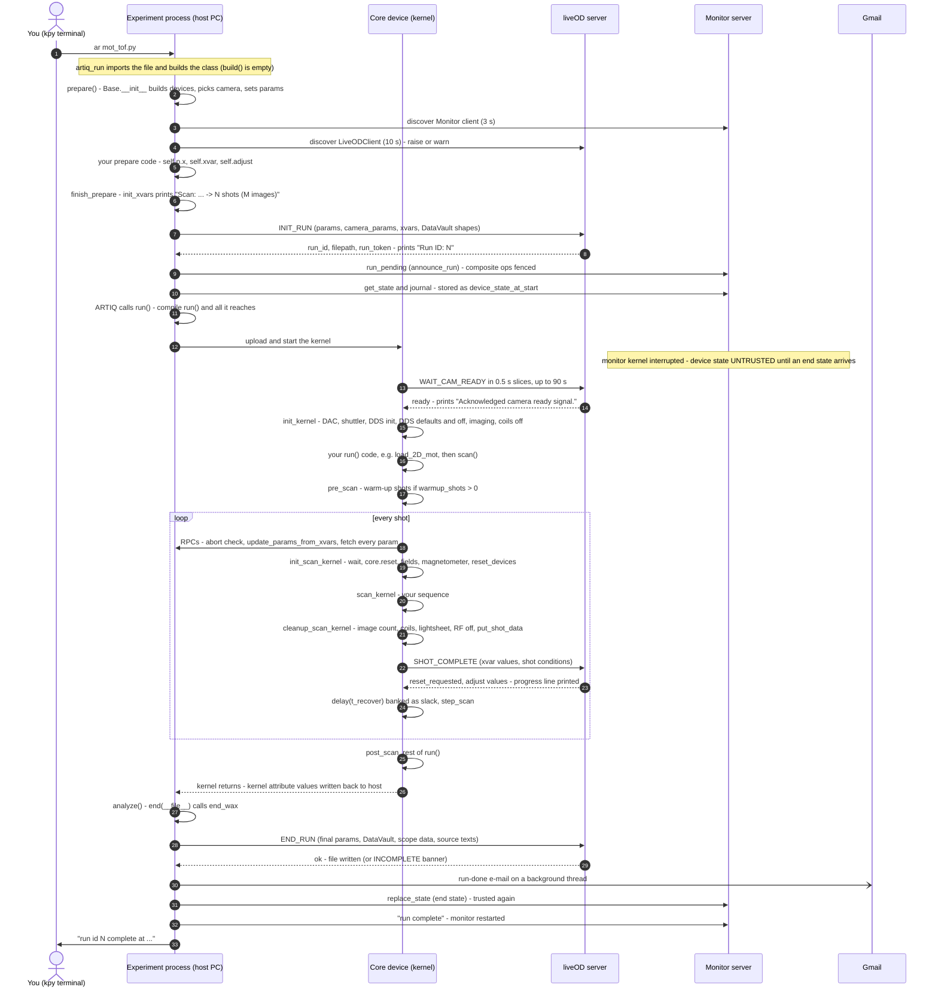
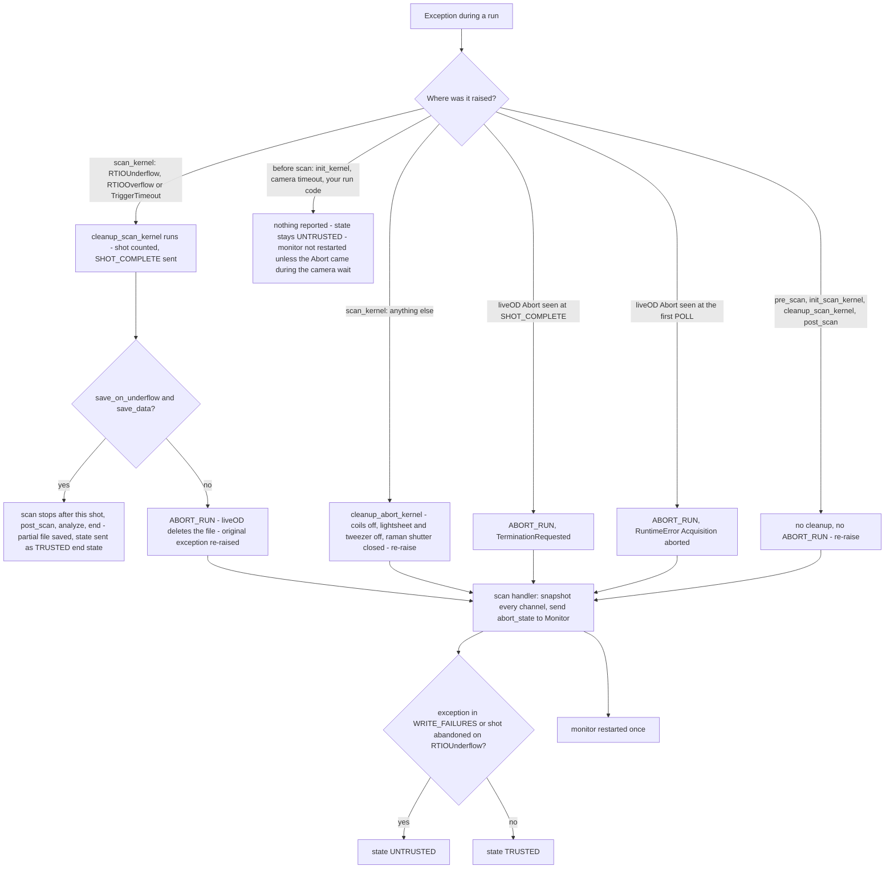

# Report 03 — The experiment lifecycle (from `ar file.py` to the saved file)

Agent 03. Code read at k-exp c8faf77 (2026-09-27) and wax acc4621 (2026-09-27). ARTIQ itself is not installed in this container, so every statement about ARTIQ internals (build/prepare order, `core.reset`, `break_realtime`, attribute writeback) is marked **inferred** unless the repo's own comments or tests state it. Paths are relative to `/home/user`. "kexp" = `k-exp/kexp`, "waxx" = `wax/waxx-src/waxx`, "waxa" = `wax/waxa-src/waxa`.

---

## 1. operator_summary

1. You start a run by typing `ar <file>.py` in a `kpy` terminal; `ar` is a shortcut to ARTIQ's `artiq_run.exe --device-db %db%` (kexp/_bat/shortcuts/ar.lnk). Your file defines one class `class X(EnvExperiment, Base)` with `prepare` (host PC setup), `run` (compiled and executed on the ARTIQ core device) and `analyze` (host, saves).
2. `prepare()` calls `Base.__init__` (builds every device object, picks the camera, connects to the Monitor server, the APD stage server, the magnetometer and liveOD), then your settings (`self.p.x = ...`, `self.xvar(...)`), then `finish_prepare()`, which counts the shots, asks liveOD for a **run ID and data file** (INIT_RUN), and tells the Monitor server a run is about to take the hardware.
3. `run()` is compiled as a whole the moment ARTIQ calls it; `init_kernel()` waits for liveOD to say the camera is armed (up to 90 s), then initialises DACs/DDSs/imaging/coils; `scan()` then runs one **shot** per combination of xvar values: host updates the parameters, `init_scan_kernel` resets the machine, your `scan_kernel` runs, `cleanup_scan_kernel` makes it safe and reports the shot to liveOD, then a 100 ms recovery gap.
4. `analyze()` calls `self.end(__file__)`: the final parameters, per-shot data and the source code are sent to liveOD (END_RUN) which writes the HDF5 file; the end state of every channel goes to the Monitor server (marked *trusted*), the monitor is restarted, and a "run done" e-mail is sent in the background.
5. If something goes wrong mid-run (liveOD **Abort**, an `RTIOUnderflow`, a trigger timeout) the scan loop cleans up what it can, the data file is deleted (unless `save_on_underflow=True`), and the channel state at the abort is reported to the Monitor server — trusted after an Abort, **untrusted** after an underflow or a `ValueError`. When in doubt afterwards, press **Run MOT Observe** on the Device Control GUI.

---

## 2. mental_model

**Everyday comparison: a theatre show with a box office, a lighting desk and a stage hand.**
- `prepare()` is the rehearsal: the script is finalised (parameters, which values to scan) and the box office (liveOD) issues the ticket number (run ID) and opens the file where photos will be filed.
- Calling `run()` prints the cue sheet in the lighting desk's own language (compilation); after that the desk (core device) runs the cues against its own stopwatch (the *timeline*), far ahead of the audience's clock. If the desk ever tries to fire a cue whose time has already passed, the show stops: that is an **RTIO underflow**.
- Each performance is a **shot**; between performances the stage is reset (`init_scan_kernel`) and swept (`cleanup_scan_kernel`), and the photographer (liveOD) is told a performance ended (SHOT_COMPLETE). The intermission is `t_recover`.
- Closing night (`end()`) hands the full report to the archive (END_RUN), tells the house-lights operator (the Monitor) exactly how the stage was left so he can take over, and sends an e-mail.
- If the show is stopped mid-performance, the desk tells the house-lights operator what state it stopped in; if the stop was caused by a failed cue, that report is flagged "may be wrong" (untrusted).

### One run, end to end (deliverable sequence diagram)



### What happens when a shot or run dies (abort paths)



---

## 3. how_to

### 3.1 Run an experiment
1. Open a terminal with the `kpy` profile (Windows Terminal profile that runs `%kpy%` = `%code%\.venv\Scripts\activate`, starting in `k-exp\kexp\experiments`; PC-Setup.md:97, 231). Without the profile, type `%kpy%` first.
2. Check that the **LiveOD Server** window is running on the control PC and the **Monitor** is running (Device Control GUI / Server Dashboard). Without liveOD a camera run stops in `prepare` (see §6 L1).
3. `cd` to the experiment's folder, e.g. `cd %code%\k-exp\kexp\experiments\default_experiments`.
4. Type `ar mot_tof.py`. `ar` is `ar.lnk` in `kexp\_bat\shortcuts`, which runs `%code%\.venv\Scripts\artiq_run.exe --device-db %db%` (strings of `kexp/_bat/shortcuts/ar.lnk`; **confirmed**). It works in any terminal because `setup_shortcuts.ps1` puts the shortcuts folder on PATH and `.LNK` in PATHEXT (`kexp/_bat/setup_shortcuts.ps1:1-6`; **confirmed**).
5. For a startup-time breakdown use `art mot_tof.py` instead (`kexp/_bat/shortcuts/art.bat`, runs `waxx/util/profiling/startup_timer.py`: import → build → prepare → compile → upload → first RPC …; **confirmed**, startup_timer.py:1-30).
6. Expected terminal output of a healthy `mot_tof.py` run at the default verbosity (strings **confirmed** from code; numbers illustrative):
```
[warmup] none: first shot likely ~25% low (Base(warmup_shots=2) to fix).
Scan: 2 x dummy -> 2 shots (6 images)
Run ID: 83120
Acknowledged camera ready signal.
[dds init] full init on 24 of 24 channels, 0 skipped (forced), 1400 ms
shot 1/2 done
shot 2/2 (100%) | 3.1 s/shot
run id 83120 complete at 2026-09-28 14:03:11, 2 shots  (mot_tof)
```
Sources: base.py:89-90; scanner.py:754,776-777; expt.py:180-181; scribe.py:87; ad9910_fast_init.py:218-220; expt.py:285-303, 445. With `setup_awg=False` (as mot_tof passes) a line like `'tweezer' object has no attribute 'dds'` probably also appears at the end of the scan (see §15 B16; **inferred**).

### 3.2 Write a minimal experiment (rules that the code enforces or assumes)
```python
from artiq.experiment import *
from kexp import Base, img_types, cameras
import numpy as np

class my_tof(EnvExperiment, Base):          # EnvExperiment FIRST, then Base
    def prepare(self):
        Base.__init__(self, camera_select=cameras.xy_basler,
                      imaging_type=img_types.ABSORPTION, save_data=True)
        self.p.t_mot_load = 1.0             # always self.p.<name>, never self.<name>
        self.xvar('t_tof', np.linspace(100., 500., 5) * 1.e-6)   # SI units
        self.p.N_repeats = 2
        self.finish_prepare(shuffle=True)   # LAST line of prepare

    @kernel
    def scan_kernel(self):                  # one shot
        self.mot(self.p.t_mot_load)
        self.dds.push.off()
        self.release()
        delay(self.p.t_tof)
        self.flash_repump()
        self.abs_image()

    @kernel
    def run(self):
        self.init_kernel(setup_awg=False)   # no tweezers in this sequence
        self.load_2D_mot(self.p.t_2D_mot_load_delay)
        self.scan()

    def analyze(self):
        import os
        self.end(os.path.abspath(__file__))
```
- Class order `(EnvExperiment, Base)` is what all 438 experiments use (grep of kexp/experiments); with the other order Python would run `Base.__init__` when ARTIQ constructs the class, with ARTIQ's manager tuple as `setup_camera` (**inferred** from the MRO).
- Put every parameter change in `prepare` on `self.p`: the scan loop re-writes **every** int/float/array parameter from the host into the kernel before every shot (scanner.py:526-554, 611-635), so a `self.p.x = ...` inside `run()` before `self.scan()` is overwritten at the first shot (**confirmed** by code).
- Forget `analyze`/`end` and ARTIQ's empty `Experiment.analyze` runs instead: no END_RUN (liveOD marks the run "exited", file "not saved, not deleted", live_od_server.py:1362-1370), no end state to the Monitor, no monitor restart, no e-mail (**inferred** from code; ARTIQ's default analyze is a no-op).

### 3.3 Run without a camera or without liveOD
- `Base.__init__(self, setup_camera=False)`: nothing is acquired, no camera wait in `init_kernel`, no image-count check; liveOD is still contacted (for the run ID and saving) but a missing liveOD only warns. With `save_data=True` and no liveOD, **nothing is saved** and only a warning is printed (expt.py:188-192).
- `Base.__init__(self, setup_camera=False, suppress_live_od=True)`: liveOD is never contacted, `save_data` is forced to `False`, run ID stays 0 (cameras.py:79-81; clients.py:34). This is what `tools/mot_observe.py` does (mot_observe.py:102-104).

### 3.4 Add warm-up shots
`Base.__init__(self, ..., warmup_shots=2)` (base.py:33, 87-93). Each warm-up shot runs `reset_devices`, `reset_tweezers(False)`, `self.warmup_kernel()` and `cleanup_warmup_kernel()` before the scan loop (base.py:275-300). The default `Cooling.warmup_kernel` is the **hf tweezer BEC preparation** (cooling.py:38-53); for any other sequence override it in your class:
```python
    @kernel
    def warmup_kernel(self):
        self.mot(self.p.t_mot_load)   # imaging-free; no DataVault writes
        self.release()
```

### 3.5 Stop a run
1. Click **Abort** in the LiveOD Server window (the button turns bold red while a run is active; tooltip "Stop the run now and delete its data file. No confirmation: it has to be fast."; waxx/util/live_od/gui/main_window.py:580-584). From a remote viewer: **Abort run / skip ID** (remote_viewer_window.py:420).
2. The experiment stops at the **end of the shot in progress** (it sees `reset_requested` in the SHOT_COMPLETE reply, expt.py:261-265), or at once if it was waiting for the camera (scribe.py:85-86), or before the first shot (one POLL, scribe.py:253-254).
3. The terminal shows `[abort] if this process has not exited in 30 s, ...`, then a `TerminationRequested` traceback (commit wax 782345c: "an aborted run's process hung after its TerminationRequested traceback"), and `[Monitor] run N aborted (the liveOD Abort button): its device state at the abort went to the monitor server (trusted).`
4. The data file is deleted by liveOD (`_finalize_reset_run` → `self._run_file.discard()`, live_od_server.py:858-864).
5. If the state is untrusted afterwards (red banner on the Device Control GUI), press **Run MOT Observe** (runs `kexp/experiments/tools/mot_observe.py`, whose end state marks the state trusted; mot_observe.py:1-15; k-exp/tests/test_state_reset_expt.py).

### 3.6 Keep the shots already taken when a shot underflows
`Base.__init__(self, ..., save_on_underflow=True)` (base.py:31, 74). Applies to `RTIOUnderflow`, `RTIOOverflow` and `TriggerTimeout` raised inside `scan_kernel`, and only when `save_data=True` (scribe.py:307-308). The run stops after the failed shot (which *is* counted and reported), `post_scan` and the rest of `run()` execute, then `analyze()`/`end()` save a partial file and the terminal says `run id N ended at <time> after 7 of 20 shots  (<expt>)` (expt.py:439-442).

### 3.7 Change how chatty the terminal is
`Base.__init__(self, verbosity=0|1|2)` or `set WAX_VERBOSITY=2` before `ar` (the kwarg wins; console.py:1-17, 26-30; expt.py:77-79). 0 = warnings only, 1 = milestones (default), 2 = everything including per-shot xvar values and `[camera] ready.`.

### 3.8 Force or skip the full DDS initialisation
`self.init_kernel(force_dds_init=False)` lets the AD9910 fast init skip intact channels (~1.4 s saved). **Today's default is `True`** (base.py:155), so every run does the full init unless you pass `False` (see §5 N10, §15 B1).

### 3.9 See afterwards what a run did
Root attributes of the run's HDF5 file (written by DataSaver from END_RUN, waxa/data/data_saver.py:804-811): `expt_file` (your experiment's source), `params_file` (kexp/config/expt_params.py), `base_class_<name>` for each `.py` in kexp/base, and every entry of `_extra_file_texts`: `device_state_at_start` (JSON, base.py:136), `dds_init` (JSON, ad9910_fast_init.py:56-58), `camera_overrides` (added by liveOD, live_od_server.py:449-460). All texts are read **at END_RUN time**, not at compile time (expt.py:590-605; §7 D5).

### 3.10 A run that will not exit
After an Abort the process arms a 30 s dump, after a normal `end()` a silent 60 s dump (expt.py:29-32, 264, 430). If the process is still alive then, Python's `faulthandler` prints every thread's stack to stderr; read it for what holds the exit (typically the AWG close, the e-mail thread waiting on the G: drive, or a ZMQ socket).

---

## 4. reference_facts

### 4.1 `Base.__init__` keyword arguments (kexp/base/base.py:22-34)
| kwarg | default | effect | confidence |
|---|---|---|---|
| `setup_camera` | `True` | acquire with the chosen detector; resolved to `capture_frames` (cameras.py:81) | confirmed |
| `save_data` | `True` | liveOD reserves run ID + file at INIT_RUN and saves at END_RUN; forced `False` by `suppress_live_od` (cameras.py:79-80) | confirmed |
| `imaging_type` | `img.ABSORPTION` | 3 images/shot for absorption, `N_pwa_per_shot+2` otherwise (scanner.py:768-773) | confirmed |
| `absorption_image` | `None` | deprecated; prints `Warning: The argument 'absorption_image' is depreciated -- change it out for 'imaging_type'` (expt.py:81-83) | confirmed |
| `camera_select` | `cameras.xy_basler` | CameraParams or key string (cameras.py:27-38) | confirmed |
| `expt_params` | `None` → `kexp.config.expt_params.ExptParams()` | (base.py:50-54) | confirmed |
| `data_vault` | `None` → `kexp.config.data_vault.DataVault(self)` | (base.py:57-60) | confirmed |
| `suppress_live_od` | `False` | no LiveODClient at all; `save_data=False`; PDXC errors warn instead of raise (clients.py:26, 34) | confirmed |
| `save_on_underflow` | `False` | see §3.6; stored as `run_info.save_on_underflow` (base.py:74) and sent in INIT_RUN (expt.py:557) | confirmed |
| `override_apd_stage` | `None` | force APD pickoff stage in (`True`) / out (`False`) (cameras.py:83-84) | confirmed |
| `warmup_shots` | `0` | stored as `params.N_warmup_shots` (base.py:87) | confirmed |
| `verbosity` | `None` → `WAX_VERBOSITY` or 1 | (expt.py:77-79) | confirmed |

### 4.2 `resolve_run_config` truth table (kexp/base/cameras.py:44-94), `override_apd_stage=None`
| camera_select | setup_camera | suppress_live_od | capture_frames (= `self.setup_camera`) | save_data | APD stage | liveOD missing → |
|---|---|---|---|---|---|---|
| any Basler | True | False | True | as passed | left alone (None) | **raise** |
| any Basler | False | False | False | as passed | None | warn; nothing saved if save_data |
| any Basler | any | True | False | False | None | not contacted |
| `cameras.andor` | True | False | True | as passed | **out** (False) | raise |
| `cameras.andor` | True | True | False | False | None | not contacted |
| `cameras.andor` | False | any | False | as passed/False | None | warn |
| `cameras.apd` | True | False | **False** | as passed | **in** (True) | **warn only; nothing saved** |
| `cameras.apd` | True | True | False | False | in (True) | not contacted |
| `cameras.apd` | False | any | False | as passed/False | None | warn |
Confirmed by code (cameras.py:73-94; clients.py:34-50; expt.py:173-192). The Basler "stage left alone" row contradicts the wiki's Base page (§11).

### 4.3 `init_kernel` kwargs (kexp/base/base.py:140-216) — all default `True`
| kwarg | what it does when True | pass False when |
|---|---|---|
| `run_id` | prints `Run ID: N` again, only at VERBOSE (172-175) | never matters |
| `init_dds` | `init_all_cpld()` + `init_all_dds(force_dds_init)` (186-188) | a test that must not touch the Urukuls |
| `init_dac` | `dac_device.init()` then `delay(t_rtio)` (180-182) | testing |
| `dds_set` | `delay(1 ms)`, `dds.stash_defaults()`, `set_all_dds()` (189-192) | |
| `dds_off` | `switch_all_dds(0)` (193-194) | you want DDS left on |
| `init_sampler` | `sampler.init()` (207-208) | |
| `init_imaging` | `imaging.init()`, `integrator.init()`, `set_imaging_detuning()`, `imaging.set_power(camera_params.amp_imaging)` (202-206) | |
| `beat_ref_on` | `dds.beatlock_ref.on()` (200-201) | |
| `init_shuttler` | `shuttler.init()` (183-185) | mot_observe passes False |
| `init_lightsheet` | `lightsheet.init()` (209-210) | |
| `setup_awg` | sets `self._setup_awg`, connects/sets up the Spectrum tweezer AWG (`tweezer.awg_init()`, 176-178) | no tweezers (mot_tof, mot_observe pass False) — also skips tweezer resets per shot (control.py:96-105) |
| `setup_slm` | `setup_slm(imaging_type)`: writes SLM phase mask, only on the Andor optical path (cameras.py:142-151) | mot_observe passes False |
| `init_magnets` | `outer_coil.off()`, `inner_coil.off()` (211-213) | |
| `init_ry` | `ry_405.init()`, `ry_980.init()` (214-216) | |
| `force_dds_init` | full AD9910 init on every channel (`True` default!) (155, 188) | pass **False** to allow the fast skip |
Always (no flag): `core.reset()` first (164); camera wait if `self.setup_camera` (166-169); `break_realtime` (179, 195); `quantum_machines_raman_rf_handoff_ttl.off()` (196-199). **confirmed**.

### 4.4 Timeouts and constants
| name | value | where | confidence |
|---|---|---|---|
| camera ready wait in init_kernel | 90 s | waxx/config/timeouts.py:9; base.py:167 | confirmed |
| WAIT_CAM_READY slice | 0.5 s | live_od_client.py:40 | confirmed |
| liveOD request default timeout | 5 s | live_od_client.py:53 | confirmed |
| INIT_RUN receive timeout | 60 s | live_od_client.py:262 | confirmed |
| END_RUN receive timeout | 600 s | live_od_client.py:390 | confirmed |
| LiveODClient discovery | 10 s | live_od_client.py:53 | confirmed |
| Monitor / HMR / PDXC discovery | 3 s each | comm_client.py:63; hmr_magnetometer_client.py:60; pdxc_apd_stage.py:37 | confirmed |
| exit-notice (RUN_EXITED) timeout | 2 s | live_od_client.py:42 | confirmed |
| abort hang dump / end hang dump | 30 s / 60 s | expt.py:29, 32 | confirmed |
| e-mail SMTP timeout / exit wait | 10 s / 20 s | notifications.py:76-77 | confirmed |
| run fence lapse (never took core) | 120 s | monitor_server_gui.py:227 | confirmed |
| liveOD "no reply" after Abort | max(30 s, 3 × longest recent shot) | live_od_server.py:39-44, 1294-1306 | confirmed |
| OPX hand-back sanity timeout | 2 s | control.py:33 | confirmed |
| `t_recover` | 100 ms | expt_params.py:141 | confirmed |
| `t_rtio` | 8 ns | expt_params.py:10 | confirmed |
| `N_warmup_shots`, `N_repeats`, `N_pwa_per_shot` | 0, 1, 1 | expt_params.py:13-17 | confirmed |
| `imaging_state` | 2. (F=2) | expt_params.py:33 | confirmed |
| machine unit | 1 ns (`ref_period 1e-09`) | kexp/util/db/device_db.py:12 (repo copy; the live `%db%` may differ) | confirmed for the repo copy |
| `WRITE_FAILURES` | `("RTIOUnderflow", "RTIODestinationUnreachable", "ValueError")` | scanner.py:25 | confirmed |
| e-mail recipient | `herberthearsall@gmail.com` (hard-coded default) | notifications.py:130 | confirmed |
| e-mail credentials | `G:\Shared drives\Tweezers\Environments and Profiles\email_notification_gmail_credentials.txt` (line 1 sender, line 2 app password) | waxx/config/ip.py:6; notifications.py:54-58 | confirmed |
| verbosity levels | QUIET 0, NORMAL 1, VERBOSE 2 | console.py:21-23 | confirmed |

### 4.5 Where each lifecycle piece lives
| piece | file:line |
|---|---|
| `Base` class and MRO `Base(Expt, Devices, Cooling, Image, Cameras, Control, Clients)` | kexp/base/base.py:21 |
| `Expt(Scanner, Dealer, Scribe)` | waxx/base/expt.py:65 |
| `finish_prepare` (kexp) → `finish_prepare_wax` | base.py:95-113 → expt.py:138-209 |
| `init_kernel` | base.py:140-216 |
| `scan` / `_scan` (the loop) | waxx/base/scanner.py:301-350 / 386-499 |
| `init_scan_kernel`, `reset_devices` | base.py:218-273 |
| `cleanup_scan_kernel` → `cleanup_scan_kernel_wax` | base.py:326-357 → expt.py:211-220 |
| `pre_scan` / `cleanup_warmup_kernel` / `cleanup_abort_kernel` | base.py:275-324 |
| `post_scan` | base.py:359-367 |
| `end` → `end_wax` | base.py:370-371 → expt.py:386-430 |
| abort helpers | waxa/base/scribe.py:233-353; expt.py:338-374; scanner.py:352-363 |
| INIT_RUN / END_RUN payloads | expt.py:497-559 / 561-626 |
| run fence | waxx/base/monitor.py:261-302 |
| run-done e-mail | waxx/util/notifications.py:126-191 |
| verbosity | waxx/util/console.py |

### 4.6 Mixins: public kernels an experiment author calls, and the params they read
| mixin (file) | kernel | reads (ExptParams unless noted) |
|---|---|---|
| Cooling (cooling.py) | `mot(t, ...)` 399 | `detune_d2_c_mot, amp_d2_c_mot, detune_d2_r_mot, amp_d2_r_mot, detune_push, amp_push, i_mot, v_{x,y,z}shim_current`; inner coil on at `i_mot`, voltage 20 |
| | `load_2D_mot(t, ...)` 338 | `detune/amp_d2{v,h}_{c,r}_2dmot, detune_push, amp_push, v_2d_mot_current` |
| | `release()` 977 | inner-coil IGBT off, D2 and D1 3D beams off (no params) |
| | `flash_repump(t, detune, amp)` 276 | `t_repump_flash_imaging, detune_d2_r_imaging, amp_d2_r_imaging` |
| | `mot_observe(...)` 1031 | MOT params above + `v_2d_mot_current, i_mot, v_zshim_current`; inner coil on, voltage 9, outer coil off, imaging DDS on |
| | `warmup_kernel()` 39 | `prepare_hf_tweezers()`, `t_tweezer_hold`, `t_tof` |
| | also `cmot_d1/d2, gm, gm_ramp, optical_pumping, start_magtrap, magtrap_and_load_lightsheet, prepare_hf_tweezers, prepare_lf_tweezers, power_down_cooling, init_cooling, set_shims` | (not mapped line by line here) |
| Image (image.py) | `abs_image(leave_traps_on=False)` 317 | light image, traps off, PWOA after `camera_params.t_light_only_image_delay`, dark after `t_dark_image_delay` |
| | `light_image(t)` 113, `dark_image()` 129, `trigger_camera()` 413 | `t_imaging_pulse`, `camera_params.exposure_time/exposure_delay/t_camera_trigger` |
| | `set_imaging_detuning(f)` 458 | default by `imaging_state`: 1 → `frequency_detuned_imaging_F1`, 2 → `frequency_detuned_imaging` |
| | `cleanup_image_count()` 430 | `N_pwa_per_shot`; completes PWOA + dark if only the PWA was taken |
| Control (control.py) | `reset_coils` 111, `background_field` 137, `read_magnetometer` 147, `arm_scopes` 131, `reset_tweezers` 96, `handoff_to_quantum_machines` 193, `wait_for_quantum_machines_handback` 267, `prep_raman` 154 | OPX: `t_opx_handoff_artiq_side` (350 ns), `t_opx_handoff_opx_side` (1 µs), `t_opx_handback_artiq_rtio_delay` (3 µs), `t_opx_handback_switch_fall_delay` (2 µs) (expt_params.py:451-475) |
| Devices (devices.py) | `init_all_dds(force)` 305, `set_all_dds` 290, `switch_all_dds(state)` 296, `init_all_cpld` 313 | |
| Cameras (cameras.py) | `setup_slm(imaging_type)` 143 | |
| Clients (clients.py) | host only: `self.monitor`, `self.pdxc`, `self.magnetometer`, `self.live_od_client` | |
| Feedback (feedback.py) | separate mixin, not in `Base`; declares `kernel_invariants` (feedback.py:14-31) | |
All **confirmed** by reading the listed lines.

---

## 5. expert_nuances

N1. **Who calls what, in what order.** artiq_run constructs the class (ARTIQ's `HasEnvironment.__init__` calls `build()`; we define no `build`), then calls `prepare()`, `run()`, `analyze()` (**inferred**: ARTIQ docs; also `waxx/util/profiling/startup_timer.py:3-6` lists "import -> build -> prepare -> compile ... -> analyze"). `Base.__init__` is called by *you* inside `prepare` (all 438 experiments), never by ARTIQ.

N2. **The mixin `__init__`s never run.** `Base.__init__` → `super().__init__` = `Expt.__init__` → `super().__init__()` = `Scanner.__init__`, which does not chain further (scanner.py:74-114). Dealer, Scribe, Devices, Cooling, Image, Cameras, Control `__init__`s are never executed; `Clients.__init__` is called explicitly (base.py:76). The placeholders in those `__init__`s exist only for the editor (base.py:61-63 comment "the mixin __init__s are not chained"). **confirmed**. Corollary: attributes a mixin `__init__` would set (e.g. `Scribe.server_talk`, `self.data_filepath`) do not exist on a real experiment.

N3. **Compilation happens when ARTIQ calls `run()`**: the whole call graph reachable from `run` is compiled then (including `scan`, `_scan`, the ~270 `kernel_from_string` param writers built in `finish_prepare` by `generate_assignment_kernels`, scanner.py:611-635, and the monitor's snapshot kernel). Host attribute values are embedded at that moment; the kernel sees later host changes only through RPC fetches (**inferred** from ARTIQ semantics + scanner.py:526-554 which exists for exactly this). Consequence: every experiment compiles the abort handler — see k-exp/tests/test_abort_state_compiles.py.

N4. **Every param is re-sent every shot, not just xvars.** `write_host_params_to_kernel` loops over all int32/int64/float/ndarray params (scanner.py:540-554), each value fetched by an RPC (`fetch_*`, 556-609). Bools, lists and strings get no writer (611-635) → scanning a list param changes only the host copy (KERNEL_INVARIANTS_PLAN.md:177-178). Types are frozen at `finish_prepare`: `plug_in_xvars` sets each xvar's param to its first value before the writers are generated (dealer.py:28-34), so an xvar of `np.arange` ints gets an int64 writer. **confirmed**. Type detection is by substring of `str(type(value))` (`'int' in dtype`, scanner.py:621-635).

N5. **Kernel-side param assignments are clobbered.** Because of N4, `self.p.x = v` inside `run()` before `self.scan()` is overwritten by the host value at the first shot, and inside `scan_kernel` it lasts until the next shot's write. Set params on the host (in `prepare`, or via `compute_new_derived`). **confirmed** by code.

N6. **Per-shot order and timeline** (scanner.py:399-497; base.py:218-239, 326-357):
   `_check_for_abort_signal` (RPC; real POLL only before shot 1, scribe.py:249-254) → `update_params_from_xvars` (host: xvar values, then pending Adjust values, then `compute_derived()`, then `compute_new_derived()`, scanner.py:509-524) → `write_host_params_to_kernel` → `break_realtime` → `init_scan_kernel` (`wait_until_mu(now_mu())` to drain the banked `t_recover` and any warm-up coil ramp, `core.reset()`, arm scopes, `background_field()` (coils off if their cached current ≠ 0, shims and 2D-MOT supply to 0, 10 ms), `read_magnetometer()` (RPC, stores `data.b`), second `core.reset()`, `reset_devices()`, `reset_tweezers()`) → `break_realtime` → `scan_kernel` (in try) → `cleanup_scan_kernel` (image count, raman shutter off, fast-frequency-update cleanup, `reset_coils` (outer PID stop, 50 ms, outer off+discharge, inner PID stop, inner off), `lightsheet.off()`, handoff TTL off, `imaging.off()`, `raman.off()`, Rydberg lock status, then `cleanup_scan_kernel_wax`: `break_realtime`, `ttl.clear_input_events()`, `data.put_shot_data()` (waits until the timeline has played out, data_vault.py:425), SHOT_COMPLETE RPC) → `delay(t_recover)` → `break_realtime` → `step_scan` (host; last xvar innermost, scanner.py:637-657).
   The `t_recover` delay is *banked slack*: the next iteration's host RPCs run while the hardware waits it out, so the gap between shots is max(t_recover, host RPC time), not the sum (scanner.py:401-406, 483-486). **confirmed** by comments; timing claim **inferred**.

N7. **`core.reset()` vs `break_realtime()` vs `wait_until_mu(now_mu())`.** `core.reset()` drops every output event not yet played and puts the cursor just after "now" (**inferred**, ARTIQ docs); that is why `init_scan_kernel` waits first (commit k-exp 4217db1: the ~0.7 s coil ramp-down of `cleanup_warmup_kernel` was being cut short). `break_realtime()` only moves the cursor forward if it is behind "now + margin" (**inferred**), so it keeps banked slack. `wait_until_mu(now_mu())` blocks the CPU until the hardware has caught up with the cursor — used before any RPC whose timing matters (`read_magnetometer`, `arm_scopes`, `put_shot_data`, the abort snapshot).

N8. **RPCs run immediately, not at the cursor.** An RPC executes when the kernel CPU reaches it, regardless of the timeline (scanner.py:401-406; ARTIQ-basics wiki page, correct). A blocking RPC (SHOT_COMPLETE, magnetometer, fetch) costs wall-clock time but not timeline slack as long as the cursor is ahead.

N9. **Attribute writeback only when a kernel returns.** After a normal `run()` ARTIQ copies kernel-modified attributes (DDS frequency/amplitude/switch, DAC `v`, TTL `state`, params…) back to the host objects; `end()` then sends those host values as the end state (monitor.py:180-202). After an exception nothing is written back, which is why `scan()` snapshots every channel in the kernel and ships it via RPC before re-raising (scanner.py:326-363; monitor.py:204-229). **confirmed** by the repo comments (scanner.py:329-331) — the ARTIQ mechanism itself **inferred**. `kernel_invariants` attributes are never written back (KERNEL_INVARIANTS_PLAN.md:13-16).

N10. **`force_dds_init` defaults to `True` in `init_kernel`**, while the docstring right below says "By default (False) channels that still hold their PLL / SYNC setup ... are skipped" (base.py:155 vs 157-161) and `Devices.init_all_dds(force=False)` also presents skipping as the default (devices.py:305-310). Since its first appearance (merge 9fd18fb, #213, 2026-09-23) every experiment that does not pass `force_dds_init=False` pays the full init (~1.4 s, ad9910_fast_init.py:3-7) and prints `[dds init] full init on N of N channels, 0 skipped (forced), ... ms` at NORMAL verbosity; the file's `dds_init` attribute records `"why": "forced"`. No experiment passes `False` (grep). **confirmed**; whether intentional → needs a human.

N11. **Camera ready comes before any hardware init.** `init_kernel` waits for liveOD first (base.py:164-169), holding the core for up to 90 s while the camera arms. A liveOD Abort during that wait returns at the next 0.5 s slice (live_od_client.py:276-321; scribe.py:85-86).

N12. **`setup_camera` inside the code means "liveOD grabs frames"** (`capture_frames`), not what you passed: `False` for an APD run even with `setup_camera=True` (cameras.py:67-68, 81; base.py:44). All downstream messages that say `setup_camera=False` use this internal meaning.

N13. **Raise vs warn when liveOD is missing** is decided in `Clients.__init__` by `getattr(self,'setup_camera',True)` = `capture_frames` (clients.py:38). The `RuntimeError("No liveOD server connection found...")` in `finish_prepare_wax` (expt.py:183-187) is unreachable from `Base`: it needs `save_data and setup_camera` with no client, which Clients already raised on, and `suppress_live_od` forces both off. **confirmed**.

N14. **Run ID**: `RunInfo(..., defer_run_id=True)` sets `run_id = 0` in `Expt.__init__` (expt.py:95-98; run_info.py:15-19); INIT_RUN's reply sets `run_info.run_id` and `filepath` (expt.py:176-179). `Run ID: N` prints only if non-zero (180-181): a `save_data=False` run prints no run ID and ends with `run id 0 complete ...`. `run_datetime` is the time `Base.__init__` ran (run_info.py:20-27), not the first shot. **confirmed**.

N15. **INIT_RUN happens before `init_kernel`** — the file exists (and a run ID is consumed) as soon as `finish_prepare` returns, before compilation. A compile error therefore leaves liveOD with an open run; the atexit `notify_exit` tells it RUN_EXITED (live_od_client.py:163-188, registered at 269-272). Camera-param refusals (`AndorParams.prepare_for_run`) raise earlier, inside `init_xvars` → `prepare_image_array`, before INIT_RUN, so no ID is consumed (scanner.py:714-722; waxx/tests/test_run_fields.py `test_the_check_runs_before_init_run`). **confirmed**.

N16. **Run fence.** `announce_run` (after INIT_RUN, so it carries the real run ID; expt.py:201-209) sends `run_pending` with a random token; composite ops are refused until the run takes the core (monitor interrupted) or its end state arrives, or 120 s pass without it taking the core. An atexit `withdraw_run_at_exit` lifts it if the run dies first (monitor.py:261-302). The monitor experiment itself never fences (`_is_monitor`). **confirmed**.

N17. **Device-state stamp.** `Base.finish_prepare` asks the Monitor server for the current state, trust, hazards and journal and stores it as the `device_state_at_start` file attribute; only a failed check prints (hazards and untrusted lines are kept off the terminal since 2026-09-26/27, commits f5b9044, 163c232) (base.py:115-138; run_stamp.py:63-80). **confirmed**.

N18. **What scan() does with each exception** (scanner.py:334-350, 429-477):
   - Inside `scan_kernel`: `RTIOUnderflow`, `TriggerTimeout`, `RTIOOverflow` → `cleanup_scan_kernel` (full per-shot cleanup *including* `put_shot_data` and SHOT_COMPLETE for the failed shot) → `_abort_shot(what)`: with `save_on_underflow and save_data` returns True (finish normally), else sends ABORT_RUN, prints `[Scanner] <what>: run N aborted after cleanup; ...` and the bare `raise` resumes the original exception with its core-device traceback. Any other exception → `cleanup_abort_kernel` (= `cleanup_warmup_kernel`: raman shutter off, `reset_coils`, lightsheet off, tweezer off; base.py:302-324) → re-raise.
   - Anywhere else inside `scan()` (pre_scan warm-ups, `init_scan_kernel`, `cleanup_scan_kernel`, `write_host_params_to_kernel`, `post_scan`, SHOT_COMPLETE's `TerminationRequested`) → only the outer handler: wait, snapshot, `_report_abort_state`, re-raise. No cleanup kernel, no ABORT_RUN (unless the raising code sent it itself).
   Since 2026-09-27 (wax 3a25319); before, underflows were swallowed and replaced by a scribe `RuntimeError` without the channel/line. `scan(raise_underflow=True)` is ignored and prints a note (scanner.py:369-372, 390-391). **confirmed**.

N19. **Trusted vs untrusted after an abort** (expt.py:338-374): untrusted iff the handler's exception name or the abandoned shot's cause is in `WRITE_FAILURES` = RTIOUnderflow, RTIODestinationUnreachable, ValueError (scanner.py:21-25), because `DAC_CH.set` caches `self.v` *before* `write_dac` (DAC_CH.py:29-36) and ramps cache after their last point. TriggerTimeout, RTIOOverflow, the Abort button and any other exception → trusted. Tests: waxx/tests/test_abort_state.py (`test_an_exception_a_write_can_raise_is_reported_untrusted`, `test_other_exceptions_are_trusted`, `test_a_shot_abandoned_on_a_trigger_timeout_does_not`). **confirmed**.

N20. **Abort latency.** The Abort button's flag reaches the experiment only in a SHOT_COMPLETE reply (end of the current shot) or in the single POLL before shot 1; warm-up shots run before that POLL (scanner.py:393 vs 407), so an Abort during warm-ups waits for all of them. A liveOD "no reply" state appears after max(30 s, 3× the longest recent shot) (live_od_server.py:1294-1330). **confirmed**.

N21. **`TerminationRequested` is misattributed on a superseded run.** When liveOD answers SHOT_COMPLETE with `stale_run`, the client sets `last_reset_requested=True` (live_od_client.py:354-365); `_notify_shot_complete` then records the cause as "the liveOD Abort button" (expt.py:261-263), so the Monitor journal/banner says Abort button although nobody pressed it. **confirmed** by code.

N22. **`end_wax` order** (expt.py:386-430): scope close → `cleanup_scanned()` (xvar params become the full arrays in **scan order**, no unshuffling, derived params recomputed; failures print the exception and `Derived parameters were not updated.`, scanner.py:659-677) → END_RUN (blocks up to 600 s) → e-mail thread → `update_device_states` (end state, trusted) → `signal_end` ("run complete" → monitor restarted) unless `restart_monitor=False` → final line → 60 s hang dump armed. If END_RUN raises, nothing after it runs (no e-mail, no end state, no monitor restart). **confirmed**.

N23. **END_RUN payload** (expt.py:561-626): `params` (host ExptParams after writeback and `cleanup_scanned`; adjusted params = last value, one number), `datavault` (each container's `_run_data`, `data_gotten`, `external`), `sort_idx`, `sort_N`, `xvardims`, `N_shots_with_repeats`, `N_pwa_per_shot`, `capture_images`, scope data (reshaped; unusable scopes are dropped with a printed warning), `expt_filepath`, `expt_file_text`, `params_file_text`, `base_class_texts` (every `kexp/base/*.py` not starting with `__`), `extra_file_texts` (`device_state_at_start`, `dds_init`, anything an experiment stashes, e.g. an OPX program). liveOD adds `camera_overrides` (live_od_server.py:449-460). **confirmed**.

N24. **INIT_RUN payload** (expt.py:497-559): `save_data`, `capture_images`, `camera_key`, `camera_params` (the request), dates, `expt_class`, `expt_file` (file stem via `_expt_file_stem`, which works around ARTIQ's file_import, expt.py:458-481, tested by waxx/tests/test_expt_file_stem.py), `imaging_type`, `xvarnames`, `xvardims`, `xvar_ranges`, `sort_idx`, `sort_N`, image/timestamp shapes, DataVault shapes, all params, `N_shots_with_repeats`, `N_pwa_per_shot`, `save_on_underflow`, `adjust_specs`. **confirmed**.

N25. **Progress lines** (expt.py:267-304): at NORMAL the stride is ⌈N/4⌉; first line `shot 1/N done -- printing every S shots` (+ ` and the last` when N is not a multiple of S); later `shot n/N (p%) | x.x s/shot | 3m07s left, ETA 14:05:07` (rate measured from shot 1's end, so compile/init are excluded). VERBOSE: every shot plus `| key=value` xvars. QUIET: none. **Without liveOD** every shot prints regardless of verbosity (237-241). ASCII only because ExptBuilder pipes stdout through cp1252. **confirmed**.

N26. **Warm-up shots** (base.py:82-93, 275-315; cooling.py:38-53): no camera trigger, no DataVault write, no SHOT_COMPLETE (so invisible to liveOD and the file except `params.N_warmup_shots`); printed as `[warmup] warm-up shot 1` (async RPC print). Measured motivation: first hf BEC shot 0.77 of the rest with 0 warm-ups, 0.92 with 2, 0.99 with 7 (runs 78568-78570, kexp/experiments/JP/hf_bec_warmup_test.py:15-18). The default warm-up is the hf tweezer BEC prep for every experiment. Warm-up time counts against liveOD's first-frame grab timeout (Andor 60 s, Basler 20 s first frame / 8 s later frames, waxx/config/timeouts.py; camera_host/legacy.py:43-47) — **inferred**, which grab path is live needs agent 08.

N27. **Exit.** atexit handlers run LIFO: e-mail join (≤20 s), Monitor `withdraw_run_at_exit`, LiveODClient `notify_exit` (RUN_EXITED only if the run is still open: no END_RUN and no ABORT_RUN reached liveOD) (notifications.py:179-191; monitor.py:289-302; live_od_client.py:163-188). The end-of-run comment says the mail thread is "non-daemon ... exit waits for it" (expt.py:410-412) but it is a daemon thread joined for at most 20 s (notifications.py:182-190) — comment stale, behaviour bounded. **confirmed**.

N28. **OPX hand-off lifecycle.** `init_kernel` drops `quantum_machines_raman_rf_handoff_ttl` because a crashed OPX run leaves it HIGH (base.py:196-199); every `cleanup_scan_kernel` drops it again and switches the imaging and raman switch DDS off (base.py:342-351; commit k-exp 468a539). A missing hand-back edge raises `TriggerTimeout` after the take-back (control.py:301-324), which the scan loop treats like an underflow (cleanup, ABORT_RUN, re-raise; trusted). Timing params were split on 2026-09-27 (k-exp b2c3210); the docstrings still quote older numbers (control.py:272 says rtio delay 2 µs, params say 3 µs; control.py:228 says switch fall 5 µs, params say 2 µs). The comment "never scan or live-adjust them (kexp.control.opx.opx_config.CONFIG_TIME_PARAMS; refused)" (expt_params.py:436-438) refers to a module that does not exist on main — nothing refuses it. **confirmed**.

N29. **`notify=False` / `restart_monitor=False`.** `mot_observe.py` passes `notify=False` (no e-mail). `hf_tweezer_bec.py:80` passes `restart_monitor=False` (for the monitor server's back-to-back run loop, commit k-exp 0816b10): run by hand, it leaves the monitor stopped. **confirmed**.

N30. **ARTIQ compiler rules the authors must follow here** (from repo comments and KERNEL_INVARIANTS_PLAN.md:24-39):
   1. Never assign `self.live_od_client = None` — ARTIQ fails with `cannot unify NoneType with LiveODClient` (expt.py:90-93; MIGRATION_PLAN.md rule 4).
   2. An attribute must have the same type on every instance of a class a kernel touches (rule 5); that is why every DDS carries a dummy `DAC_CH(ch=-1)` (waxx/control/artiq/DDS.py:64-69; waxx/config/dds_id.py:122-132).
   3. A variable may not change type between loops (data_vault.py:421-424); exception handlers bind no names (`except X as e` gives `e` one type) (scanner.py:332, 428).
   4. Lists returned by an RPC live in the calling function's stack frame; never store them in an attribute (m-labs/artiq#1497; monitor.py:1170-1178).
   5. `kernel_invariants`: assigning to one in a kernel is a compile error; a subclass's set replaces the parent's — use `Parent.kernel_invariants | {...}` (plan rules 1-3). Only `Feedback` and a few drivers declare sets today.
   6. `@portable` helpers count as kernel code when called from a kernel (rule 6); `kernel_from_string` bodies obey kernel rules (composite.py:37).
   7. ARTIQ's I/O-delay estimator crashes on a kernel whose delay depends on an argument some caller leaves at its default — use `at_mu` (waxx/control/artiq/TTL.py:107-110).
   **confirmed** as documented rules; the exact compiler message texts other than rule 1 are not in the repos (needs a human).

N31. **Sentinel defaults differ per file and one collides with a real value.** `dv = 100.` in cooling.py:18 (vs −10e9 image.py:32, −0.1 control.py:25/devices.py:49, −100 scanner.py:18, −1 feedback.py:7). Passing exactly 100. to a Cooling kernel means "use the ExptParams value"; `i_magtrap_ramp_end` defaults to 100. (expt_params.py:265). **confirmed**.

N32. **Monitor, magnetometer and APD-stage fallbacks in `Clients`** (clients.py:18-32): Monitor failure prints one line and the run continues with no fence, no stamp, no abort report and no end state; magnetometer failure installs `HMRDummy` (field 0.0 every shot); PDXC failure disables stage moves with warnings (pdxc_apd_stage.py:37-45). An `HMRClient` failure that is *not* a `RuntimeError` is not caught and stops `prepare` (depends on beacon's exception type — needs a human). **confirmed** except the beacon part.

N33. **Two DataVault/params instances are created and discarded.** `Expt.__init__` builds waxa `ExptParams`, waxx `DataVault(expt=self)`, a bare `DataSaver()`; `Base.__init__` replaces all three (expt.py:103-118; base.py:50-60, 72). Harmless, but a subclass of `Expt` that is not `Base` would run with the generic waxa params. **confirmed**.
