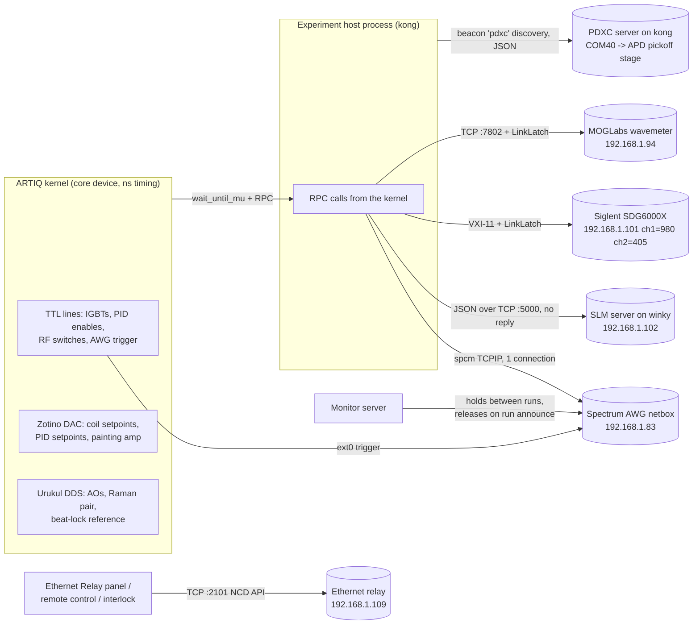

# Agent 06 report: Hardware control drivers

Scope: the driver classes an experiment (or a lab GUI) uses to reach hardware that is not a plain ARTIQ TTL/DAC/DDS line, plus the composite classes that bundle ARTIQ lines into one physical thing (coils, lightsheet, tweezer PIDs, Raman pair, Rydberg beams, beat-locked imaging). Repos read at k-exp HEAD c8faf77 and wax HEAD acc4621. History is shallow (k-exp from 2026-09-10, wax from 2026-09-24), so "first seen" dates cannot go earlier than that.

Citation shorthand: `kexp/...` = `/home/user/k-exp/kexp/...`; `waxx/...` = `/home/user/wax/waxx-src/waxx/...`; `ktests/` = `/home/user/k-exp/tests/`; `wtests/` = `/home/user/wax/waxx-src/tests/`. Confidence labels: **confirmed** (code/test shows it), **inferred** (strongly implied; reason given), **needs a human**.

---

## 1. operator_summary

- Most of what the machine does is driven by ARTIQ's own real-time channels (TTL, DAC, DDS). Several important instruments are *not*: the tweezer AWG (Spectrum netbox, 192.168.1.83), the SLM (on the PC "winky", 192.168.1.102), the Rydberg Siglent generator (192.168.1.101), the MOGLabs wavemeter (192.168.1.94), the APD pickoff stage (PDXC, through a server on kong), and the Ethernet relay (192.168.1.109). An experiment talks to these over the lab network from the host PC, in the middle of the kernel, through "RPC" calls. **confirmed** (`kexp/config/ip.py:81-119`, `kexp/config/siglent_id.py:10`, `waxx/control/slm/slm.py:15`).
- The big difference to remember: an ARTIQ channel does exactly what the sequence says at exactly the time it says; a network instrument gets a message and may or may not act on it. Several drivers here never hear back (SLM, relay, AWG tone writes during a run), and their saved "settings" are what was *requested*, not what the device did. **confirmed** (sections 5 and 7).
- The composite classes (`igbt_magnet`/`hbridge_magnet` for the coils, `lightsheet`, `tweezer`, `RamanBeamPair`, `RydbergDDSSwitchBeam`/`RydbergTTLSwitchBeam`, `BeatLockImagingPID`) remember the last value they set (a "cache"). Ramps and "off" start from that remembered value, not from a measurement, which matters when something else (the Device Control GUI, a crashed run) moved the hardware. **confirmed** (`kexp/control/big_coil.py:50-55,148-178`).
- Drivers that can lose their network link during a run (Siglent, wavemeter) now carry a "link latch": after the first failure they skip calls for 30 s instead of paying a timeout every shot, print one line when the link goes down and one when it comes back, and record 0. for a failed reading. **confirmed** (`waxx/util/link_latch.py:1-66`, `wtests/test_sdg6000x_link.py`, `wtests/test_wavemeter_link.py`, `ktests/test_rydberg_lock_read.py`).
- If one of these servers is down when you start an experiment, the behaviour differs per device: the AWG waits up to 30 s and then aborts the run; the SLM prints an error and the run continues on the old pattern; the wavemeter silently switches to a dummy that records 0.; the PDXC stage prints a warning and is left wherever it is. **confirmed** (sections 6 and 7).

## 2. mental_model

**Everyday comparison.** ARTIQ's own channels are like the light switches and dimmers wired into the lab's walls: flip one in the script and it happens at that instant, every time. The network instruments are like colleagues you text: the AWG texts back before you move on (a run cannot start without it), the Siglent and wavemeter answer when asked and the driver notes "no answer" as 0.; the SLM and the relay you text and walk away (you only learn they did it by looking at the atoms, or at the SLM PC's window). The monitor server is the colleague who keeps the AWG's phone line open between runs and hands it over when a run calls.

The coil, lightsheet and tweezer classes are like a car's cruise control that remembers the speed you last set. If someone pushed the car while you were not looking, "slow down gradually" starts from the remembered speed, not the real one.



## 3. how_to

### 3.1 Check who holds the tweezer AWG, and free it
1. Open `http://192.168.1.83/status_page.php` in a browser. Each instrument line says `used by <ip>`; `0.0.0.0` means free. **confirmed** (`waxx/control/tweezer/awg_connection.py:84-99` parses exactly this page; Monitor wiki page says the same).
2. If kong (192.168.1.76) holds it and no run is going, it is normally the monitor server: in the Device Control GUI, Composite tab, the connection bar pill "Tweezer AWG" shows it; click the pill to disconnect (it asks to confirm with the text "The AWG card is stopped: the tweezer AOD gets no RF from it until it is connected again and traps are applied."). **confirmed** (`kexp/config/monitor_connections.py:26-38`).
3. If another process on kong holds it (a hung run, a notebook that opened `spcm.Card`), close that process. The AWG notebooks in `kexp/experiments/tools` release the card only in their last cell. **confirmed** (`waxx/control/tweezer/spectrum_DDS_tweezer.py:592-596`).
4. A run does not need you to do this if the holder is the monitor server: the server releases the card before it answers the run's announcement, and a run waits up to 30 s for the card anyway. **confirmed** (`kexp/config/monitor_connections.py:1-10`, `waxx/control/tweezer/awg_connection.py:27-31`, test `wtests/test_monitor_connections.py::test_a_run_announcing_itself_gets_the_card_before_the_reply`).

### 3.2 Apply static tweezer tones between runs (no experiment)
1. Device Control GUI, Composite tab, "Tweezer" card: fill the "AWG traps" table (frequency in MHz, amplitude 0-1, at most 16 rows, sum of amplitudes <= 1). **confirmed** (`kexp/config/composite_devices.py:961-981` table `traps`, `max_rows=16` at line 979).
2. Press "Apply traps": the monitor server writes the tones (tones no longer listed are zeroed), then the monitor experiment pulses `awg_trigger`. The AOD RF switch is not touched; "On" also writes the table and then switches the tweezer on. **confirmed** (`kexp/config/composite_devices.py:878-885, 984-995`; `waxx/control/tweezer/awg_agent_driver.py:28-58`).
3. Needs the "Tweezer AWG" pill connected; otherwise On is refused. **confirmed** (`composite_devices.py:917-922`).

### 3.3 Test whether the AWG's software trigger applies tones (by hand, once)
`python kexp/experiments/tools/awg_force_trigger_check.py [--f1 72e6] [--f2 78e6] [--amp 0.05]` on a PC that can reach the monitor server, with the monitor server holding the AWG and a spectrum analyzer on the AWG output before the amplifier. It asks y/n after each step and prints a result table. `--amp` must be in (0, 0.3]. **confirmed** (`kexp/experiments/tools/awg_force_trigger_check.py:1-88`). Status: unverified on this card (`waxx/control/tweezer/awg_agent_driver.py:11-15`).

### 3.4 Start the SLM server correctly (SLM PC "winky", 192.168.1.102)
1. Run `wax\waxx-src\waxx\control\slm\server\server.bat`. From a Remote Desktop session it hands the session back to the PC's own screen (`tscon <id> /dest:console`, admin prompt; your Remote Desktop window closes), then waits up to 20 s for Windows to see 2 displays, then runs `python run_server.py` after `call %kpy%`. **confirmed** (`waxx/control/slm/server/server.bat:13-49`).
2. A good start prints, in order: `Initializing SLM...`, `Blink SDK was successfully initialized.`, `SLM Width: 1920, Height: 1200`, `LUT Loaded Successfully.`, `SLM Cleared to Blank Pattern.`, a `Phase 0.0pi is mapped to gray level 0` line, `-> mask: spot, dimension=0 um, ...`, `Waiting for next task...`, and `Server listening on 192.168.1.102:5000...`. **confirmed** (`run_server.py:54-56,125-132,168`; `slm_server.py:37,198,202,209,218`).
3. Do not look at it later with Windows Remote Desktop; use VNC/TeamViewer. **confirmed as the code's own advice** (`server.bat:5-11`); the physical reason is **needs a human** (Demons page says "best explanation").
4. Use only the new spot finder (`kexp\calibrations\SLM_spot_finder\spot_finder.bat`, shortcut `_bat\spot_finder.bat.lnk`). Do not use `_bat\spot_finder.lnk`: it launches the old tkinter tool `waxx\control\slm\spot_finder\spot_finding.bat`, which holds the server's only connection open (section 7, D4). **confirmed** (shortcut targets read from the .lnk files in `kexp/_bat/`; `spot_finding_tool.py:30-39`).

### 3.5 Restart ARTIQ, switch the sources, reset the magnet inhibit (Ethernet relay)
1. Server Dashboard (kong) or Client Dashboard: "Ethernet Relay" tab (control group, right dock). The window/panel is titled "Ethernet Relay Control". **confirmed** (`kexp/util/dashboard/server_dashboard_app.py:55-59`, `client_registry.py:43-50`, `ethernet_relay_gui.py:211`).
2. Group "Source Control": "Source Status:" shows ON/OFF; button "Turn Source OFF"/"Turn Source ON" toggles relay 3. No confirmation dialog. **confirmed** (`ethernet_relay_gui.py:223-255,499-513`).
3. Group "Magnet Enable Status": the button reads "ON" (magnets enabled, gray) or "INH - Reset?" (inhibited, red). Clicking "ON" inhibits the magnets immediately (no confirmation); clicking "INH - Reset?" re-enables them. **confirmed** (`ethernet_relay_gui.py:257-268,423-475,515-529`).
4. Group "ARTIQ Control": "Restart ARTIQ" asks "Are you sure you want to restart ARTIQ?\n\nThis will interrupt any running experiments." then cuts satellite power for the "Satellite restart wait" (default 3 s), waits "Satellite to main delay" (default 5 s), then cuts main-crate power for 3 s. "Satellites" and "Main" restart one crate each. The "⚙" button opens "ARTIQ Restart Settings". **confirmed** (`ethernet_relay_gui.py:18-62,531-607`; `kexp/control/ethernet_relay.py:14-15,37-62`). Note: for the full "Restart ARTIQ" the main crate's off-time is the *satellite* wait, not "Main restart wait" (`ethernet_relay_gui.py:83-87`) **confirmed**.
5. From Python: `from kexp import EthernetRelay; r = EthernetRelay(); r.source_on(); r.read_relay_status()` (list of 4 bools, relay 1..4). **confirmed** (`kexp/control/ethernet_relay.py:17-110`, lazy export `kexp/__init__.py:39`).
6. By email: the remote-control service accepts a "sources" command with on/1/true/t or off/0/false/f. **confirmed** (`kexp/util/remote_control/remote_control.py:117-133`); the email format itself belongs to the remote-control agent.

### 3.6 Start the PDXC (APD pickoff stage) server and fix a wrong remembered position
1. Server Dashboard panel "PDXC Picomotor" (starts `python -m kexp.control.serial.server.pdxc_server`), or run that module by hand on kong. It opens COM40, puts the controller in SMC mode at max speed and prints `PDXC ready: SMC output, CH1 at 20000 steps/s`, then `PDXC server listening on port <n>` and starts its beacon "pdxc". **confirmed** (`kexp/util/dashboard/server_registry.py:184-193`; `kexp/config/ip.py:113-115`; `waxx/control/misc/pdxc.py:275-296,530-550`).
2. Experiments move it themselves at prepare time (Base.__init__ → `self.pdxc.set_apd_stage(...)`): APD runs ask "in", Andor-frame runs ask "out", Basler runs leave it alone. **confirmed** (`kexp/base/base.py:80`, `kexp/base/cameras.py:83-90`, `kexp/control/misc/pdxc_apd_stage.py:76-98`).
3. If someone moved the stage by hand, tell the server: `from kexp.control.misc.pdxc_apd_stage import APDStageClient; APDStageClient().declare_position('out')` (or `'in'`), or force a full throw: `APDStageClient().apd_out(force=True)`. **confirmed** (`pdxc_apd_stage.py:100-128`).

### 3.7 SRS DC205 / SR560 servers (kong)
`kexp\_bat\dc205_server.bat` (COM10, TCP 192.168.1.76:5555) and `kexp\_bat\sr560_server.bat` (COM9, TCP :5556). No experiment in kexp uses their clients today. **confirmed** (`kexp/_bat/dc205_server.bat`, `sr560_server.bat`; `kexp/config/ip.py:74-79`; grep finds no client use in `kexp/`).

### 3.8 Look at the Rydberg lock record of a run
In analysis: `ad.data.frequency_wavemeter_405`, `ad.data.frequency_wavemeter_980` (measured wavemeter frequency, Hz) and `ad.data.frequency_siglent_405`, `ad.data.frequency_siglent_980` (Siglent frequency read back, Hz), one value per shot. 0. means the read failed that shot; read section 7 D6 before trusting "not 0". **confirmed** (`kexp/config/data_vault.py:20-23`, `kexp/control/rydberg_lasers.py:76-98`; attribute access path per waxa is **inferred**).

### 3.9 Recalibrate
- Coil setpoint-to-current: run `kexp/experiments/measurements/measure_currents_vs_setpoint_pid_and_supply.py`, analyse with `k-jam/analysis/measurements/current_vs_setpoint_pid_and_supply.ipynb`, paste into `kexp/calibrations/magnets.py:9-13`. **confirmed** (comments `magnets.py:4-7`).
- Tweezer frequency-to-position mesh: run `tweezer_xpf_calibration.py`, analyse `k-jam/analysis/measurements/tweezer_xgrid_calibration.ipynb`, replace `X_PER_F_*`, `X_TO_F_OFFSET_*` in `kexp/calibrations/tweezer.py:35-45`. **confirmed** (`tweezer.py:24-33`).
- Tweezer PID1→PID2 conversion: `k-jam/analysis/measurements/PID1_vs_PID2.ipynb` → `tweezer.py:4-10`. **confirmed**.

### 3.10 Label a Quarto (PID box) so it can be identified
Flash `waxx/control/quarto/name_quarto/name_quarto.ino` with the label in `cal_d` (max 15 chars; example `"phase-lock"`), which stores it in NVM page 500 (= address 0xFA00). Every PID firmware in `kexp/control/quarto/*` answers the serial command `ping` with that label. **confirmed** (`name_quarto.ino:4-21`, `name_test.ino:13-21`, e.g. `pid_tweezer_intensity_stabilize.ino:47,55-60`).

## 4. reference_facts

### 4.1 Hosts, ports, COM ports

| Device | Address / port | Where set | Conf. |
|---|---|---|---|
| Tweezer AWG (Spectrum DN2 netbox) | `TCPIP::192.168.1.83::inst0::INSTR`; status page `http://192.168.1.83/status_page.php` | `kexp/config/ip.py:117-119`; `awg_connection.py:91-93` | confirmed |
| SLM server (PC "winky") | 192.168.1.102 TCP 5000 | `waxx/control/slm/slm.py:15`; `run_server.py:10-11`; LAN sheet `kexp/util/network/LAN_devices.csv` | confirmed |
| Rydberg Siglent SDG6000X (LAN sheet: "fast siglent AWG (SDG6052X) (Ry cavity AOs)") | 192.168.1.101, VXI-11; ch1 = 980, ch2 = 405 | `kexp/config/siglent_id.py:10-22` | confirmed |
| MOGLabs FZW wavemeter | 192.168.1.94 TCP 7802 (MOGDevice default) | `ip.py:98-99`; `moglabs/mogdevice.py:42-45` | confirmed |
| Bristol wavemeter | 192.168.1.105 (Bristol server, not used by experiments) | `ip.py:101-102`; `bristol_wavemeter.py:10` | confirmed |
| Ethernet relay (NCD, 4 relays) | 192.168.1.109 TCP 2101 | `ip.py:81-83` | confirmed |
| Keysight supplies | 170 A at .77 (inner), 500 A at .78 (outer); LAN sheet calls .77 "160A Keysight" | `ip.py:104-108`; `LAN_devices.csv` | confirmed (value); rating **needs a human** |
| PDXC server | on kong (192.168.1.76), OS-assigned TCP port, found by beacon id `pdxc`; serial COM40 | `ip.py:113-115`; `pdxc.py:34,519,547-550` | confirmed |
| SRS DC205 / SR560 servers | kong 192.168.1.76 :5555 (COM10) / :5556 (COM9) | `ip.py:74-79` | confirmed |
| Newport picomotor 8742 (objective / lightsheet mirrors) | 192.168.1.80 | `kexp/control/misc/objective_stages.py:7` | confirmed |
| Siglent scopes | 192.168.1.108 ("control desk"), .110, .112 in experiments/LAN sheet | e.g. `kexp/experiments/JP/monitored_rabi/cont_mon.py:43` | confirmed |
| SSG3021X (Ry fiber EO generator) | 192.168.1.97 — driver exists, not instantiated | `waxx/control/misc/ssg3021x.py:8`; `devices.py:195` (commented) | confirmed |
| Painting FM generators (SDG6022X .91/.92, Keysight 33500B .122, BNC .123) | not in any code | `LAN_devices.csv`; grep | confirmed (absent) |

### 4.2 Timing and retry constants

| Constant | Value | File:line | Conf. |
|---|---|---|---|
| `T_AWG_IN_USE_WAIT` (run waits for a held card) | 30 s | `awg_connection.py:31` | confirmed |
| `T_AWG_RETRY_INTERVAL` / `N_AWG_RETRIES` | 2 s / 3 tries (non-"in use" errors) | `awg_connection.py:32-34` | confirmed |
| `T_AWG_CLOSE_TIMEOUT` / exit / slow report | 5 s / 5 s / 1 s | `awg_connection.py:41-46` | confirmed |
| Monitor server AWG open wait / agent close | 10 s / 2.5 s; open timeout 30 s | `monitor_connections.py:24,37`; `awg_agent_driver.py:23-25` | confirmed |
| `T_AWG_RPC_DELAY` (after each AWG write in a kernel) | 25 ms | `spectrum_DDS_tweezer.py:19` | confirmed |
| AWG trigger pulse | 1 µs on `ttl.awg_trigger` (ch 14), ext0 rising edge, 1.5 V level, DC | `spectrum_DDS_tweezer.py:149,829-833`; `ttl_id.py:34` | confirmed |
| AWG output amplitude (full scale) | 0.428 V into 50 Ω | `spectrum_DDS_tweezer.py:823-824` | confirmed |
| AWG DDS cores | 20 (`core_list`); 2D mode puts cores 8-11 on channel 1 | `spectrum_DDS_tweezer.py:849-853` | confirmed |
| `SLM_RPC_DELAY` | 0.25 s timeline delay after the send | `slm.py:11,109` | confirmed |
| SLM server reinit | every 3600 s if idle >= 20 s and queue empty; queue 256 | `run_server.py:14-16,134-161` | confirmed |
| Siglent `T_TIMEOUT` (connect and reply) / `T_RPC_DELAY` | 2 s / 20 ms | `sdg6000x.py:31-34` | confirmed |
| Siglent sweep step time | 0.1 s per step (default 1 MHz step) | `sdg6000x.py:329,357-366` | confirmed |
| LinkLatch retry | 30 s | `link_latch.py:21` | confirmed |
| Wavemeter socket timeout / channel settle | 1 s / 75 ms × up to 3 | `moglabs_wavemeter.py:21,36,90-94` | confirmed |
| Wavemeter lock tolerance | 60 MHz | `kexp/config/wavemeter_id.py:6` | confirmed |
| Relay connect | 5 retries (6 attempts), backoff 0.2/0.5/1/2/3 s, 10 s timeout (also bounds recv) | `waxx/control/ethernet_relay.py:283-285` | confirmed |
| Relay GUI poll | every 5 s | `ethernet_relay_gui.py:130-132` | confirmed |
| Interlock relay probe | 1 attempt, 0.5 s, at most every 5 s | `kexp/util/guis/interlock/interlock_service.py:71-80` | confirmed |
| ARTIQ restart defaults | 3 s power-off, 5 s satellite→main | `kexp/control/ethernet_relay.py:14-15` | confirmed |
| PDXC throw | 40000 pulses per move; in = 3 moves, out = 1; persisted in `~/.waxx/pdxc_server_defaults.json` on the server | `pdxc.py:68-76` | confirmed |
| PDXC move time | pulses/frequency + 0.3 s per move (open loop, no encoder) → ~6.9 s in, ~2.3 s out at 20 kHz | `pdxc.py:429-437` | inferred (arithmetic on defaults) |
| PDXC client timeouts | connect 2 s; move reply 290 s; other device calls 10 s; discovery 3 s from experiments | `pdxc.py:36-40`; `pdxc_apd_stage.py:36-39` | confirmed |
| Coil analog delay | 30 ms after supply ramps | `big_coil.py:21,177` | confirmed |
| `igbt_magnet.off()` total timeline | ~285 ms per coil (10+30 ramp to i_pid, 50+30+30 rampdown, 5, 130 discharge) | `big_coil.py:273-305` | inferred (sum of delays) |
| `start_pid` | 50 steps over 50 ms raising supply to i_pid + overhead, then 30 ms | `big_coil.py:233-253` | confirmed |
| Tweezer PID1 integrator clear after switch-on | `t_tweezer_pid1_int_clear_delay` = 10 µs, 1 µs pulse | `awg_tweezer.py:120-121`; `expt_params.py:128` | confirmed |

### 4.3 Coil constants and calibrations

| Item | Value | File:line | Conf. |
|---|---|---|---|
| Inner coil | `hbridge_magnet`, max_current 170 A, max_voltage 80 V, 17 A per V supply setpoint, no offset, PID uncalibrated (1 A/V) | `kexp/base/devices.py:124-135`; `magnets.py:15-19` | confirmed |
| Outer coil | `igbt_magnet`, max_current 500 A, max_voltage 80 V; supply 50.846 A/V + 0.661 A; PID 40.016 A/V − 0.352 A (transducer current) | `devices.py:137-150`; `magnets.py:9-13` | confirmed |
| Outer supply-current DAC limit | `max_v=7.` V ≈ 356.6 A | `kexp/config/dac_id.py:29` | confirmed (limit); current is inferred arithmetic |
| PID overhead | 0.4 × i_pid (+0), "2025-11-11 fudged to make it work only near I=20A (LF), I=182A (LF)" | `magnets.py:30-52` | confirmed |
| Supply voltage default | 70 V (DAC 8.75 V) | `big_coil.py:17,111-113,132-133` | confirmed |
| Field calibration | 2.841 G/A + 1.338 G (run 10575), "should be retaken! Very old" | `magnets.py:54-101` | confirmed |
| H-bridge switch delay | `t_hbridge_switch_delay` 80 ms (`switch_to_*` unused) | `expt_params.py:21`; `big_coil.py:355-363` | confirmed |
| Imaging detuning branch | outer current > 45 A = "high field" fits | `kexp/calibrations/imaging.py:8`; `image.py:497` | confirmed |
| Analysis cross-section threshold | 1 A on recorded `i_outer_imaging` | `waxa/calibrations/cross_section.py:49` | confirmed |

### 4.4 Lines each composite class drives (kexp)

| Class / object | Lines | File:line | Conf. |
|---|---|---|---|
| `outer_coil` | DAC 9 current (max 7 V), DAC 10 voltage, DAC 19 PID; TTL 8 IGBT, TTL 3 PID enable, TTL 0 discharge IGBT (unused by methods), TTL 50 SRS blanking (unused) | `dac_id.py:28-38`, `ttl_id.py:20-56`, `devices.py:137-150` | confirmed |
| `inner_coil` | DAC 8 current, DAC 11 voltage, DAC 18 PID; TTL 6 IGBT, TTL 2 PID, TTL 9 H-bridge; "discharge" = TTL 21 `test_trig` (unused) | same | confirmed |
| `lightsheet` | DAC 1 VVA/PID setpoint, DAC 0 paint amplitude, TTL 4 RF switch, TTL 12 integrator hold | `devices.py:153-160` | confirmed |
| `tweezer` | DDS `tweezer_pid_1` (+DAC 12), DDS `tweezer_pid_2` (+DAC 17, max 10 V), TTL 13 AOD RF switch, TTL 14 AWG trigger, TTL 11 PID1 integrator hold/zero, TTL 1 PID2 enable, DAC 16 paint amplitude | `devices.py:162-173`; `dds_id.py:55-62` | confirmed |
| `raman` | DDS `raman_150_plus` (dds0), `raman_80_plus` (dds1), switch `raman_switch`; `raman_nf` uses `raman_150_minus` + the same `raman_80_plus` | `devices.py:175-193` | confirmed |
| `ry_405` | Siglent ch2, DDS switch `ry_405_sw`, DAC 31 intensity (2.6 V), TTL 49 shutter, TTL 56 PID clear (shared with 980), wavemeter ch 2 | `devices.py:201-212`; `dac_id.py:42-43`; `wavemeter_id.py:26` | confirmed |
| `ry_980` | Siglent ch1, TTL 52 switch, DAC 30 intensity (2.8 V), TTL 56 PID clear, wavemeter ch 5 | `devices.py:214-224`; `wavemeter_id.py:27` | confirmed |
| `imaging` (`BeatLockImagingPID`) | switch `imaging_x_switch`, ref `beatlock_ref`, PID DDS `imaging` (+DAC 20); TTL 86/87 (comment: "no longer does anything") | `devices.py:238-252`; `ttl_id.py:68-69` | confirmed |
| `integrator` | TTL 36 int/hold (inverted), TTL 38 reset, sampler `apd_integrator` (must be Sampler_Last_CH) | `devices.py:231-233`; `integrator.py:22-30` | confirmed |
| Painting "off" voltages | tweezer −4.985 V, lightsheet −5.95 V (full = +6 V) | `awg_tweezer.py:23`; `painted_lightsheet.py:17`; `painted_beam.py:65-69` | confirmed |

### 4.5 Beat lock defaults
`beatlock_sign = -1`, `N_offset_lock_reference_multiplier = 8`, `frequency_minimum_offset_beatlock = 250 MHz`; resonance shift uses half the ground hyperfine splitting 461.7 MHz. **confirmed** (`kexp/config/expt_params.py:36-38`; `beat_lock.py:17,153-156`).

### 4.6 Rydberg
Siglent defaults: 980 ch1 417.0 MHz, 0.640 Vpp, limits 50-499 MHz, max 1 Vpp; 405 ch2 459.0 MHz, 0.125 Vpp, limits 65-500 MHz, max 1 Vpp. Wavemeter targets `frequency_target_405_lock = 741.0928 THz`, `frequency_target_980_lock = 306.6819 THz + 60 MHz`. Lock verdict: |measured − (target + eo_shift_direction·f_siglent − cavity_ao_order·f_cavity_ao)| > 60 MHz → "unlocked" print; both beams use eo_shift_direction −1 and cavity_ao_order 0. **confirmed** (`siglent_id.py:11-22`; `expt_params.py:477-478`; `rydberg_lasers.py:118-124`; `devices.py:207,219`).

### 4.7 What each driver leaves in the data file

| Driver | Recorded | Request or applied | Conf. |
|---|---|---|---|
| Outer coil | `data.i_outer_imaging` (A), once per shot at the first camera trigger: `i_pid` if the PID is on, else `i_supply` | request (cached setpoint converted by calibration), never measured | confirmed (`image.py:62-79`, `big_coil.py:135-145`) |
| Rydberg | `frequency_wavemeter_405/980`, `frequency_siglent_405/980` per shot, only for beams switched on that shot | applied (wavemeter measurement; Siglent read back with `C<n>:BSWV?`); 0. = failed | confirmed (`rydberg_lasers.py:93-98`, `sdg6000x.py:230-276`) |
| Tweezer AWG | only ExptParams (`frequency_tweezer_list`, `amp_tweezer_list`, ...) | request | inferred (no readback anywhere in `spectrum_DDS_tweezer.py`) |
| SLM | only ExptParams (`dimension_slm_mask`, `phase_slm_mask`, `px_slm_phase_mask_position_x/y`) | request, and not even always what was sent (section 7 D3) | confirmed |
| Raman / lightsheet / tweezer PIDs | ExptParams | request | inferred |
| Device state at start | `device_state_at_start` text (monitor's view, trust, hazards) | monitor's cached state | confirmed (`base.py:115-138`) |
| DDS init | HDF5 attr `dds_init` | applied | confirmed (`devices.py:111-119`) |
| Scopes | END_RUN payload `scope_data` (NaN for failed channels) | applied (traces) | confirmed (`oscilloscopes.py:176-218`; `waxx/base/expt.py:564-620`) |
| Relay, PDXC stage position, Keysight | nothing | — | inferred (grep finds no save) |

## 5. expert_nuances

### 5.1 How a kernel talks to a network instrument (applies to AWG, SLM, Siglent, wavemeter)
- The pattern is `self.core.wait_until_mu(now_mu())` (let the wall clock catch up with the timeline), a host RPC that blocks the kernel, then either `delay(...)` or `self.core.break_realtime()`. **confirmed** (`sdg6000x.py:319-392`, `slm.py:107-109`, `spectrum_DDS_tweezer.py:141-179`, `rydberg_lasers.py:93-98`).
- The ones that end with `break_realtime()` (Siglent `set`/`set_output`/`sweep`/`init`, `lock_status`) cannot underflow however slow the RPC is. The ones that end only with a fixed `delay()` can: `SLM.write_phase_mask_kernel` adds 0.25 s (`slm.py:109`), the AWG setters add 25 ms (`spectrum_DDS_tweezer.py:147,162,177,490,523`). If the RPC takes longer than that delay, the next RTIO event in the kernel is in the past → `RTIOUnderflow`. In `init_kernel` this is covered by the unconditional `break_realtime()` at `base.py:179`; inside a user's `scan_kernel` it is not. **confirmed** (code), underflow outcome **inferred**.
- The SLM client socket has no timeout (`slm.py:111-116`, plain `socket.socket` + `connect`). With the SLM PC off the network, the connect blocks for the operating system's connect timeout (tens of seconds on Windows), which also makes the underflow above likely when called in a scan. **confirmed** (no `settimeout`); duration **inferred** (OS default).
- The AWG move writers `write_move` / `write_amp_ramp` are `@rpc(flags={"async"})` (`spectrum_DDS_tweezer.py:529-585`): the kernel does not wait for the host to finish pushing up to 10^6 commands; it waits 25 ms of timeline and pulses the trigger. Whether a long move is fully queued on the card by then is not checked anywhere. **confirmed** (code), risk **inferred**.

### 5.2 Tweezer AWG
- `awg_init` (called as an RPC from `init_kernel`, `base.py:176-178`) = `AwgConnection.connect(setup)`: first closes any connection this process already holds (`awg_connection.py:139-142`), then opens; if the driver's error text contains "in use" or "locked" it keeps retrying every 2 s until 30 s have passed, printing who holds the card (read from the netbox status page, since the driver's error does not say) once per holder; other retryable errors ('network', 'timeout', 'not found', 'no connection') get 3 tries. A setup error (e.g. card mode) closes the card and is not retried. **confirmed** (`awg_connection.py:130-192`, tests `wtests/test_tweezer_card_close.py::test_connect_waits_while_another_connection_holds_the_card`, `::test_a_setup_error_closes_the_card_and_is_not_retried`).
- Why 30 s: a run whose core connection was taken by a new run lets go of the card only when its process exits, which took longer than the old ~4 s (3 tries). **confirmed** (`awg_connection.py:27-31`; commit a2492d4, 2026-09-26).
- `spcm.Card.open` marks a card open even with a null handle; `_open_card` checks the handle so the failure is reported at open, not later as a "card mode" error. **confirmed** (`awg_connection.py:194-210`).
- Close is bounded: stop with `M2CMD_DATA_STOPDMA` (plain stop if refused), then `spcm_vClose`, in a daemon thread; the caller waits at most 5 s, then abandons the card and says which step hung. Reason: run 83101 (2026-09-26) never reached `end()` because `spcm_vClose` joined a driver thread forever. An `atexit` handler closes the card for runs that crash before `post_scan`. **confirmed** (`awg_connection.py:36-46,212-314`; commit a2492d4). Whether the netbox accepts STOPDMA was "owed on kong" in that commit message: **needs a human**.
- Setup: DDS mode, all channels enabled, 50 Ω, 0.428 V amplitude, trigger mask ext0 only (software trigger disabled in the mask), rising edge at 1.5 V, DC coupling, DDS commands by DMA with `WAIT_IF_FULL`, DDS trigger source = card, `dds.reset()` leaves no tones, then `card.start(M2CMD_CARD_ENABLETRIGGER)`. **confirmed** (`spectrum_DDS_tweezer.py:811-858`).
- New tones take effect only on the next trigger pulse (`exec_at_trg`); every setter pulses `awg_trg_ttl` unless `trigger=False`. **confirmed** (`spectrum_DDS_tweezer.py:136-179,860-888`).
- Trap bookkeeping: each `TweezerTrap` takes its DDS core index from a counter stored on the shared ExptParams (`p.idx_tweezer`), reset to 0 by the controller and by `reset_trap_list_rpc`; traps are indexed in creation order. **confirmed** (`spectrum_DDS_tweezer.py:63-66,613,786-790`).
- `finish_prepare` builds the trap list from `frequency_tweezer_list`/`amp_tweezer_list` if empty and deep-copies it into `traps_saved`; every shot `reset_tweezers` → `reset_traps` rebuilds the list on the host only if one of those two lists is an xvar, syncs kernel-side trap objects from `traps_saved`, writes static tones for all traps and (in `reset_tweezers`) waits 15 ms and pulses the trigger. **confirmed** (`base.py:111-113`; `kexp/base/control.py:96-108`; `spectrum_DDS_tweezer.py:768-802`).
- Scanning `frequency_tweezer_list`/`amp_tweezer_list`: the scanner writes no kernel value for list params (KERNEL_INVARIANTS_PLAN "pre-existing bugs"), but `reset_trap_list_rpc` runs on the host and reads the host's params, so the *static tones* do follow the xvar; anything a kernel reads from `self.p.frequency_tweezer_list` does not. **inferred** (host RPC path at `spectrum_DDS_tweezer.py:776-790` vs the plan's statement).
- Each `TweezerTrap` allocates a 10^6-float scratch array (8 MB) and `save_trap_list` deep-copies all traps; KERNEL_INVARIANTS_PLAN warns never to reference `values` from a kernel. **confirmed** (`spectrum_DDS_tweezer.py:75`; `kexp/util/profiling/KERNEL_INVARIANTS_PLAN.md:56`).
- The plan's "pre-existing bug" that moves read a stale `_value_final` looks fixed in current code: `cubic_move`, `sine_move`, `linear_amplitude_ramp`, `sine_amplitude_modulation` use the value returned by the RPC. **inferred** (`spectrum_DDS_tweezer.py:274-349` vs plan lines 173-176).
- `tweezer.on()` (kexp): PID1 setpoint to 0 V, 300 µs, AO2 on, painting set or off, AO1 + AOD RF switch on together, then 10 µs later a 1 µs pulse on the PID1 hold/zero line (clears the integrator's turn-on transient; since 2026-09-27, commit abc6905). The docstring says "pid2 feedback set to disabled" but `on()` never touches `pid2_enable_ttl`. **confirmed** (`awg_tweezer.py:91-121`).
- `tweezer.off()` leaves the PID1 hold/zero line HIGH (integrator zeroed and held), which the Quarto firmware treats as "integral1 = 0, integrator stopped". `reset_tweezers` also ends with the line HIGH. **confirmed** (`awg_tweezer.py:123-133`; `control.py:107-108`; `kexp/control/quarto/pid_tweezer_intensity_stabilize/pid_tweezer_intensity_stabilize.ino:63-70`).
- `low_power=True` ramps drive PID2 (`tweezer_pid2_enable` high; firmware then starts PID2 with integral preset to `v_max_ao_efficiency` 4 V) and convert `v_pd_max` with `tweezer_vpd1_to_vpd2` (×71.7 − 2.14). **confirmed** (`awg_tweezer.py:149-177,254-258`; `.ino` hold2 at lines 72-80; `calibrations/tweezer.py:6-14`).
- The tweezer's ramps do not switch the beam on (`_ramp_begin` only sets the DAC and PID2 enable), the lightsheet's ramps do (`self.on(paint=paint)` + one step delay, so a lightsheet ramp lasts t + one step). **confirmed** (`awg_tweezer.py:149-156`; `painted_lightsheet.py:64-68`).

### 5.3 Painting co-ramps (lightsheet and tweezer)
- Each step writes the power DAC and the painting DAC with `load_dac=False` and then one `load()`: on a Zotino this is one LDAC strobe for the whole board, so both move on the same edge. **confirmed** (`painted_beam.py:31-37,137-149`).
- `keep_trap_frequency_constant`: painting amplitude ∝ (P/P_max)^(1/3), rescaled onto [v_paint_min, v_awg_am_max]. **confirmed** (`painted_beam.py:80-97`).
- Endpoint convention: n steps at t/n; linear/exponential/adiabatic reach v_end at step n−1 and hold for one step; cubic reaches it at n. **confirmed** (`waxx/control/artiq/ramp_math.py:14-21`).
- Any DAC write above the channel's `max_v` writes **0 V** (not clamped) and prints the channel's error asynchronously; a ramp whose start or end is above `max_v` does nothing at all (no writes, no timeline advance) and prints. **confirmed** (`waxx/control/artiq/DAC_CH.py:25-81`). `BeatLockImagingPID._clamp_v_pid` exists precisely to avoid the zeroing (`beat_lock.py:550-570`).

### 5.4 Coils (`kexp/control/big_coil.py`)
- Two analog knobs per coil: the supply's current setpoint (`i_control_dac`) and voltage setpoint (`v_control_dac`), plus a PID loop (Quarto `pid_coil`) whose setpoint is `pid_dac` and which is engaged by `pid_ttl`. The IGBT TTL connects the coil. **confirmed** (`big_coil.py:27-60`; firmware `pid_coil.ino:150-160` "At TTL edges ... enable/disable PID", integrator cleared at each edge).
- `start_pid(i)`: sets the PID setpoint to i (default: the cached supply current), engages the PID, then raises the supply over 50 ms to i + overhead (0.4·i by default) so the shunt MOSFET sits near its best gate voltage. `stop_pid(i)` sets the supply back to i (default: the cached PID setpoint), waits 30 ms, disengages. **confirmed** (`big_coil.py:210-270`; `magnets.py:34-52`).
- Overhead vs DAC limit: the outer supply DAC tops out at 7 V ≈ 356.6 A, so a PID current above ~254.7 A makes `set_supply` write 0 V to the supply (see 5.3). The Composite "PID on" op refuses this case; `start_pid` in an experiment does not. **confirmed** (`dac_id.py:29`; Monitor wiki page states the same refusal; arithmetic inferred).
- `off()` = ramp the supply over 10 ms to the cached `i_pid`, then `rampdown()` (PID off, 50 ms/100-step ramp from cached `i_supply` to 0, voltage 0, 30 ms), IGBT and PID off, 5 ms, `discharge()` (IGBT closed with setpoints at 0 for 130 ms, then open). The first step exists to hand over from PID to supply smoothly, but it means `off()` after a manual ramp to 0 drives the supply *up* to the last PID setpoint first; the Composite tab's "Off" deliberately avoids `off()` for that reason. **confirmed** (`big_coil.py:297-305`; `kexp/config/composite_devices.py:28-35`).
- `reset_coils()` (every shot's cleanup and abort cleanup): outer `stop_pid()`, 50 ms, `off()`; inner `stop_pid()`, `off()`. `stop_pid()` with no argument sets the supply to the cached `i_pid` even when the PID was never started this shot; the cache persists across shots of a run. **confirmed** (`kexp/base/control.py:110-128`; `big_coil.py:255-269`). See D11.
- `init_kernel(init_magnets=True)` calls `off()` from a freshly built object (cached currents 0): the supply setpoint is stepped to 0 A rather than ramped from whatever flows. **confirmed** (`base.py:210-213`; Monitor wiki page "Hazards to know").
- `background_field()` at every shot start calls `off()` only if the cached `i_supply` is non-zero. **confirmed** (`control.py:136-143`).
- `ramp_supply` with a start or end above the DAC limit: `DAC_CH.linear_ramp` returns without writing, but `igbt_magnet.ramp_supply` still sets `self.i_supply = i_end` and still adds the 30 ms analog delay; the t of the ramp is not spent. **confirmed** (`big_coil.py:173-178`; `DAC_CH.py:55-81`).
- `current_now()` (what `data.i_outer_imaging` records) is the cached PID setpoint while `pid_on`, else the cached supply setpoint. **confirmed** (`big_coil.py:135-145`; `image.py:62-79`).
- Inner coil PID has no calibration (slope 1, offset 0) and no code uses it. `hbridge_magnet.switch_to_helmholtz/antihelmholtz` are plain host methods (no `@kernel`) and unused; the Composite tab toggles `ttl.hbridge_helmholtz` directly. **confirmed** (`devices.py:124-135`; `big_coil.py:355-363`; `composite_devices.py:1179,1187`).
- Several cooling stages call `inner_coil.set_voltage(i_supply)`, i.e. pass a current (A) where a voltage (V) is expected. Possibly deliberate (supply voltage headroom tracking current) but undocumented. **confirmed** (code: `kexp/base/cooling.py:484,535,579`); intent **needs a human**.
- The Keysight supplies are only *monitored* (and can be switched on / protection cleared) by the Keysight server over VXI-11; experiments never command them over the network. The server sets `OUTP:INH:MODE LIVE`, i.e. the supplies' inhibit input is live. **confirmed** (`waxx/util/guis/keysight/keysight_server.py:50,93,123,190-195`). That relay 2 ("MAGNET_INHIBIT") drives that inhibit input is **inferred** from names; wiring **needs a human**.

### 5.5 Rydberg beams and the Siglent / wavemeter pair
- Per shot: `reset_devices()` clears each beam's `_used`; `on()`/`pulse()` set it; `cleanup_scan_kernel` calls `lock_status()` for both, which reads only beams used this shot. `post_scan` sweeps the 980 Siglent back to its default only if the 980 was used in the last shot. **confirmed** (`base.py:272-273,353-355,360-365`; `rydberg_lasers.py:58-98,163-177,222-225`).
- `_read_lock`: Siglent frequency first (`C<ch>:BSWV?` read-back); if that fails, the wavemeter is read without a lock verdict; each failure prints and records 0.; nothing raises. **confirmed** (`rydberg_lasers.py:100-128`; `ktests/test_rydberg_lock_read.py`).
- History: the lock read was commented out ("commented while testing Rydberg with LAN down as this is super slow") until commit 3a02db5 "ry fix" (2026-09-24), which re-enabled it once the link latches existed (wax 7e59e7d, same day). **confirmed** (`git show 3a02db5`).
- Siglent writes never raise on a link failure: they print `... FAILED -- hardware NOT updated ...`, mark the setting stale so the next identical request is sent again, and the latch makes the next 30 s of calls cost nothing. Reads raise (and `_read_lock` catches them). A sweep first reads the real frequency; if that fails it writes nothing; if a step fails it stops. **confirmed** (`sdg6000x.py:1-16,195-229,325-366`; `wtests/test_sdg6000x_link.py`).
- Each Siglent *channel* object builds its own `SDG6000X` instrument, so the two channels on 192.168.1.101 have separate latches: an outage prints two "link down" lines and costs two timeouts per retry cycle. **confirmed** (`sdg6000x.py:170`; `siglent_id.py:11-22`).
- The wavemeter controller is a per-address singleton (one latch for both beams); a failed construction does not poison it. **confirmed** (`moglabs_wavemeter.py:21-46`; `wtests/test_wavemeter_link.py::test_failed_construction_does_not_poison_singleton`).
- Reading a beam switches the FZW optical switch to that beam's channel (2 = 405, 5 = 980), waiting 75 ms and re-checking up to 3 times; `robust=True` (the default) also reads exposure and saturation. **confirmed** (`moglabs_wavemeter.py:82-98,206-229`).
- Runs never switch the Siglent outputs on or off: `init(init_siglent=True)` is never called in kexp, so output state is whatever the front panel says; the driver's cached state starts at "on". **confirmed** (grep; `sdg6000x.py:159-189`).
- Both beams share the PID-clear TTL (ch 56); `ry_405.set_power()` pulses it, clearing the 980's integrator too if both loops listen to it. **confirmed** (`devices.py:206,217`); effect on the 980 loop **needs a human**.

### 5.6 SLM
- Client: `write_phase_mask(dimension, phase, x_center, y_center, mask_type, initialize)` sends one JSON object `{"mask","center","phase"(in units of π),"dimension"(int µm),"initialize","spacing":10,"angle":45}` on a new TCP connection and closes it; no `seq`, so the server sends nothing back. `[slm] spot: 30 um, 2.03 pi @ (1022, 843)` is printed right after the send returns. **confirmed** (`slm.py:21-82,111-116`; `slm_protocol.py:14-23`).
- Sentinels: dimension default is `dv = 1.` (so passing 1 m means "default"), phase default is also `dv = 1.` (so passing phase = 1.0 rad means "use `phase_slm_mask`"), centres use −1. `kexp/experiments/test/ttl_in_out.py:38` passes `phase=1.` and therefore sends 2.028π. **confirmed** (`slm.py:8-10,43-50`).
- `dimension = int(dimension * 1e6)` truncates: `30 * 1e-6` becomes 29 µm (a computed value; the literal `30e-6` gives 30). **confirmed** (python arithmetic; `slm.py:65`).
- Server (`run_server.py`): one connection at a time (listen backlog 1, `handle_client` inline), a reader that cuts JSON objects out of the byte stream (since 2026-09-26, 45c0929; before, two commands in one `recv` were both rejected and a split command was lost), a queue of 256, one worker thread that generates the image and calls `Write_image`. Unknown masks — including the client's allowed `'cross'` — become spot; `initialize` is ignored. **confirmed** (`run_server.py:163-303`; `slm_protocol.py:36-75`; `ktests/test_spot_finder_scan.py::test_split_commands`).
- The `dimension` the server prints as "um" is used as a *pixel* diameter (radius = dimension // 2 pixels) for spots, a pixel square for gratings and a pixel arm width for crosses. **confirmed** (`slm_server.py:57-72,95-129`); whether the lab meant µm = pixels **needs a human**.
- Phase-to-gray uses the LUT at `C:\Program Files\Meadowlark Optics\Blink 1920 HDMI\LUT Files\phase_to_gray.txt` loaded at import (column 1 = phase in π, column 0 = gray), nearest value; the repo copy `waxx/control/slm/lut/phase_to_gray.txt` (254 rows, phase up to 2.71π) is not what the server reads. The voltage LUT loaded into the SLM is `19x12_8bit_linearVoltage.lut`. **confirmed** (`slm_server.py:11-14,33-39,205-206`).
- Hourly re-init (idle ≥ 20 s, queue empty) re-creates the SDK, reloads the LUT, clears the SLM and then applies `default_pattern` (dimension 0 = blank), not the last pattern. **confirmed** (`run_server.py:21-38,68-72,134-161`).
- `setup_slm` in `init_kernel` writes only for Andor-path cameras (`optical_path_key == 'andor'`, which includes the APD): absorption → blank (0, 0), dispersive → the ExptParams mask; fluorescence → nothing. The absorption test is written twice (`ABSORPTION or ABSORPTION`). **confirmed** (`kexp/base/cameras.py:143-151`).
- The kexp spot finder uses `seq` replies and a run gate (no SLM write during a run); covered by `SLM-spot-finder---run-gate` and not repeated here. **confirmed** (`kexp/calibrations/SLM_spot_finder/slm_group.py:55-75,300-375`).

### 5.7 Raman pair, fast frequency updates, OPX hand-off
- `RamanBeamPair.set(...)` only rewrites what changed (sentinel `dv=-0.1`), invalidates any pre-staged fast-frequency write first, halves the phases (double-pass: dds0 gets global/2, dds1 (global+relative)/2), and **always ends with `dds0.on(); dds1.on()`** — the light is gated by `dds_sw` (`raman_switch`), switched by `on()/off()`. `pulse()` toggles `dds_sw.dds_device.sw` directly, bypassing the DDS wrapper's cached state. **confirmed** (`raman_beams.py:236-241,569-675,766-784`).
- `cleanup_scan_kernel` calls `self.raman.clean_up_fast_frequency_update()` every shot (restores CFR2 `asf_profile_enable=1`, default CFR1, and rewrites the single-tone profile via `set_mu`), even when FFU was never set up; `raman_nf` is not cleaned up, and it shares `raman_80_plus` with `raman`. **confirmed** (`base.py:333`; `raman_beams.py:413-427`; `DDS.py:409-415`; `devices.py:175-193`).
- `ao_frequencies()` (host, 2026-09-24) runs the same split as the kernel so the OPX configuration cannot drift from ARTIQ's. **confirmed** (`raman_beams.py:170-190`; commit 7e59e7d).
- OPX hand-off: TTL 32 triggers the OPX, TTL 33 high routes the raman 80/150 AOs to the OPX, TTL-in 41 receives the hand-back edge; `init_kernel` and every `cleanup_scan_kernel` drop TTL 33 and switch imaging/raman RF off. The "never measured" timing assumptions are listed in the docstring. The OPX builder the comments cite (`kexp.control.opx`) is not in the repository. **confirmed** (`kexp/base/control.py:193-323`; `ttl_id.py:62-66`; `base.py:199,345-351`; `ls kexp/control`).
- `RamanBeamPair.__init__` wraps `self.dds0.dds_device.sysclk_per_mu` in try/except that only prints; `Devices.__init__`/`Control.__init__` build `RamanBeamPair()` with no arguments, which would raise `TypeError` (those mixin `__init__`s never run, per `base.py:55-57`). **confirmed**.

### 5.8 Beat-locked imaging
- `BeatLockImaging.__init__` only fills `_N_beatref_mult`, `_beat_sign`, `_frequency_minimum_beat` when the argument is the sentinel; an explicit value leaves the attribute unset. Only defaults work today (`configure_imaging_system` passes none). **confirmed** (`beat_lock.py:50-56`; `devices.py:240-250`).
- The imaging PID TTLs 86/87 "no longer do anything"; `set_power(reset_pid=True)` pulses TTL 87 to no effect. **confirmed** (`ttl_id.py:68-69`; `beat_lock.py:476-482`).
- `set_imaging_detuning` raises in-kernel if the offset is below 250 MHz or the reference would be negative; the host conversion only prints the same conditions plus the > 400 MHz DDS limit. **confirmed** (`beat_lock.py:107-165`).

### 5.9 Ethernet relay
- Relays: 1 ARTIQ main-crate power, 2 magnet inhibit, 3 sources, 4 ARTIQ satellite power. For the ARTIQ relays "on" = power **cut** (`artiq_main_off()` turns the relay on; `toggle_*` turns it on, sleeps, turns it off). For relay 2, relay on = magnets enabled (`enable_magnets`), off = inhibited (`kill_magnets`). **confirmed** (`kexp/control/ethernet_relay.py:9-92`).
- The kexp subclass reaches the parent's private `self.__board` by name mangling; this only works because both classes are named `EthernetRelay` (`_EthernetRelay__board`). Renaming the subclass breaks every method with `AttributeError`. **confirmed** (verified with a python snippet reproducing the pattern).
- Every call opens a fresh TCP connection and closes it; `connect(retries=None, backoff=None, timeout=None)` defaults to 6 attempts with backoff 0.2-3 s and a 10 s timeout that also bounds each `recv`; `retries=0` logs its final failure at DEBUG (the caller reports it). **confirmed** (`waxx/control/ethernet_relay.py:279-340`; commit b4cdc66, 2026-09-24).
- Control commands' replies are parsed into `[True, data]` or `[False, 0]` but every kexp method discards the result (`_ = ...`); only a socket error surfaces. **confirmed** (`waxx/control/ethernet_relay.py:162-170`; `kexp/control/ethernet_relay.py:27-92`).
- Three separate pollers touch the board: the Ethernet Relay panel (every 5 s, default connect), a second copy of that panel if both dashboards are open, and the interlock server's probe (one attempt, 0.5 s, at most every 5 s, serialized by `_relay_lock` inside the interlock process only). The interlock comment records that ">1/s across pollers" made the board take >0.5 s to accept. **confirmed** (`ethernet_relay_gui.py:130-132,477-487`; `server_dashboard_app.py:55-59`; `interlock_service.py:71-80,351-377`).

### 5.10 PDXC APD pickoff stage
- "Where it is" is the last position the server commanded (open-loop piezo, no encoder); jogs set it to "unknown"; `move_to` drives the full throw into the end stop and records the target; if the recorded position already matches, it returns `already in` without moving (so an experiment pays the throw only on the first run after a change). **confirmed** (`pdxc.py:55-62,477-502`).
- `move_to` queries `ERR?` at the end and prints any fault, but still records the new position and returns `moved in`. **confirmed** (`pdxc.py:499-502,255-273`).
- Reachability is decided once, when the experiment is built (beacon discovery, 3 s); if the server is not found, every stage call for the life of that experiment prints a warning and does nothing. After a successful connection, a failed call raises (stopping the run) unless `suppress_live_od=True`. **confirmed** (`pdxc_apd_stage.py:20-70`; `clients.py:24-26`).
- The dashboard labels it "PDXC Picomotor", but the driver is for an ORIC PDXC piezo stage controller; the Newport picomotors (8742, 192.168.1.80) are a different device. **confirmed** (`server_registry.py:185`; `pdxc.py:1`; `objective_stages.py:7-38`).

### 5.11 Scopes (Siglent SDS2000X over VXI-11, Tektronix via pylablib)
- Scopes added with `self.scope_data.add_siglent_scope(ip, label, arm)` are armed every shot in `init_scan_kernel` (`arm=True`: single trigger + `*OPC?`; `arm=False`: normal trigger + run). Arm errors are printed per scope and the shot continues. A channel that cannot be read is stored as NaN of the last good length so the run's traces stay rectangular (run 83178 lost all traces to ragged data). The scope driver has no link latch and uses python-vxi11 defaults (unbounded connect, 10 s reply). **confirmed** (`oscilloscopes.py:34-47,176-218`; `oscilloscopes_base.py:73-85,151-157`; `control.py:130-134`).

### 5.12 Quarto PID firmware folders (`kexp/control/quarto/`)
Note: `RydbergBeamBase.set_power` sends a 10 µs pulse on TTL 56 (`ry_intensity_pid_clear`, `rydberg_lasers.py:66-69`). If TTL 56 drove a trigger input of the Rydberg boxes below, the pulse would leave that loop *disabled* (enable = trigger high). Which box and input TTL 56 is wired to **needs a human**.

All are Quarto (qCommand) sketches; each answers `ping` with its NVM label; most accept `c` (clear integrator), some `m` (manual override toggle), `s` (print toggle), `on`/`off`. Trigger inputs gate them from ARTIQ TTLs. **confirmed** (file contents; TTL-to-trigger wiring **needs a human**).

| Folder | What it is (from file) | Trigger meaning (from code) |
|---|---|---|
| `pid_coil` | dual-regime coil current PID (low/high current gain sets, switch at `V_regime` 2.5 V on the current monitor; high-current gains updated 2026-03-17); output DAC3 to the FET | trigger 1 high = PID enabled; integrator cleared on each edge |
| `pid_tweezer_intensity_stabilize` | tweezer PID1 (ADC1 vs setpoint on ADC2 → DAC1) and PID2 (ADC3 vs ADC4 → DAC2) | trigger 1 high = integral1 zeroed and held; trigger 2 high = PID2 on (integral preset 4 V), low = DAC2 fixed at 4 V |
| `pid_intensity_stabilize_imaging` | imaging power PID (setpoint from ADC2) | trigger 1 high = PID disabled; trigger 2 high = manual override (`MANUAL_OUTPUT_VOLTAGE` 8.3 V) |
| `pid_intensity_stabilize_phase_lock_beam` | phase-lock beam (setpoint 0.75, from ADC2) + 405 (setpoint 4.0) | trigger 1/2 high = PID 1/2 enabled; integrator cleared at each edge |
| `pid_intensity_stabilize_ry_3418` | Rydberg "atoms" (4.1 V, max 4.3 V) and "cavity" (1.5 V) intensity | trigger 1/2 high = PID 1/2 enabled; integrator cleared at each edge |
| `pid_intensity_stabilize_rydberg_cavity` | 405 (3.5) and 980 (7.5) intensity | trigger 1/2 high = PID 1/2 enabled; integrator cleared at each edge |
| `pid_frequency_stabilize_Raman` | Raman frequency lock on a peak-separation signal (`setpoint1 = 18`, `pid.txt` alongside) | trigger 1 rising edges mark the scan period used for peak detection |
| `MZI_phase_lock_PID/*`, `MZI_phase_lock__no_trigger` | Mach-Zehnder phase lock (auto-scan variant with a `scan` command) and a "no_trigger" variant, which exists at two paths | despite the name, a trigger-1 rising edge resets the output hold to 5 V and the integrator to 10 |

## 6. loud_failures

Each entry: verbatim text (template, then a plausible example where it is an f-string) → cause → fix. All **confirmed** from the code at the cited line unless marked.

### 6.1 Tweezer AWG (experiment terminal, during `init_kernel`)

```
{label} is in use ({holder}); waiting up to {t_wait_in_use:g} s for it to be released
tweezer awg is in use (held by 192.168.1.76 -- this PC, so another process here); waiting up to 30 s for it to be released
```
`waxx/control/tweezer/awg_connection.py:177-180`. Another connection holds the card; the run keeps trying every 2 s. Holder text variants (`awg_connection.py:101-114`): `held by <ip> -- this PC, so another process here`, `held by <ip>`, `the netbox now reports it free`, `the netbox status page did not say who holds it`. Fix: usually nothing (the monitor server releases it; a previous run exits). If it persists, see 3.1.

```
{label} connected (attempt {attempt}).
tweezer awg connected (attempt 3).
```
`awg_connection.py:154-155`. Printed only after an "in use" wait. Success.

```
{label} init failed: {reason} -- still in use after {t_wait_in_use:g} s.{_in_use_advice}
tweezer awg init failed: open: card is already in use by another application (held by 192.168.1.76 -- this PC, so another process here) -- still in use after 30 s. Close whatever has it open on the PC holding it: a run that is still going or hung, a notebook kernel that opened the card (the AWG notebooks in kexp/experiments/tools close it only in their last cell), or the monitor server (disconnect it on the Composite tab's connection bar).
```
`awg_connection.py:184-192` (printed, then `RuntimeError` with the same text; the driver's own wording before the parenthesis comes from spcm and is only an example, taken from `wtests/test_tweezer_card_close.py:207`). The run stops. Fix: 3.1.

```
tweezer awg connection failed ({reason}), retrying in 2.0 s
tweezer awg init failed: Could not connect to the tweezer awg at TCPIP::192.168.1.83::inst0::INSTR: {driver text}
```
`awg_connection.py:174-176,191-192,207-209`. Netbox unreachable / not found / timeout: 3 tries, then `RuntimeError`. Fix: check the netbox's power and LAN (ping 192.168.1.83), the Spectrum driver install on the PC (PC-Setup step 6).

```
tweezer awg init failed: card mode not supported
```
`awg_connection.py:191-192` for a driver error during `_setup_dds` (example text from `wtests/test_tweezer_card_close.py:246`). Not retried; card closed. Fix: needs a human (card/firmware).

```
tweezer awg: *** stopping the card did not return, so the card may still be running within 5 s. Not waiting any longer; the netbox frees the card when this process's connection drops. ***
tweezer awg: *** the card was stopped, but closing the connection (spcm_vClose) did not return within 5 s at exit. Not waiting any longer; the netbox frees the card when this process's connection drops. ***
tweezer awg: closing the card took 1.3 s.
tweezer awg: stop with STOPDMA failed while closing ({error}); trying a plain stop
tweezer awg: stop failed while closing ({error})
tweezer awg: close failed ({error})
```
`awg_connection.py:247-262,271-286`. Bounded close gave up / was slow / a step was refused. The run still ends. Fix: if the "may still be running" line appears, the AOD may still have RF: check the tweezer beam; the next run's `awg_init` resets the card.

```
'tweezer' object has no attribute 'dds'
```
`waxx/control/tweezer/spectrum_DDS_tweezer.py:928-933` (`reset_awg` prints any exception). Printed at the end (`post_scan`, `base.py:365`) of every run with `init_kernel(setup_awg=False)` (e.g. `default_experiments/mot_tof.py:69`), because the controller only gets `self.dds` when the card is set up. Harmless. **confirmed from code; not observed in a log.**

```
The amplitudes in amplitude_list sum to a value >1 (1.2)
The amplitudes in the trap list sum to a value >1 ({ampsum})
You must indicate cateye/non-cateye of each tweezer if specifying tweezers by position.
You must specify either freuqency or position (not both), or specify neither to use default values.
Amplitude and frequency lists are not of equal length
A move of {t_move} s at dt = {dt} s needs {N} AWG steps (max 1000000).
Modulation depth must be between 0 and 1 (got {d}).
Amplitude modulation peak {p} exceeds 1 (amplitude {a}, depth {d}).
Modulation frequency {f} Hz is above the Nyquist frequency {0.5/dt} Hz for the amplitude step time dt = {dt} s.
```
`spectrum_DDS_tweezer.py:714-721,753,756,878,387,264-268` (`ValueError`, spelling as in code). Bad trap/move request. Note the "trap list" message prints the sum *before* the new trap (`:751-753`).

```
Both frequencies and cateye/non-cateye are specified -- ignoring the cateye list, using frequencies.
```
`spectrum_DDS_tweezer.py:717-718` (print). Informational.

Monitor-side (Device Control GUI op errors / `awg_force_trigger_check.py`):
```
amplitudes sum to {s:.3f} > 1
negative amplitude
{n} tones, but the card has {m} DDS cores
the AWG is not open
The monitor server does not hold the AWG: {conn}. Connect it on the Composite tab first.
{cmd}: the monitor server did not answer.
{cmd} refused: {msg}
--amp must be in (0, 0.3] for this check
```
`awg_agent_driver.py:37-43,101-111`; `awg_force_trigger_check.py:36-38,52-60`.

### 6.2 SLM

Experiment terminal:
```
[slm] Error sending phase mask: {e}
[slm] Error sending phase mask: [WinError 10061] No connection could be made because the target machine actively refused it
```
`waxx/control/slm/slm.py:81-82`. The TCP connect/send failed (server not running, SLM PC off). Printed, not raised: the run continues and the SLM keeps its previous pattern. Fix: start the server (3.4); treat the run's SLM settings as unknown. (Windows error text is an example.)

```
mask_type must be one of 'spot', 'grating', or 'cross'.
```
`slm.py:61-62`, raised before the `try` → propagates out of the RPC and stops the run.

SLM server window (winky):
```
Error: Failed to load LUT!
```
`waxx/control/slm/server/slm_server.py:208-213`: followed by `Delete_SDK()` and `exit()`, which ends the pattern-writing thread (see D1). Fix: Demons page entry; start with `server.bat` at the PC's own screen.

```
Error during initial init: {e}
Error handling task {type}: {e}
Error handling task APPLY: 'NoneType' object has no attribute 'Write_image'
```
`run_server.py:58-59,98-100`. SDK failed to load (DLL, driver) or a pattern failed. The second example is what the worker would print if the initial SDK load raised before `slm_lib` was set (**inferred**).

```
Ignoring malformed command.
Unknown mask; set to default spot.
Plaintext 3-arg parse failed.
Plaintext 7-arg parse failed.
Wrong plaintext format length.
Queue full: dropped one stale task to enqueue latest APPLY.
Failed to enqueue APPLY: {e}
Error while handling client: {e}
SLM_find_spot.py disconnected
```
`run_server.py:195-241,270,284,298,302`. "Unknown mask" also fires for the client's legal `'cross'`. "Queue full" means 256 commands are waiting: the worker is dead or stuck. "SLM_find_spot.py disconnected" is printed for *any* client that resets the connection (misleading name).

Server launcher (`server.bat`):
```
This is a Remote Desktop session: the SLM is not visible from here.
The session is still not on the PC's own screen (%SESSION_NAME%). Not starting the server.
Windows sees only %SCREENS% display(s): the SLM is not showing up as a monitor.
Not starting the server, since it could not reach the SLM. Check the HDMI cable,
the controller LED (solid green = OK), and Settings - Display - Detect.
```
`server.bat:17-19,51-62`.

### 6.3 Siglent SDG6000X (Rydberg EO / AO generator)

```
{label} *** {what} FAILED -- hardware NOT updated ({ExcType}: {e}) ***
[siglent 192.168.1.101 ch1] *** set frequency=420.0000 MHz FAILED -- hardware NOT updated (OSError: host unreachable) ***
[siglent 192.168.1.101 ch2] *** set amplitude=0.125 Vpp FAILED -- hardware NOT updated (LinkDownError: siglent 192.168.1.101: link down since OSError('host unreachable'); next retry in 27 s) ***
[siglent 192.168.1.101 ch1] *** sweep to default (could not read the current frequency) FAILED -- hardware NOT updated (...) ***
[siglent 192.168.1.101 ch1] *** output ON FAILED -- hardware NOT updated (...) ***
```
`waxx/control/misc/sdg6000x.py:191-198,224-225,300-316,334-343`; latch text `waxx/util/link_latch.py:45-50`. The write did not reach the generator; the run continues; the next identical request is re-sent. Fix: check 192.168.1.101 on the LAN; data for those shots used the old frequency.

```
*** {name}: link down ({error!r}). Calls will be skipped and retried every {retry_after:.0f} s. ***
*** siglent 192.168.1.101: link down (timeout('timed out')). Calls will be skipped and retried every 30 s. ***
siglent 192.168.1.101: link back.
```
`link_latch.py:52-66`. Printed once per outage (per instrument object; the Siglent prints it twice, once per channel).

```
Requested siglent freuqency exceeds configured maximum, setting to max.
Requested siglent freuqency exceeds configured minimum, setting to min.
```
`sdg6000x.py:294-299` (spelling as in code). Silent clamp of the request to 50-499 MHz (980) / 65-500 MHz (405); the clamped value is what the hardware gets and what `frequency_siglent_*` reads back.

```
Amplitdue requested for this channel is beyond configured maximum.
```
`sdg6000x.py:308-309` (`ValueError`, spelling as in code). Raised on the call *after* an over-limit amplitude was sent (see bug B6); stops the run.

### 6.4 Wavemeter and Rydberg lock record

```
Failed to connect to wavemeter -- please close wavemeter software if it is open. Lock status will not be checked.
```
`kexp/config/wavemeter_id.py:20-24`, at experiment build. Any exception from `WavemeterController('192.168.1.94')` (bare `except:`) switches both beams to dummies for the whole run: every shot records 0. Fix: close the MOGLabs wavemeter software (it holds the connection, per the message), check the LAN, restart the experiment.

```
[{key}] siglent read failed, recording 0.: {e!r}
[ry_405] siglent read failed, recording 0.: LinkDownError('siglent 192.168.1.101: link down since ...; next retry in 12 s')
[{key}] wavemeter read failed, recording 0.: {e!r}
```
`kexp/control/rydberg_lasers.py:111-127`. `{key}` is `?` when the wavemeter is the dummy (no `key`). Fix: as for the link-down lines.

```
laser {key} unlocked:
target = {f_target/1e12:1.6f}, meas = {f/1e12:1.6f}, diff = {(f - f_target)/1e6:1.1f}
laser ry_980 unlocked:
target = 306.681960, meas = 306.682100, diff = 140.0
```
`waxx/control/misc/moglabs_wavemeter.py:225-228`. Measured frequency more than 60 MHz from target + EO shift. Print only; data records the measured value. Beware: a failed read with the link up gives meas = 0.000000 and a huge negative diff (D16).

```
Wavemeter exposure time {ms:1.0f} ms is too long for reliable lock detection.
Wavemeter saturation level ({sat:1.0f}/100) is too low for reliable lock detection.
Failed to read wavemeter channel
Failed to set channel to {ch}, got {last_ch}
Failed to set channel
Failed to communicate with wavemeter. Check connection and IP address.
Error getting frequency from wavemeter
Failed to read wavemeter saturation level.
Failed to read wavemeter exposure time.
failed to set averaging time
failed to set wavemeter units
Device did not respond to query
*** wavemeter 192.168.1.94: link down (...). Calls will be skipped and retried every 30 s. ***
```
`moglabs_wavemeter.py:79,96,98,106,123,132,143,152,158,180,190`; `moglabs/mogdevice.py:84-88`; `link_latch.py:55-56`.

### 6.5 Coils, DACs, integrator, beat lock

```
Attempted to set dac ch {key} to a voltage > specified maximum voltage ({max_v:1.3f}) for that channel. DAC voltage was replaced by zero for these instances.
Attempted to set dac ch outer_coil_supply_current to a voltage > specified maximum voltage (7.000) for that channel. DAC voltage was replaced by zero for these instances.
```
`waxx/control/artiq/DAC_CH.py:22-23,26-43` (async print). For `set()` the channel really was set to 0 V; for a ramp nothing was written (the wording "replaced by zero" is then wrong). Outer coil: > ~356 A supply, or PID current > ~254 A with the default overhead. Fix: lower the current or overhead. On a channel without `errmessage` (placeholder/dummy) this print itself raises `AttributeError` (KERNEL_INVARIANTS_PLAN).

```
The beat lock is unhappy at a lock point below the minimum offset.
You tried to set the DDS to a negative frequency!
The requested detuning results in an offset less than the minimum beat note frequency for the lock.
The requested detuning would require a negative reference frequency. You'll need to flip the beat lock sign to reach this detuning.
Invalid beatlock reference frequency for requested detuning (>400 MHz). Must be less than 400 MHz for ARTIQ DDS. Consider changing the beat lock reference multiplier.
Both the xy and x imaging fibers are currently derived from the PID setup (as of 2026-02-17)
```
`waxx/control/beat_lock.py:125-129` (kernel `ValueError`s, stop the run), `:159-164` (prints only), `kexp/base/devices.py:252` (`ValueError` for a non-PID imaging config).

```
For fast readout, use channel 6 or 7 of the sampler and assign as Sampler_Last_CH in sampler_id.py
```
`waxx/control/integrator.py:28-29` (`ValueError` at build).

### 6.6 Ethernet relay

```
Relay connect attempt {n}/{N} to {addr} failed: {exc!r}; retrying in {d:.2f}s
Relay connect attempt 1/6 to ('192.168.1.109', 2101) failed: TimeoutError('timed out'); retrying in 0.20s
Relay connect failed after {N} attempts to {addr}: {exc!r}
Relay connect succeeded on attempt {n} to {addr}
```
`waxx/control/ethernet_relay.py:313-333` (logger `waxx.control.ethernet_relay`: WARNING, ERROR — or DEBUG when `retries=0` — and INFO). Where these appear depends on the dashboard's logging setup (**inferred**).

```
Relay operation failed: {message}
```
`kexp/util/guis/ethernet_relay/ethernet_relay_gui.py:649-666` (logger error), and the "Source Status" label turns purple with text `ERROR`. Also resets the "Restart ARTIQ" button text.

```
'bool' object is not subscriptable
```
**inferred**: `get_relay_status_by_index` returns `False` for a reply with a bad handshake/length/checksum (`waxx/control/ethernet_relay.py:172-179`) and every read in kexp indexes it with `[0]` (`kexp/control/ethernet_relay.py:23,97,107`).

### 6.7 PDXC stage

```
[PDXC] WARNING: no connection to the PDXC stage server: {e}
       APD stage control is disabled for this run. Start the PDXC server on the control PC if you need it.
[PDXC] WARNING: not connected -- skipping {what}.
[PDXC] WARNING: not connected -- skipping move to in.
[PDXC] WARNING: {what} failed: {e}
       Continuing without APD stage control.
[PDXC] APD stage {result}.
[PDXC] APD stage moved in.
[PDXC] APD stage already out.
PDXC server unreachable: {exc}
```
`kexp/control/misc/pdxc_apd_stage.py:41-43,52,68-69,104`; `waxx/control/misc/pdxc.py:766` (`RuntimeError`, raised to the experiment unless `suppress_live_od=True`).

Server window:
```
PDXC ready: SMC output, CH1 at 20000 steps/s
PDXC frequency readback {r} Hz != requested {f} Hz
PDXC failed to switch to SMC output (SW? -> {mode!r})
PDXC error {code}: {message}
PDXC error 7: stage move abnormal
PDXC ERR? returned unparseable reply: {raw!r}
PDXC rejected {cmd!r}: {resp}
PDXC server listening on port {port}
```
`pdxc.py:186` (rejected; also raised as `RuntimeError`), `:265` (unparseable), `:270` (error code; the move still reports success, D10), `:287` (`RuntimeError` at server start), `:293`, `:295`, `:551`.

### 6.8 Scopes
```
[ScopeData.arm_rpc] ERROR arming '{label}': {e}
[SiglentScope read_sweep] ERROR shot {shot} ch={ch}: {e} -- stored as NaN ({npts} pts)
[SiglentScope read_sweep] ERROR shot 3 ch=0: C1 is switched off -- stored as NaN (1000000 pts)
[SiglentScope read_sweep] ERROR shot {shot} ch={ch}: {e} -- no length to size a NaN placeholder; this run's traces will be ragged
scope sent {n} bytes, expected {m} ({points} points)
[end_wax] WARNING: scope_data.close() raised: {e} — continuing.
```
`waxx/control/misc/oscilloscopes.py:43,196-216`; `oscilloscopes_base.py:132-134`; `waxx/base/expt.py:391-393`.

### 6.9 Objective stages (Newport 8742)
```
lightsheet cannot be translated!
```
`kexp/control/misc/objective_stages.py:74-75`, then `UnboundLocalError` on `objective` (**confirmed** by reading: nothing assigns it on that branch).
