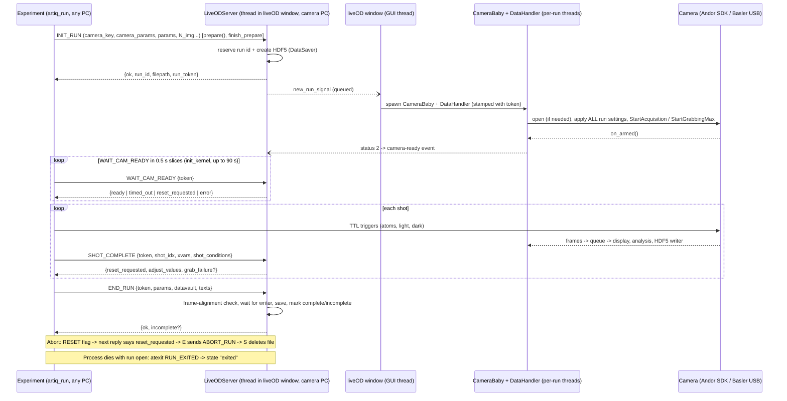

# Report 08: Cameras and LiveOD

Research agent 08, 2026-09-28. k-exp HEAD c8faf77, wax HEAD acc4621. Read-only; nothing was run.

**Citation legend.** `live_od/X` = `wax/waxx-src/waxx/util/live_od/X`; `waxx/X` = `wax/waxx-src/waxx/X`; `waxa/X` = `wax/waxa-src/waxa/X`; `kexp/X` = `k-exp/kexp/X`; `waxx-tests/X` = `wax/waxx-src/tests/X`; `kexp-tests/X` = `k-exp/tests/X`; `wiki/X` = the wiki clone in the scratchpad. Commits are wax SHAs unless marked (k-exp).
**Confidence legend.** [C] confirmed (code or test shows it), [I] inferred (reason given), [H] needs a human.

---

## 1. operator_summary

liveOD is the separate program that owns the lab's cameras. The **LiveOD Server** window runs on the camera PC (kong, by every hint in the repo [H]). Every camera experiment talks to it over the network. At the start of a run the experiment announces itself (`INIT_RUN`). liveOD then hands out the run ID, creates the HDF5 data file, sets the camera up with the run's settings, and says "ready" only once the camera is **armed**. It shows each shot's images, OD and atom number live, and saves the images into the file. At the end (`END_RUN`) it writes the rest of the data and marks the file complete, or **incomplete** with a reason when frames are missing or out of place.

The one control you need in a hurry is the red **Abort** button, top right of the LiveOD Server window. It stops the run at the end of the current shot and deletes that run's file. The pill at the left of the status row always says where the run is: Camera…, Running, Saving, Saved, Aborting, Aborted, No reply, Exited or Error.

Anyone can watch from another PC with the **LiveOD Viewer** (`live_od_viewer.bat`). If liveOD is not running, a camera experiment stops at startup with `[LiveOD] Could not connect to LiveOD server`. Which camera a run uses, and all its exposure, gain and trigger settings, live in `kexp/config/camera_id.py`. What the camera actually applied is recorded separately, whenever it differs from the request (`camera_overrides`).

---

## 2. mental_model

**A camera librarian.** liveOD is like the librarian who keeps the lab's cameras in a locked cabinet. An experiment cannot touch a camera. It fills in a request slip (`INIT_RUN`: which camera, how many pictures, which settings). The librarian writes a ticket number on it (the **run ID** and a secret **run token**), takes the camera out, sets it up exactly as the slip says, and loads it (**armed**). Only then does it say "go" (`WAIT_CAM_READY` → ready). The experiment fires the shutter by a hardware pulse (TTL) for each picture. After each shot it phones in "shot done" (`SHOT_COMPLETE`), and each time it asks whether anyone pressed Abort. At the end it hands in the rest of the paperwork (`END_RUN`). The librarian files everything together in one folder, the HDF5 file, and stamps it complete or incomplete. A slip with an old ticket number (a run that a newer request has replaced) is politely ignored. If the caller hangs up for good (`RUN_EXITED`), the librarian notes it and stops waiting.



---

## 3. how_to

### 3.1 Start the LiveOD Server (on the camera PC)
1. On the camera PC [H: kong, 192.168.1.76, is where every hint points: `live_od/gui/remote_viewer_window.py:10-11` usage example; `kexp/_bat/shortcuts/LiveOD Server.lnk` hard-codes `C:\Users\scientist\...`; wiki/Starting-up-the-experiment.md:68], use the Windows-search shortcut **LiveOD Server**, or `kexp\_bat\live_od.bat`, or from a `kpy` terminal:
   ```cmd
   python -m kexp.util.live_od.gui.main_window
   ```
   [C] `kexp/util/live_od/gui/main_window.py:1-23`; `kexp/_bat/live_od.bat` (`cd %code%\k-exp\kexp\util\live_od\gui` then `python main_window.py`); shortcut target read from `kexp/_bat/shortcuts/LiveOD Server.lnk` (strings). The shortcut is found by Windows search once `setup_shortcuts.ps1` has run [C] `kexp/_bat/setup_shortcuts.ps1:1-10`.
2. A console opens, then a window titled **LiveOD Server** [C] `kexp/config/live_od.py:86`, `live_od/gui/main_window.py:1427`. It is up when the console and the log panel show (new in waxx, replacing the old "Mother is watching...", which no longer exists anywhere in the code [C] grep):
   ```
   HH:MM:SS INFO    liveOD server listening on tcp://0.0.0.0:<port>
   HH:MM:SS INFO    liveOD broadcaster publishing on tcp://*:<port>
   HH:MM:SS INFO    Console handler installed: closing this console closes the cameras.
   ```
   [C] `live_od/live_od_server.py:767`, `live_od/live_od_broadcaster.py` (run), `live_od/gui/main_window.py:931`; line format `%(asctime)s %(levelname)-7s %(message)s` `live_od/log.py:246`.
3. The status row at the top reads a grey **Idle** pill and `Next run: <id>`. `Next run: (unavailable)` means liveOD cannot read the run-ID counter on the data drive [C] `live_od/gui/status_strip.py:280-283`, `live_od/gui/main_window.py:514-519`.
4. All cameras start **closed**. Each is opened on demand by the first run that needs it [C] `kexp/config/live_od.py:18-19` (`CAMERAS_OPEN_ON_START = ()`), `live_od/camera_nanny.py:138-153`.

### 3.2 Open a remote viewer (any PC)
1. Shortcut **Viewer (LiveOD)**, or `kexp\_bat\live_od_viewer.bat`, or `python -m kexp.util.live_od.gui.remote_viewer_window [ip] [port]` [C] `kexp/util/live_od/gui/remote_viewer_window.py:1-42`. The window title is **LiveOD Viewer** [C] `live_od/gui/remote_viewer_window.py:779`.
2. It finds liveOD's broadcast by UDP (`live_od_broadcast[:<octet>]`), retrying every second, with `LiveOD server not found — retrying…` in its label [C] `live_od/gui/remote_viewer_window.py:327-341`. The `ip port` arguments skip discovery for the image stream only. Abort, Adjust and the camera buttons still discover the command socket by UDP [C] `:317-322`, `:702-712`.
3. It needs no lab config. The camera list comes from liveOD's `CAMERA_STATE` broadcast every 2 s [C] `live_od/gui/remote_viewer_window.py:410-416`, `live_od/gui/main_window.py:176-187`.
4. The viewer's red **Abort run / skip ID** button sends `RESET`. Its failures are printed to the viewer's console only, not the window [C] `:420-429`, `:734-750`. (Note: the "skip ID" half does not work today; see §7 D3.)

### 3.3 Run an experiment on a camera
1. In `prepare()`: `Base.__init__(self, camera_select=cameras.andor, imaging_type=img_types.ABSORPTION, setup_camera=True, save_data=True)`. `camera_select` defaults to `cameras.xy_basler` [C] `kexp/base/base.py:21-34`. It accepts a `CameraParams` or its key string (`'andor'`) [C] `kexp/base/cameras.py:27-38`.
2. Camera keys: `xy_basler`, `x_basler`, `z_basler`, `basler_2dmot`, `andor`, `apd` [C] `kexp/config/camera_id.py:22-64`. The APD is not a camera: with `setup_camera=True` it means "no liveOD frames, the pickoff stage goes in" [C] `kexp/base/cameras.py:44-94`.
3. `finish_prepare()` sends `INIT_RUN`. The terminal prints `Run ID: <id>` [C] `waxx/base/expt.py:173-181`. `init_kernel()` then waits up to 90 s for the camera [C] `kexp/base/base.py:166-167`, `waxx/config/timeouts.py:9`. With `verbosity>=2` it prints `[camera] ready.` [C] `kexp/base/base.py:168-169`. `Acknowledged camera ready signal.` always prints [C] `waxa/base/scribe.py:87`.
4. The terminal gets a `!!` banner when the camera applied something other than what was asked [C] `live_od/live_od_client.py:198-214`, and another if the camera stops recording mid-run [C] `:217-230`.

### 3.4 Watch a run in the LiveOD Server window
- **Status row**, left to right: pill (state), run label (`<run id> · <experiment file> `, or red `NOT SAVING` when `save_data=False`), camera button (the run's camera, coloured by state; ▾ drops down the others), progress bar `k/N`, `Δt` (last shot period) and `ETA`, red **Abort** [C] `live_od/gui/status_strip.py:1-16,213-233,280-303`; `live_od/gui/camera_menu.py:1-21`; `live_od/gui/main_window.py:619-641`. The window title follows it: `LiveOD Server — Run 83120 — Running — 12/40` [C] `live_od/gui/status_strip.py:308-313`, `live_od/gui/main_window.py:688-690`.
- **Stalled** (yellow pill): no shot for more than max(10 s, 3× the mean of the last 5 shot periods); the tooltip says `No shot for N s`. It is display only [C] `live_od/gui/status_strip.py:56-57,261-270`.
- **Viewer toolbar**: `Fit` (R, reset zoom), OD min/max spin boxes + `Auto`, `ROI` (checkable; right-click = Auto ROI), `Plot` (L, live scalar plot), `Adjust (n)`, `◀ ▶ ❚❚` (shot history, Left/Right/Space, up to 50 shots or 256 MB), `View` menu (Lock views, Profiles (P), Average last N shots, Auto ROI + "last N", Clear images), `Markers` (M adds one), `⚙` (OD scale limits, dark mode), `µm` (pixel ↔ µm at the atoms) [C] `live_od/gui/viewer.py:286-300,309-460`, `:33-34`, `live_od/gui/main_window.py:565-572,628-633`.
- **Log panel** above the images. ERROR records flash the taskbar entry [C] `live_od/gui/main_window.py:692-703`. The same log also goes to the console and `~/.waxx/logs/live_od.log` [C] `live_od/log.py:33,245-261`.
- **Adjust** (enabled when the experiment registered `self.adjust(...)` params): values are SI, the unit is display only. Changes reach the experiment in the next `SHOT_COMPLETE` reply and apply from the next shot [C] `live_od/gui/adjust_panel.py:1-19`, `live_od/live_od_server.py:1160-1175`, `waxx/base/scanner.py:505-521`.
- **Markers** (pins) are stored per camera by the server in `~/.waxx/live_od_markers.json` on the liveOD PC, at most 50 per camera, and shared with remote viewers [C] `live_od/marker_store.py:1-33`, `live_od/live_od_server.py:1540-1552`.

### 3.5 Abort a run
1. Click **Abort** in the LiveOD Server window (no confirmation; tooltip "Stop the run now and delete its data file. No confirmation: it has to be fast.") [C] `live_od/gui/main_window.py:574-600`, or **Abort run / skip ID** in a viewer [C] `live_od/gui/remote_viewer_window.py:420-429`.
2. The pill turns orange **Aborting**. The experiment sees the flag in the next `SHOT_COMPLETE` reply (end of the current shot) [C] `live_od/live_od_server.py:1175`. During the camera wait it sees it within one 0.5 s slice [C] `live_od/live_od_client.py:39-40,309-311`; before the first shot, by one POLL [C] `waxa/base/scribe.py:249-261`.
3. The experiment sends `ABORT_RUN` and stops. liveOD deletes the file (after the image writer lets go, up to 120 s) and shows **Aborted** [C] `live_od/live_od_server.py:1430-1450,834-866`, `live_od/data/run_file.py:163-185`. The run ID is used up and is not reused [C] (claimed at INIT_RUN, `live_od/gui/main_window.py:1262-1263`).
4. If the experiment never answers, after max(30 s, 3× the longest recent shot period) the pill becomes red **No reply** and liveOD logs one WARNING. The next run start discards that run's file [C] `live_od/live_od_server.py:39-44,1294-1329`; `waxx-tests/test_liveod_abort_reply.py:168-196`.
5. Then (not liveOD's business): if the Device Control GUI says the device state is untrusted, run MOT Observe (Monitor report).

### 3.6 Find out what happened to a run
```python
from waxx.util.live_od.live_od_client import LiveODClient
c = LiveODClient()
c.poll()            # run_state, run_in_progress, run_id, n_shots, images_expected/received, grab_failure, last_outcome, cameras, camera_overrides
c.list_runs()       # this liveOD process's runs: seq, run_id, name, t_start, t_end, outcome, detail
c.get_log(83120)    # {"run": {...}, "records": [...]}; get_log(seq=12) for an unsaved (run id 0) run
```
[C] `live_od/live_od_client.py:413-450`, `live_od/live_od_server.py:1452-1521`. Outcomes: `saved`, `saved_incomplete`, `discarded`, `save_failed`, `nothing_written`, `exited`, `in_progress` [C] `live_od/log.py:122-125`, `live_od/log.py:116`. The buffer starts empty when liveOD starts. The long-term record is `~/.waxx/logs/live_od.log` on the liveOD PC (2 MB × 5 rotating files) [C] `live_od/log.py:33,253-261`.

### 3.7 Borrow an idle Basler from liveOD
```cmd
python -m waxx.util.live_od.camera_cli list
python -m waxx.util.live_od.camera_cli release xy_basler
python -m waxx.util.live_od.camera_cli grab xy_basler --release --reopen --save shot.png
python -m waxx.util.live_od.camera_cli open xy_basler
```
Exit codes: 0 ok, 1 error, 2 refused, 3 no server, 4 timeout [C] `live_od/camera_cli.py:1-33`. During a run, liveOD refuses to close the run's camera and refuses every open. Closing a camera the run does not use is allowed [C] `live_od/live_od_server.py:466-490`; `waxx-tests/test_live_od_camera_release.py:42-90`. `grab` goes through the beacon Basler server (`beacon.basler.frame_grabber`, black box [H]) [C] `live_od/camera_cli.py:111-192`.

### 3.8 Close liveOD
- Close the **window** (between runs). During a run it asks first: title `Close liveOD during a run?`, default **No** [C] `live_od/gui/main_window.py:705-723`. Shutdown stops the server, stops the camera threads quietly, and closes every camera through its safe close. Andor order: stop acquisition, close shutter, keep cooler on, close SDK. Everything is bounded to about 3.8 s [C] `live_od/gui/main_window.py:34-45,747-796`, `waxx/control/cameras/andor.py:161-201`.
- Closing the **console** also shuts down cleanly, but **without asking**, even mid-run [C] `live_od/gui/main_window.py:925-931`, `live_od/console_guard.py:84-95`.
- **Ctrl+C / Ctrl+Break in the liveOD console are ignored** (`Ctrl+C ignored -- close the liveOD window to quit`) [C] `live_od/console_guard.py:12-19,90-93`.
- Killing the process (Task Manager) skips all of this. The OS still drops the device locks [C] `waxx/control/cameras/device_lock.py:10-15`.
- Never restart liveOD mid-run: it holds the only copy of the run's state. Check `POLL` `run_in_progress == False` first [C] `live_od/MIGRATION_PLAN.md:52-53`.

### 3.9 Change a camera's settings for runs
Edit the camera's entry in `kexp/config/camera_id.py` (exposure/amp/gain per imaging type, trigger line, serial, magnification, image delays, Andor readout clocks). The experiment reads it at `Base.__init__`, and liveOD re-applies **every** setting at the start of each run [C] `kexp/config/camera_id.py:22-64`, `live_od/camera_nanny.py:155-264`. `waxx/control/cameras/camera_param_classes.py` holds only class defaults ("DO NOT ASSIGN DEFAULT PARAMETERS HERE") [C] `:118,182`. Changing a value only for one experiment: `self.camera_params.exposure_time = ...` after `Base.__init__` is sent in INIT_RUN [I] (payload is `vars(self.camera_params)` minus `_` names, `waxx/base/expt.py:497-534`); nothing in the code forbids it.

### 3.10 Turn the camera host on (maintainer only; not yet the default)
`kexp/config/live_od.py:81` `use_camera_host=False` → `True`, then restart liveOD (not during a run). To revert, set it back and restart [C] `live_od/config.py:63-69`, `live_od/gui/main_window.py:206-219`. The flag was flipped on kong at least once on 2026-09-27 (host-mode Andor runs 83174-83176 in commit b5801fd), and HEAD ships it off [C] commit b5801fd message; `kexp/config/live_od.py:81`.

---

## 4. reference_facts

### 4.1 Wire protocol (REQ/REP, pickled dicts; one request at a time; server single-threaded)
Server: `live_od/live_od_server.py:758-828`. Client: `live_od/live_od_client.py`. Discovery id `live_od` (command socket) and `live_od_broadcast` (PUB), both scoped `:<last octet of core_addr in %db%>` when `db` is set [C] `waxx/util/comms_server/hardware_id.py:119-198`.

| Tag | Sent by | Carries | Reply | Cite |
|---|---|---|---|---|
| INIT_RUN | experiment (`finish_prepare_wax`) | save_data, capture_images, camera_key, camera_params (dict of `vars(camera_params)` minus `_`-names), params, N_shots_with_repeats, N_pwa_per_shot, images_shape/dtype, xvarnames/dims/ranges, sort_idx/N, adjust_specs, expt_file, expt_class, datavault_shapes | `{ok, run_id, filepath, run_token}` (+ `camera_overrides` in host mode with Persist); refusal `{ok: False, error}` | [C] `waxx/base/expt.py:497-558`; `live_od/live_od_server.py:883-1042` |
| WAIT_CAM_READY | experiment, 0.5 s slices, total 90 s | run_token, timeout | `{ok, ready, reset_requested}` (+ `camera_overrides`); `{ok: False, ready: False, timed_out: True, error: "Camera ready timeout" \| "Basler previous grab-loop exit timeout"}`; `{ok: False, error: "camera failed before it was ready: ..."}` | [C] `live_od/live_od_server.py:1044-1114`; client `live_od/live_od_client.py:276-328` |
| SHOT_COMPLETE | experiment, each shot (RPC from `cleanup_scan_kernel_wax`) | run_token, shot_idx, N_shots_total, xvar_values, shot_conditions | `{ok, reset_requested, adjust_values}` (+ `grab_failure`) | [C] `waxx/base/expt.py:211-265`; `live_od/live_od_server.py:1116-1183` |
| END_RUN | experiment (`end_wax`) | run_token, params, datavault, sort_idx, scope data, source texts, extra_file_texts | `{ok}` (+ `incomplete: {reason, images_expected, images_received}`); `{ok: False, error}` on save failure | [C] `waxx/base/expt.py:386-401,561-627`; `live_od/live_od_server.py:1212-1282` |
| ABORT_RUN | experiment (abort paths), best effort, errors swallowed | run_token | `{ok}` | [C] `live_od/live_od_client.py:452-464`; `live_od/live_od_server.py:1430-1450` |
| RUN_EXITED | experiment's atexit hook, fresh socket, 2 s | run_token, reason (`uncaught <Type>: <msg>` or "") | `{ok}` / `{ok, ignored}` | [C] `live_od/live_od_client.py:163-188`; `live_od/live_od_server.py:1331-1373` (since 2026-09-27, commit 0a5eb82) |
| RESET | viewers, tools (the local Abort button sets the flag directly) | – | `{ok}` | [C] `live_od/live_od_server.py:1375-1380`; `live_od/gui/main_window.py:1333-1347` |
| POLL | anyone, read-only | – | reset_requested, run_in_progress, run_id, n_shots, last_shot_age_s, init_run_age_s, run_state, expt_name, n_shots_expected, images_expected, images_received, grab_failure, last_outcome, cameras, run_camera_key, camera_overrides | [C] `live_od/live_od_server.py:1452-1487` |
| GET_LOG | anyone, read-only | run_id / seq / since / min_level / limit, or `runs: True` | `{ok, run, records}` or `{ok, runs}` | [C] `:1489-1521` |
| CAMERA_CONTROL | viewers, camera_cli | camera_key, action open/close/toggle | `{ok}` (asynchronous; confirm via POLL `cameras`) or `{ok: False, error, run_in_progress, run_camera_key}` | [C] `:1397-1428` |
| SUBSCRIBE_/UNSUBSCRIBE_SCALARS | viewers | tier `atom_number` \| `fits` | `{ok}` | [C] `:1523-1538` |
| GET/SET_ADJUST_VALUE(S), SET_ADJUST_SPEC | viewers | key, value / bounds | `{ok}`; SET clamps to spec min/max | [C] `:1554-1593` |
| GET_MARKERS / SET_MARKERS | viewers | camera_key, markers | `{ok, camera_key, markers}` | [C] `:1540-1552` |
| anything else | – | – | `{ok: False, error: "Unknown tag: <tag>"}` | [C] `:819-820` |

**Run token.** A random 32-hex string issued at INIT_RUN (`uuid4().hex`). The client sends it with WAIT_CAM_READY, SHOT_COMPLETE, END_RUN, ABORT_RUN and RUN_EXITED. A message with another token gets `{ok: False, stale_run: True, error}` and changes nothing. `unknown_run: True` is added when this liveOD process never issued that token (liveOD was restarted). A message with **no** token is accepted (old clients) [C] `live_od/live_od_server.py:297-353`; `waxx-tests/test_liveod_run_token.py:79-201`; `waxx-tests/test_fixb_server.py:373-415`. The server remembers the last 512 tokens [C] `:154`.

### 4.2 Broadcast (PUB) tags
`OD_IMAGE`, `SHOT_PROGRESS`, `RUN_STARTED`, `RUN_DONE`, `LOG_MSG`, `MARKERS`, `RUN_STATE`, `CAMERA_STATE` (+ optional `persist`), `SHOT_SCALARS`, `FK_TOF`, `ADJUST_VALUES`, `HELLO` (heartbeat, 0.5 s). The high-water mark is 8 messages, and older frames are dropped [C] `live_od/gui/remote_viewer_window.py:124-178`, `live_od/live_od_broadcaster.py` (`_HEARTBEAT_INTERVAL_S = 0.5`, `_SNDHWM = 8`).

### 4.3 Run states (status pill)
| state | pill | colour | set when | cite |
|---|---|---|---|---|
| idle | Idle | grey | startup | [C] `live_od/gui/status_strip.py:28` |
| waiting_camera | Camera… | purple | INIT_RUN with camera; each WAIT_CAM_READY not yet ready | [C] `:29`; `live_od/live_od_server.py:1030,1085-1086` |
| waiting_grab_drain | Old grab… | purple | Basler run while an older grab loop is still alive | [C] `:30`; `:1076-1077` |
| running | Running | green | no-camera INIT_RUN; camera ready; each SHOT_COMPLETE | [C] `:31`; `:1030,1106,1166` |
| saving | Saving | blue | END_RUN with a file | [C] `:32`; `:1235` |
| saved | Saved (tooltip `INCOMPLETE: <reason>` if incomplete) | dark green | END_RUN saved | [C] `:33`; `:1266,1270` |
| done | Done | dark green | END_RUN with save_data=False | [C] `:34`; `:1274` |
| aborting | Aborting | orange | Abort pressed during a run | [C] `:35`; `:1284-1292` |
| aborted | Aborted | orange | ABORT_RUN, END_RUN of a reset run, next INIT_RUN finalizing a reset | [C] `:36`; `:865,1230` |
| no_reply | No reply | deep orange | Abort unanswered past the limit (since 2026-09-27) | [C] `:37`; `:1307-1329` |
| exited | Exited | red | RUN_EXITED (since 2026-09-27) | [C] `:38`; `:1360,1371` |
| stalled | Stalled | yellow | strip's own watchdog, display only | [C] `:39,261-270` |
| error | Error | red | refused INIT_RUN (no run in progress), save failed | [C] `:40`; `:575,1249` |

`ACTIVE_STATES` (elapsed clock runs, live view drops to 2 Hz): waiting_camera, waiting_grab_drain, running, saving, aborting, no_reply [C] `live_od/gui/status_strip.py:53-54`. The pill tooltip carries the server's detail text [C] `:272-278`.

### 4.4 Timeouts and periods
| What | Value | Cite |
|---|---|---|
| Client default request timeout (SHOT_COMPLETE, POLL, ...) | 5 s | [C] `live_od/live_od_client.py:53` |
| Client beacon discovery | 10 s | [C] `:53` |
| INIT_RUN reply wait | 60 s | [C] `:262` |
| Camera-ready total wait (init_kernel) | 90 s (`INIT_KERNEL_CAMERA_CONNECTION_TIMEOUT`) | [C] `kexp/base/base.py:167`, `waxx/config/timeouts.py:9` |
| WAIT_CAM_READY slice | 0.5 s | [C] `live_od/live_od_client.py:40` |
| END_RUN reply wait | 600 s | [C] `:390` |
| Exit notice (RUN_EXITED) | 2 s, fresh socket | [C] `:42,135-150` |
| Server REP poll | 0.5 s | [C] `live_od/live_od_server.py:764` |
| Image writer / delete wait (`DATA_SAVER_TIMEOUT`) | 120 s | [C] `waxx/config/timeouts.py:11`, `live_od/data/run_file.py:106,178` |
| Abort → "no_reply" | max(30 s, 3 × longest of the last ≤5 shot periods; first shot's period from INIT_RUN before there are two) | [C] `live_od/live_od_server.py:43-44,1294-1305` |
| Basler first frame | 20 s after arm | [C] `waxx/config/timeouts.py:18`, `waxx/control/cameras/basler_usb.py:275,299-302` |
| Basler each later frame | 8 s after the previous frame (this includes the gap between shots) | [C] `waxx/config/timeouts.py:19`, `basler_usb.py:326-327` |
| Andor each frame | 60 s | [C] `waxx/config/timeouts.py:21`, `waxx/control/cameras/andor.py:283-289` |
| Camera open retry | every 2 s, **forever** until the thread is stopped (`CAMERA_OPEN_TIMEOUT = 30` is defined but used nowhere) | [C] `live_od/camera_nanny.py:11-13,111-136`; grep: no user of `CAMERA_OPEN_TIMEOUT` |
| "Can't reach camera" warning | every ~20 s of retries | [C] `live_od/camera_nanny.py:13,130-132` |
| Camera state rebroadcast | 2 s | [C] `live_od/gui/main_window.py:182-187` |
| Next-run label refresh | 2 s | [C] `:615-617` |
| Shutdown budget | server wait 1.5 s, grab 0.8 s, close cameras 3.0 s, writer 3.0 s, stack dump after 20 s; console handler budget 4 s | [C] `live_od/gui/main_window.py:39-43`, `live_od/console_guard.py:51-52` |
| Aborted experiment's own stack dump if not exited | 30 s (60 s after a normal end) | [C] `waxx/base/expt.py:25-50` |

### 4.5 The K-machine cameras (`kexp/config/camera_id.py`, HEAD c8faf77)
| key | class | serial | trigger line | TTL used (`choose_camera`) | abs: exposure / amp / gain | fluor | dispersive | magnification | light-only / dark delay | cite |
|---|---|---|---|---|---|---|---|---|---|---|
| xy_basler | BaslerParams | 40316451 | Line1 (default) | `ttl.basler` = `assign_ttl_out(5)` | 19 µs / 0.5 / 6 dB | 1 ms / 0.5 / 0 | 100 µs / 0.248 / 0 | 0.5 | 25 ms / 20 ms (defaults) | [C] `kexp/config/camera_id.py:42-46`; `kexp/base/cameras.py:121-122`; `kexp/config/ttl_id.py:25` |
| x_basler | BaslerParams | 40320384 | **Line2** | **`ttl.z_basler`** = `assign_ttl_out(10)` | 19 µs / 0.248 / 0 | 1 ms / 0.5 / 0 | 100 µs / 0.248 / 0 | 0.75 (class default) | 25 / 20 ms | [C] `camera_id.py:48-52`; `cameras.py:123-124`; `ttl_id.py:30` |
| z_basler | BaslerParams | 40416468 | Line1 | `ttl.z_basler` = `assign_ttl_out(10)` | 19 µs / 0.5 / 24 dB | 1 ms / 0.5 / 0 | 100 µs / 0.248 / 0 | 0.75 | 25 / 20 ms | [C] `camera_id.py:54-57`; `cameras.py:125-126` |
| basler_2dmot | BaslerParams | 40277703 (since 2026-09-26; was 40411037) | Line2 | `ttl.basler_2dmot` = `assign_ttl_out(20)` | 19 µs / 0.248 / 0 (all class defaults) | 1 ms / 0.5 / 0 | 100 µs / 0.248 / 0 | 0.75 | 25 / 20 ms | [C] `camera_id.py:59-62`; k-exp commit d7bc89e; `ttl_id.py:42` |
| andor | AndorParams (DU897) | – (SDK index 0, lock `andor_sdk2:0`) | ext | `ttl.andor` = `assign_ttl_out(7)` | 10 µs / 0.2 / EM 300 | 25 µs / 0.5 / EM 1 | 5 µs / 0.2 / EM 300 | 16.4 (run 49189, 2025-11-20) | 30 ms / 30 ms (since 2026-09-23; was 50) | [C] `camera_id.py:22-34`; `ttl_id.py:27`; `waxx/control/cameras/andor.py:26` |
| apd | APDParams(AndorParams) | – | – | `ttl.andor` (same line as the Andor) | 20 µs / 0.2 / (EM 300 default) | 25 µs / 0.5 / (EM 10 default) | 5 µs / 0.2 / (EM 300) | 50/3 (default) | 50 ms / 50 ms | [C] `camera_id.py:36-40`; `cameras.py:127-131`; `camera_param_classes.py:280-329` |

Other fixed facts:
- Basler: pixel 3.45 µm, `exposure_delay` 17 µs, resolution (1200, 1920) by default for **all four** Baslers, frames cast to `uint8`, gain in dB [C] `waxx/control/cameras/camera_param_classes.py:117-153`, `basler_usb.py:309`, `:180-186`.
- Andor: pixel 16 µm, `exposure_delay` 0 ("needs to be updated from docs"), `t_camera_trigger` 200 ns, `t_readout_time` 18.1 ms (full frame at 17 MHz, GetReadOutTime 2026-09-23; was 1.7 ms), `connection_delay` 8 s; readout clocks `hs_speed=0, preamp=2, vs_speed=1, vs_amp=3, baseline_clamp=1`; run-owned `trigger_mode="ext", frame_transfer=0, sensor_roi=(0,512,0,512,1,1)`, images `uint16` [C] `camera_param_classes.py:193-226`, `kexp/config/camera_id.py:30-34`, `waxx/base/scanner.py:725-731`.
- Base `CameraParams.t_camera_trigger` = 2 µs (the Baslers' trigger pulse) [C] `waxa/dummy/camera_params.py:17`.
- Andor opens at cooler setpoint −60 °C, fan full, EM gain mode 3, EM gain capped at ×300 (advanced off), cooler mode 1 (kept on at close), CameraLink on [C] `waxx/control/cameras/andor.py:84-112`.
- **Andor readout-clock history**:
  - Up to 2026-09-24, per-run `vs_speed`/`vs_amp` reached the camera only when it was first opened. Runs 80702-80706 recorded values the camera never had [C] `live_od/camera_nanny.py:226-229`, commit e929cf8.
  - 2026-09-23: a dark-frame CIC sweep favoured 0.3 µs / Normal (`vs_speed=0, vs_amp=0`).
  - 2026-09-24: runs 80707 (0.5 µs/+3) vs 80708 (0.3 µs/Normal) showed no image at 0.3 µs/Normal ("light - dark peak 38 ADU vs 9400 ADU"), so it was reverted to `vs_speed=1, vs_amp=3`, and the frame gaps went 50→30 ms [C] `kexp/config/camera_id.py:9-21,26-31`; k-exp commit e571272.
  - 2026-09-26: the parked lines were dropped (k-exp 4f3a9c5), AndorEMCCD's own defaults changed to vs 1/+3 (12605a7), and the run-owned fields were stated explicitly (k-exp b534fc7). The "no 0.3 µs/Normal" rule exists only as a camera-host constraint [C] `kexp/config/live_od.py:50-58,83`.
  - 2026-09-26: `set_amp_mode_checked`. Before it, a non-zero `hs_speed` never reached the camera (pylablib cache wrote it back) [C] `andor.py:99-103`.

### 4.6 Andor run-owned fields: accepted values (`check_andor_run_fields`)
`trigger_mode` ∈ `("ext",)` for runs, `("int","software")` for live; `frame_transfer` ∈ `(0,)`; `sensor_roi` must be the full frame at bin 1 [C] `waxx/control/cameras/camera_param_classes.py:69-114,176-180`. They are checked in `AndorParams.prepare_for_run()`, called first in `Scanner.prepare_image_array`, which runs in `init_xvars` inside `finish_prepare_wax` before INIT_RUN, so no run ID is used [C] `waxx/base/scanner.py:683-703,714-722`; `waxx-tests/test_run_fields.py:195-209`. `hs_speed/vs_speed/vs_amp/preamp` must be integers; `baseline_clamp` must be 0 or 1 [C] `camera_param_classes.py:272-277`.

### 4.7 Files and paths
| What | Where | cite |
|---|---|---|
| liveOD log file | `~/.waxx/logs/live_od.log` on the liveOD PC, 2 MB × 5 | [C] `live_od/log.py:33,256-258` |
| In-memory log buffer | 20 000 records, 500 runs | [C] `live_od/log.py:37-38` |
| Markers | `~/.waxx/live_od_markers.json` | [C] `live_od/marker_store.py:15` |
| Device locks | `%LOCALAPPDATA%\waxx\device_locks\<key>.lock` + `.json` sidecar (`~/.waxx/device_locks` without LOCALAPPDATA; `$WAXX_DEVICE_LOCK_DIR` in tests) | [C] `waxx/control/cameras/device_lock.py:17-18,88-98,169-171` |
| Lock keys | `andor_sdk2:0`, `basler:<serial>` | [C] `andor.py:26`, `basler_usb.py:141` |
| Window layout | QSettings `("waxx", "live_od")` | [C] `live_od/gui/main_window.py:1424` |
| Adjust units memory | QSettings `("waxx", "liveod")` | [C] `live_od/gui/adjust_panel.py:56` |
| Stashed END_RUN payload after a failed save | path printed in the error; finish with `retry_pending_save(r'<path>')` | [C] `live_od/data/run_file.py:132-161` |
| Taskbar identity | `weldlab.kexp.gui.live_od` (window), `weldlab.kexp.gui.live_od_viewer` (viewer) | [C] `kexp/config/live_od.py:85`, `live_od/gui/remote_viewer_window.py:768-770` |
| USB matrix switch | 192.168.1.85 | [C] `kexp/util/network/LAN_devices.csv:12` |

### 4.8 LiveODConfig fields kexp sets (`kexp/config/live_od.py`)
Camera bar order `("xy_basler", "basler_2dmot", "z_basler", "x_basler", "andor")` (also the remote viewer's order since the move; before it the broadcast listed x before z) [C] `:13-17`; `waxx-tests/...`, `kexp-tests/test_live_od_config_builder.py:35-39`. The APD is not on the bar [C] `:17`. `cameras_open_on_start=()`, `use_camera_host=False`, `camera_host_claim_on_start=("andor",)`, `camera_constraints={"andor_emccd": (du897_vs,)}`, default ROI ids `andor_all` / `basler_all` (rows of roi.xlsx), `params_factory=ExptParams`, `cross_section_for_shot` = waxa's rule, `window_title="LiveOD Server"` [C] `kexp/config/live_od.py:18-87`. The grab-drain gate applies to keys containing "basler" [C] `live_od/config.py:36-37,59`.

### 4.9 Per-shot cross section in liveOD's atom number
From `shot_conditions['i_outer_imaging']` (outer-coil current at the first camera trigger, recorded by `record_imaging_conditions`):
- ≥ 1 A → `SIGMA_HF_M2`, tag `high-field`;
- < 1 A → `SIGMA_LF_M2` (= λ², a placeholder), tag `low-field-uncalibrated`;
- missing → the high-field value, tag `fallback-no-record`.

The tags are `atom_cross_section_source` in the shot scalars [C] `waxa/calibrations/cross_section.py:9-11,48,73-110`, `live_od/shot_cross_section.py:30-104`, `kexp/base/image.py:63-79`. Without pixel calibration (no camera_params) the number stays integrated OD, tag `uncalibrated-integrated-od` [C] `live_od/shot_cross_section.py:85-100`.

---

## 5. expert_nuances

1. **"Ready" means armed, not open.** Status 2 is sent from the driver's `on_armed` callback: after `StartAcquisition` plus `acquisition_in_progress()` for the Andor, after `StartGrabbingMax` plus `IsGrabbing()` for a Basler [C] `live_od/camera_mother.py:402-437,557-576`; `waxx/control/cameras/andor.py:273-277,336-342`; `basler_usb.py:279-287`; `waxx-tests/test_liveod_ready_armed.py:102-141`. A driver without `on_armed` gets ready early, with a WARNING [C] `camera_mother.py:567-574`. The frame-alignment clock `_t_ready_mono` starts at the first ready reply [C] `live_od/live_od_server.py:1107-1109`.
2. **Everything is re-applied every run** (since 2026-09-26). Basler: StopGrabbing if grabbing, exposure, gain, `configure_trigger(trigger_source)`. Andor: EM gain, exposure, `set_amp_mode_checked(0,0,hs,preamp)`, vs speed, vs amplitude, baseline clamp, `apply_run_fields` (stop, trigger, FT off, image area, cont mode, shutter open; readback mismatch raises) [C] `live_od/camera_nanny.py:155-264`; `andor.py:344-385`. Any exception means no camera for the run (DummyCamera), and WAIT_CAM_READY fails at once [C] `camera_nanny.py:255-259`; `waxx-tests/test_fixa_camera_lock.py:140-163`.
3. **Requested vs applied.** `camera_params/` in the file is always the **request**, and it is also what the kernel timed with: `light_image` delays `exposure_time - t`, `trigger_camera` pre-triggers by `exposure_delay` [C] `kexp/base/image.py:113-135,413-428`. What the camera applied goes into the root attr `camera_overrides` (JSON), only when something differs [C] `live_od/live_od_server.py:401-460`; `waxa/atomdata_base.py:450-470,498-513`. The field names are the driver's: `exposure_time` (s) and `gain` (Basler dB; Andor EM factor), origin `clamped` (and `persist` in host mode) [C] `basler_usb.py:180-219`, `andor.py:387-419`. A Basler value **rounded** by the camera by more than 0.1% (exposure) or 0.01 dB (gain) also counts as a clamp, not only an out-of-range one [C] `basler_usb.py:22-29,199-219`. If adding the record fails, the run is saved without it plus an ERROR [C] `live_od/live_od_server.py:432-447`; `waxx-tests/test_fixb_server.py:245-263`.
4. **When the `!!` banner prints.** At INIT_RUN only in host mode with Persist [C] `live_od/live_od_server.py:1037-1041`. In legacy mode, at the ready reply: clamps are reported in `create_camera`, before the grab and so before `on_armed` [C] `camera_mother.py:451-465`, `live_od_client.py:312-315`.
5. **`setup_camera` is not what you passed.** `Base.__init__` replaces it with `capture_frames = setup_camera and not is_apd and not suppress_live_od`. So an APD run has `self.setup_camera=False` [C] `kexp/base/cameras.py:44-94`, `kexp/base/base.py:39-47`. `Clients` decides raise-vs-warn on that value [C] `kexp/base/clients.py:34-50`. With the APD selected and liveOD down you get the *warning* path, and `save_data=True` then saves nothing (see D1).
6. **Two "no liveOD" paths.** Construction of `LiveODClient()` in `Clients.__init__` does the beacon discovery. On failure it raises iff `self.setup_camera`, else it warns [C] `kexp/base/clients.py:34-50`. `finish_prepare_wax` then raises `No liveOD server connection found...` only if `save_data and setup_camera` with no client. That is unreachable in kexp, because Clients already raised [I] from the two code paths `waxx/base/expt.py:182-192`.
7. **Scoped discovery.** Server id is `live_od:<octet>` from the liveOD PC's `%db%`. The client looks for `live_od:<octet>` from **its own** `%db%` [C] `waxx/util/comms_server/hardware_id.py:119-178`. Two PCs whose `db` point at different device dbs (or one with `db` unset and one set) cannot find each other, even with the firewall right [I] from the code. The repo's device db has `core_addr = "192.168.1.75"` → `live_od:75` [C] `kexp/util/db/device_db.py:3`. With `db` unset the client takes the unique `live_od*` on the subnet, or raises if there are zero or several [C] `hardware_id.py:163-178`.
8. **Server is single-threaded.** A slow handler blocks every other request: END_RUN waits up to 120 s for the image writer plus the save with retries; ABORT_RUN waits up to 120 s for the writer before deleting [C] `live_od/live_od_server.py:758-828`, `live_od/data/run_file.py:106,178`. During that time POLLs from viewers, the SLM run gate and tools time out. This is why the camera wait is sliced into 0.5 s requests: a RESET must get through [C] `live_od_server.py:1044-1057`.
9. **Abort is a flag, not a kill.** The local button sets `_reset_requested` directly and calls `reset()`, which interrupts the camera threads. A remote RESET sets the flag and emits `reset_signal` [C] `live_od/gui/main_window.py:1333-1402`; `live_od_server.py:1375-1380`. The experiment reads it:
   - from the SHOT_COMPLETE reply (`last_reset_requested`), then raises `TerminationRequested` [C] `waxx/base/expt.py:242-265`;
   - in the camera wait [C] `waxa/base/scribe.py:79-88`;
   - by one POLL before the first shot [C] `scribe.py:249-261`; `kexp-tests/test_live_od_reset.py:155-181`.

   The file is deleted by the server at ABORT_RUN, at END_RUN if the flag is set, or at the next INIT_RUN (`_finalize_reset_run(notify_gui=False)`) if the experiment never answered [C] `live_od_server.py:834-866,925-937,1222-1232,1430-1450`.
10. **Why ABORT_RUN does not re-emit reset_signal when a reset is pending.** A second queued `reset()` would race the next INIT_RUN and abort the new run on its first poll (save_data=False runs start fast) [C] `live_od_server.py:1438-1448`, `:841-847`.
11. **RUN_EXITED (2026-09-27, commit 0a5eb82)** [C] `live_od_server.py:1331-1373`; `waxx-tests/test_liveod_abort_reply.py:98-165`:
   - during an abort it counts as ABORT_RUN (file discarded);
   - with camera frames still due, the run stays in progress (state "exited"), because the camera thread owns the file;
   - otherwise the run ends with outcome "exited", and the file is **left as it was, not saved, not deleted**, and forgotten, so a later reset cannot delete it.

   The client registers the atexit hook at the first successful INIT_RUN, and sends only if the run is still open [C] `live_od_client.py:163-188,267-272`.
12. **A superseding INIT_RUN.**
   - The old run's messages get `stale_run`, and the old experiment stops at its next SHOT_COMPLETE with the `[LiveODClient] ... liveOD is serving a newer run` line [C] `live_od_client.py:356-365`.
   - On the server side nothing of the old run is saved or deleted [C] `waxx-tests/test_liveod_run_token.py:169-183`.
   - But in the window, `spawn_baby` **interrupts** a previous CameraBaby still held as `the_baby`, and an interrupted baby takes `dishonorable_death`, which deletes its run's file [C] `live_od/gui/main_window.py:1063-1074`, `live_od/camera_mother.py:385-387,515-524`. Only babies whose run already ended are stopped "quietly" [C] `main_window.py:1190-1217`. So a superseded camera run still grabbing loses its file [I] from the code; the server-only tests do not cover it.
13. **Refused INIT_RUN changes nothing.** A data-file failure (or a host refusal) leaves the run in progress with its token, file, camera and state. The pill shows Error only when no run is in progress [C] `live_od_server.py:566-576,904-916`; `waxx-tests/test_fixb_init_run.py:76-105`. The data file is created synchronously inside INIT_RUN, and a slow drive logs `Data file creation took X s — is the data drive slow?` above 2 s [C] `:904-919`.
14. **Basler grab-drain gate.**
   - A Basler INIT_RUN while an older Basler CameraBaby is still alive clears an event. WAIT_CAM_READY then waits (pill "Old grab…") until only the current baby remains [C] `live_od_server.py:122-131,227-249,943-955,1069-1083`.
   - The per-device grab lock (`grab_lock()` RLock keyed by serial / `andor_sdk2:0`) and the nanny's `camera_lock` serialize "apply settings + grab" across threads. A stale baby's `stop_grab()` is non-blocking and prints `Grab loop is owned by another thread; not stopping it here.` [C] `basler_usb.py:37-57,242-244,360-374`; `andor.py:41-55,455-469`; `camera_nanny.py:55-84`; `camera_mother.py:467-503`.
15. **Frames are filed by index, not arrival.**
   - Andor: hardware frame index via `read_multiple_images(rng=...)`. Lost frames raise `FrameLostError` after every frame that did arrive is queued under its own index; surplus frames beyond `N_img` are dropped with a WARNING [C] `andor.py:233-334`.
   - Basler: `GrabStrategy_OneByOne` (was LatestImages). A failed result, or a `BlockID`/`ImageNumber` jump, raises `FrameLostError`; the frame after a gap is queued under its counter index [C] `basler_usb.py:246-358`.
   - `FrameLostError` is a `TimeoutError`, so the run is kept and marked incomplete [C] `waxx/control/cameras/errors.py:1-11`, `camera_mother.py:357-363`.
   - A trigger the camera missed leaves **no** gap, and every later frame is one slot early; only the alignment check can hint at it.
16. **Frame-alignment check at END_RUN** (`frame_alignment.assess`) [C] `live_od/frame_alignment.py:1-226`; `live_od_server.py:496-535`; `waxx-tests/test_frame_alignment.py`:
   - **issue** (run incomplete, `FRAME ALIGNMENT SUSPECT: ...`): a frame that arrived before its shot could have been triggered, or a frame beyond the reported shots;
   - **notes** (WARNING only): a frame > 1 s after its shot's SHOT_COMPLETE, and, since 2026-09-27, the "possible one-slot shift" note from where the long inter-shot gap falls (≥ 3× the next gap; slot 1 = stray edge, last slot = missed trigger). The note was changed after run 83129's false alarm (commit 5d032c8).
   - It is skipped when `N_img % N_shots != 0`, or for a reset run.
17. **Incomplete reasons** (joined with "; ") [C] `live_od/data/run_file.py:86-131`:
   - `image writer did not finish within 120 s`
   - `<received>/<expected> images received`
   - the WriteReport lines: `frames are (H, W) dtype but the run declared ...` (all frames written anyway); `frame i: ... does not fit the run's images ...; not written`; `frame i: write failed: ...`; and `<written>/<expected> images written to the file`
   - the grab failure text (camera timed out, FrameLostError, `camera host: ...`, `FRAME ALIGNMENT SUSPECT: ...`)
   - The file gets `run_finalized=True, data_complete=False, incomplete_reason, images_expected, images_received, run_complete=False` [C] `waxa/data/data_saver.py:855-870`.
18. **Deficit warning mid-run.** `Camera is N frame(s) behind after shot k/N` appears once the shortfall from shots *before* the reported one reaches a whole shot's worth. It is logged once per new maximum and never aborts [C] `live_od_server.py:1185-1210`; `waxx-tests/test_live_od_run_log.py:240-259`. A grab that ended early is told to the experiment once (`THE CAMERA STOPPED RECORDING THIS RUN` banner); the run goes on and saves incomplete [C] `live_od_server.py:1176-1182`, `live_od_client.py:366-369`.
19. **Camera open is retried forever.** `persistent_get_camera` retries every 2 s until the thread is stopped. A camera another process holds (`DeviceBusy`) or one on the wrong USB port keeps a run in "Camera…" until the experiment's 90 s timeout. The CameraBaby then keeps retrying until the next run or a reset interrupts it [C] `camera_nanny.py:111-136`; `main_window.py:1063-1074`. The comment on `CAMERA_OPEN_TIMEOUT` promises a 30 s cap that does not exist [C] `waxx/config/timeouts.py:13-16`.
20. **Camera actions during a run**: only *closing* a camera the run does not use is allowed, for both the window's own camera button and remote CAMERA_CONTROL. A remote viewer's camera button always sends `toggle`, so it cannot even release an idle camera during a run; `camera_cli release` (sends `close`) can [C] `live_od_server.py:466-490`; `live_od/gui/remote_viewer_window.py:653-664`.
21. **liveOD's atom number depends on the acquisition window's zoom.** The Analyzer integrates OD over the drawn ROI if one is set, else over the OD plot's current **view range** [C] `live_od/gui/analyzer.py:100-111,288-316`. It is computed only while someone subscribes (the window always subscribes to `fits` for the corner numbers) [C] `analyzer.py:145-147`, `main_window.py:148-151`. Remote viewers get the server's numbers, whatever their own zoom [C] `remote_viewer_window.py:363-370`. Frames are grouped for display in arrival order, `N_pwa_per_shot + 2` at a time [C] `analyzer.py:90-99`.
22. **Legacy (flag off) vs camera host (flag on).** With the flag off (HEAD), CameraNanny opens cameras in the GUI process and nothing is served to other programs. The `camera_constraints` rule (no 0.3 µs/Normal vertical clock) is **not enforced**: it is only read by `CameraHost` [C] `live_od/camera_host/host.py:429`; grep shows no other reader. With it on:
   - INIT_RUN locks the camera before the run id is used; the first WAIT_CAM_READY arms it (a failed arm fails the wait at once); END_RUN/ABORT_RUN/superseding INIT_RUN unlock it; RESET keeps the lock [C] `live_od_server.py:578-747`, `camera_host/host.py:1-58`.
   - Baslers are borrowed from the beacon server (RELINQUISH, `CLAIM_TIMEOUT_S=3`) [C] `camera_host/host.py:86-90`, `camera_host/claims.py:1-49`.
   - Persist puts whitelisted live values on top of runs (origin `persist`), and the Andor is served as `camera_server:<host>:liveod` [C] `camera_host/host.py:44-58`.
23. **Grab drain vs host.** The Basler drain gate is skipped in host mode (the worker is the only thread on the camera) [C] `live_od_server.py:551-555,1074-1075`.
24. **Image counts.** `get_N_img`: ABSORPTION → 3 frames per shot, **regardless of `N_pwa_per_shot`**; anything else → `N_pwa_per_shot + 2` [C] `waxx/base/scanner.py:737-777`. `cleanup_image_count` completes PWOA + dark only if exactly `N_pwa` light images were taken, accepts `N_pwa+1` light / `N_pwa+2` triggers, and otherwise raises [C] `kexp/base/image.py:430-455`. See F4 for the FK-TOF clash.
25. **What records the field for the cross section.** The first `trigger_camera` of each shot (`record_imaging_conditions` latch, reset per shot in `init_scan_kernel`). A shot that never triggers leaves 0 A → `low-field-uncalibrated` [C] `kexp/base/image.py:63-79`, `kexp/base/base.py:64,233`. `shot_conditions` are every single-valued numeric DataVault container, and building them never raises [C] `waxx/base/expt.py:306-324`.
26. **Old clients / servers mix.** The client falls back to POLL if a SHOT_COMPLETE reply lacks `reset_requested`. For WAIT_CAM_READY it judges "not ready yet" by `timed_out`, or by the text `timeout` from a server older than those keys [C] `live_od_client.py:232-244,371-378`; `waxx-tests/test_fixb_server.py:145-191`. The experiment loads the client fresh each run; the server changes only after a liveOD restart [C] commit 0a5eb82 message.
27. **Protocol hygiene.** Only dicts/lists/primitives/numpy go on the wire (pickle). `pickle.loads` on an unauthenticated LAN socket is arbitrary code execution for anything on the subnet (known, pre-existing) [C] `live_od/MIGRATION_PLAN.md:58-60,114-115`.
28. **Where the code lives.** liveOD moved kexp → waxx on 2026-09-18. `kexp/util/live_od/**` are aliases (the module object *is* the waxx module), and waxx must not import kexp [C] `live_od/MIGRATION_PLAN.md:1-40`; `kexp-tests/test_live_od_migration.py:48-121`. waxx's window refuses to run without a lab config [C] `live_od/gui/main_window.py:74-84,1433-1436`.

---

## 6. loud_failures

Each entry gives the verbatim text (template, then an example), where it prints, the cause and the fix. f-string templates are shown with `{...}`.

### 6.1 Experiment terminal, at `Base.__init__` (prepare)
**L1**, raised by `kexp/base/clients.py:45-50` [C]:
```
RuntimeError: [LiveOD] Could not connect to LiveOD server: {e}
Check that the LiveOD server window is running on the control PC.
To run without a LiveOD server, pass suppress_live_od=True (and setup_camera=False) to Base.__init__.
```
- **Cause.** `LiveODClient()` could not discover liveOD, and the run captures frames (`capture_frames=True`). `{e}` is beacon's discovery error [H: exact text is beacon's] or, with `%db%` unset on this PC, one of [C] `waxx/util/comms_server/hardware_id.py:169-177`:
  ```
  [hardware_id] No 'live_od' server discovered on the subnet and no hardware id available (env var 'db' unset). Start the server, or set 'db' to this branch's device_db.py.
  [hardware_id] Multiple 'live_od' servers found on the subnet (live_od:75, live_od:86) but this machine has no hardware id to pick the right one. Set env var 'db' to this branch's device_db.py.
  ```
- **Fix.**
  1. Start the LiveOD Server on the camera PC.
  2. Make `%db%` on both PCs point to device dbs with the same `core_addr` (scoped id `live_od:<octet>`) [I] §5.7.
  3. Check the firewall (UDP beacon) [H: see Network page].
  4. Or run with `setup_camera=False` / `suppress_live_od=True` for no imaging.

**L2**, printed, not raised, by `kexp/base/clients.py:39-43` [C]:
```
[LiveOD] WARNING: Could not connect to LiveOD server: {e}
Running experiment without LiveOD (setup_camera=False).
Start the LiveOD server window if imaging is needed.
```
Same cause, but `capture_frames=False`: you passed `setup_camera=False`, **or you selected `cameras.apd`**. Followed by L3 if `save_data=True`. See D1.

**L3**, printed by `waxx/base/expt.py:188-192` [C]:
```
[LiveOD] WARNING: No liveOD server connection — data will not be saved (setup_camera=False).
```
Run ID stays 0; nothing is written anywhere [C] `waxx/base/expt.py:173-192,396-408`.

**L4**, raised by `kexp/base/cameras.py:35-37` (`resolve_camera`) [C]:
```
ValueError: The requested camera with key {key} was not found.
e.g. ValueError: The requested camera with key andr was not found.
```
A typo in a string `camera_select`.

**L5**, raised by `kexp/base/cameras.py:134-137` [C]:
```
ValueError: No camera TTL mapping found for camera key '{camera.key}'.
```
A camera added to `camera_id.py` but not to `choose_camera`'s match.

### 6.2 Experiment terminal, at `finish_prepare` (still before a run ID)
**L6**, raised by `waxx/control/cameras/camera_param_classes.py:12,85-113` from `AndorParams.prepare_for_run()`, via `waxx/base/scanner.py:720-722` [C]:
```
AndorParams.{field} = {value!r} is refused: {reason}
e.g.
AndorParams.frame_transfer = 1 is refused: frame transfer is never used: with an external trigger the exposure becomes the time between triggers, so the recorded exposure_time would be false (Andor SDK2 manual p.55)
AndorParams.trigger_mode = 'ext_exp' is refused: runs accept only ('ext',) (one frame per TTL edge); ext_start free-runs after the first edge, ext_exp exposes while the TTL is high, and the other modes are unsupported
AndorParams.sensor_roi = (0, 512, 0, 512, 2, 2) is refused: binning 2x2 is not accepted, only bin 1 (binning scales the atom number by the bin factor); the only accepted value is (0, 512, 0, 512, 1, 1)
AndorParams.sensor_roi = (0, 256, 0, 512, 1, 1) is refused: only the full frame (0, 512, 0, 512, 1, 1) is accepted in this build (a crop moves every analysis ROI)
AndorParams.baseline_clamp = 2 is refused: must be 0 (off) or 1 (on)
AndorParams.hs_speed = None is refused: must be an integer (and never None)
```
The exception class is `RunFieldRefused(ValueError)`. No run ID is used [C] `waxx-tests/test_run_fields.py:75-84,195-209`. Fix: restore the value in `kexp/config/camera_id.py:22-34`.

### 6.3 Experiment terminal, at INIT_RUN
**L7**, raised by `live_od/live_od_client.py:263-266` [C]:
```
RuntimeError: [LiveODClient] INIT_RUN failed: {error}
e.g. RuntimeError: [LiveODClient] INIT_RUN failed: Data file creation failed: [Errno 2] No such file or directory: 'B:\\_K\\PotassiumData\\...'
host mode: RuntimeError: [LiveODClient] INIT_RUN failed: INIT_RUN refused (no run id used): camera andor: HostRefused: <why>
```
- **Cause.** liveOD could not create the data file (drive unmapped, disk full) [C] `live_od/live_od_server.py:909-916`. In host mode, the camera could not be locked or its profile was refused [C] `:593-598`. No run ID is used in either case.
- **Liveod side.** The pill turns Error (only if no run was in progress) and the log shows `INIT_RUN: could not create data file: ...` [C] `:912`.
- **Fix.** Map the data drive (`%data%`) and restart the run.

**L8**, raised by `live_od/live_od_client.py:122-130` [C]:
```
ConnectionError: [LiveODClient] No response from liveOD server at tcp://{ip}:{port}. Is liveOD running?
```
- **Cause.** No reply within the timeout: 60 s for INIT_RUN, 5 s for SHOT_COMPLETE, 10 min for END_RUN, (slice + 5 s) for the camera wait.
- **Beware.** The `{ip}:{port}` shown is the *re-discovered* address, printed after `_rediscover()`, not the one that failed [C] `:125-130`. For INIT_RUN on a slow drive, liveOD may still finish creating the file and consider the run started (see D6).

### 6.4 Experiment terminal, in `init_kernel` (camera wait)
**L9**, raised by `live_od/live_od_client.py:297-301` [C]:
```
ValueError: [LiveODClient] Camera ready timed out after {timeout:.0f} s (server: {last_error}).
e.g. ValueError: [LiveODClient] Camera ready timed out after 90 s (server: Camera ready timeout).
     ValueError: [LiveODClient] Camera ready timed out after 90 s (server: Basler previous grab-loop exit timeout).
```
- **Cause.** The camera never armed within 90 s. Usual reasons: it never opened (held by another process, wrong USB routing, powered off: the liveOD log shows L22/L23 every 2 s), or an older Basler grab loop never exited. The file stays on disk and the camera thread keeps retrying until the next run or an Abort (D5).
- **Fix.** Read the liveOD log; free or route the camera; press Abort; rerun.

**L10**, raised by `live_od/live_od_client.py:318-321` [C]:
```
ValueError: [LiveODClient] Camera ready failed: {error}
e.g.
ValueError: [LiveODClient] Camera ready failed: camera failed before it was ready: camera not ready: Camera andor: the run's settings were not applied (AmpModeUnavailable: amplifier mode (channel 0, output amp 0, hs_speed 3, preamp 2) is not available on this camera; nothing was sent. (hs_speed, preamp) offered for output amp 0: [...])
ValueError: [LiveODClient] Camera ready failed: WAIT_CAM_READY for superseded run (token 3f9c...); ignored
ValueError: [LiveODClient] Camera ready failed: WAIT_CAM_READY for a run unknown to this liveOD (restarted?) (token 3f9c...); ignored
ValueError: [LiveODClient] Camera ready failed: camera andor could not be armed: <Type>: <msg>       (host mode)
```
Sources: `live_od/live_od_server.py:1062-1064`; `live_od/camera_mother.py:364-378,418-427`; `waxx/control/cameras/andor.py:618-641`; `live_od_server.py:337-353,677-684`; tests `waxx-tests/test_fixa_camera_lock.py:140-163`.
- **Settings refused.** Fails at once, without waiting out the 90 s. The file is deleted (the camera thread's `dishonorable_death`), but the run ID is used. Fix the value in `camera_id.py`.

**L11**, printed then raised by `waxa/base/scribe.py:79-88,269-284` (a reset during the camera wait) [C]:
```
Run {run_id} reset while waiting for the camera -- aborting.
RuntimeError: Acquisition for run {run_id} aborted.
```

### 6.5 Experiment terminal, during the scan
**L12**, printed by `live_od/live_od_client.py:356-365`, then `TerminationRequested` [C]:
```
[LiveODClient] {error} -- {why}; this run is stopped and nothing more of it is recorded.
e.g.
[LiveODClient] SHOT_COMPLETE for superseded run (token 3f9c0a...); ignored -- liveOD is serving a newer run; this run is stopped and nothing more of it is recorded.
[LiveODClient] SHOT_COMPLETE for a run unknown to this liveOD (restarted?) (token 3f9c0a...); ignored -- liveOD does not know this run (was it restarted?); this run is stopped and nothing more of it is recorded.
```
Another INIT_RUN took liveOD over, or liveOD was restarted mid-run. Tested at `waxx-tests/test_liveod_run_token.py:169-183`.

**L13**, a `!!` banner printed by `live_od/live_od_client.py:222-230` (once per run) [C]:
```
!!!!!!!!!!!!!!!!!!!!!!!!!!!!!!!!!!!!!!!!!!!!!!!!!!!!!!!!!!!!!!!!!!!!!!!!
!! liveOD: THE CAMERA STOPPED RECORDING THIS RUN
!!   camera timed out: No Basler image within 8 s (got 3/60). Camera not triggered?
!! The frames of the shots from here on are NOT recorded. The run is not
!! stopped by this: END_RUN will save what arrived, marked
!! data_complete=False. Abort the run if its images matter.
!!!!!!!!!!!!!!!!!!!!!!!!!!!!!!!!!!!!!!!!!!!!!!!!!!!!!!!!!!!!!!!!!!!!!!!!
```
The camera grab ended early (timeout, lost frame, driver error); the run continues [C] `live_od/live_od_server.py:1176-1182`; `waxx-tests/test_fixb_server.py:265-300`.

**L14**, printed at the ready reply (legacy) or at INIT_RUN (host Persist) by `live_od/live_od_client.py:198-214` [C]:
```
!!!!!!!!...
!! CAMERA SETTINGS DIFFER FROM camera_params (xy_basler):
!!   exposure_time: requested 1.5e-05 -> applied 1.9e-05 (clamped)
!! The run file records this in its root attribute camera_overrides;
!! camera_params/ in the file is the request, not what the camera ran.
!!!!!!!!...
```

**L15**, old-server fallbacks by `live_od/live_od_client.py:376-377,478-479` [C]:
```
[LiveODClient] shot_complete: reply missing 'reset_requested' field — falling back to poll_reset() (liveOD GUI may need a restart).
[LiveODClient] poll_reset: unexpected server reply: {reply}
  → liveOD GUI may need to be restarted to pick up new code.
```
The experiment's client is newer than the running liveOD; restart liveOD between runs.

**L16**, printed by `waxa/base/scribe.py:314-315` / `:352-353` (RTIO error) [C]:
```
[Scanner] RTIOUnderflow: run {run_id} aborted after cleanup; the original exception and its traceback follow.
```
Sends ABORT_RUN; liveOD deletes the file. Scan-loop report owns the details.

**L17**, printed by `waxx/base/expt.py:44-47` on the Abort path [C]:
```
[abort] if this process has not exited in 30 s, its thread stacks will be printed here to show what is holding it up.
```

### 6.6 Experiment terminal, at END_RUN / exit
**L18**, raised by `live_od/live_od_client.py:392-395`; stash hint from `live_od/data/run_file.py:153-161` [C]:
```
RuntimeError: [LiveODClient] END_RUN failed: {error}
e.g.
RuntimeError: [LiveODClient] END_RUN failed: <saver error text>
Final params for run 83120 are preserved at <stash path>. Once the data drive is back, finish the save with:
    from waxa.data.data_saver import retry_pending_save
    retry_pending_save(r'<stash path>')
RuntimeError: [LiveODClient] END_RUN failed: END_RUN for superseded run (token ...); ignored
```
- The save failed; liveOD shows Error `Save failed: <cause>`.
- The run-done email, the monitor's end state and the done printout are **skipped**, because `end_wax` raises before them [I] `waxx/base/expt.py:398-432`.
- Fix: run `retry_pending_save` with the path given once the drive is back.

**L19**, a banner printed by `live_od/live_od_client.py:398-410` [C]:
```
!!!!!!!!...
!! RUN SAVED INCOMPLETE: {reason}
!! {images_received} of {images_expected} images arrived. The file is marked
!! data_complete=False; its images are in arrival order and do not line up
!! with the shots. Do not analyze it as a complete run.
!!!!!!!!...
```

**L20**, printed by the atexit hook `live_od/live_od_client.py:176-188` [C]:
```
[LiveODClient] exiting without END_RUN (uncaught KeyboardInterrupt: ); liveOD was told.
[LiveODClient] exiting without END_RUN; liveOD had already moved on to another run.
[LiveODClient] exiting without END_RUN; liveOD did not take it (Unknown tag: RUN_EXITED; a liveOD older than RUN_EXITED needs a restart).
[LiveODClient] exiting without END_RUN, and could not tell liveOD (Again: Resource temporarily unavailable); its run stays open until the next run starts or someone resets it.
```
Informational. The run's file is left as is (not deleted) unless an Abort was pending (§5.11).

### 6.7 liveOD window / console / log (ERROR and WARNING records)
**L21**, from `live_od/gui/main_window.py:79-84` and `:1433-1436` [C]:
```
RuntimeError: LiveODWindow needs a LiveODConfig with data_saver and run_id_source. Start liveOD through the lab's launcher (kexp: `python -m kexp.util.live_od.gui.main_window` or live_od.bat), which calls waxx.util.live_od.config.set_config first.
waxx's liveOD window has no lab configuration of its own. Start it through the lab's launcher -- kexp: `python -m kexp.util.live_od.gui.main_window` or _bat/live_od.bat.
```
It was started as `python -m waxx.util.live_od.gui.main_window`. Use the kexp launcher.

**L22**, a WARNING by `live_od/camera_nanny.py:293`, every retry (every 2 s) [C]:
```
There was an issue opening the requested camera (key: {key}): {e}
e.g. There was an issue opening the requested camera (key: andor): Andor SDK is held by pid 1234 (python.exe, spot_finder) since 14:02
e.g. There was an issue opening the requested camera (key: xy_basler): Basler camera 40316451 is held by pid 5678 (python.exe, server_headless) since 09:15
```
The DeviceBusy text comes from `waxx/control/cameras/device_lock.py:196-205`. Holder labels come from the process label: `liveOD` for liveOD [C] `live_od/gui/main_window.py:1410-1416`; otherwise the script stem / package name [C] `device_lock.py:72-85` [H: exact label a beacon server gets]. Fix: close the camera in the other program (SLM spot finder, Camera Viewer / beacon Basler server, a notebook), or route the USB matrix switch.

**L23**, a WARNING by `live_od/camera_nanny.py:132`, about every 20 s [C]:
```
Can't reach camera {key}. Make it available to continue, or abort the run.
```

**L24**, an ERROR by `live_od/camera_nanny.py:256` [C]:
```
Could not apply the run's settings to camera {key}: {e}
e.g. Could not apply the run's settings to camera andor: amplifier mode (channel 0, output amp 0, hs_speed 3, preamp 2) is not available on this camera; nothing was sent. (hs_speed, preamp) offered for output amp 0: [...]
```
Followed by a WARNING from `live_od/camera_mother.py:372-373` [C]:
```
{name}: Camera andor: the run's settings were not applied (AmpModeUnavailable: ...); not starting this run's grab. Check the camera connection and the messages above.
```
`{name}` is the random first name the window gives each run's camera thread (`names.get_first_name()`) [C] `live_od/gui/main_window.py:992`.

**L25**, a WARNING by `live_od/camera_mother.py:362-363` [C]:
```
{name}: camera timed out. {e} Ending this run's grab. The frames that arrived are kept; the run will be saved as incomplete.
e.g. Jennifer: camera timed out. No Andor image within 60 s (got 2/15). Camera not triggered? Ending this run's grab. ...
```
Driver texts [C] `waxx/control/cameras/andor.py:287-294,307-310,340-341`, `basler_usb.py:284-285,300-302,305-308,320-324`:
```
No Andor image within 60 s (got {n}/{N_img}). Camera not triggered?
Andor acquisition stopped with {n}/{N_img} images.
Andor frame(s) {lost} of {N_img} were overwritten in the SDK ring buffer before they were read (got {n}); later frames kept their own index.
StartAcquisition returned but the camera does not report 'acquiring'; not arming.
No Basler image within {20|8} s (got {n}/{N_img}). Camera not triggered?
Basler frame {count} of {N_img} lost: {GetErrorDescription()} (got {count}); later frames would have moved into its slot.
Basler {serial}: frame(s) {lost} of {N_img} lost without a failed grab result ({BlockID|ImageNumber} went from 11 to 13; got {count}); the frame after the gap was queued as frame {idx}, nothing moved into the lost slots.
Basler {serial}: StartGrabbingMax({N_img}) returned but the camera is not grabbing; not arming.
```

**L26**, a WARNING by `live_od/live_od_server.py:1204-1210` [C]:
```
Camera is {deficit} frame(s) behind after shot {k}/{N} ({received} received, {due} due from the shots before it). A trigger the camera was not ready for leaves no gap: every later frame lands one slot early. If this does not clear, the run will be saved as incomplete.
```

**L27**, an ERROR by `live_od/live_od_server.py:1260-1264` [C]:
```
END_RUN: run_id={run_id} saved INCOMPLETE ({reason}). The file is marked data_complete=False; its images are in arrival order and do not line up with the shots.
```

**L28**, an ERROR by `live_od/live_od_server.py:531-535`; the notes are WARNINGs at `:529-530` [C]:
```
Run {run_id}: FRAME ALIGNMENT SUSPECT: frame {i} is filed as shot {s}'s but arrived {dt:.3f} s before shot {s-1} was reported complete, so no trigger of shot {s} made it; an extra frame came earlier and the frames from there on are in the wrong shots' slots ({n} frame(s) arrived before their shot could start)
Frame alignment (not conclusive): possible one-slot shift: in {k}/{n} shots the long gap between shots falls before slot {slot}, not slot 0 (shots {a}..{b}, every shot from there to the end; shot {a}'s gap {gap:.3f} s) -- frames one slot early: a trigger was missed earlier, or a stalled image dispatcher stamped them late
Frame alignment (not conclusive): frame {i} (shot {s}) arrived {dt:.3f} s after shot {s} was reported complete: a slow frame, or a frame of a later shot after a missed trigger ({n} frame(s) more than 1 s late)
```
Texts from `live_od/frame_alignment.py:168-226`.

**L29**, an ERROR by `live_od/live_od_server.py:1247` [C]:
```
END_RUN: save of run {run_id} failed: {error}
```

**L30**, an ERROR by `live_od/gui/main_window.py:1245` then an automatic abort; source `live_od/data/image_writer.py:170-175` [C]:
```
Data file unusable ({reason}) — aborting run.
```
The image writer could not open the HDF5 file within 120 s. liveOD aborts the run itself (same as pressing Abort).

**L31**, a WARNING by `live_od/live_od_server.py:1328`, since 2026-09-27 [C]:
```
Run {run_id}: Abort requested {waited:.0f} s ago and no answer from the experiment (limit {limit:.0f} s, from the shot period): its process may be gone or hung. It is still told to stop; the next run start discards its file, as for any abort.
```

**L32**, WARNINGs by `live_od/live_od_server.py:1351-1364` [C]:
```
RUN_EXITED: the experiment of run {run_id} exited during its abort ({why}); taken as the abort's acknowledgement.
RUN_EXITED: run {run_id}: The experiment's process exited without END_RUN ({why}) with {received}/{expected} frames in. The camera thread still owns the run's file, so the run stays open until the next run start or a reset.
RUN_EXITED: run {run_id}: The experiment's process exited without END_RUN ({why}). Its file is left as it was: not saved, not deleted.
```

**L33**, WARNINGs by `live_od/live_od_server.py:344-350,926-927` [C]:
```
{tag} carries the token of a superseded run ({token[:8]}...); the current run is {run_id} ({token[:8]}...). Ignored.
{tag} carries a run token unknown to this liveOD ({token[:8]}...): was liveOD restarted after that run's INIT_RUN? Ignored.
INIT_RUN while run {run_id} is still in progress: that run is superseded; its further messages will be ignored.
```

**L34**, by `live_od/live_od_server.py:488-490,1406-1407` and `live_od/gui/main_window.py:505-508` [C]:
```
Camera control rejected: run {run_id} in progress (uses {camera}); only closing a camera the run does not use is allowed
CAMERA_CONTROL rejected ({key} -> {action}): run in progress (uses {camera})
```

**L35**, from `live_od/console_guard.py:92` [C]:
```
Ctrl+C ignored -- close the liveOD window to quit
```

**L36**, a dialog from `live_od/gui/main_window.py:711-718` [C]:
```
Close liveOD during a run?
liveOD is in the middle of run {run_id}.

Closing liveOD now stops its camera and the server: the experiment's next message to liveOD fails, and the run is not saved complete.

Close liveOD anyway?
```

**L37**, WARNINGs from `live_od/data/run_file.py:107,179,182,184` [C]:
```
DataHandler did not finish within 120 s — proceeding anyway.
DataHandler did not release the file within 120 s — deletion may fail.
Deleted incomplete data file: {path}
Could not delete incomplete data file: {exc}
```

**L38**, from `waxx/control/cameras/andor.py:146-149,207-209` [C]:
```
AndorEMCCD: reopening a closed handle is refused (it would restore pylablib's defaults, internal trigger included). Construct a new AndorEMCCD instead.
```
Someone called `open()`/`Open()` on a closed Andor handle. liveOD itself builds a new one [C] `live_od/camera_nanny.py:138-153`.

**L39**, a kernel exception raised by `kexp/base/image.py:451` (`cleanup_image_count`) [C]:
```
ValueError: Incorrect number of PWA acquired during the shot.
```
The shot took a number of light images/triggers other than `N_pwa` (then auto-completed) or `N_pwa+1`/`N_pwa+2`.

**L40**, from `live_od/live_od_client.py:438-439` [C]:
```
LookupError: [LiveODClient] GET_LOG: No run with run_id={run_id!r} seq={seq!r} in this server's log (the buffer starts when the server does).
```
Source `live_od/live_od_server.py:1507-1509`.

**L41**, from the camera_cli tool, `live_od/camera_cli.py:141-145,61,190-191` [C]:
```
liveOD holds xy_basler (state open). Pass --release to close it there first (refused if the run in progress is using it).
liveOD not reachable: {exc}
xy_basler is still closed in liveOD (open it from the GUI, or `camera_cli open xy_basler`); the next run that needs it reopens it.
```

**L42**, from `live_od/camera_mother.py:567-571` [C]:
```
{name}: this camera driver's start_grab() has no on_armed callback, so the run is told the camera is ready before its acquisition has started; a trigger in between is lost and shifts every later frame (update the driver).
```

---

## 7. demon_candidates

**D1. An APD run with liveOD down saves nothing and says "setup_camera=False" although you wrote `setup_camera=True`.**
- *Evidence.*
  - `resolve_run_config` sets `capture_frames=False` for the APD [C] `kexp/base/cameras.py:81`.
  - `Base` passes that on as `setup_camera` [C] `kexp/base/base.py:44`.
  - `Clients` then only *warns* on a failed connection (L2), and `finish_prepare_wax` prints L3 and carries on with run ID 0 [C] `kexp/base/clients.py:38-43`, `waxx/base/expt.py:182-192`.
  - The kernel runs, reads the APD, and `end_wax` writes nothing (the legacy fallback is gated on `setup_camera`) [C] `waxx/base/expt.py:396-408`.
- *What you see.* Two WARNING lines at the top of a long terminal scroll, `Run ID: 0`-style output, and a normal-looking end. No file in today's folder.
- *Confidence.* Seen in code, not in a test and not reported from the lab. Best explanation; still needs checking on the machine.

**D2. Abort pressed just after the last shot deletes a complete run while the experiment reports success.**
- *Evidence.*
  - If Abort is pressed after the last SHOT_COMPLETE reply but before END_RUN (during `post_scan`/`analyze`), `_handle_end_run` sees `_reset_requested`, logs `END_RUN: run N was reset — discarding data.`, deletes the file and replies `{"ok": True}` [C] `live_od/live_od_server.py:1222-1232`; `waxx-tests/test_live_od_data.py:162-168`.
  - The client treats `ok` as success [C] `live_od/live_od_client.py:390-411`. `end_wax` sends the run-done email and prints `run id N complete at ... , 20 shots` [C] `waxx/base/expt.py:398-450`.
- *What you see.* The experiment terminal says "complete", the email arrives, the pill says **Aborted**, and there is no file.
- *Confidence.* Code path confirmed; the client-side "success" is inferred. Best explanation; still needs checking.

**D3. The viewer's "Abort run / skip ID" does not skip an ID when idle, and leaves a stuck reset flag that later rewrites the previous run's outcome to "discarded".**
- *Evidence.*
  - With no run active, the server's `_handle_reset` sets `_reset_requested=True`, then emits `reset_signal` [C] `live_od/live_od_server.py:1375-1380`.
  - The window's `reset()` returns early when `_reset_requested` is set and nothing is active [C] `live_od/gui/main_window.py:1337-1341`. So `update_run_id()` ("No active run. Incrementing Run ID.", `:1377-1381`) never runs from a remote RESET, and the flag stays True.
  - POLL reports `reset_requested: True` while idle [C] `:1465`.
  - The next INIT_RUN runs `_finalize_reset_run(notify_gui=False)` [C] `:936-937`. That calls `_record_outcome("discarded","reset")`, which overwrites the *previous, saved* run's entry in the run index (`LogBuffer.end_run` edits the current entry, still the last run) [C] `live_od/live_od_server.py:864,868-881`, `live_od/log.py:122-132`. It also flashes the pill to **Aborted** and emits `run_done_signal` for a run that ended long ago.
  - The tooltip promises "with no run active, skip to the next run ID" [C] `live_od/gui/remote_viewer_window.py:424-426`.
- *What you see.* Nothing happens on click. At the next run the log index (`list_runs()`, GET_LOG) says the previous run was `discarded (reset)` although its file is complete on disk.
- *Confidence.* Code-path confirmed; no test covers it. Best explanation; still needs checking.

**D4. Ctrl+C (or a crash) in the experiment leaves a half-written file behind; Abort would have deleted it.**
- *Evidence.* Since 2026-09-27 an exiting process sends RUN_EXITED. With no abort pending and no frames due, the file is "left as it was: not saved, not deleted" and forgotten [C] `live_od/live_od_server.py:1362-1373`; `waxx-tests/test_liveod_abort_reply.py:110-127`. The file has params and whatever images arrived, `run_complete=False` (set at reservation) [C] `waxa/data/data_saver.py:510`.
- *What you see.* The pill says **Exited**, and a file with that run ID sits in the day's folder. `atomdata(0)` skips it (no `run_finalized`), so it may look like the run "vanished" or like an older run is newest (links to E11).
- *Confidence.* Seen and confirmed by test (the server side).

**D5. A camera that cannot open keeps its thread retrying forever. The comment says 30 s.**
- *Evidence.* `CAMERA_OPEN_TIMEOUT = 30.` is documented as the cap on `persistent_get_camera` [C] `waxx/config/timeouts.py:13-16`, but no code uses it (grep). The loop runs until `break_check()` [C] `live_od/camera_nanny.py:111-136`. The experiment gives up after 90 s (L9). The CameraBaby keeps trying until the next INIT_RUN interrupts it; its interrupted death deletes the run's file [C] `live_od/gui/main_window.py:1063-1074`, `live_od/camera_mother.py:385-387,515-524`.
- *What you see.* The pill stays **Camera…**, then **Exited** after the experiment dies (RUN_EXITED with frames due keeps the run open). The log repeats L22 every 2 s and L23 every ~20 s. The Abort button stays red.
- *Confidence.* Seen in code; best explanation for "stuck on Camera…"; still needs checking.

**D6. INIT_RUN that outlasts the client's 60 s leaves an orphan run.**
- *Evidence.* The client gives up after 60 s with L8 ("Is liveOD running?"), and `_run_open` is not set, so no RUN_EXITED is sent [C] `live_od/live_od_client.py:258-268`. The server finishes the synchronous file creation (`Data file creation took X s — is the data drive slow?`), accepts the run and waits [C] `live_od/live_od_server.py:904-1042`. The next run supersedes it (L33), and the reserved file stays [I].
- *What you see.* The experiment blames liveOD; the liveOD pill shows **Running**/**Camera…** for a run nobody is running; a stray file.
- *Confidence.* Inferred from timeouts; not seen.

**D7. Basler held by the dashboard's Basler server (or the Camera Viewer) blocks Basler runs.**
- *Evidence.*
  - The Server Dashboard auto-starts `beacon.basler.server_headless` ("Basler server · Camera Viewer") on every host (`"*"`) and on kong [C] `kexp/util/dashboard/dashboard_hosts.py:22-39`; `kexp/util/dashboard/server_registry.py:142-154`.
  - waxx's own docstring says that server "opens it whenever a viewer looks at it" [C] `live_od/camera_host/claims.py:3-5`.
  - With the host flag off, liveOD cannot borrow the camera; CameraNanny just retries the open [C] `live_od/camera_nanny.py:266-294`.
- *What you see.* A Basler run stuck at **Camera…** with L22 naming another pid. Symmetrically, a Camera Viewer dock that shows nothing while liveOD holds the camera.
- *Confidence.* Mechanism inferred (beacon internals are a black box [H]).

**D8. Andor held by the SLM spot finder blocks Andor runs.**
- *Evidence.* The spot finder opens the Andor in its own process; `DeviceBusy` both ways [C] wiki/SLM-spot-finder---run-gate.md:60; `waxx/control/cameras/andor.py:76-81`. liveOD retries forever (D5).
- *What you see.* L22 `Andor SDK is held by pid N (python.exe, <label>) since HH:MM` every 2 s.
- *Confidence.* Confirmed mechanism; frequency needs a human.

**D9. The 0.3 µs / Normal vertical clock is refused only in host mode.**
- *Evidence.* The only guard is `camera_constraints`, read only by `CameraHost` [C] `kexp/config/live_od.py:50-58,83`, `live_od/camera_host/host.py:429`. With the flag off (HEAD), `vs_speed=0, vs_amp=0` in `camera_id.py` is applied without complaint [C] `live_od/camera_nanny.py:230-231`.
- *What you see.* Runs whose light frames hold no image (as in run 80708): OD ≈ 0 everywhere, dark σ at read-noise level, and the file says complete.
- *Confidence.* Code confirmed; physical effect confirmed by the 2026-09-24 comment [C] `kexp/config/camera_id.py:14-18`.

**D10. Metadata that recorded the request, not the camera (archaeology, fixed).** These are the same demon pattern, now closed:
- per-run `vs_speed`/`vs_amp` never reached the camera (runs 80702-80706, fixed 2026-09-24) [C] `live_od/camera_nanny.py:226-229`;
- a non-zero `hs_speed` never reached it (fixed 2026-09-26) [C] `waxx/control/cameras/andor.py:99-103`;
- the trigger and shutter were set only at open (fixed 2026-09-26) [C] `live_od/camera_nanny.py:160-163`;
- a failed frame write was counted as complete with a zero-filled slot (fixed 2026-09-26) [C] wiki LiveOD page, `live_od/data/run_file.py:111-122`;
- "ready" was sent before arming, so the first trigger could be lost and shift every frame (fixed 2026-09-26) [C] `live_od/camera_mother.py:413-417`;
- the last frame of a host-mode Andor run was dropped silently (run 83174, fixed 2026-09-27, host only) [C] commit b5801fd.

Today's residual in the same pattern is D9.

**D11. Superseded run's messages are silently accepted from old clients.** Messages without a token are taken as the current run's [C] `live_od/live_od_server.py:330-335`. An experiment process started with an old client (before 2026-09-26) that hangs and then sends END_RUN would save into the new run's file [I]. Low likelihood now.

**D12. Remote viewer controls fail silently.** Abort, camera toggle, adjust and marker requests from a viewer print failures only to the viewer's console (`[RemoteViewer] Reset failed: live_od server not discovered`); the window shows only "Sending Reset to server…" [C] `live_od/gui/remote_viewer_window.py:532-534,714-750`. A viewer started with explicit `ip port` (because UDP discovery is blocked) still needs UDP for these [C] `:317-322,702-712`. *Seen in code; needs checking.*

**D13. liveOD's atom number changes when you zoom.** It integrates over the ROI rectangle, or failing that the *current view range* of the acquisition window [C] `live_od/gui/analyzer.py:288-316`. Zooming into the cloud in the LiveOD Server window lowers the next shot's atom number; remote viewers' zoom does nothing. *Confirmed; by design, but it misleads.*

**D14. Frame alignment can only prove misalignment.** A clean result proves nothing, and a missed trigger followed by a stray edge inside one shot is invisible [C] `live_od/frame_alignment.py:36,70-72`. *By design; worth a Demons entry as "images out of order with a complete flag".*

---

## 8. symptoms

Each symptom: where you look, what you see, what you expected, what is really going on, and a pointer.

1. **Experiment terminal: `RuntimeError: [LiveOD] Could not connect to LiveOD server: ...` in `prepare()`.** You expected the run to start.
   - Causes: liveOD not running; the `db` env var differs between the two PCs; firewall.
   - Misleading: the message says "control PC"; liveOD runs on the camera PC.
   - → L1, §5.7, N9.
2. **Experiment terminal: the run finishes normally, but there is no file.** Earlier in the scroll: `[LiveOD] WARNING: Could not connect...` and `... data will not be saved (setup_camera=False).` You passed `setup_camera=True` with the APD → D1. Or you passed `setup_camera=False` and liveOD was down → L2/L3. Or `suppress_live_od=True` forced `save_data=False` [C] `kexp/base/cameras.py:79-80`.
3. **LiveOD Server pill purple "Camera…" for a long time; the experiment terminal says nothing; after 90 s `Camera ready timed out after 90 s (server: Camera ready timeout).`** The liveOD log repeats `There was an issue opening the requested camera (key: ...)` and `Can't reach camera ...`.
   - The camera is held elsewhere (D7, D8), not routed on the USB switch, or off.
   - Misleading: the experiment's own terminal is silent for 90 s.
   - → L9, L22, D5.
4. **Pill "Camera…" then the experiment fails at once with `Camera ready failed: camera failed before it was ready: ... the run's settings were not applied (...)`.** A setting the camera refused (amplifier mode, run field). The run ID is used, the file is deleted. → L10, L24.
5. **Pill "Old grab…" (purple).** A Basler run is waiting for the previous run's grab loop to exit. It usually clears within one frame timeout (≤ 20 s). If it times out: `(server: Basler previous grab-loop exit timeout)`. → §5.14.
6. **Mid-run, liveOD log: `Camera is 3 frame(s) behind after shot 5/20 ...`.** Not an abort; the run may still save complete if the frames catch up. → L26.
7. **Experiment terminal banner `THE CAMERA STOPPED RECORDING THIS RUN`, but shots keep coming.** The camera grab ended (for example a Basler with > 8 s between frames, or a lost frame). The run goes on and is saved incomplete. Abort if the images matter. → L13, F3.
8. **End of run: `!! RUN SAVED INCOMPLETE: ...` in the terminal; in liveOD a dark-green Saved pill whose tooltip says `INCOMPLETE: ...`.** Misleading: the pill says "Saved". `atomdata` prints `!! RUN N IS INCOMPLETE: ...` on load [C] `waxa/atomdata_base.py:471-496`. → L19, L27, §5.17.
9. **`!! CAMERA SETTINGS DIFFER FROM camera_params` at camera ready; `!! run N: camera settings differ from ad.camera_params (the request): exposure_time 1.5e-05 -> 1.9e-05 (clamped)` when loading.** `camera_params/` holds your request; the camera ran with the applied value. → L14, N17, E8.
10. **Pressed Abort; the pill says Aborting for a long time.** The experiment checks at the end of each shot, so the wait can be a whole shot. After max(30 s, 3× shot period) the pill says **No reply**: the process is gone or hung. The next run start deletes the file. → §3.5, L31.
11. **Pill red "Exited".** The experiment process ended without END_RUN (crash, Ctrl+C, console closed).
    - The file stays on disk, incomplete (D4).
    - With frames still due, the run stays "in progress" (Abort button still red) until the next run.
    - → L32.
12. **The experiment stopped with `... liveOD is serving a newer run; this run is stopped and nothing more of it is recorded.`** A second experiment was launched, or liveOD restarted (`unknown ... restarted?`). → L12, E10.
13. **Remote viewer: clicking "Abort run / skip ID" does nothing between runs.** → D3.
14. **Remote viewer: `LiveOD server not found — retrying…` forever while the LiveOD Server is running.** Causes: a `db` env var mismatch (scoped id), or UDP blocked by the firewall. → §5.7.
15. **LiveOD Server status row `Next run: (unavailable)`.** liveOD cannot read the run-ID counter; the data drive is likely unmapped. The next INIT_RUN fails with `Data file creation failed`. At startup the console printed `Data dir (...) not found. Attempting to re-map network drives.` and possibly `Data dir still not found. Are you connected to the physics network?` [C] `waxa/data/server_talk.py:147-160`; liveOD starts anyway [C] `live_od/gui/main_window.py:522`.
16. **Double-clicking "LiveOD Server": a console flashes and vanishes.** `live_od.bat` has no `pause`, so a startup exception (missing package, import error) is lost with the console [I] `kexp/_bat/live_od.bat`. Run the command from a `kpy` terminal to see the error.
17. **liveOD console: `Ctrl+C ignored -- close the liveOD window to quit`.** This is intended. → L35.
18. **Atom number in the Plot window jumps when you zoom the OD image.** → D13.
19. **The live display pairs frames wrongly after a lost frame** (atoms/light swapped in the view) while the file is filed by index. The display groups frames by arrival order. → §5.21.
20. **FK-TOF window can't be opened.** Its button was removed from the viewer toolbar; the window still exists [C] `live_od/gui/viewer.py:366-368`.
21. **The Abort button is red but the pill says Exited or Idle.** The window thinks a run is active (server `_run_in_progress`, or a live CameraBaby) [C] `live_od/gui/main_window.py:590-605`. Pressing it sets up an abort that the next INIT_RUN finalizes.

---

## 9. terms_used

For each term: a plain definition, then an everyday comparison where one helps, then where it shows up in our code.

- **liveOD.** The separate program that owns the cameras, saves images into the data file, and shows OD live.
  - *Comparison:* the lab's camera librarian.
  - *Code:* `waxx.util.live_od`, launched by `python -m kexp.util.live_od.gui.main_window`.
- **LiveOD Server (window).** liveOD's main window on the camera PC. It holds the server, the cameras and the log. *Code:* `LiveODWindow`, title "LiveOD Server".
- **LiveOD Viewer (remote viewer).** A watch-only copy of the display on any PC. *Code:* `RemoteViewerWindow`, `live_od_viewer.bat`.
- **Server / client.** A server waits for requests; a client sends them and waits for the answer. *Code:* `LiveODServer` (in liveOD), `LiveODClient` (in your experiment, `self.live_od_client`).
- **Message / tag.** A small dictionary sent over the network; its `tag` names what it is. *Code:* `{"tag": "SHOT_COMPLETE", "shot_idx": 3, ...}`.
- **INIT_RUN / WAIT_CAM_READY / SHOT_COMPLETE / END_RUN / ABORT_RUN / RUN_EXITED / RESET / POLL / GET_LOG / CAMERA_CONTROL.** The message types (§4.1).
- **Run token.** A secret name liveOD gives each run at INIT_RUN. Every later message about the run must carry it, so a stale experiment cannot touch a newer run.
  - *Comparison:* a cloakroom ticket.
  - *Code:* `reply["run_token"]`, `_run_msg_ok`.
- **Superseded run.** A run that a later INIT_RUN took over; its messages are ignored (`stale_run`).
- **Armed.** The camera is actually acquiring and will catch the next trigger. liveOD says "ready" only then. *Code:* `on_armed`, `CameraBaby._report_ready`.
- **Trigger / TTL.** A short electrical pulse from the ARTIQ hardware that tells the camera "take a picture now". *Code:* `self.ttl.camera.pulse(...)` in `trigger_camera`; `ttl_id.py` `assign_ttl_out(7)` for the Andor.
- **Frame.** One picture from the camera.
- **Shot / run.** A shot is one pass of the sequence; a run is all shots with one run ID.
- **N_img.** How many frames the run expects in total. *Code:* `params.N_img`, from `get_N_img`.
- **PWA / PWOA / dark.** Picture with atoms, picture without atoms (light only), and dark picture. Together they give the OD. *Code:* `abs_image()` → `light_image()`, `pwoa_and_dark_img()`.
- **N_pwa_per_shot.** How many "with atoms" pictures a shot takes (normally 1).
- **OD (optical density).** −ln(transmitted/incident) light; proportional to column density.
- **Absorption cross section.** The effective area one atom blocks. Atom number = ∫OD dA / σ. *Code:* `waxa.calibrations.cross_section`, tags `high-field`/`low-field-uncalibrated`.
- **Integrated OD.** OD summed over pixels; the proxy liveOD shows without calibration.
- **ROI (region of interest).** The rectangle of the image that is analysed. *Code:* viewer `ROI` button; `ROI(roi_id="andor_all")`.
- **Auto ROI.** Finds a rectangle around the atoms automatically (waxa's detector).
- **Marker (pin).** A symbol drawn at a fixed image position, kept per camera by liveOD.
- **Adjust / adjust param.** A parameter you can nudge between shots from liveOD's Adjust panel. *Code:* `self.adjust('t_tof', ...)`.
- **camera_params.** The settings the experiment requests for its camera (exposure, gain, ...). Saved in the file as `camera_params/`. *Code:* `self.camera_params`, `kexp.config.camera_id.cameras.andor`.
- **camera_overrides.** liveOD's record of settings the camera applied differently from the request. *Code:* root attr `camera_overrides`, `ad.camera_overrides`.
- **Clamp.** The camera changed a value to one it can do (out of range, or rounded). *Code:* `last_clamps()`.
- **Imaging type.** Absorption, fluorescence or dispersive. It picks the exposure, amp and gain. *Code:* `img_types.ABSORPTION`, `select_imaging_type`.
- **Exposure time.** How long the sensor collects light (s).
- **EM gain.** Electron-multiplying gain of the Andor EMCCD (a multiplication factor, capped at 300 here).
- **Gain (Basler).** Analog gain in dB.
- **EMCCD.** A camera whose sensor multiplies each photo-electron before readout, for faint signals. *Code:* `AndorEMCCD`.
- **Readout clocks (hs_speed, vs_speed, vs_amp, preamp).** How fast charge is shifted out of the Andor sensor, and the voltages used. The wrong combination can lose the image (run 80708).
- **Baseline clamp.** Andor feature that holds every frame's bias level fixed.
- **Frame transfer.** An Andor mode that exposes the next frame while reading the last. Refused for runs here.
- **sensor_roi.** The part of the Andor chip read out, `(hstart, hend, vstart, vend, hbin, vbin)`; only the full frame is allowed.
- **Binning.** Adding neighbouring pixels together on the chip.
- **Run-owned fields.** Andor settings that belong to the run and are checked before INIT_RUN (`trigger_mode`, `frame_transfer`, `sensor_roi`).
- **RunFieldRefused.** The error for a forbidden run-owned value.
- **Serial number.** The Basler's unique ID, used to pick which USB camera to open. *Code:* `BaslerParams(serial_number='40316451')`.
- **Trigger line (Line1/Line2).** Which input pin of the Basler listens for the TTL.
- **Magnification.** Image size / object size of the imaging optics; turns pixels into µm at the atoms.
- **Device lock / DeviceBusy.** An OS file lock that lets only one program open a camera. The error names who holds it.
  - *Comparison:* an "occupied" sign on a door.
  - *Code:* `DeviceLock("andor_sdk2:0")`.
- **pid.** The operating system's number for a running program.
- **Camera host.** An off-by-default mode where liveOD keeps each camera in one worker thread and shares it with other programs. *Code:* `use_camera_host`.
- **Persist.** Host-mode switch that carries live camera settings into runs. Recorded with origin `persist`.
- **CameraBaby / DataHandler / CameraNanny / ImageWriter.** liveOD's per-run camera thread, per-run image dispatcher, the object that opens cameras, and the file writer. The log calls each run's camera thread by a random first name ("Baby Jennifer born").
- **Thread.** A part of a program that runs at the same time as the rest. liveOD has a server thread, camera threads and the GUI thread.
- **Qt signal.** How one part of the GUI program tells another something happened.
- **Queue.** A first-in-first-out list that one thread fills and another empties (frames go camera → queue → display/writer).
- **Grab / grab loop.** The camera driver's loop that waits for and collects frames.
- **Grab drain.** Waiting for the old run's Basler grab loop to finish before arming the new one.
- **Frame alignment.** Whether each frame sits in the slot of the shot that made it.
- **Incomplete run / data_complete.** A saved file that is missing frames or is otherwise suspect. *Code:* attrs `data_complete=False`, `incomplete_reason`.
- **run_complete / run_finalized.** File flags: all good / the server is done writing.
- **HDF5.** The file format of our data files (`.hdf5`).
- **Beacon / discovery.** Programs announce "I'm here at IP:port" by UDP broadcast, and clients find each other that way. *Code:* `beacon` package (external), `live_od:75`.
- **Scoped id.** A discovery name with the hardware's number appended (`live_od:75`), taken from `%db%`'s `core_addr`.
- **Environment variable.** A named setting of the PC that programs read (`%db%`, `%data%`, `%code%`, `%kpy%`).
- **ZMQ / REQ-REP / PUB-SUB.** The messaging library. REQ-REP is ask-and-answer, one at a time; PUB-SUB is broadcast to any number of listeners.
- **pickle.** Python's way of turning objects into bytes to send them.
- **atexit.** Code Python runs when a program ends normally or on an uncaught error. It is how RUN_EXITED is sent.
- **Timeout.** How long something waits before giving up.
- **Exception / traceback / raise.** A Python error, the printout showing where it happened, and the act of signalling it.
- **Kernel / RPC.** The part of the experiment that runs on the ARTIQ core device; a call from the kernel back to the PC (SHOT_COMPLETE is one).
- **USB matrix switch.** A box that routes each camera's USB to one of several PCs (192.168.1.85).
- **Status pill / status strip.** The coloured state label and the row it sits in.
- **Shot history.** The last up-to-50 shots kept in the viewer (◀ ▶).
- **FK TOF.** "Fast-kinetics time of flight": several atom pictures per shot at increasing times, fitted for temperature.
- **APD / pickoff stage.** A photodiode that sees light split off before the Andor, and the motorized mount that moves the splitter in or out.

---

## 10. prerequisites

In rough order:
- Shot / run / scan / xvar (Standard terminology).
- Absorption imaging and OD; PWA / PWOA / dark.
- TTL trigger; ARTIQ kernel vs host; RPC.
- Camera basics: exposure, gain, sensor readout, EMCCD vs CMOS.
- `Base.__init__` flags: `camera_select`, `imaging_type`, `setup_camera`, `save_data`, `suppress_live_od`.
- Run ID; the data file (HDF5) and data drive (`%data%`).
- Server / client and discovery (beacon), with environment variables (`%db%`).
- Device lock.
- Monitor / device state (for what an abort leaves behind; another report).

---

## 11. wiki_audit

### 11.1 `LiveOD---Camera-acquisition-and-previewer.md` (525 lines, last edit 2026-09-26)
Claim-by-claim (line numbers in the wiki file):

| Wiki lines | Claim | Verdict |
|---|---|---|
| 11 | Server runs on the computer the cameras are on; data drive = Bananastand | correct in design; which PC [H] |
| 14 | "The server must be running ... if it isn't, the experiment will fail at startup" | **stale/incomplete**: only when `capture_frames` is True. `setup_camera=False` or APD runs only warn and save nothing (`kexp/base/clients.py:34-50`; D1) |
| 16 | Why a separate program | unverifiable rationale; fine |
| 24-28 | Run sequence (INIT_RUN, token, apply all settings, ready when armed, END_RUN checks) | correct (`live_od_server.py:883-1282`) |
| 26 | "The experiment waits for this in init_kernel()" | correct (`kexp/base/base.py:166-167`) |
| 27 | "It then signals back to the experiment that the shot is done" | **wrong direction**: the experiment sends SHOT_COMPLETE; liveOD replies with the reset flag / adjust values (`waxx/base/expt.py:222-265`) |
| 30 | "Ready means armed (since 2026-09-26)" | correct |
| 42-48 | Start: "liveOD Start Menu shortcut"; "Mother is watching..." | **stale**: the shortcut is "LiveOD Server" (Windows search via `setup_shortcuts.ps1`). "Mother is watching..." no longer exists; the startup lines are `liveOD server listening on tcp://0.0.0.0:<port>` etc. |
| 52-58 | Viewer shortcut/command; "no configuration needed" | mostly correct. **Nuance**: discovery is scoped by `%db%` (§5.7) |
| 60 | Firewall requirement | unverifiable here (network report) |
| 78-85 | `setup_camera=False`: "status lights will not progress past 'baby born'" | **stale** (no status lights; the pill shows "Running" for a no-camera run, `live_od_server.py:1030`) |
| 87-94 | `save_data=False`: no file, no run ID; live display still updates | correct (run_id 0, `live_od_server.py:901-919`) |
| 96 | `setup_camera=False, save_data=True` saves data without images | correct only when liveOD is reachable |
| 100-105 | `suppress_live_od`: connection "at the start of prepare()"; error if not found; forces setup_camera and save_data False | correct (`kexp/base/cameras.py:79-81`, `clients.py:34`); "raises" holds only when frames are captured |
| 109-118 | Controls table: Reset, Screenshot, ROI dropdown, OD sliders, Clear, Reset zoom | **wrong/stale**: now Abort; Fit; OD min/max spin boxes + Auto; ROI toggle (+ Auto ROI); Plot; ◀ ▶ ❚❚; View menu (Lock views, Profiles, Average, Auto ROI, Clear images); Markers; ⚙; µm; Adjust (`live_od/gui/viewer.py:309-460`, `main_window.py:574-588`). No Screenshot, no ROI dropdown |
| 122-135 | Status indicator lights (baby born / cam ready / ready sent / ready ack) | **wrong/stale**: replaced by the status strip pill (§4.3) and the camera button. The numeric statuses still exist internally (`camera_mother.py:405-417`) |
| 139-150 | Run token section | correct, **except 150**: "The superseded run's camera thread is stopped quietly: nothing is discarded". True only for a thread whose run already ended; a still-running one is interrupted and its file deleted (§5.12) |
| 156-171 | Everything re-applied every run; frame reading OneByOne / hardware index; FrameLostError | correct (`camera_nanny.py:155-264`, `basler_usb.py`, `andor.py`) |
| 165 | "the liveOD log says why ("Could not apply the run's settings to camera ...")" | correct; add that the experiment now fails **at once** with L10 (not "never becomes ready") |
| 173-199 | Andor run fields and refusal text | correct (`camera_param_classes.py:69-114`) |
| 201-226 | camera_overrides | correct; **add**: Basler *rounding* also counts (`basler_usb.py:199-219`); the field for EM gain is `gain` |
| 228 | "The only origin written today is "clamped". "persist" is ... not built yet" | **stale**: Persist was built 2026-09-26 (a793e52) behind the host flag; with the flag off (HEAD) only "clamped" is written |
| 232-248 | Reset button: deletes file, **increments the run ID**, "restarts the watching process"; "experiment checks periodically that the data file still exists" | **wrong**: the button is **Abort**, it only aborts (`main_window.py:574-600`). The run ID was consumed at INIT_RUN. There is no watching process. The experiment learns of the abort from the reset flag in SHOT_COMPLETE/POLL replies (`waxa/base/scribe.py:233-267`), not from file existence. **Missing**: Aborting → No reply (2026-09-27) |
| 254-263 | USB matrix switch, symptoms "baby born", "Can't reach camera", fix via web UI + Reset | partially stale: "baby born" is gone; "Can't reach camera" still exists (`camera_nanny.py:132`). Matrix switch IP 192.168.1.85 is in `LAN_devices.csv:12`; the procedure [H] |
| 265-271 | Camera types | correct but thin (no key list, no TTL mapping) |
| 273-308 | Borrowing a Basler / camera_cli / grab_frame | correct for liveOD's side (`camera_cli.py`); beacon parts [H] |
| 312-358 | Incomplete runs | correct; wording "arrival order" is superseded by index filing (see §15 F9) |
| 355-358 | "A camera that never opened ... the grab thread deletes the file, and the experiment fails waiting" | **partly wrong**: a camera that never opens is retried forever; the file is deleted only when the thread is later interrupted (D5) |
| 360-381 | Frame-alignment check | **stale (add-only)**: missing the 2026-09-27 gap-based "possible one-slot shift" note (commit 5d032c8); the late-frame note is still right |
| 383-402 | GET_LOG, outcomes list | **stale**: outcome `exited` missing (2026-09-27). `.claude/skills/.../run_log.py` not in this container [H]. Log path correct |
| 406-425 | Closing liveOD closes cameras | **wrong at 414**: Ctrl+C / Ctrl+Break do **not** shut down; they are ignored with `Ctrl+C ignored -- close the liveOD window to quit` (`console_guard.py:12-19,90-93`). The rest is correct. **Add**: closing the *console* does not ask, even mid-run |
| 427-435 | Device locks | correct |
| 439-465 | Camera host, Persist, live view | correct against the code (spot-checked constants: CLAIM 3 s, stale 5 s, 10/2 Hz, banners). **Add**: the flag was exercised on kong 2026-09-27 (runs 83174-83176); the 0.3 µs/Normal constraint exists only here (D9) |
| 471-511 | Troubleshooting | partially stale ("baby born", "Reset", "cam ready"); missing No reply / Exited / Old grab… / Next run unavailable / DeviceBusy from the dashboard's Basler server |
| 515-526 | Summary table | correct; missing LiveODBroadcaster, frame_alignment, RunFile, StatusStrip |

**Missing entirely**:
- RUN_EXITED / "Exited" / "No reply" (2026-09-27);
- the status strip vocabulary;
- remote viewer specifics (Abort run / skip ID, Reconnect, camera drop-down) and D3;
- Adjust panel, Markers, Plot window, FK-TOF;
- the per-shot cross section tags (`high-field` / `low-field-uncalibrated` / `fallback-no-record`);
- the camera table (serials, trigger lines, TTLs, magnifications);
- timeouts (Basler 20/8 s, Andor 60 s, camera wait 90 s);
- the `%db%`-scoped discovery;
- liveOD's atom number follows the zoom;
- APD warn-path (D1).

**Too deep for the main path, keep in Nuances/Internals**: run tokens, grab-drain gate, frame-alignment math, camera host internals, device-lock mechanics, readout-clock history (Archaeology).

**Duplication**: device locks and DeviceBusy (also SLM page 60); camera host / StreamSource (SLM page 62-74); `setup_camera`/`save_data`/`suppress_live_od` (Base page, Quick-Start); network discovery (Networking-intro).

### 11.2 `Starting-up-the-experiment.md` (2026-07-21), LiveOD parts
- L5-10 "LiveOD Server ... runs on kong": consistent with the repo hints [H].
- L51 "Basler Cameras" server: **stale**, now "Basler server · Camera Viewer" (`server_registry.py:144`). **Add**: this server can hold Baslers liveOD needs (D7).
- L70-71 "If save_data=True and no LiveOD server is running, the experiment throws a RuntimeError at startup": **wrong condition**. It raises when frames are to be captured (`setup_camera=True` on a camera), whatever `save_data` says; with `setup_camera=False` or the APD it only warns and saves nothing.
- L73 "LiveOD server ... Start Menu shortcut": the shortcut is "LiveOD Server".
- L77 command: correct.
- L83-84 "Mother is watching...": **wrong** (gone).
- L86-92 viewer: correct.
- L106 `fix_run_id.bat`: broken (recon: target file missing); not a liveOD item, but the Abort button no longer skips IDs either (§11.1, D3).

### 11.3 `Quick-Start---anatomy-of-an-experiment.md` (2026-09-10), camera parts
- L57 camera selection controls the TTL: correct (`kexp/base/cameras.py:108-140`). **Add**: x_basler and z_basler share `ttl.z_basler`.
- L59 APD: correct.
- L61 imaging type controls defaults and images per shot: correct (`get_N_img`), but ABSORPTION is always 3/shot (F4).
- L63 `save_data=False` → no preallocation: correct (`scanner.py:723-735`). "preallocate a many GB file on the server" is **stale**: the file is not preallocated at INIT_RUN any more; the images dataset is created at the first frame (`image_writer.py` SaveWorker).
- L65 `setup_camera=False` does not turn off save_data: correct.
- L82 "If save_data=True but no liveOD server is running, finish_prepare raises a RuntimeError": **wrong**. `Base.__init__` (`Clients`) raises, and only when frames are captured. `finish_prepare`'s own RuntimeError is unreachable in kexp (§5.6). "each shot's images are acknowledged as they land" is loosely right (SHOT_COMPLETE).
- L113-115: correct.

### 11.4 `Base-experiment-parent-class.md` (2026-09-10), camera parts
- L26-27 camera_params and choose_camera: correct.
- L28 "`camera`: an instance of the camera object, either BaslerUSB or AndorEMCCD": **wrong**. In the experiment `self.camera` is a `DummyCamera` placeholder (`kexp/base/image.py:46`); cameras are opened only in liveOD.
- L73 Clients "raises ... if save_data=True and nothing is listening": **wrong condition** (raise iff `setup_camera` after `resolve_run_config`; `clients.py:34-50`).
- L91-117 detector table, APD, override_apd_stage: correct (`kexp/base/cameras.py:44-94`).
- L109 imaging_type defaults to ABSORPTION: correct.

### 11.5 `Standard-terminology.md` (2026-07-20)
- L14 liveOD "the GUI we use to connect to the camera; it saves images into our data files. separate process ... network socket": correct but thin. It also creates the file, assigns the run ID and saves END_RUN data.
- L16-18 PWA / PWOA / dark: correct in substance.
  - The PWOA is taken `t_light_only_image_delay` after the PWA, with traps switched off in between (`kexp/base/image.py:317-366`).
  - The dark image kills the imaging light (absorption) or the MOT beams (fluorescence) and closes the imaging shutter (`image.py:356-395`). "No beams applied" is approximately right.

### 11.6 Pages outside my brief that repeat liveOD claims (for the editor)
- **Networking-intro.md:218,256,299-318**: liveOD "on the analysis PC 192.168.1.79"; beacon id plain `"live_od"`; "When init_kernel() runs, LiveODClient.init_run(...)". **Stale**: the id is scoped `live_od:<octet>`, and INIT_RUN is sent in `finish_prepare` (prepare), not `init_kernel` (`waxx/base/expt.py:173-181`). [H] which PC.
- **Scan-loop-and-parameter-scanning.md:78**: "If save_data=True and no liveOD server..." (the same wrong condition) [flag to agent owning scan loop].
- **MIGRATION_PLAN "Left for a person"** (`live_od/MIGRATION_PLAN.md:76-92`): status unknown [H]:
  - the liveOD restart and smoke set;
  - the `.claude/hooks/lab_guard.py` path (not in this container);
  - stray `dataset_db.mdb` files;
  - git history not replayed;
  - prose mentions in the wiki (LiveOD page, Networking-intro).
