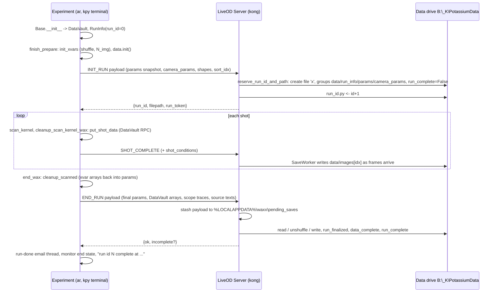

# Agent 09 report: the data pipeline

Scope: DataVault/DataContainer (waxx + kexp), DataSaver, server_talk, RunInfo, Scribe/Dealer, liveOD's `data/` package (RunFile, ImageWriter), Expt payload builders, ScopeData, run-done email, `kexp/config/ip.py` paths, `fix_run_id.bat`, `delete_artiq_dataset_garbage.bat`, and the tests named in the brief.
Repos read at k-exp c8faf77, wax acc4621 (both shallow clones: wax history starts 2026-09-24, k-exp 2026-09-10). Older history was read from GitHub (ucsb-amo/wax) and is cited by upstream SHA ("GitHub", not in the local clone).
Path shorthand: `waxa/...` = `wax/waxa-src/waxa/...`, `waxx/...` = `wax/waxx-src/waxx/...`, `kexp/...` = `k-exp/kexp/...`.

---

## 1. operator_summary

1. Every saved run is one HDF5 file on the data drive, `%data%` = `B:\_K\PotassiumData` on kong, in a folder per day: `B:\_K\PotassiumData\2026-09-28\0083120_2026-09-28_14-03-11_gm_tof.hdf5` (7-digit run ID, the time the experiment was *prepared*, and the experiment's **class name**, not its file name).
2. The experiment never writes that file itself. The **LiveOD Server** on kong creates it when the run starts (INIT_RUN, which also hands out the run ID), writes the camera images into it as they arrive, and writes the parameters, per-shot DataVault values, scope traces and source code into it when the run ends (END_RUN). No LiveOD Server means no file.
3. A run ID is used up only when a file is actually created: `save_data=False` runs get run ID 0 and no file, and a run that is aborted (liveOD Abort, an RTIO underflow without `save_on_underflow`) has its file deleted, leaving a gap in the numbering. That is normal.
4. To look at a run, use `from waxa import atomdata; ad = atomdata(83120)` (a positive number is a run ID; `0` is the newest *finished* run, `-1` the one before). A run that is still being written, or whose experiment crashed, is skipped by `atomdata(0)`.
5. If a run lost camera frames it is still saved but marked incomplete: the experiment's terminal and `atomdata` both print a `!!` banner. Believe the banner.
6. `fix_run_id.bat` (and the Start-menu shortcut "FIx Run ID") no longer works: the script it runs was deleted on 2026-03-03, and it is not needed any more.

## 2. mental_model

**Everyday comparison: a lab notebook kept by the camera operator.** The experiment is a scientist calling out numbers; the LiveOD Server is the clerk who owns the notebook. At the start of a run the scientist says "new run, here is my plan and my settings" (INIT_RUN). The clerk takes the next free page number (run ID), writes the plan at the top, and says the page number back. During the run the clerk glues in each photo as it comes off the camera. At the end the scientist hands over a sealed envelope with the final settings, the per-shot measurements and copies of the recipe files (END_RUN); the clerk copies the envelope into the page, re-sorts everything into order if the scientist did the shots in a shuffled order, and stamps the page "complete" (or "incomplete: 3 photos missing"). If the run is abandoned the clerk tears the page out, and that page number is never reused. Before copying the envelope in, the clerk photocopies it into a desk drawer (the pending-save stash) in case the notebook is snatched away mid-copy (the network drive drops).



## 3. how_to

### 3.1 Find where a run's data went
1. Read the run ID in the experiment's terminal: `Run ID: 83120` is printed at the end of `prepare` (`waxx/base/expt.py:180-181`, only when the ID is non-zero). The LiveOD Server log also says `INIT_RUN: run_id=83120, mot_tof, 20 shots, save=True, camera=xy_basler` (`waxx/util/live_od/live_od_server.py:1031-1035`). **confirmed**
2. The file is `%data%\<run_date_str>\<run_id:07d>_<run_datetime_str>_<class name>.hdf5`, where `%data%` is the LiveOD Server's `%data%` on kong, and both date strings are taken on the experiment's PC when `Base.__init__` ran (`waxa/data/data_saver.py:334-346`, `waxa/data/run_info.py:20-26`). **confirmed**
3. The name uses the Python class, not the file: `ar mot_tof.py` makes `..._gm_tof.hdf5` because `kexp/experiments/default_experiments/mot_tof.py:6` defines `class gm_tof`. **confirmed**
4. No file? See section 8, "My run finished but no file appeared".

### 3.2 Load a run for analysis (notebook or script)
```python
from waxa import atomdata
ad = atomdata(83120)        # a run ID (idx > 0)
ad = atomdata(0)            # newest *finished* run
ad = atomdata(-2)           # third-newest finished run
ad = atomdata(path=r"B:\_K\PotassiumData\2026-09-28\0083120_2026-09-28_14-03-11_gm_tof.hdf5")
ad = atomdata(83120, lite=True)   # the ROI-cropped lite copy (made automatically if missing)
```
(`waxa/data/server_talk.py:60-125`, `waxa/atomdata_base.py:566-577,2628-2699`). **confirmed**
- To read from another data folder, pass your own `server_talk`: `from waxa.data.server_talk import server_talk as st; ad = atomdata(83120, server_talk=st(data_dir=r"D:\PotassiumData"))`. Changing `os.environ['data']` inside a running notebook does nothing: the default `server_talk` is built when `waxa` is imported (`waxa/atomdata.py:45`, `waxa/data/server_talk.py:17`). Restart the kernel instead. **confirmed**
- Do not use `load_atomdata(idx, roi_id, path, skip_saved_roi, ...)` with its later positional arguments: they shift by one onto `atomdata`'s `lite` argument (section 15). **confirmed**

### 3.3 Record your own per-shot number (DataVault)
1. In `prepare`, after `Base.__init__` and **before** `self.finish_prepare(...)`:
   `self.data.my_signal = self.data.add_data_container(1)` (one float per shot), or `(8, np.int32)`, or `((4, 8), np.int64)` (`waxx/config/data_vault.py:317-375`).
2. In the kernel, each shot: `self.data.my_signal.put_data(value)` or `self.data.my_signal.shot_data[0] = value`.
3. It is copied into the run's grid after every shot by `cleanup_scan_kernel_wax` (`waxx/base/expt.py:211-220`) and saved at END_RUN; read it back as `ad.data.my_signal` (shape = xvar dims, trailing size-1 axes dropped). **confirmed**
4. Only 1D or 2D per shot, only `float64`, `int32`, `int64` (`waxx/config/data_vault.py:304-311,366-370`). **confirmed**

### 3.4 Look inside a file by hand
```python
import h5py
with h5py.File(path, "r") as f:
    print(dict(f.attrs).keys())          # run_complete, data_complete, xvarnames, expt_file, ...
    print(list(f["data"].keys()))        # images, image_timestamps, apd, i_outer_imaging, sort_idx, ...
    print(f["params"]["t_tof"][()])
```
Close the file promptly (use `with`): a file held open by another program during a run can make LiveOD's end-of-run save fail and its delete-on-abort time out (section 7, D11). The old page's "HDF5Viewer" installer location is lab lore (needs a human). **inferred**

### 3.5 Tell a finished run from an unfinished or damaged one
Read the root attributes (`waxa/data/data_saver.py:861-870`, `waxa/data/server_talk.py:237-289`):
| `run_complete` | `run_finalized` | `data_complete` | Meaning |
|---|---|---|---|
| True | True | True | Saved and complete. |
| False | True | False | Saved, but frames missing or suspect: read `incomplete_reason`, `images_expected`, `images_received`. `atomdata` prints a banner. |
| False | absent | absent | Still being written, or the run never reached a successful END_RUN (crash, save failure, process exit). `atomdata(0)` skips it. |
| absent | absent | absent | File from before 2026-09-24's attrs; completion judged by whether the xvars in `params/` are arrays. |
**confirmed**

### 3.6 Finish a save that failed because the data drive dropped
1. The experiment's terminal ends with `RuntimeError: [LiveODClient] END_RUN failed: ...` whose text contains the stash path and the command (`waxx/util/live_od/data/run_file.py:166-175`, `waxx/util/live_od/live_od_client.py:392-395`).
2. When `B:` is back, on **kong** in a `kpy` Python:
```python
from waxa.data.data_saver import retry_pending_save, list_pending_saves
print(list_pending_saves())      # %LOCALAPPDATA%\waxx\pending_saves\0083120_endrun.pkl, ...
retry_pending_save(r'C:\Users\scientist\AppData\Local\waxx\pending_saves\0083120_endrun.pkl')
```
It prints `[DataSaver] Pending save for run 83120 completed.` and deletes the stash (`waxa/data/data_saver.py:1168-1204`). Nothing retries these automatically and nothing lists them in a GUI (no caller of `list_pending_saves` exists; grep). **confirmed** (the `AppData\Local` expansion of `%LOCALAPPDATA%` is **inferred**)

### 3.7 "Fix the run ID" today
- You normally do not need to. The next run ID is `max(run_id.py, highest ID on disk + 1, 1)` (`waxa/data/data_saver.py:390-395`), so a stale or low counter cannot cause reuse of an ID that is on disk. **confirmed**
- To skip one ID on purpose: press **Abort** in the LiveOD Server window while no run is active; it logs `No active run. Incrementing Run ID.` and adds 1 to `%data%\run_id.py` (`waxx/util/live_od/gui/main_window.py:1377-1381`). **confirmed**
- Script equivalent of the deleted `increment_run_id.py` (which read `%data%\run_id.py`, added 1 and wrote it back; GitHub ucsb-amo/wax db1be2a): `python -c "from kexp.config.ip import server_talk; server_talk.update_run_id()"` (`waxa/data/server_talk.py:457-471`). **inferred** (same effect; not a lab-sanctioned command)
- Do not run `fix_run_id.bat` / "FIx Run ID": it fails (section 6).

### 3.8 Point the data somewhere else (local folder, offline laptop)
1. Set the machine variable `data` (System Properties > Environment Variables, or `setx data "D:\PotassiumData"`), then restart **every** process that reads it: the LiveOD Server (it decides where files go: `kexp/config/live_od.py:45,70`), the Server Dashboard (log dir, data-dir guard: `kexp/util/dashboard/server_dashboard_app.py:85-103`), the data browser, Jupyter kernels, and the terminal you run `ar` from. `setx` only affects processes started afterwards. **confirmed** for which modules read it; the `setx` behaviour is Windows **inferred**
2. Copy `run_id.py` (and `roi.xlsx` if you use saved ROI keys) into the new folder first. Without `run_id.py` the new folder's run IDs start again at 1 (`waxa/data/data_saver.py:390-395`), which will collide with real run IDs if the files are ever copied back into the main tree, and the LiveOD "next run" label goes blank (`waxx/util/live_od/gui/main_window.py:514-518`). **confirmed**
3. There is no `_lite` mode for runs. `_lite` is only the folder for ROI-cropped lite copies (section 5, N7). **confirmed**

### 3.9 Make a lite (ROI-cropped) copy
`ad.save_lite_copy()` (alias `create_lite_copy`) or `atomdata(rid, lite=True)` (auto-creates) or the data browser. Written to `%data%\_lite\<date>\<run_id:07d>_lite_<datetime>_<class>.hdf5`; images cropped to the ROI, scope traces float32, everything else copied (`waxa/data/data_saver.py:339-341`, `waxa/data/server_talk.py:500-637`, `waxa/atomdata_base.py:833-1019`). The browser path writes `<lite>.tmp` then renames, so a cancel leaves nothing (`test_lite_creation.py::test_cancel_leaves_no_file`). **confirmed**

### 3.10 The run-done email
Every run that reaches `end()` sends `run <id> done: <experiment file name> - <YYYY-MM-DD HH:MM:SS>` to a hard-coded address from a Gmail account whose credentials are read from `G:\Shared drives\Tweezers\Environments and Profiles\email_notification_gmail_credentials.txt` (`waxx/util/notifications.py:78-115`, `waxx/config/ip.py:6`). Turn it off with `self.end(expt_filepath, notify=False)` (`kexp/base/base.py:370-371`; `mot_observe.py:44` and `auto_tof.py:59` do). **confirmed**

### 3.11 Clear ARTIQ dataset garbage
`kexp/_bat/delete_artiq_dataset_garbage.bat` runs `cd %code%\k-exp && del /s /q dataset_db.mdb dataset_db.mdb-lock` then `pause`. It deletes every ARTIQ dataset database file anywhere under `%code%\k-exp`. These are created by `artiq_run` in the folder you run from (they are git-ignored: `k-exp/.gitignore` lists `*.mdb`, `*.mdb-lock`). **confirmed** for the command; what creates the files is **inferred** (ARTIQ's default `--dataset-db dataset_db.mdb`).

### 3.12 Ask liveOD what became of a run
`from waxx.util.live_od.live_od_client import LiveODClient; LiveODClient().list_runs()` gives each run's outcome: `saved`, `saved_incomplete`, `discarded`, `save_failed`, `nothing_written`, `exited`, `in_progress` (`waxx/util/live_od/live_od_client.py:442-450`, `live_od_server.py:868-881,1370`). The buffer starts empty when the LiveOD Server starts. Messages from `DataSaver` that use `print` are **not** in this buffer (section 7, D9). **confirmed**

## 4. reference_facts

### 4.1 Locations and names
| Item | Value | Citation | Confidence |
|---|---|---|---|
| Data root | `%data%` env var; `B:\_K\PotassiumData` on kong | `kexp/config/ip.py:9`; wiki PC-Setup | confirmed (var) / lore (value) |
| B: share | `\\bananastand.physics.ucsb.edu\anewstart` ("the BananaStand" NAS) | `kexp/_bat/skynet.bat:12,16` | inferred |
| Day folder | `YYYY-MM-DD` = `run_date_str`, experiment PC local time at `Base.__init__` | `waxa/data/run_info.py:20-26`, `data_saver.py:343-344` | confirmed |
| File name | `<run_id zero-padded to 7>_<YYYY-MM-DD_HH-MM-SS>_<ExptClass>.hdf5` | `waxa/data/data_saver.py:334-346` | confirmed |
| Real example | `B:\_K\PotassiumData\2026-08-21\0075862_2026-08-21_14-03-11_sigma_z.hdf5` | `wax/waxa-src/tests/test_climate.py:309` | confirmed |
| Lite copies | `%data%\_lite\<date>\<id:07d>_lite_<datetime>_<class>.hdf5` | `data_saver.py:339-341` | confirmed |
| Run ID counter | `%data%\run_id.py`, one integer = next ID (a floor) | `kexp/config/ip.py:44-48`, `server_talk.py:24,450-498` | confirmed |
| ROI spreadsheet | `%data%\roi.xlsx` | `kexp/config/ip.py:46`, `server_talk.py:25` | confirmed |
| Logs | `%data%\_logs\server`, `%data%\_logs\client` | `kexp/config/ip.py:33-35` | confirmed |
| Monitor state file | `%data%\device_state_config_<hwid>.json` | `kexp/config/ip.py:57-62` | confirmed |
| Oldest date folder searched | 2023-06-22 (`FIRST_DATA_FOLDER_DATE`) | `kexp/config/ip.py:42`, `server_talk.py:27-28,199` | confirmed |
| Drive remap script | `"G:\Shared drives\Weld Lab Shared Drive\Infrastructure\map_network_drives.bat"` (`MAP_BAT_PATH`) | `server_talk.py:11`, `kexp/config/ip.py:40` | confirmed |
| Pending END_RUN stash | `%LOCALAPPDATA%\waxx\pending_saves\<id:07d>_endrun.pkl` (on the LiveOD PC) | `data_saver.py:27,1119-1150` | confirmed |
| Email credentials | `G:\Shared drives\Tweezers\Environments and Profiles\email_notification_gmail_credentials.txt` (line 1 address, line 2 app password) | `waxx/config/ip.py:6`, `notifications.py:32-44` | confirmed |
| Email recipient | `herberthearsall@gmail.com` (hard-coded default) | `waxx/util/notifications.py:82` | confirmed |
| Source texts saved | `%code%\k-exp\kexp\config\expt_params.py`, every `%code%\k-exp\kexp\base\*.py` not starting `__`, and the experiment file | `kexp/config/ip.py:26,36-38`; `waxx/base/expt.py:590-605` | confirmed |
| `WAXA_DATA_UNC` | does not exist anywhere in either repo (grep) | — | confirmed |

### 4.2 What is inside a run file (current main)
Written at INIT_RUN by `DataSaver._populate_data_file` (`waxa/data/data_saver.py:476-568`) inside the exclusive create (`:404-435`):
| Path | Content | Citation |
|---|---|---|
| attrs `has_images` | `capture_images` (False for APD, `setup_camera=False`) | `:503,508` |
| attrs `xvarnames` | list of xvar names | `:509` |
| attrs `run_complete` | False | `:510` |
| attrs `images_shape`, `images_dtype` | declared frame stack, only if capturing | `:518-523` |
| attrs + group `run_info/` | `run_id, run_date_str, run_datetime_str, expt_class, imaging_type, save_data, save_on_underflow, filepath(=[]), xvarnames, experiment_filepath(="")`; failures swallowed | `:487-501,548,933-945` |
| `data/<container>` | each DataVault container, pre-allocated at its full (squeezed) shape, zeros | `:525-533` |
| `data/sort_idx`, `data/sort_N` | shuffle permutations (padded with -1) and their lengths, only if shuffled | `:535-545` |
| `params/` | snapshot of host ExptParams after `init_xvars` (xvars hold only their first value) | `:550-559`; `waxa/base/dealer.py:28-34` |
| `camera_params/` | the run's camera request; never rewritten | `:561-568` |
Written during the run by liveOD's SaveWorker (`waxx/util/live_od/data/image_writer.py:194-238`):
| `data/images` | `(N_img, H, W)`, created lazily from the first frame's shape/dtype, stored by arrival index | |
| `data/image_timestamps` | `(N_img,)` float64, `time.time()` on the LiveOD PC when the frame was dequeued | `camera_mother.py:249` |
Written at END_RUN by `_write_end_run_outputs` (`data_saver.py:773-870`):
| `params/` | deleted and rewritten from the END_RUN payload: host ExptParams at `end()`, xvars as full arrays, array params unshuffled | `:785-792,737-748` |
| attrs `experiment_filepath`, `expt_file`, `params_file`, `base_class_<module>` | experiment path and source texts, read from disk at END_RUN | `:795-807` |
| attrs from `extra_file_texts` | `device_state_at_start` (JSON, kexp), `camera_overrides` (JSON, only when non-empty), any other provenance text (e.g. a generated OPX program) | `:808-811`; `kexp/base/base.py:136`; `live_od_server.py:449-460` |
| `data/<container>` | overwritten for containers with `data_gotten` (or external) | `:813-816,714-732` |
| `data/scope_data/<label>/{t, t_map?, v}` | float32, gzip 4; `t` deduplicated | `:819,1091-1105,65-87` |
| `data/timestamp_shot_end` | server time of each SHOT_COMPLETE, reshaped to xvardims when the count matches, unshuffled | `:751-760,822-826`; `live_od_server.py:1130` |
| attrs `unshuffle_in_progress` | True during the in-place image/external rewrite, False after | `:837-846` |
| attrs `unshuffle_applied` | True unless a torn earlier attempt was detected | `:851-852` |
| attrs `run_finalized`, `data_complete`, `run_complete` | True/True/True, or True/False/False plus `incomplete_reason`, `images_expected`, `images_received` | `:861-870` |
Written later by analysis: attrs `roix`, `roiy` (ROI saved into the raw file by `ROI.save_roi_h5`, `waxa/roi.py:503-511`); lite copies add `lite_source_roix/roiy` (`server_talk.py:625-626`). **confirmed** for all rows.

Not in the file (confirmed by grep/reading): the git revision of any repo; waxx/waxa library source; `kexp/config/*_id.py`, `kexp/control/*`; per-shot adjust values; the `adjust_specs`; `run_info.run_datetime` (see N9); Siglent `failed_captures`; `shot_order` (the wiki's claim; section 11).

### 4.3 DataVault
| Fact | Value | Citation | Confidence |
|---|---|---|---|
| Allowed types | (1D or 2D per shot) × (`float64`, `int32`, `int64`) | `waxx/config/data_vault.py:304-311` | confirmed |
| Concrete classes | `DataContainer1D_f64`, `2D_f64`, `1D_i32`, `2D_i32`, `1D_i64`, `2D_i64` | `:128-282` | confirmed |
| Kernel methods | `put_data(value, i=0[, j=0])`, `put_data_1d`, `put_data_2d` (2D only), `update_to_host`, `_put_shot_data` | same | confirmed |
| Sentinel | one no-op container inserted per unused type so ARTIQ can type each list; never saved | `:401-411`, `:146-147` | confirmed |
| Registration | containers found by attribute name during `finish_prepare` → `data.init()` | `:377-389`; `waxx/base/expt.py:163` | confirmed |
| Grid index | `tuple(xvar.counter for xvar in scan_xvars)` (positions in the shuffled value lists) | `:58` | confirmed |
| Squeeze | trailing per-shot size-1 axes dropped; xvar axes never dropped | `:87-113` | confirmed |
| Per-shot sync | `put_shot_data` waits for the timeline (`wait_until_mu(now_mu())`), RPCs every container, then `break_realtime()` | `:419-438` | confirmed |
| kexp global containers | `apd` (1), `post_shot_absorption` (4), `b` (1, magnetometer), `i_outer_imaging` (1, A), `frequency_wavemeter_405/980`, `frequency_siglent_405/980` (1 each) | `kexp/config/data_vault.py:8-23` | confirmed |
| `i_outer_imaging` | written once per shot at the first camera trigger by `Image.record_imaging_conditions`; value = `outer_coil.i_pid` if PID on, else `i_supply` (commanded set points, not a measurement). Added 2026-09-16 (k-exp b4ba8e2 "auto detect outer coil current") | `kexp/base/image.py:62-79`; `kexp/control/big_coil.py:136-145` | confirmed |
| Who uses `i_outer_imaging` | liveOD cross section per shot (`_shot_conditions`) and analysis `waxa/calibrations/cross_section.py` | `waxx/base/expt.py:306-324`; `cross_section.py:5-10,77` | confirmed |

### 4.4 Timeouts and retry constants
| Name | Value | Where used | Citation |
|---|---|---|---|
| waxa `DEFAULT_TIMEOUT` | 45 s | `Scribe.wait_for_data_available` default (legacy `read_groups`) | `waxa/config/timeouts.py:1` |
| `REMOVE_DATA_TIMEOUT` | 10 s | bound on deleting an aborted run's file | `waxa/config/timeouts.py:8`; `scribe.py:164-176` |
| `REMOVE_DATA_POLL_INTERVAL` | 0.25 s | poll during delete | `waxa/config/timeouts.py:4` |
| `CHECK_FOR_DATA_AVAILABLE_PERIOD` | 0.05 s | file-open retry period | `waxa/config/timeouts.py:9` |
| `T_NOTIFY` / `N_NOTIFY` | 5 s / 99 tries | "Can't open data..." cadence | `waxa/config/timeouts.py:11-12`; `scribe.py:72-74` |
| waxx `DATA_SAVER_TIMEOUT` | 120 s | SaveWorker file wait; END_RUN wait for the writer; delete wait | `waxx/config/timeouts.py:11`; `run_file.py:120,192`; `image_writer.py:291` |
| `SAVE_RETRY_DELAYS_S` | 2, 5, 15 s (4 attempts) | END_RUN read and write phases | `data_saver.py:18,876-900` |
| INIT_RUN reply wait | 60 s | experiment side | `live_od_client.py:262` |
| END_RUN reply wait | 600 s | experiment side | `live_od_client.py:390` |
| Slow-create warning | > 2 s | liveOD log | `live_od_server.py:917-919` |
| SMTP timeout / exit wait | 10 s per call / 20 s | email | `notifications.py:28-29` |
| End-hang stack dump | 60 s after `end()` (30 s after an abort) | `waxx/base/expt.py:29-32,430` |
| `RECENT_COMPLETED_TRUST_WINDOW` | 0 (every candidate file is checked) | `server_talk.py:12,233` |
**confirmed** for all rows.

### 4.5 Run-ID facts
| Fact | Citation | Confidence |
|---|---|---|
| Experiment starts with `run_id=0` (`defer_run_id=True`) and takes the ID from the INIT_RUN reply | `waxx/base/expt.py:95-98,176-181` | confirmed |
| Reservation: candidate = `max(counter, fs_max+1, 1)`; exclusive create `h5py.File(path, "x")`; on `FileExistsError`/`OSError` with the path existing, try next; then `run_id.py <- candidate+1` | `data_saver.py:387-439` | confirmed |
| `fs_max` = highest ID in the newest non-empty date folder dated ≤ today | `server_talk.py:473-489,177-206` | confirmed |
| `save_data=False` → no reservation, run ID 0 | `live_od_server.py:901-916` | confirmed |
| Reset/Abort of a running run deletes its file (ID becomes a gap); Abort with no run increments the counter by 1 | `live_od_server.py:834-866`; `main_window.py:1360-1381` | confirmed |
| Introduced: run-ID reservation 2026-06-22 (GitHub ucsb-amo/wax 3bb4ff8 "data handling, reserve run ID"); `increment_run_id.py` removed 2026-03-03 (GitHub fd3b776 "server talk everywhere", jpagett) | GitHub | confirmed |

## 5. expert_nuances

N1. **Who writes the file.** The experiment never opens the HDF5 file on the current path. `end_wax` sends END_RUN and the LiveOD Server's `DataSaver.save_data_from_payload` writes (`waxx/base/expt.py:397-401`; `live_od_server.py:1234-1243`). The experiment's `self.ds` (`kexp/base/base.py:72`) is only used to read source-file texts for the END_RUN payload (`expt.py:590-605`) and by the legacy `write_data` branch, which Base cannot reach (Clients raises first, `kexp/base/clients.py:44-50`). The legacy `DataSaver.save_data/create_data_file` (`data_saver.py:110-217`) are dead on this path. **confirmed**

N2. **Order inside the file across time.** INIT_RUN params snapshot → images as they arrive → END_RUN rewrites `params/` wholesale. So a file whose END_RUN never landed holds xvars as scalars (their first value, `dealer.py:28-34`), which is exactly what `_is_completed_run`'s slow path and `_unpack_xvars` test for (`server_talk.py:278-287`, `atomdata_base.py:2536-2538`). **confirmed**

N3. **END_RUN is read → compute → write, retried.** Phase 1 reads only what must come from the file (images, external containers) and only when the run was shuffled; phase 2 is pure numpy; phase 3 writes metadata first, the big image rewrite last, bracketed by `unshuffle_in_progress` so a death mid-rewrite is flagged rather than silently half-shuffled (`data_saver.py:578-870`). Retries: `OSError`/`RuntimeError` only, 4 attempts, with a stale-handle purge and a drive re-check between (`:876-927`). The payload is pickled to local disk first (`run_file.py:146-153`). History: stash since 2026-08-12 (GitHub fc8551f), phases/incomplete since 2026-09-24 (GitHub d7d1f3f). **confirmed**

N4. **Shuffling, and why the file is in sorted order.** `finish_prepare(shuffle=True)` (default) sorts each xvar's values ascending, then permutes each axis with a random permutation; xvars of equal length share the same permutation (`waxa/base/dealer.py:77-126`). Shots run as nested loops over the *shuffled* lists (last xvar innermost, `scanner.py:637-657`), and each shot's DataVault values land at the shuffled index (`data_vault.py:58`). At END_RUN the server unshuffles images, timestamps, DataVault arrays, scope traces and every numeric array param along any axis whose length equals one of `sort_N` (`data_saver.py:692-771,948-1058`). So the saved file is in sorted order; `data/sort_idx`, `data/sort_N` are kept so `ad.reshuffle()` can recover acquisition order (`atomdata_base.py:2545-2568`). `atomdata` itself unshuffles only files from before 2024-10-02 (`atomdata_base.py:2582-2588`). Side effect: xvar values you gave in a deliberate order (e.g. descending, or `[1,0,1,0]`) are stored sorted unless you pass `shuffle=False`. **confirmed**

N5. **Unshuffle-by-length is a heuristic.** Any numeric array param (not in `_PROTECTED_PARAM_KEYS`) with an axis whose length equals an xvar length is permuted at END_RUN, even if it is not scan-derived (`data_saver.py:570-576,737-748,960-975`). Intended for derived arrays computed from xvars in `cleanup_scanned` (`scanner.py:659-677`); wrong for an unrelated list param of coincident length (section 15). **confirmed** (intent **inferred**)

N6. **Requested vs applied.** `params/` = host ExptParams at `end()` (request, SI units). `camera_params/` = the INIT_RUN request; what the camera actually ran with, where it differs, is only in the root attr `camera_overrides` (JSON, written only when non-empty; `live_od_server.py:373-460`; `test_camera_overrides_banner.py`). `i_outer_imaging` = commanded coil set point (`big_coil.py:136-145`). Wavemeter/Siglent reads that fail are stored as `0.` (`kexp/control/rydberg_lasers.py:91-126`); magnetometer unreachable → `HMRDummy` returns `0.` for `data.b` (`waxx/util/guis/HMR_magnetometer/hmr_magnetometer_client.py:43-47`; `kexp/base/clients.py:28-32`). DDS/DAC values are saved as commanded SI numbers; the quantized hardware value (e.g. AD9910 frequency tuning word) is not recorded (grep; **inferred** that it differs slightly). **confirmed** except where marked.

N7. **`_lite` is a lookup mode, not a run mode.** `server_talk.set_data_dir(lite)` flips `self.data_dir` between `%data%` and `%data%\_lite` as a side effect of lookups (`server_talk.py:51-58`), and `atomdata` works around this by deriving the regular dir explicitly (`atomdata_base.py:2592-2603`). No run writes to `_lite`. `atomdata(0, lite=True)` finds the newest completed **regular** run and then its lite copy, creating one if missing (`server_talk.py:89-105`; `atomdata_base.py:2686-2714`). A lite file always gets `run_complete=True` even if its source was incomplete; its `data_complete=False` is copied from the source, so the banner still prints (`atomdata_base.py:1002-1017`). **confirmed**

N8. **Completion probe details.** `_is_completed_run` opens with `locking=False` (a read lock could break the writer's open on the share), treats any exception as "not complete", and since 2026-09-24 compares `bool(rc)` because h5py returns `numpy.bool_` (the old `is True` never matched, so every file fell through to the xvar check) (`server_talk.py:237-289`; GitHub d7d1f3f). A finalized-but-incomplete run counts as completed so it can be loaded with its banner (`test_incomplete_run_attrs.py::test_run_lookup_treats_a_finalized_incomplete_run_as_finished`). The data browser has its own copy of the same rule (`waxa/browser/scanner.py:586-600`). **confirmed**

N9. **`ad.run_info.run_datetime` is the load time.** The INIT_RUN run_info proxy does not include `run_datetime`, so on load `RunInfo()`'s constructor value (now) survives (`data_saver.py:491-501`; `run_info.py:20`; `atomdata_base.py:2728-2732`). Use `run_datetime_str` or the file name. `waxa/climate/attach.py:35-41` says the same. **confirmed**

N10. **Time stamps.** `run_datetime_str` = experiment PC time at `Base.__init__` (before compile). `image_timestamps` = LiveOD PC `time.time()` when a frame came off the queue (`camera_mother.py:247-253`). `timestamp_shot_end` = LiveOD PC time when SHOT_COMPLETE arrived (`live_od_server.py:1120-1130`). None is a hardware timestamp. A run that crosses midnight stays in the start day's folder. **confirmed**

N11. **Run-ID lookup walks newest-first and stops early.** `_scan_for_run_id` lists date folders newest first and stops at the first folder whose highest ID is below the target (`server_talk.py:388-390`). Correct only while IDs grow with dates. Duplicate detection is per folder; two files with the same ID in different day folders are not reported and the newer folder wins (`:380-387`). Folders dated after "today" (reader's clock) are ignored (`:199`). **confirmed**

N12. **Adjust.** Values from the Adjust panel are applied to host params at the top of each shot (`scanner.py:509-524`; `expt.py:376-384`). `params/<key>` in the file is the value in effect for the last shot; a change made during the last shot is never applied or saved; the initial value and per-shot history are not saved. Both the experiment (`expt.py:194-199`) and liveOD (`live_od_server.py:1020-1024`) warn. **confirmed**

N13. **Provenance texts are read at END_RUN, not at compile.** `expt_file`, `params_file`, `base_class_*` are read from disk on the experiment PC when `end()` runs (`expt.py:590-605`). Editing `cooling.py` during a long run saves the edited text. The git revision is not saved (grep). **confirmed**

N14. **`device_state_at_start`** is a JSON text attr from the monitor server's pre-run report, stored via `_extra_file_texts` after INIT_RUN (`kexp/base/base.py:95-138`); atomdata does not load it into `ad` (it only reads `expt_file`, `params_file`, `base_class_*`; `atomdata_base.py:2859-2884`). Read it with h5py. **confirmed**

N15. **Scope data.** Each `read_sweep` appends one entry to the scope's `_data` in shot order; at END_RUN `reshape_data()` needs exactly `prod(xvardims)` entries or the whole scope's data is dropped with a warning (`oscilloscopes.py:100-110`; `expt.py:564-578`). Since 2026-09-27 (acc4621) a Siglent channel that cannot be read is stored as NaN of the last good length and listed in `failed_captures`, so one bad shot no longer makes the run ragged (`oscilloscopes.py:176-218`); `failed_captures` itself is not saved. `save_on_underflow` pads unreached shots with **zeros** (`oscilloscopes.py:139-152`). Time axis stored float32 and deduplicated (`data_saver.py:30-87,1084-1086`). **confirmed**

N16. **Two DataSavers, two machines.** The file lands under the LiveOD PC's `%data%`; the source texts come from the experiment PC's `%code%`. On kong they are the same machine; an experiment submitted from another PC saves that PC's copy of the kexp sources (`kexp/config/live_od.py:70`; `kexp/config/ip.py:26,38`). **confirmed**

N17. **Where messages go.** `DataSaver` and `server_talk` use `print`. In the LiveOD Server process that reaches only the console window it was started from (`_bat/live_od.bat`), not the log panel, log file or GET_LOG buffer, which are fed by `logging` (`waxx/util/live_od/log.py` `setup_logging`, StreamHandler + RotatingFileHandler). Examples: `[DataSaver] WARNING: params/... not stored`, `[DataSaver] end-of-run write failed (attempt 1/4): ...`, `Data dir (...) not found. Attempting to re-map network drives.` **confirmed**

N18. **Drive remap has two implementations.** Processes that called `data_dir_guard.configure` (only the Server Dashboard: `server_dashboard_app.py:85-106`) run the bat with `shell=True`, 30 s timeout, and never raise (`data_dir_guard.py:136-218`). Everything else (LiveOD Server, notebooks, data browser) uses `server_talk`'s inline fallback: `subprocess.run(cmd, creationflags=CREATE_NO_WINDOW)` with no timeout and no exception handling (`server_talk.py:147-157`). `check_for_mapped_data_dir()`'s True/False result is ignored by every caller (`get_data_file`, `reserve_run_id_and_path`, `create_data_file`). **confirmed**

N19. **What a shot with no write stores.** `shot_data` is never cleared between shots, so a container not written in a shot keeps the previous shot's value, and that value is copied into the new cell once the container has ever been non-zero (`data_vault.py:41-46,115-120,50-65`; no reset anywhere, grep). The kexp docstring "Zero if the shot never imaged" (`kexp/config/data_vault.py:14-17`, `image.py:72`) holds only until the first shot that did image. **confirmed**

N20. **Save-on-underflow runs.** With `Base(save_on_underflow=True)`, a shot ending in RTIOUnderflow/Overflow/TriggerTimeout is cleaned up (`cleanup_scan_kernel`, which also records the failed shot's DataVault values and notifies liveOD), the scan stops, and `end()` saves (`scanner.py:432-453,496-497`; `scribe.py:295-346`). Unreached cells stay zero. Camera runs are then flagged incomplete by the frame count; runs with no camera are not flagged at all (section 7, D3). **confirmed**

N21. **The email** is sent from a daemon thread joined at exit for ≤ 20 s; a failure is a `logging.warning` only (`notifications.py:111-143`). The comment in `end_wax` says "non-daemon thread: exit waits for it" (`expt.py:410-412`), which no longer matches the code. It is not sent if END_RUN raised (the exception leaves `end_wax` first, `expt.py:401,413-415`). **confirmed**

N22. **Liveness of `run_id.py`.** The LiveOD status strip re-reads `run_id.py` every 2 s over the share and shows it as the next ID (`main_window.py:514-518,614-617`). The actual next ID can be higher (`max(counter, fs_max+1)`). **confirmed**

## 6. loud_failures

Each entry: where you see it, verbatim text (template, then a filled example), cause, fix. All **confirmed** from the raising line unless marked.

L1. **`fix_run_id.bat` / Start-menu "FIx Run ID"** (cmd window, which closes at once because the .bat has no `pause`).
```
C:\Users\scientist\code\.venv\Scripts\python.exe: can't open file 'C:\\Users\\scientist\\code\\wax\\waxa-src\\waxa\\data\\increment_run_id.py': [Errno 2] No such file or directory
```
Cause: `kexp/_bat/fix_run_id.bat:3` runs `python %code%\wax\waxa-src\waxa\data\increment_run_id.py`; that file was removed from wax on 2026-03-03 (GitHub ucsb-amo/wax fd3b776, "server talk everywhere"; `git log --all -- '*increment_run_id*'` is empty in both local shallow clones). The shortcut `kexp/_bat/shortcuts/FIx Run ID.lnk` targets `..\fix_run_id.bat` (strings in the .lnk). Fix: none needed (section 3.7). The exact interpreter prefix is **inferred** (Python 3.11 on Windows prints the executable path); the missing file is **confirmed**.

L2. **Experiment terminal, at `Base.__init__`, no LiveOD Server, `setup_camera=True`** (`kexp/base/clients.py:45-50`):
```
RuntimeError: [LiveOD] Could not connect to LiveOD server: {e}
Check that the LiveOD server window is running on the control PC.
To run without a LiveOD server, pass suppress_live_od=True (and setup_camera=False) to Base.__init__.
```
Fix: start the LiveOD Server on kong. (The `No liveOD server connection found. Start the liveOD GUI before running experiments.` RuntimeError at `waxx/base/expt.py:184-187` is unreachable through `Base`, because this one fires first.)

L3. **Experiment terminal, `setup_camera=False`, no LiveOD Server** (two warnings, run continues, nothing saved): `kexp/base/clients.py:39-43` then `waxx/base/expt.py:189-192`:
```
[LiveOD] WARNING: Could not connect to LiveOD server: {e}
Running experiment without LiveOD (setup_camera=False).
Start the LiveOD server window if imaging is needed.
...
[LiveOD] WARNING: No liveOD server connection — data will not be saved (setup_camera=False).
```

L4. **Experiment terminal, INIT_RUN refused because the file could not be made** (`waxx/util/live_od/live_od_client.py:263-266` with the server's error from `live_od_server.py:909-916`):
```
RuntimeError: [LiveODClient] INIT_RUN failed: Data file creation failed: {exc}
e.g. RuntimeError: [LiveODClient] INIT_RUN failed: Data file creation failed: [WinError 3] The system cannot find the path specified: 'B:\\_K\\PotassiumData\\2026-09-28'
```
LiveOD log: `INIT_RUN: could not create data file: {exc}` (ERROR with traceback). Cause: data drive unmapped/unreachable, disk full, permissions. No run ID used. Fix: map `B:` (run the remap bat, or `net use`), then rerun. The WinError example text is **inferred**.

L5. **Experiment terminal, INIT_RUN reply never came** (`live_od_client.py:122-130`):
```
ConnectionError: [LiveODClient] No response from liveOD server at tcp://192.168.1.76:{port}. Is liveOD running?
```
Cause on the data side: `reserve_run_id_and_path` blocked more than 60 s (slow share; or the hidden remap bat waiting, see D6). Look for `Data file creation took {dt:.1f} s — is the data drive slow?` in the LiveOD log (`live_od_server.py:917-919`). The same text at END_RUN after 600 s can appear while liveOD is still saving (D7).

L6. **Experiment terminal, END_RUN save failed** (`live_od_client.py:392-395`, text built in `waxx/util/live_od/data/run_file.py:164-175`):
```
RuntimeError: [LiveODClient] END_RUN failed: {saver error}
Final params for run {run_id} are preserved at {stash_path}. Once the data drive is back, finish the save with:
    from waxa.data.data_saver import retry_pending_save
    retry_pending_save(r'{stash_path}')
```
LiveOD log: `END_RUN: save of run {id} failed: {error}` (`live_od_server.py:1247`); LiveOD console, before it, up to four times: `[DataSaver] end-of-run write failed (attempt 1/4): {exc}` (`data_saver.py:891`). The file stays with `run_complete=False` and no `run_finalized` (hidden from `atomdata(0)`). Fix: section 3.6. Side effects: the run-done email is not sent and the end-of-run monitor state update / monitor restart in `end_wax` do not run, because the exception leaves `end_wax` at line 401 (`waxx/base/expt.py:397-424`). **confirmed**

L7. **LiveOD console, file with no `data` group at END_RUN** (`data_saver.py:655-659`):
```
ValueError: Data file {filepath} has no 'data' group — file creation never completed, so no run data can be saved.
```
Should be impossible since the exclusive-create-and-populate design; if seen, the file was replaced or truncated by something else.

L8. **LiveOD log, SaveWorker could not open the file** (`image_writer.py:167-175`, message from `waxa/base/scribe.py:49-53`), then the GUI aborts the run (`main_window.py:1236-1246`):
```
SaveWorker: could not open data file: Timed out waiting for data to be available after {t:.1f} s ({reason}): {path}
Data file unusable ({reason}) — aborting run.
e.g. Timed out waiting for data to be available after 120.1 s (file busy (Unable to open file (unable to lock file, errno = 11, ...))): B:\_K\PotassiumData\2026-09-28\0083120_2026-09-28_14-03-11_gm_tof.hdf5
```
Reasons: `file busy`, `file busy ({exception})`, `file has no 'data' group`. Every 5 s while waiting the console prints `Can't open data. Is another process using it?` (`scribe.py:72-74`). Fix: close whatever holds the file (HDFView, a notebook `h5py.File` left open), check the share. The example lock text is **inferred**.

L9. **Abort path, file cannot be deleted** (`scribe.py:164-167`):
```
TimeoutError: Could not delete incomplete data within 10 s (still held open by another handle): {path}
```
and in the LiveOD log (`run_file.py:192-198`): `DataHandler did not release the file within 120 s — deletion may fail.` / `Could not delete incomplete data file: {exc}`. Result: an orphan file of an aborted run stays in the day folder (run_complete False; skipped by `atomdata(0)`).

L10. **Loading: run not found** (`server_talk.py:405-406`; also `:105`):
```
ValueError: Data file with run ID 83120 was not found.
```
Causes: wrong ID; run discarded (aborted) or `save_data=False`; `%data%` points elsewhere in this process (default `server_talk` is fixed at import); the day folder is older than 2023-06-22 or dated in the "future" of this PC's clock (`server_talk.py:199`); IDs not increasing with date (early stop, `:388-390`).

L11. **Loading the newest run when none is finished** (`server_talk.py:97,113-114`): `ValueError: No completed data files were found.`

L12. **Loading lite** (`server_talk.py:101-104`): `ValueError: A lite copy does not exist for run ID {run_id}. Load the regular data or create a lite copy first.` `atomdata(..., lite=True)` catches this and builds the copy (`atomdata_base.py:2690-2698`).

L13. **Loading with `path=` not ending `.hdf5`** (`server_talk.py:118-121`): `ValueError: The provided path is not a hdf5 file.`

L14. **Loading a file whose END_RUN never landed** (`waxa/atomdata_base.py:2536-2538`):
```
ValueError: Run 83120 did not have a scanned parameter.
```
Misleading: the run did scan; the file still holds the INIT_RUN params snapshot where each xvar is a scalar (N2). Check `run_complete`/`run_finalized`; look for a pending-save stash on kong (section 3.6).

L15. **Loading a finalized camera run in which no frame ever arrived** (`atomdata_base.py:2760,2781-2783`): the incomplete banner prints, then
```
KeyError: "Unable to synchronously open object (object 'images' doesn't exist)"
```
Cause: `has_images=True` but `data/images` is created lazily on the first frame (`image_writer.py:194-209`) and END_RUN never creates it (`data_saver.py:668,843-845`). `atomdata(0)` hits this until the next run finishes. Workaround: `atomdata(0, ignore_images=True)` or load `-1`. Exact KeyError wording depends on the h5py/HDF5 version (**inferred**); the code path is **confirmed**.

L16. **Analysis PC without `%data%`** (`server_talk.py:147` via `get_data_file` → `check_for_mapped_data_dir`):
```
TypeError: stat: path should be string, bytes, os.PathLike or integer, not NoneType
```
Verified in Python 3.11 here (`os.path.exists(None)`). Fix: set `data` (PC-Setup) or pass `server_talk=st(data_dir=...)`/`path=`.

L17. **Experiment PC without `%code%`**: `Base.__init__` → `DataSaver(*PATHS)` (`kexp/base/base.py:72`, `data_saver.py:99`) with `EXPT_PACKAGE_DIR=None` (`kexp/config/ip.py:26`):
```
TypeError: expected str, bytes or os.PathLike object, not NoneType
```
Verified in Python 3.11 (`os.path.join(None, ...)`). **confirmed**

L18. **DataVault type not allowed** (`waxx/config/data_vault.py:366-370`):
```
ValueError: Unsupported data container (ndim=3, dtype=uint16). Supported: 1D/2D of float64, int32, int64.
```
(`:395-398` has the twin `Data container '{key}' has unsupported type (ndim=..., dtype=...).`, reachable only for a hand-built subclass.)

L19. **Experiment terminal, every shot, wrong-shaped `shot_data`** (`data_vault.py:66-72`):
```
Value is not correct shape for data container 'all':
  expected shape (8,) but value has shape (4,). Skipping.
```
or `An error occurred with 'put_data' for data container '{key}':` followed by the numpy error. The shot's cell stays zero.

L20. **Experiment terminal, incomplete run** (`live_od_client.py:397-410`); LiveOD log ERROR `END_RUN: run_id={id} saved INCOMPLETE ({reason}). The file is marked data_complete=False; its images are in arrival order and do not line up with the shots.` (`live_od_server.py:1260-1264`):
```
!!!!!!!!!!!!!!!!!!!!!!!!!!!!!!!!!!!!!!!!!!!!!!!!!!!!!!!!!!!!!!!!!!!!!!!!
!! RUN SAVED INCOMPLETE: 60/63 images received; camera timed out
!! 60 of 63 images arrived. The file is marked
!! data_complete=False; its images are in arrival order and do not line up
!! with the shots. Do not analyze it as a complete run.
!!!!!!!!!!!!!!!!!!!!!!!!!!!!!!!!!!!!!!!!!!!!!!!!!!!!!!!!!!!!!!!!!!!!!!!!
```
Reasons seen in tests: `N/M images received`, `image writer did not finish within 120 s`, `frames are (2, 2) uint8 but the run declared (4, 5) uint16`, `1/3 images written to the file (2 not written; first: frame 1: (2, 2) uint16 does not fit the run's images (4, 5) uint16; not written)`, `FRAME ALIGNMENT SUSPECT: ...`, a grab-failure text (`run_file.py:119-138`; `test_liveod_write_report.py`, `test_live_od_run_log.py`). On load, `atomdata` prints `incomplete_banner` (`atomdata_base.py:471-496,2768-2773`; `test_incomplete_banner.py`).

L21. **Camera overrides** (experiment terminal at INIT_RUN/WAIT_CAM_READY, `live_od_client.py:198-214`; on load, `atomdata_base.py:498-513`):
```
!! CAMERA SETTINGS DIFFER FROM camera_params (andor):
!!   em_gain: requested 300 -> applied 30 (clamped)
!! The run file records this in its root attribute camera_overrides;
!! camera_params/ in the file is the request, not what the camera ran.
...
!! run 83102: camera settings differ from ad.camera_params (the request): em_gain 300 -> 30 (clamped)
```

L22. **LiveOD console, unstorable param at INIT_RUN** (`data_saver.py:553-568`; `test_params_store_warnings.py`), and its END_RUN twin (`:788-792`), which is the one that decides the final file:
```
[DataSaver] WARNING: params/not_a_number not stored (NoneType value): {h5py error}
[DataSaver] WARNING: camera_params/sensor_roi not stored (NoneType value): {h5py error}
[DataSaver] Failed to save param 'not_a_number': {h5py error}
```
Only in the LiveOD console (N17). Since 2026-09-26 (d772b3c); before, the INIT_RUN path dropped them with a bare `except: pass`.

L23. **LiveOD console, DataVault pre-allocation failed** (`data_saver.py:529-533`): `[DataSaver] Could not pre-allocate DataVault '{key}': {exc}`. That container is then silently not written at END_RUN (`:814-816` writes only keys already in `data/`).

L24. **Scope data dropped** (experiment terminal, `waxx/base/expt.py:566-573`; `oscilloscopes.py:103`; LiveOD console `data_saver.py:1077-1079`):
```
[PD] WARNING: reshape_data() called with no data — returning empty array.
[_serialize_end_payload] WARNING: scope 'PD' reshape_data() raised: cannot reshape array of size 38 into shape (20,1,2,1000000) — scope data will be empty for this run.
[_serialize_end_payload] WARNING: scope 'PD' produced no usable data (shape=(0, 0, 0, 0)) — omitting from payload.
[SiglentScope read_sweep] ERROR shot 7 ch=0: {e} -- stored as NaN (1000000 pts)
[SiglentScope read_sweep] ERROR shot 7 ch=0: {e} -- no length to size a NaN placeholder; this run's traces will be ragged
[ScopeData.arm_rpc] ERROR arming 'PD': {e}
```
(numpy's reshape wording in the example is **inferred**.)

L25. **Torn save detected on a retry** (LiveOD console, `data_saver.py:677-683`):
```
[DataSaver] WARNING: 'unshuffle_in_progress' is set on {path} — a previous save died partway through the in-place rewrite, so shot ordering of data/images and of externally-written DataVault arrays is UNRELIABLE.  Leaving them untouched and keeping the flag set.
```

L26. **Stash could not be written** (LiveOD console, `data_saver.py:1151-1153`): `[DataSaver] WARNING: could not stash END_RUN payload: {exc}` (the save is still attempted; a later failure then has no recovery hint).

L27. **Retrying a stash whose file is gone** (`data_saver.py:1188-1192`): `FileNotFoundError: Data file for run {run_id} is gone: {filepath}`.

L28. **Drive remap messages** (any process using the inline fallback, `server_talk.py:147-160`):
```
Data dir (B:\_K\PotassiumData) not found. Attempting to re-map network drives.
Data dir still not found. Are you connected to the physics network?
Network drives successfully mapped.
Data dir (None) not found. Are you connected to the network?        (non-Windows)
```
Server Dashboard (guarded path, `waxx/util/dashboard/server_supervisor.py:373-381`): `DATA_DIR unreachable; map-network-drives bat not found at {bat} — cannot start`, `DATA_DIR still missing after running {bat} — cannot start`, `DATA_DIR is not configured — cannot start`, `DATA_DIR unreachable ({reason}) — cannot start`.

L29. **Counter file empty** (`server_talk.py:463-468`, only on `update_run_id` without a RunInfo, i.e. Abort with no run): `run id file at {path} is empty -- extracting from latest data file`.

L30. **Lite copy messages** (`server_talk.py:529-530,563-565,615-618`): `ValueError: Pass both roix and roiy, or neither.`; `Lite creation for run {rid} cancelled.`; `Lite version of run {rid} saved at {path}.`; `ValueError: ROI roix=[x0, x1], roiy=[y0, y1] does not fit images of shape (H, W).`; `[atomdata] Existing lite file is not readable HDF5; regenerating: {file}` (`atomdata_base.py:2709`).

L31. **Run-done email failure** (experiment stderr, via `logging.warning`, `notifications.py:114-115`; credential format error `:39-43`):
```
Failed to send run-done notification: [Errno 2] No such file or directory: 'G:\\Shared drives\\Tweezers\\Environments and Profiles\\email_notification_gmail_credentials.txt'
Credential file must contain at least two non-empty lines (sender email, app password): {path}
```
The `WARNING:waxx.util.notifications:` prefix depends on artiq_run's logging setup (**inferred**). Harmless to the data.

L32. **Save-on-underflow** (experiment terminal, `scribe.py:344-345`; `expt.py:441-442`):
```
[Scanner] RTIOUnderflow on run 83120: save_on_underflow=True — proceeding to analyze() to save partial data.
run id 83120 ended at 2026-09-28 14:10:02 after 7 of 20 shots  (mot_tof)
```
Without the flag: `[Scanner] RTIOUnderflow: run 83120 aborted after cleanup; the original exception and its traceback follow.` (`scribe.py:314-315`) and the file is deleted by liveOD (ABORT_RUN → `_finalize_reset_run` → `RunFile.discard`, `live_od_server.py:1430-1448,860`).

## 7. demon_candidates

D1. **Unrelated array params get permuted in the saved file.** At END_RUN every numeric array param with an axis whose length equals any xvar's length is "unshuffled" (`data_saver.py:737-748,960-975`; legacy `dealer.py:224-246` did the same). A list param such as `frequency_tweezer_list` of length 5 in a run with a 5-point xvar is stored permuted; the kernel used it unpermuted. Nothing warns. Evidence: code pattern. Date: design predates the local history (the legacy `_unshuffle_struct` has it). *best explanation — still needs checking* on a real file (pure-numpy reasoning; numpy not available here to demonstrate).

D2. **Non-camera partial runs look complete.** `save_on_underflow=True` on an APD / `setup_camera=False` run: `images_expected=0`, no writer, no grab failure, so `RunFile.save` finds no reason and writes `run_complete=True, data_complete=True` (`run_file.py:119-145`). Unreached shots are zeros in `data/apd` etc., indistinguishable from real zeros; only `timestamp_shot_end` (shorter, not reshaped: `data_saver.py:755-756`) and the terminal line `run id N ended at ... after 7 of 20 shots` tell. *seen in code, confirmed*.

D3. **A container not written in a shot repeats the previous shot's value.** `shot_data` is never reset (N19). Conditional writes (e.g. only when a lock is read, only when imaging) silently duplicate the last value into later cells; the kexp docstring promises zero. *confirmed by code; impact depends on the experiment*.

D4. **Orphan files that never finish.** A Python exception that is not an RTIO error (a ValueError in an RPC, a DRTIO link loss) runs `cleanup_abort_kernel` and re-raises (`scanner.py:467-477`); no ABORT_RUN is sent; at exit `notify_exit` sends RUN_EXITED and liveOD leaves the file "as it was: not saved, not deleted" (`live_od_server.py:1331-1373`; `live_od_client.py:163-188`). Save failures (L6) and abort deletes that time out (L9) leave the same kind of file. These stay in the day folder with the INIT_RUN params snapshot forever; `atomdata(0)` skips them, `atomdata(id)` fails with the misleading L14, and the numbering shows no gap. *confirmed*.

D5. **"No silent drops" warnings are only in the LiveOD console.** Unstorable params, failed END_RUN attempts, remap attempts and the torn-save warning are `print`s in the LiveOD Server process (N17); the LiveOD log panel, log file and `GET_LOG` never see them. Since 2026-09-26 (d772b3c) for the params warning. *confirmed*.

D6. **Hidden remap bat can hang liveOD.** Outside the Server Dashboard, a missing data dir makes `server_talk` run `map_network_drives.bat` with `CREATE_NO_WINDOW`, no shell, no timeout (`server_talk.py:147-151`). If the bat waits for input (a `net use` password prompt), the LiveOD Server's single message loop blocks inside INIT_RUN; the experiment gets `No response from liveOD server ... Is liveOD running?` although liveOD is running. If `G:` (Google Drive) is not mounted, `subprocess.run` raises instead and INIT_RUN is refused (L4 with a `[WinError 2]` text). *best explanation — still needs checking* (Windows behaviour of the bat is not visible here).

D7. **END_RUN reply timeout while the save is still going.** The client waits 600 s (`live_od_client.py:390`); the server may spend 120 s waiting for the image writer plus up to 22 s of retry sleeps plus multiple full-file rewrites on a slow share. On timeout the experiment raises `ConnectionError: ... Is liveOD running?` and skips the email and monitor end state, while liveOD may still finish and mark the file complete. *best explanation — still needs checking*.

D8. **Run-ID collisions are still possible between two LiveOD servers.** The exclusive create is on the full file name, which includes the experiment's time stamp and class (`data_saver.py:342,409`), so two servers that read the same `max(counter, fs_max+1)` create two differently named files with the same ID; the docstring's "can never obtain the same run_id" (`:367-371`; `run_file.py:68-71`) is too strong. Detection is only at load time, only within one day folder (`server_talk.py:380-387`); `matches[0]` is `os.scandir` order (on NTFS usually name order, i.e. the earlier time stamp; server-dependent on SMB, **inferred**). *confirmed from code; whether two servers ever share B: is needs-a-human*.

D9. **`atomdata(0)` crashes after a zero-frame camera run** (L15). The run is finalized-incomplete, so it counts as the newest completed run, and loading it raises KeyError after the banner. *confirmed from code*.

D10. **Provenance texts can differ from what ran.** Source texts are read at END_RUN from disk (N13). Editing `kexp/base/*.py` or the experiment file while a long run is going stores the edited text as if it had run. No git revision is stored. *confirmed*.

D11. **An open viewer can break a save or an abort.** HDFView (or a notebook holding `h5py.File` open) on a run's file: the SaveWorker's `r+` open or the END_RUN `r+` open can fail (retried then `save_failed`), and on abort `os.remove` fails while the handle is open (L9). `_is_completed_run` deliberately uses `locking=False` because "taking a read lock there can make the writer's own open fail" (`server_talk.py:238-246`), which is the same mechanism. *best explanation — still needs checking* (Windows/HDF5 locking version on kong unknown).

D12. **A wrong `%data%` quietly starts a new numbering.** If the LiveOD Server's `%data%` points at a folder that exists (or on a drive that exists) but is not the real data root, `os.makedirs(folder, exist_ok=True)` creates the day folder, the counter read fails to 0 and `fs_max` is None, so the first run gets ID 1 (`data_saver.py:390-407`). The ignored return value of `check_for_mapped_data_dir` (N18) means nothing stops it. *confirmed from code*.

D13. **Future-dated folders are invisible.** Any folder named after "today" by the reader's clock is skipped by every lookup and by the reservation's `fs_max` (`server_talk.py:199`). An experiment PC whose clock is ahead of kong names folders kong will not look at; its run IDs are then not seen by reservation (collision risk, D8) or `atomdata(0)`. *confirmed from code; needs a human whether any experiment PC has a drifting clock*.

D14. **`data.b` / wavemeter / Siglent zeros.** Magnetometer unreachable → `HMRDummy` → `data.b = 0.` every shot; failed wavemeter/Siglent reads → `0.` (N6). Only a one-line print at `Base.__init__` or per failure. *confirmed*.

D15. **Scope traces: zeros for unreached shots; Tektronix channels all equal.** `pad_to_n_shots` pads with zeros, not NaN (`oscilloscopes.py:139-152`). `TektronixScope_TBS1104.read_sweep` appends the same array object `d` once per channel, so with two or more channels every stored channel holds the last channel's trace (`oscilloscopes.py:257-265`). *confirmed from code* (Tektronix path: whether anyone still uses it needs a human; grep finds only Siglent uses in kexp experiments).

D16. **Stash files pile up unseen.** `pending_saves` is only reported in the failing run's END_RUN error; nothing lists or retries them (`data_saver.py:1168-1175`, no callers). A run whose stash is forgotten stays a hidden orphan (D4). *confirmed*.

D17. **A shared `server_talk` flips `data_dir`.** `set_data_dir(lite)` mutates the object; lookups with `lite=True` on one thread change `data_dir` for another (`server_talk.py:51-58,177-181,445-448`). The default `atomdata` `server_talk` is one module-level instance shared by every `atomdata()` call (`atomdata.py:45`). *best explanation — still needs checking* (a race needs concurrent lite and non-lite lookups, e.g. in the data browser).

D18. **Every run flagged incomplete if a camera's real frame size differs from its declared resolution.** The images dataset takes the first frame's shape; a mismatch with the declared `images_shape` marks the run incomplete every time (`image_writer.py:210-223`). The commit that added this says a smoke run per camera is "owed on kong" (d772b3c message). *best explanation — still needs checking on kong* (seen 2026-09-26 onward if at all).

## 8. symptoms

S1. **"My run finished, but no new file appeared in today's folder."** Where: Explorer on `B:\_K\PotassiumData\<today>`, or `atomdata(0)` giving an older run. Check in order: (a) terminal said `Run ID: 0`-less? If no `Run ID: N` line printed at prepare, the run had `save_data=False` or `suppress_live_od=True` (`kexp/base/cameras.py:79-80`) and nothing was ever going to be saved. (b) `[LiveOD] WARNING: No liveOD server connection — data will not be saved (setup_camera=False).` (L3). (c) The file is there but under the **class** name and the **prepare** date (a run started before midnight lands in yesterday's folder). (d) The LiveOD Server that ran it had a different `%data%` (D12). (e) It was aborted (liveOD Abort, underflow): deleted on purpose. (f) It exists but is unfinished (D4): `atomdata(0)` skips it. Misleading signal: the terminal's final `run id 83120 complete at ...` prints even when the file is incomplete (`expt.py:444-445`); the incomplete banner is printed earlier.

S2. **"`atomdata(0)` loads an older run than the newest file."** Expected: the file I see in Explorer. Happened: the newest file has `run_complete=False` and no `run_finalized` (still being written, crashed, save failed, RUN_EXITED); it is skipped (`server_talk.py:257-261`). Before 2026-09-24 this skip never happened (numpy.bool_ bug) and `atomdata(0)` could return an in-flight run.

S3. **"`atomdata(83120)` says `Run 83120 did not have a scanned parameter.` but I scanned t_tof."** The file never got its END_RUN (L14, D4). Look for `%LOCALAPPDATA%\waxx\pending_saves\0083120_endrun.pkl` on kong.

S4. **"`atomdata(0)` prints an incomplete banner then a KeyError about 'images'."** A camera run with zero frames (D9). Load `-1` or pass `ignore_images=True`.

S5. **"The experiment ended with `RuntimeError: [LiveODClient] END_RUN failed` and a path to a .pkl."** Data drive dropped at the end. The run's images are in the file, params are not final; follow the printed `retry_pending_save` line on kong (3.6). The run-done email did not come and the Device Control GUI did not get this run's end state (L6).

S6. **"The terminal printed a big `!! RUN SAVED INCOMPLETE` block."** Images are in arrival order; after the first missing frame, shots are shifted. Do not fit per-shot. If *every* run says `frames are (...) but the run declared (...)`, the camera's size setting disagrees with `kexp/config/camera_id.py` (D18).

S7. **"`fix_run_id` / 'FIx Run ID' flashes a black window and nothing changes."** L1. Nothing is wrong with the run IDs; there is nothing to fix.

S8. **"There are gaps in the run IDs."** Normal: every aborted run's ID is burned (its file deleted), and Abort with no run bumps the counter (`No active run. Incrementing Run ID.`). The LiveOD message `Acquisition aborted, run ID advanced.` (`main_window.py:1364`) is misleading: nothing is advanced at that moment; the ID was taken at INIT_RUN.

S9. **"`[server_talk] WARNING: run ID 83120 maps to 2 data files: [...] Loading ... This indicates a run_id collision.`"** (`server_talk.py:381-386`). Two files in the same day folder start `0083120_`. See D8; open both and compare `expt_class`/time stamps; the one loaded is the first in directory order.

S10. **"`ad.params.frequency_tweezer_list` in the file is in a different order than in my experiment."** D1: coincident length with an xvar.

S11. **"My xvar was `[3e-3, 1e-3, 2e-3]` but `ad.params.t_tof` is `[1e-3, 2e-3, 3e-3]`."** Default `shuffle=True` sorts before shuffling (N4). Use `finish_prepare(shuffle=False)` to keep a hand-made order.

S12. **"My adjusted value is not what the file says."** The file holds the value used in the last shot only (N12); the experiment warned `[adjust] WARNING: ...` at prepare.

S13. **"`ad.run_info.run_datetime` says today, but the run was last week."** N9.

S14. **"`data.i_outer_imaging` is non-zero for a shot that did not image."** D3 (carried over from the previous shot), and it is the set point, not a measured current (N6).

S15. **"Analysis laptop: `TypeError: stat: path should be string ... not NoneType` from `atomdata(...)`."** `%data%` not set (L16).

S16. **"A notebook still loads from the old drive after I changed `%data%`."** The default `server_talk` was built at import (3.2). Restart the kernel.

S17. **"The LiveOD 'next run ID' label shows 83121 but the run got 83125."** The label is the counter file; the reservation also looks at the highest ID on disk (N22).

S18. **"The experiment says `No response from liveOD server ... Is liveOD running?` but the LiveOD Server window is open."** D6/D7: liveOD stuck in a slow or blocked file operation. Check the LiveOD console window (not the log panel) for `Data dir (...) not found. Attempting to re-map network drives.` or `[DataSaver] ... failed (attempt n/4)`.

S19. **"Scope traces are all NaN for one shot."** A Siglent capture failed that shot (acc4621, 2026-09-27); the experiment terminal printed `[SiglentScope read_sweep] ERROR shot k ch=c: ... -- stored as NaN`. Traces flat zero for the last shots of a partial run: D15.

S20. **"The data browser / `atomdata(0)` never shows a run I know finished on another PC."** Its day folder may be dated after this PC's "today" (D13), or it is under that PC's own `%data%`.

## 9. terms_used

| Term | Plain definition | Everyday comparison | Our-code example |
|---|---|---|---|
| run | One execution of an experiment file: all its shots, one data file, one run ID. | One page in the lab notebook. | `ar mot_tof.py` → run 83120 |
| shot | One pass through the experimental sequence (`scan_kernel`) for one set of scanned values (repeats are separate shots). | One photo on the page. | `shot 7/20 (35%)` progress line (`expt.py:291`) |
| run ID | The integer that names a run; unique, increasing, given by the LiveOD Server when the run starts. | Page number. | `Run ID: 83120`; file `0083120_...hdf5` |
| run ID counter (`run_id.py`) | A text file in the data folder holding one number: the lowest ID the next run may get. | The "next page" bookmark. | `%data%\run_id.py` containing `83121` |
| data directory / `%data%` | The folder all runs are saved under; set by the Windows environment variable `data`. | The notebook shelf. | `B:\_K\PotassiumData` |
| environment variable | A named setting Windows gives every program it starts; programs read it with `os.getenv`. | A sticky note on the PC that every new program can read. | `os.getenv("data")` in `kexp/config/ip.py:9` |
| BananaStand | The lab's network storage server (NAS) holding the data; mapped as drive `B:`. | The shared filing cabinet down the hall. | `\\bananastand.physics.ucsb.edu\anewstart` (`skynet.bat:16`) |
| mapped network drive | A network folder given a drive letter so programs can use it like a local disk. | A shortcut that makes the hallway cabinet look like a desk drawer. | `net use B: \\bananastand...` |
| HDF5 / `.hdf5` file | A single file that holds many named arrays ("datasets") in folders ("groups"), each with labels ("attributes"). | A zip file of spreadsheets, each with sticky notes. | `f['data']['images']` |
| group | A folder inside an HDF5 file. | A tab divider. | `params/`, `data/`, `run_info/`, `camera_params/` |
| dataset | An array stored in an HDF5 file. | One spreadsheet. | `data/apd`, `params/t_tof` |
| attribute (HDF5) | A small labelled value attached to the file or a group. | A sticky note on the cover. | `f.attrs['run_complete']` |
| h5py | The Python library for reading and writing HDF5 files. | The pair of hands that opens the zip. | `h5py.File(path, 'r')` |
| LiveOD Server | The program on kong that owns the cameras, gives out run IDs and writes the data files. | The notebook clerk. | window title "LiveOD Server" (`kexp/config/live_od.py:86`) |
| INIT_RUN / END_RUN | The first and last messages an experiment sends the LiveOD Server: "a run is starting, here is the plan" and "here are the final values". | Checking in and handing over the envelope. | `_serialize_init_payload`, `_serialize_end_payload` (`expt.py:497-626`) |
| payload | The bundle of values sent in one message (a Python dict, pickled). | The envelope's contents. | `{'params': ..., 'datavault': ..., 'scope_data': ...}` |
| DataVault | The experiment's collection of per-shot measurement slots that get saved with the run. | A set of labelled columns in the notebook. | `self.data` (`kexp/config/data_vault.py`) |
| DataContainer | One named per-shot slot in the DataVault, with a fixed shape and number type. | One labelled column. | `self.data.apd` |
| `shot_data` | The container's value for the current shot, filled inside the kernel. | Today's cell in the column. | `self.data.apd.shot_data[0] = v` |
| dtype | The kind of number stored (64-bit float, 32-bit integer ...). | Whether a column holds decimals or whole numbers. | `np.float64`, `np.int32` |
| kernel | Code compiled by ARTIQ and run on the real-time core device, not on the PC. | The recipe the robot follows without phoning home. | `@kernel def scan_kernel(self):` |
| RPC | A call from the kernel back to Python on the PC. | The robot phoning the office. | `update_from_kernel` (`data_vault.py:115`) |
| host | The PC side of an ARTIQ experiment (ordinary Python). | The office. | `self.params` on the host |
| xvar | A parameter scanned over a list of values. | The dial you turn between photos. | `self.xvar('t_tof', np.linspace(...))` |
| shuffle / unshuffle | Taking the scan values in random order, and putting the results back into sorted order afterwards. | Shuffling flash cards, then re-sorting the answers. | `Dealer.shuffle_xvars`, `sort_idx` |
| `sort_idx` / `sort_N` | The random permutation used for each xvar length, and those lengths; saved so the order can be undone. | The note of how the cards were shuffled. | `data/sort_idx` |
| params / ExptParams | The object holding every experiment parameter in SI units. | The settings sheet. | `self.p.t_tof`, `params/t_tof` |
| camera_params | The camera settings the run asked for. | The camera order form. | `camera_params/exposure_time` |
| `camera_overrides` | A note in the file of camera settings that differed from the request (e.g. clamped). | "Out of stock, substituted." | root attr `camera_overrides` |
| run_complete / run_finalized / data_complete | File flags: saving finished and nothing is missing / the server is done with the file / every frame arrived. | "Done", "closed", "all photos present" stamps. | `f.attrs['data_complete']` |
| incomplete run | A saved run whose frames are missing or suspect. | A page with photos missing and a warning stamp. | `!! RUN 80713 IS INCOMPLETE: ...` |
| lite copy | A smaller copy of a run with images cropped to the region of interest. | A photocopy of just the interesting part. | `%data%\_lite\...\0083120_lite_...hdf5` |
| ROI | Region of interest: the rectangle of the image that contains the atoms. | The crop box. | attrs `roix`, `roiy` |
| atomdata | The analysis object that loads a run and computes OD, fits, atom numbers. | The reader who turns the page into a report. | `ad = atomdata(83120)` |
| server_talk | The helper that knows the data folder, finds files by run ID and manages the counter. | The librarian's index. | `kexp.config.ip.server_talk` |
| DataSaver | The class that creates and fills run files (runs inside the LiveOD Server). | The clerk's pen. | `DataSaver.save_data_from_payload` |
| pending save / stash | A local copy of the END_RUN envelope kept until the save succeeds. | Photocopy in the desk drawer. | `%LOCALAPPDATA%\waxx\pending_saves\0083120_endrun.pkl` |
| pickle | Python's way of writing an object to bytes. | Freeze-drying. | `pickle.dump(...)` in `stash_end_run_payload` |
| exclusive create (`'x'` mode) | Opening a file only if it does not exist yet; fails otherwise. | Taking a ticket only if the number is still free. | `h5py.File(fpath, "x")` (`data_saver.py:409`) |
| run token | A random name liveOD gives each run so messages from an older run are ignored. | A claim ticket. | `run_token` in the INIT_RUN reply |
| `save_data`, `setup_camera`, `suppress_live_od`, `save_on_underflow` | `Base.__init__` switches: keep a file / grab camera frames / do not talk to liveOD at all (forces `save_data=False`) / keep the shots taken when a shot underflows. | Notebook on/off, camera on/off, clerk not called, keep partial page. | `Base.__init__(self, save_data=False)` |
| RTIOUnderflow | ARTIQ error: the kernel tried to schedule an output in the past. | The robot missed its cue. | `except RTIOUnderflow:` (`scanner.py:432`) |
| scope data | Oscilloscope traces read each shot and saved with the run. | Chart-recorder strips glued in. | `data/scope_data/PD/v` |
| NaN | "Not a number": a placeholder meaning "no value". | A blank cell marked "n/a". | Siglent failed capture stored as NaN |
| exception / traceback | A Python error object, and the printed list of calls that led to it. | An alarm and the trail of footprints to it. | `RuntimeError: [LiveODClient] END_RUN failed: ...` |
| default argument evaluated at import | A function's default value computed once when the module loads, not on each call. | A form pre-filled when printed, not when used. | `atomdata(..., server_talk=st())` |
| `.bat` file | A Windows script of command-line commands. | A macro. | `kexp/_bat/fix_run_id.bat` |

## 10. prerequisites

Glossary terms a reader needs first: run, shot, scan, xvar, run ID, environment variable, `%data%`, mapped network drive, HDF5 file (group, dataset, attribute), LiveOD Server, INIT_RUN/END_RUN, host vs kernel, RPC, ExptParams (params), SI units convention, `save_data`/`setup_camera`/`suppress_live_od`, shuffle/unshuffle, atomdata, ROI, camera_params. For DataVault authors additionally: dtype, `@kernel`, ARTIQ type inference (why only six container types exist). For experts: file locking on a network share, Windows file handles, pickle.

## 11. wiki_audit

### DataVault---Saving-experiment-data.md (227 lines, last edit 2026-09-10 fccf8e7)
| Claim (line) | Verdict |
|---|---|
| DataVault logs arbitrary per-shot data, accessed as `self.data` (3) | correct (`kexp/base/base.py:57-60`) |
| Base classes in `waxx.config.data_vault`, kexp subclass in `kexp.config.data_vault` (9-10) | correct |
| "does not live in `waxa.data.data_vault` (that path doesn't exist)" (12) | correct (there is `waxa/config/data_vault.py`, a 6-line placeholder used by `Dealer`) |
| 1D/2D, float64/int32/int64, typed subclasses, error text (16-23) | correct (`data_vault.py:128-311,366-370`) |
| `add_data_container` signature/table (29-41) | correct; `external_data_bool` row says "e.g. camera images via liveOD": wrong, images are not a DataContainer and no container in either repo sets `external_data_bool=True` (grep) |
| "DataVault reads those attribute names during `finish_prepare`" (45) | correct (`expt.py:163`, `data_vault.py:382-389`); add: a container assigned after `finish_prepare` is silently not saved |
| Example from `sampler_data_saver_test.py` (59-103) | matches the file (`kexp/experiments/test/sampler_data_saver_test.py`), minus its unused import and a debug print; unverifiable whether it runs |
| "The container knows which scan step you're on" (107) | correct (`data_vault.py:58`) |
| "write twice, last write wins" (108) | correct |
| Squeeze table and code (145-181) | correct (`data_vault.py:87-113`; `atomdata_base.py:2820-2827`) |
| "Scan order ... saved array is in sorted grid order ... acquisition sequence recorded as `run_info/shot_order`. Only the legacy `shuffle='axis'` scheme shuffles the value lists" (209) | **wrong**: on main the only scheme is per-axis shuffle of the value lists (`dealer.py:77-126`) with END_RUN unshuffle by `sort_idx` (`data_saver.py:692-771`); no `shot_order` is written anywhere and `shuffle='axis'` is not a mode (any truthy value shuffles, `scanner.py:699-700`). The text arrived with wiki commit fccf8e7 (2026-09-10, "gamin"); no branch of ucsb-amo/wax holds that code as of 2026-09-28 (checked `main` and `jep/random-scan-order-new`). Only `kexp/analysis/rabi_posterior_cli.py:173-189` reads an optional `shot_order`. |
| "External data ... this is how camera images survive" (210) | wrong (see above); the mechanism exists (`data_saver.py:672-675,714-719`) but is unused |
| "Repeat averaging — supports averaging (and reverting) repeats" (211) | stale: `ad.avg_repeats()` is deprecated and does nothing; use `ad.avg`, `ad.std`, `ad.sem` (`atomdata.py:117-119`, `load_atomdata.py:35-37`) |
| "Tested with ... Transpose + averaging edge cases" (213) | unverifiable |
| Methods table: `DataContainer.put_data()` "in `waxx.config.data_vault.DataContainer`" (220) | slightly wrong: `put_data` is defined on each concrete subclass, not the base (`data_vault.py:7-21,131-133`) |
| Missing | `i_outer_imaging` and the other kexp globals (2026-09-16), the carry-over of `shot_data` (N19), `_data_gotten`, sentinel containers, `_shot_conditions`, what "saved" means now (liveOD writes it at END_RUN), key-name collisions with `images`/`sort_idx`/... |
Duplication: squeeze section overlaps `slice_atomdata`/analysis pages only lightly. Preserve (Internals): the sentinel/typing explanation from the `DataContainer` docstring (`data_vault.py:7-21`).

### Saving-and-loading-data.md (24 lines, 2026-07-20; title line says "# Scanning variables")
| Claim (line) | Verdict |
|---|---|
| `scan` runs one shot per combination and takes images (3) | correct (plus repeats) |
| "saved using various methods of `waxa.data.DataSaver`... a `DataSaver` object is created as the attribute `ds`" (7) | technically correct (`kexp/base/base.py:72`) but misleading: the experiment's `ds` only reads source texts; saving is done by the LiveOD Server's `DataSaver` (N1) |
| "A data file is initially saved by the experiment itself ... then opened by liveOD" (11) | **wrong** (stale since the liveOD server design, 2026-05-18 ec4ba6e, and certainly since 2026-06-22 3bb4ff8): liveOD creates the file at INIT_RUN (`data_saver.py:363-439`) |
| "HDF5Viewer ... installer in the software folder on the shared google drive" (13) | unverifiable (needs a human); the HDF Group's tool is called HDFView; warn about holding files open (D11) |
| `from waxa import atomdata`, `ad = atomdata(run_id)` (17) | correct |
| `atomdata.OD` shape `(len(xvar1),len(xvar2),px,py)`; multi-image axis treated as an xvar (21) | attribute is `ad.od` (lower case, ROI-cropped, `atomdata.py:217`); the `idx_pwa` axis for `N_pwa_per_shot > 1` is correct (`atomdata.py:311-318`) |
| "loading ... very quick" (23) | opinion; `atomdata` now prints `[atomdata timing]` lines every load (`atomdata_base.py:631,697-711`) |
| "Jupyter notebooks in `k-jam/analysis`" (25) | needs a human (k-jam not in this container) |
Verdict: rewrite; fold into a "Where your data goes and how to load it" page.

### Changing-data-directory.md (15 lines, 2026-07-20)
| Claim (line) | Verdict |
|---|---|
| Data on the BananaStand, e.g. `B:\_K\PotassiumData` (3) | correct (lore; consistent with `skynet.bat`, `data_dir_guard.py:93`) |
| "or a `_lite` folder for quick throwaway runs" (3) | **wrong**: `_lite` holds lite copies only (N7) |
| `%data%` read by `server_talk` via `os.getenv("data")`; DataSaver, run-ID file, ROI spreadsheet hang off it (7) | correct (`kexp/config/ip.py:9,44-48`; `server_talk.py:17-25`) |
| "restart the processes that read it (the experiment master and liveOD)" (7) | stale: there is no experiment master; the list is LiveOD Server, Server Dashboard, data browser, notebooks, `ar` terminals (3.8) |
| "`_lite` mode ... used for lightweight/no-save runs so they don't clutter the main data tree" (9) | **wrong**: `save_data=False` writes nothing; no run writes to `_lite` |
| Lab Google Doc for pointing at local dirs (11) | unverifiable |
| Remap batch file (15) | correct (`MAP_BAT_PATH`, `server_talk.py:11,147-157`; dashboard guard `data_dir_guard.py`) |
| BananaStand login password (13-15) | needs a human |
| Missing | copy `run_id.py` or IDs restart at 1 (D12); the notebook import-time default (3.2); two remap implementations (N18); UNC names (`WAXA_DATA_UNC` does not exist). |

### Starting-up-the-experiment.md (108 lines, 2026-07-21) — data items only
| Claim (line) | Verdict |
|---|---|
| `%data%` "Read by waxa's server_talk to know where to save" (21) | correct, with the nuance that the LiveOD Server's value is the one that counts (N16) |
| "If `save_data=True` and no LiveOD server is running, the experiment throws a `RuntimeError` at startup" (70-71) | partly wrong: only with `setup_camera=True` (`clients.py:44-50`); with `setup_camera=False` it warns and saves nothing (L3) |
| "LiveOD ... saves the image data to the data drive" (80-81) | incomplete: it creates the file, assigns the run ID and writes params/DataVault/scope/source texts too |
| "`fix_run_id.bat` — nudges the run-ID counter forward" (106) | **wrong since 2026-03-03**: target script deleted (L1). Replace with 3.7 |
| `data_browser.bat` (107) | correct (`kexp/_bat/data_browser.bat`) |

### Standard-terminology.md (20 lines, 2026-07-20)
| Claim (line) | Verdict |
|---|---|
| shot = "a unique set of values of the independent variables" (5) | slightly wrong with repeats: repeated shots share values; say "one set of values" |
| run = "a set of shots" (6) | correct; add "with one run ID and one data file" |
| repeat via `N_repeats` (10), adjust via `self.adjust(...)` (11) | correct |
| params = `kexp.config.expt_params.ExptParams`, `self.p` (12) | correct |
| liveOD "saves images into our data files ... separate process ... network socket" (14) | incomplete: it creates the files and assigns run IDs |
| BananaStand = "the server the lab uses to store data and other common info" (15) | correct; add host `bananastand.physics.ucsb.edu`, share mapped as `B:` (**inferred** from `skynet.bat`) |
| PWA/PWOA/dark (16-18) | correct (3 images per shot for absorption, `scanner.py:767-773`) |
Recommend absorbing into the glossary (Words You'll See) as the recon suggests.

### Other pages touching this area (cross-checks for their owners)
- **LiveOD page, "The Reset button"** (lines 234-244): "Increments the run ID so the next run gets a clean slate" is wrong for an active run (the ID was taken at INIT_RUN; only Abort with no run increments, `main_window.py:1360-1381`), and "The ARTIQ experiment checks periodically that the data file still exists" is stale: the check is the SHOT_COMPLETE reply's `reset_requested` flag (`scribe.py:233-267`; the file check is commented out at `:208-231`). The page's Incomplete-runs and GET_LOG sections are current (2026-09-24/26) and duplicate what a data page would say; link rather than copy.
- **Scan-loop page**: lines 74, 82-96, 335, 648 describe `shuffle='axis'`, full-grid random order, `N_repeats` blocks and `run_info/shot_order`: not on main (see the DataVault row). Line 250 "end() ... increments run ID" and lines 602-618 (`self.write_data(...)`, `update_run_id()`) are stale: `end()` sends END_RUN and never touches the counter (`expt.py:386-430`).
- **Quick-Start page line 82**: "If `save_data=True` but no liveOD server is running, `finish_prepare` raises a `RuntimeError`": raised in `Base.__init__` (Clients) and only with `setup_camera=True`.
- **Repositories-and-design-philosophy** lines 39, 63: generic, correct.
- **PC-Setup** lines 100, 178, 200: `data = "B:\_K\PotassiumData\"` with a trailing backslash: harmless for `server_talk` (`os.path.join`) but worth making consistent.

Material to preserve outside the main path: the DataContainer typing/sentinel rationale (Internals); the history of the completion flag bug (numpy.bool_, 2026-09-24), the pre-2024-10-02 unshuffle-on-load rule, `SCOPE_DATA_CHANGE_EPOCH` 2026-01-16 for scope-data format (`atomdata_base.py:2900-2901`), and `increment_run_id.py`'s removal (Archaeology).

## 12. needs_a_human

1. Is `%data%` on kong exactly `B:\_K\PotassiumData` (trailing backslash or not), and is `B:` the `anewstart` share of `bananastand.physics.ucsb.edu` for normal users too (only `skynet.bat` shows it)?
2. What does `G:\Shared drives\Weld Lab Shared Drive\Infrastructure\map_network_drives.bat` do; can it prompt for a password; is `G:` (Google Drive) always mounted on kong?
3. Are experiments ever run from a PC other than kong while the LiveOD Server runs on kong (N16), or are two LiveOD servers ever writing to `B:` at once (D8)?
4. Is the run-done email recipient (`herberthearsall@gmail.com`) still wanted for every run by every user?
5. Which HDF5 viewer does the lab use, where is its installer, and is it known to lock files during runs (D11)?
6. Has any camera been flagged incomplete on every run since 2026-09-26 (D18, the smoke runs owed in d772b3c)?
7. Is there anything in `%LOCALAPPDATA%\waxx\pending_saves` on kong right now (D16)?
8. Was the full-grid random scan order with `shot_order` (wiki 2026-09-10) ever run on the machine, and where is its code (not on any ucsb-amo/wax branch)?
9. Is the Tektronix scope path still used (D15)?
10. Does anyone rely on `fix_run_id.bat` or the "FIx Run ID" shortcut; should both be deleted?
11. Lab procedure for the BananaStand password and the Google Doc "pointing at local directories" (Changing-data-directory line 11).
12. Where analysis notebooks live (`k-jam/analysis`?).
13. `beacon`: not involved in this area except that `LiveODClient` discovers the LiveOD Server over the network; data-path code calls no `beacon` names (grep of the files in scope). Discovery internals: needs a human / agent owning liveOD.

## 13. proposed_topics

| Topic | Audience | Tier | Reason |
|---|---|---|---|
| Where your data goes: `%data%`, day folders, file names (class name, prepare time), who writes the file | newcomer | 1 | N4/N20; the most asked question |
| Loading a run: `atomdata(id / 0 / -n / path= / lite=)`, what `atomdata(0)` skips | newcomer | 1 | N7/N8/E11 |
| Run IDs: how they are given, gaps, collisions warning, no need to "fix" | experimenter | 2 | E7/E12, retires `fix_run_id` |
| Anatomy of a run file (groups, datasets, attrs, when each is written) | experimenter / expert lookup | 2 | E4/E8/E16; the table in 4.2 |
| Complete, incomplete, unfinished: the three flags and what to do | experimenter | 1 | S2-S6 |
| Recording your own per-shot values (DataVault) | experimenter | 2 | rewrite of the DataVault page, correcting shuffle claims |
| Requested vs applied: what the file really records | expert lookup | 3 | N6, E8, E16 |
| When the data drive drops: END_RUN retries, stash, `retry_pending_save` | experimenter | 2 | L6, D16 |
| Changing the data directory safely (copy `run_id.py`, restart list) | maintainer | 3 | D12 |
| Lite copies | experimenter | 3 | N7 |
| Scope traces in the file | experimenter | 3 | N15, acc4621 |
| Run-done email | newcomer | 3 | 3.10 |
| Error message index entries L1-L32 | expert lookup | 3 | 2 a.m. entry point |
| Demons: orphan files; non-camera partial runs look complete; unrelated params permuted; console-only warnings | all | 2 | D1-D5 |
| Internals: DataContainer typing and sentinels; END_RUN read/compute/write; shuffle mechanics | maintainer | 4 | N3, N4 |
| Archaeology: `increment_run_id.py`, numpy.bool_ completion bug, legacy `save_data` path, pre-2024-10-02 unshuffle | maintainer | 4 | history |

## 14. question_bank_answers

**N4. How do I take a standard MOT TOF run, and where does its data end up?** In a `kpy` terminal in `kexp/experiments/default_experiments`: `ar mot_tof.py` (the LiveOD Server must be running on kong). The file is written by the LiveOD Server under its `%data%`: `B:\_K\PotassiumData\<YYYY-MM-DD>\<run_id:07d>_<YYYY-MM-DD_HH-MM-SS>_gm_tof.hdf5` (the class in `mot_tof.py` is `gm_tof`, `mot_tof.py:6`; naming `data_saver.py:334-346`; dates from `run_info.py:20-26` at prepare). The run ID is printed as `Run ID: N` at prepare (`expt.py:180-181`). liveOD writes the images during the run and everything else at END_RUN (N1). **confirmed** (the `B:` value is lore).

**N8. How do I load a run from last week if I know its run ID?** `from waxa import atomdata; ad = atomdata(83120)`. A positive integer is a run ID found by walking day folders newest-first (`server_talk.py:115-116,348-408`); `0` is the newest completed run, `-n` the n-th before it, counting completed runs only (`:87-114`); `path=` loads a file directly; `lite=True` loads (or creates) the lite copy. Avoid `load_atomdata` with more than three positional arguments (section 15, B2). **confirmed**

**N20. My run finished, but no new file appeared in today's folder. Where do I look first?** (1) Was anything to be saved: `save_data=True` and not `suppress_live_od=True` (which forces `save_data=False`, `cameras.py:79-80`)? Did the terminal print `Run ID: N` (non-zero)? (2) With `setup_camera=False` and no LiveOD Server the run only warned `[LiveOD] WARNING: No liveOD server connection — data will not be saved (setup_camera=False).` (`expt.py:188-192`). (3) Look under the **prepare** date and the **class** name. (4) Was it aborted (liveOD Abort, RTIO underflow without `save_on_underflow`)? The file is deleted on purpose (`live_od_server.py:834-866`). (5) Ask liveOD: `LiveODClient().list_runs()` → `nothing_written` / `discarded` / `save_failed` / `exited` (3.12); the LiveOD **console** shows `[DataSaver]` prints (N17). (6) If the file exists but `atomdata(0)` ignores it, it is unfinished (S2, D4). (7) The LiveOD Server's `%data%` may differ from yours (D12). **confirmed**

**E4. After a shuffled scan, is `ad.params.t_tof` in scan order or sorted order, and how does the analysis put shots back in order?** In the file it is in **sorted** order (ascending, because `shuffle_xvars` sorts before shuffling, `dealer.py:99-100`). During the run `cleanup_scanned` puts the xvar lists into params in the order taken, no unshuffling (`scanner.py:659-677`); the LiveOD Server unshuffles params, DataVault, images, image timestamps, shot timestamps and scope traces at END_RUN using the INIT/END payload's `sort_idx`/`sort_N` (`data_saver.py:692-771`), and stores `data/sort_idx` (padded with -1) and `data/sort_N` (`:535-545`). `atomdata` does not unshuffle current files (only pre-2024-10-02 ones, `atomdata_base.py:2582-2588`); `ad.reshuffle()` restores acquisition order and `ad.unshuffle()` undoes that (`:2557-2580`). If `ad.params.t_tof` is **not** monotonic in a current file, suspect: `shuffle=False` with a hand-ordered list, a file whose END_RUN never landed (then it is a scalar, not a list), or a torn save (`unshuffle_in_progress=True`). The E4 hint "atomdata unshuffles" is outdated. **confirmed**

**E7. `Run ID: 0` prints at prepare, then `Run ID: 83120` later. Where does the run ID come from, when is it assigned, and why does `fix_run_id.bat` fail?** The experiment starts with `run_id=0` (`RunInfo(..., defer_run_id=True)`, `expt.py:95-98`; `run_info.py:13-18`). In `finish_prepare`, INIT_RUN goes to the LiveOD Server, whose `DataSaver.reserve_run_id_and_path` picks `max(%data%\run_id.py, highest ID on disk + 1, 1)`, claims it by creating the file in exclusive mode, fills the file, and writes `candidate+1` back to `run_id.py` (`data_saver.py:363-439`; `server_talk.py:450-498`); the reply sets `self.run_info.run_id` and prints `Run ID: 83120` (`expt.py:173-181`). At HEAD, `Run ID: 0` is not printed at prepare: only `init_kernel` prints `self._ridstr` at verbosity 2 (`kexp/base/base.py:172-175`), which is `Run ID: 0` for `save_data=False` runs; the legacy non-deferred `RunInfo` printed `Run id: N` (lower-case `id`). `fix_run_id.bat` runs `%code%\wax\waxa-src\waxa\data\increment_run_id.py` (`fix_run_id.bat:3`), deleted from wax on 2026-03-03 (GitHub ucsb-amo/wax fd3b776); it used to add 1 to `run_id.py`. **confirmed**

**E11. Why does `atomdata(0)` sometimes load an older run than the newest file in today's folder?** `atomdata(0)` → `get_completed_data_file_by_relative_index(0)` walks day folders newest-first and files by ID descending, keeping only files `_is_completed_run` accepts (`server_talk.py:226-235,294-308`): `run_complete=True`, or `run_complete=False` with `run_finalized=True` (saved incomplete). A file with `run_complete=False` and no `run_finalized` is skipped: a run still in progress, or one whose END_RUN never succeeded (crash / RUN_EXITED / save failure / abort whose delete timed out, D4). Files without the attr fall back to "are the xvars arrays in params". Before 2026-09-24 the flag check compared `numpy.bool_` with `is True` and never matched, so every file fell to the xvar check (GitHub d7d1f3f; comment `server_talk.py:254-256`). Also skipped: day folders dated after this PC's today (`:199`). **confirmed**

**E12. `[server_talk] WARNING: run ID 83120 maps to 2 data files ... This indicates a run_id collision.` How, and which file is loaded?** Two `.hdf5` files in the **same day folder** begin with `0083120_` (`server_talk.py:358-387`); `matches[0]`, i.e. the first in `os.scandir` order, is loaded. How it can happen today: two LiveOD servers (or two processes) reserving at the same moment compute the same candidate and create two files whose names differ in time stamp or class, so both exclusive creates succeed (D8); files copied in by hand; a day folder dated in another PC's future hiding the maximum (D13); or files from before 2026-06-22's reservation code. A hand-edited `run_id.py` alone cannot cause it (the on-disk maximum is a floor). Same ID in two different day folders: no warning, newer folder wins (`:380-390`). **confirmed** (scandir order on the share: **inferred**)

**E16. `[adjust] WARNING: ... Values changed in the Adjust panel between shots will NOT be reflected in saved data.` What does the file record for an adjusted parameter?** `params/<key>` is the host ExptParams value at `end()` (`expt.py:607-611`; `data_saver.py:734-748,785-792`): the value applied at the top of the **last** shot (`scanner.py:509-524`, `expt.py:376-384`). One number, not per-shot; the initial value and the `adjust_specs` are not saved (the INIT_RUN snapshot is replaced at END_RUN). A change made during the last shot is neither applied nor saved. xvars and DataVault containers are the only per-shot records; to keep an adjusted value per shot, write it into a DataVault container each shot. **confirmed**

**Missing questions I suggest for the banks:**
- "My run was saved incomplete. Which shots can I trust?" (L20, `incomplete_banner` rules)
- "The experiment ended with `END_RUN failed` and a `.pkl` path. What now?" (3.6)
- "I changed `%data%` to a local folder. Why did my run get ID 1?" (D12)
- "Why is `ad.run_info.run_datetime` wrong?" (N9)
- "Which camera settings did the camera really use?" (`camera_overrides`)
- "Why is a list param in my file in a different order?" (D1)

## 15. bugs_and_footguns

B1. **`fix_run_id.bat` targets a deleted script** — `kexp/kexp/_bat/fix_run_id.bat:3` (+ `shortcuts/FIx Run ID.lnk`). Fails every time; no `pause`, so the error flashes by. Hurt: low (nothing needs fixing), but it is on the Start-menu search path (`setup_shortcuts.ps1`) and the wiki recommends it. **confirmed**

B2. **`load_atomdata` passes arguments positionally into the wrong slots** — `wax/waxa-src/waxa/data/load_atomdata.py:45-48` calls `atomdata(idx, roi_id, path, skip_saved_roi, transpose_idx, avg_repeats)` but `atomdata`'s 4th parameter is `lite` (`atomdata.py:33-46`). `load_atomdata(83120, skip_saved_roi=True)` loads the **lite** copy (creating one if missing), `transpose_idx` becomes `skip_saved_roi`, and `avg_repeats` becomes `transpose_idx`. Hurt: medium for anyone using `load_atomdata` (re-exported from `kexp`, `kexp/__init__.py:27,43`). **confirmed**

B3. **Coincident-length array params are permuted at END_RUN** — `waxa/data/data_saver.py:737-748` (D1). Hurt: medium, silent.

B4. **Non-camera `save_on_underflow` runs are marked complete** — `waxx/util/live_od/data/run_file.py:119-145` has no check of shots received vs `N_shots`. Hurt: medium for APD work (D2).

B5. **`shot_data` never reset between shots** — `waxx/config/data_vault.py:41-46,115-120`; the kexp docstring (`kexp/config/data_vault.py:14-17`, `kexp/base/image.py:72-73`) says unwritten = 0. Hurt: medium for conditional writes (D3).

B6. **Zero-frame finalized camera run crashes `atomdata`** — `atomdata_base.py:2760,2781-2783` trusts `has_images` without checking `'images' in f['data']`. Hurt: medium (blocks `atomdata(0)` until the next run) (D9).

B7. **Exclusive-create "cannot collide" claim is false across servers** — `data_saver.py:363-439` docstring and `run_file.py:68-71`; the claim depends on identical file names. Hurt: low unless two servers share `B:` (D8).

B8. **`check_for_mapped_data_dir()` result ignored; inline remap has no timeout and no exception handling** — `server_talk.py:147-157`; callers `server_talk.py:86`, `data_saver.py:173,388,466`. Hurt: medium on a drive drop (D6, D12).

B9. **Orphan files after non-RTIO exceptions / save failures** — `scanner.py:467-477`, `live_od_server.py:1362-1372`, `run_file.py:164-175`: by design "left as it was", but nothing lists them. Hurt: medium (D4, D16).

B10. **Misleading load error for unfinished files** — `atomdata_base.py:2536-2538` `did not have a scanned parameter`; should say the file was never finalized. Hurt: low-medium (L14).

B11. **Tektronix `read_sweep` stores the same array for every channel** — `waxx/control/misc/oscilloscopes.py:257-265` (`d` allocated once, appended per channel). Docstring "Channels not read in will be stored as all zeros" is also untrue (they are omitted). Hurt: low (no current kexp user found) (D15).

B12. **`handle_devid_input` UnboundLocalError** — `oscilloscopes.py:112-134`: with `device_id=""` and ≤ 1 USB VISA device, `idx` is read at line 124 before assignment; with several, it prints `devs_usb` but indexes `devs`. Hurt: low (lab passes explicit IPs).

B13. **`pad_to_n_shots` pads with zeros** — `oscilloscopes.py:139-152`; NaN would be honest. Hurt: low (D15).

B14. **`run_info.run_datetime` not saved; load time substituted** — `data_saver.py:491-501` vs `atomdata_base.py:2728-2732`; `_unshuffle_old_data` and the scope-format epoch test (`atomdata_base.py:2586,2900-2901`) therefore always take the "new file" branch for current files (correct by accident). Hurt: low-medium for analysis using `run_datetime` (N9).

B15. **`DataSaver`/`server_talk` warnings are `print`, invisible in liveOD's log/GET_LOG** — `data_saver.py:533,558-559,567-568,628-630,679-683,792,891,1078,1152`; `server_talk.py:149-159`. Hurt: medium (D5).

B16. **`_scan_for_run_id` early stop and folder-local duplicate check** — `server_talk.py:380-390`: assumes IDs grow with dates; duplicates across folders not reported. Hurt: low.

B17. **Future-dated folders ignored** — `server_talk.py:199`. Hurt: low (D13).

B18. **`get_latest_date_folder` recurses one day per call with no floor** — `server_talk.py:164-171`: on an empty or missing data root it recurses until `RecursionError`. Only reachable if something calls it (no caller in the files in scope; grep finds none). Hurt: low.

B19. **Comment/code mismatch in `end_wax`** — `waxx/base/expt.py:410-412` says "non-daemon thread: exit waits for it"; `notifications.py:134-142` uses a daemon thread joined ≤ 20 s. Hurt: none (documentation).

B20. **Email not sent and monitor end state skipped when END_RUN raises** — `waxx/base/expt.py:397-424`: `_client.end_run` raising leaves `end_wax` before the email, `monitor.update_device_states` and `signal_end`. Hurt: medium (the Device Control side is another agent's area; the data side is L6).

B21. **Container assigned after `finish_prepare` silently not saved; container names that collide with `images`, `image_timestamps`, `sort_idx`, `sort_N`, `scope_data`, `timestamp_shot_end` break the file** — `data_vault.py:377-389`; `data_saver.py:526-545`; `atomdata_base.py:2813`. Hurt: low.

B22. **`reserve_run_id_and_path` leaves a file if `set_run_id` fails** — `data_saver.py:434-438`: the file is closed and kept, then the exception refuses INIT_RUN, leaving a run-ID-holding orphan. Hurt: low.

B23. **Lite copies always `run_complete=True`** — `atomdata_base.py:1017`. Harmless today (lite lookups go through the regular file), but a lite of an unfinished run would look finished to a naive reader. Hurt: low.

B24. **`atomdata` default `server_talk=st()` is a shared, import-time instance** — `waxa/atomdata.py:45`, `atomdata_base.py:577`, `server_talk.py:17`. Changing `%data%` in a live kernel has no effect; lite lookups mutate shared state (D17). Hurt: low-medium.

B25. **`timestamp_shot_end` of a partial run can be permuted wrongly** — `data_saver.py:751-760`: when fewer shots than `prod(xvardims)` arrived the array is not reshaped but is still passed to the length-matching unshuffle, which permutes it if its length happens to equal an xvar length. Hurt: low.
