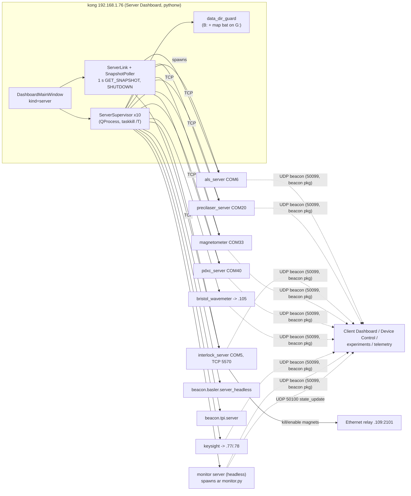

# Report 11: GUIs, dashboards and telemetry

Agent 11, 2026-09-28. k-exp HEAD c8faf77, wax HEAD acc4621. Read-only research: nothing was run.
Path conventions: `k-exp/...` = `/home/user/k-exp/...`; `waxx/...` = `/home/user/wax/waxx-src/waxx/...`;
`waxa/...` = `/home/user/wax/waxa-src/waxa/...`. The k-exp git history in this clone starts at
2026-09-10 (66 commits; the oldest, fc47c68, is a bulk commit), so "first seen" dates before
2026-09-10 cannot be established from history.

Confidence labels: **confirmed** (code or test shows it), **inferred** (strongly implied; the basis
is given), **needs a human**.

---

## operator_summary

1. The lab's hardware servers (lasers, interlock, magnetometer, wavemeter, current supplies, Basler
   cameras, TPI signal generators, the APD pick-off stage and the Monitor server) are started and
   watched by one window, the **kexp Server Dashboard**, which must run on **kong**
   (`192.168.1.76`). Launch it with the **Dashboard** shortcut or `kexp\_bat\server_dashboard.bat`.
   On kong it starts ten servers by itself about 1.2 s after the window appears (confirmed:
   `k-exp/kexp/util/dashboard/dashboard_hosts.py:22-39`, `server_dashboard_app.py:320-323`).
2. Every panel has a title bar with a small **LED** (grey = idle, yellow = starting/stopping,
   green = running *or* running-elsewhere, red = crashed), **Start / Stop / Restart** buttons, a
   connection badge (**OK** / **ERR**) and, for serial devices, a **COM pill** such as `COM5 ✓`
   (confirmed: `waxx/util/dashboard/theme.py:43-62`, `panel_header.py:200-243`).
3. A server will **not start** while the shared data drive (`%data%`, normally `B:\_K\PotassiumData`)
   is unreachable. The Log panel then says `[ERR] DATA_DIR unreachable; ... — cannot start`, and the
   LED goes back to grey (confirmed: `waxx/util/dashboard/server_supervisor.py:362-403`).
4. The **Monitor server** has no panel of its own. Its LED and Start/Stop/Restart sit on the
   **Device Control** panel's title bar. Starting the server does **not** start the monitor
   experiment. The panel then shows `Monitor not running: edits are not applied until it is started`
   with a **Start** button (confirmed: `server_dashboard_app.py:61-82`,
   `waxx/util/guis/monitor_server_headless.py:94-99`, `waxx/util/guis/device_summary.py:47-49`).
5. **LiveOD** is not in the dashboard. Start it separately with `live_od.bat` (the "LiveOD Server"
   shortcut). The **Interlock** panel is the software watchdog on the magnet cooling. It says
   `Interlock OK` (green) when healthy. Once it has tripped, it stays tripped until its server is
   restarted (confirmed: `k-exp/kexp/util/guis/interlock/interlock_service.py:583-590, 672-694`).
6. Closing the Server Dashboard window stops **every** server it started, including the Monitor
   server and the monitor experiment. It does not ask first (confirmed:
   `waxx/util/dashboard/dashboard_window.py:1141-1223`).

---

## mental_model

**The dashboard is a building's front desk with a key cabinet.** Each hardware server is a
tenant that owns one piece of equipment (a COM port, an IP instrument). The front desk (Server
Dashboard) has one hook per tenant, with a light and three buttons (Start, Stop, Restart). It
lets tenants in when the building opens (autostart), and it will not let anyone in while the
basement (the data drive) is flooded. It notices when someone let a tenant in by the side door
(a `.bat`) and does not issue a second key; that is the green "External" state. Visitors (client
dashboards on other PCs, and the experiments themselves) never go through the front desk. They
look tenants up in the building directory (the UDP beacon) and knock on their doors directly
(TCP). When the front desk closes for the night (the window is closed), it evicts every tenant
it let in.

---

## how_to

### H1. Start the Server Dashboard on kong
1. Log in to kong. Check first that `B:` (the data share) and `G:` (Google Drive, which holds the
   drive-mapping `.bat` and the e-mail credentials) are mounted. The dashboard reads `%data%`
   and runs `G:\Shared drives\Weld Lab Shared Drive\Infrastructure\map_network_drives.bat` if
   `%data%` is missing (confirmed: `k-exp/kexp/config/ip.py:9,40`,
   `server_dashboard_app.py:86-105`, `waxx/util/dashboard/data_dir_guard.py:136-218`).
2. Start it in one of three ways: double-click the **Dashboard** shortcut in
   `kexp\_bat\shortcuts\` (it targets `server_dashboard.bat`; confirmed by the target string in
   `kexp/_bat/shortcuts/Dashboard.lnk`), run `kexp\_bat\server_dashboard.bat`, or in a kpy terminal
   run `python -m kexp.util.dashboard.server_dashboard_app`. The `.bat` runs
   `start "" pythonw -m kexp.util.dashboard.server_dashboard_app %*`, so no console appears
   (confirmed: `kexp/_bat/server_dashboard.bat`). Options: `--host-ip 192.168.1.76`,
   `--include id1,id2`, `--exclude id1,id2`, `--no-autostart`
   (confirmed: `server_dashboard_app.py:108-114`).
3. The window title is `kexp Server Dashboard - <hostname>` (confirmed: `server_dashboard_app.py:304`).
   About 1.2 s after the window appears, it starts the autostart set for this host's lab IP
   (confirmed: `dashboard_window.py:425-443`, `server_dashboard_app.py:322-323`).
4. Wait for the status bar (bottom right) to read `● 10 running   ○ 0 idle`, `data dir OK`, and
   `<hostname>  192.168.1.76` (confirmed format: `dashboard_window.py:763-787, 805-814, 741`).
   There are ten because the kong entry lists nine ids and `"*"` adds `tpi` (`basler` appears in
   both lists) (confirmed: `dashboard_hosts.py:22-39`, `host_config.py:114-115`).
5. Start LiveOD separately with the **LiveOD Server** shortcut or `live_od.bat`. It is not a
   dashboard panel (confirmed: absent from `server_registry.py`; LiveOD wiki page line 410).

### H2. Check that each piece is up (what healthy looks like)
- **Header LED** green (`#2e8b57`) and the tooltip reads `Running`. The same green with the
  tooltip `External` means the dashboard detected an instance it did not start (confirmed:
  `theme.py:43-47,54-62`, `panel_header.py:200-203`).
- **Conn badge** `OK` in green. `ERR` in red means the snapshot poll is failing; hover over it for
  the reason (confirmed: `panel_header.py:214-220`).
- **COM pill**: `COM6 ✓` in green. `COM6 ✗` in red means a serial error; hover over it for the baud
  rate, `last rx N s ago` and the error (confirmed: `widgets.py:45-50,125-146`,
  `panel_header.py:222-243`).
- **Interlock** body: a large green pill `Interlock OK`, then `Temp: 21.34 °C`,
  `Flow: F1=4.02V F2=...`, `Age: 0.4s`, and a red `Kill Magnets` button when the magnets are
  enabled (confirmed: `interlock_panel.py:48-54, 267-292, 347-376`).
- **ALS / Precilaser** bodies: a green `Server: 192.168.1.76:<port>` button and
  `COM6 Connected` / `COM20 Connected` (confirmed: `waxx/util/guis/als/als_control_gui.py:1482-1492,1588`;
  `precilaser/precilaser_control_gui.py:788-794`).
- **HMR Magnetometer**: `Serial: Connected`, a status line `Connected to <ip>:<port>`, and Bx/By/Bz/Btot
  values that keep updating (confirmed: `waxx/util/guis/HMR_magnetometer/hmr_magnetometer_gui.py:904,1288`).
- **Keysight**: one value per supply, e.g. `12.34 A`. `CXN_ERR` or `OFF` on orange means not
  connected or output off. Red means the current is above the alert level (50 A on the 170 A
  supply, 100 A on the 500 A supply) (confirmed: `waxx/util/guis/keysight/keysight_client_gui.py:63,163-186`).
- **PDXC (beamsplitter stage)**: the status reads `<ip>:<port>` in green. The button of the end
  the server last commanded is outlined in green (confirmed: `waxx/util/guis/pdxc/pdxc_client_gui.py:1-14,291`).
- **Device Control**: the header LED shows the monitor **server**. The pill in the status row
  shows the monitor **experiment**: `Monitor ready` (green), `Monitor starting…` (yellow),
  `Monitor not running` (red) or `Monitor server unreachable` (dark red `#7a1616`) (confirmed:
  `waxx/util/guis/device_control_gui.py:38, 2061-2079, 2137-2150`).

### H3. Start, stop or restart one server
1. Use that panel's header buttons. **Start** is enabled in IDLE, CRASHED and EXTERNAL; **Stop** in
   RUNNING and STARTING; **Restart** in RUNNING, CRASHED and IDLE (confirmed: `panel_header.py:204-212`).
2. The same commands are in the **Servers** menu, and a click on the status-bar counts opens
   it too. That menu also has **Start autostart set (N)** and **Stop all running servers**
   (confirmed: `dashboard_window.py:649-715, 759-761`).
3. **Stop** first sends the server's own `SHUTDOWN` command (ALS, Precilaser, Interlock,
   Magnetometer, PDXC), waits `graceful_stop_timeout_s` (1.5 s by default, 4 s for the interlock),
   then runs `taskkill /PID <pid> /T /F`. Servers without a client (Monitor, Bristol, Basler,
   Keysight, TPI) are killed straight away (confirmed: `server_supervisor.py:412-440,58-85`;
   `server_registry.py:179`).
4. **Monitor server**: its Start/Stop/Restart are on the **Device Control** header. Stop and
   Restart ask first ("It is killed at once, together with the monitor experiment it runs..."), and
   after a Restart you must start the monitor experiment yourself from the status row (confirmed:
   `server_dashboard_app.py:68-82,144-167`; `tests/test_dashboard_monitor_controls.py`).

### H4. Start or stop the monitor *experiment* (not the server)
1. When the monitor is not running, the Device Control status row shows a notice with **Start**.
2. Right-click the status pill for **Start monitor experiment**, **Restart monitor experiment…**
   and **Stop monitor experiment…** (confirmed: `device_control_gui.py:2042-2059`).
3. Start asks for confirmation when the monitor was `interrupted_by_run` or LiveOD reports a run
   in progress ("Starting the monitor takes the core and cuts that experiment off") (confirmed:
   `device_control_gui.py:2165-2186`).

### H5. Client Dashboard on any other PC
1. Run `kexp\_bat\client_dashboard.bat`, which does `start "" pythonw -m kexp.util.dashboard.client_dashboard_app %*`.
   There is no shortcut for it since 2026-09-27 (confirmed: commit c04c97b).
2. The title is `kexp Client Dashboard - <hostname>`. It starts no servers (confirmed:
   `client_dashboard_app.py:1-15,127`). Visible by default: Device Control, Ethernet Relay,
   Remote Control, Keysight, TPI, Bristol, Camera Viewer. Hidden until picked from the **Panels**
   menu: ALS, Precilaser, HMR Magnetometer, and **Interlock (read-only view)**
   (confirmed: `client_registry.py:31-131`).
3. The ALS/Precilaser/Magnetometer panels on a client dashboard are full control panels
   (confirmed: the client specs reuse `AlsPanel`, `PrecilaserPanel` and `MagnetometerPanel`,
   `client_registry.py:100-123`). Only the interlock panel has a read-only variant.

### H6. Layout: move, pop out, reset, save
1. Drag panels by their title bars. The header's **⧉** button pops a panel into its own top-level
   window with its own taskbar entry. **❐** floats or re-docks it, and **✕** hides it (bring it
   back from the **Panels** menu, Ctrl+1..9) (confirmed: `panel_header.py:159-169`,
   `dashboard_window.py:543-558`).
2. **Layout → Reset to default layout** re-applies `kexp/util/dashboard/dashboard_layout.py`
   live. **Revert to saved layout** goes back to the layout loaded at startup. **Save layout to
   file…** and **Load layout from file…** write and read JSON (confirmed: `dashboard_window.py:560-576,482-500,890-946`).
3. The layout is saved one second after any dock move and again on close, to `QSettings("kexp","dashboard")`
   under the keys `dashboard/<server|client>/<host_ip>/{geometry,state,popped,popped_geometry/<id>}`
   (confirmed: `dashboard_window.py:343-349,820-822,863-872`). On Windows that means the registry key
   `HKCU\Software\kexp\dashboard` (inferred: Qt's default NativeFormat).
4. A shortcut at the k-exp repo root, `k-exp/dashboard_layouts.lnk`, points to
   `G:\Shared drives\Tweezers\Environments and Profiles\dashboard`. That is probably where layout
   JSON files are kept (inferred from the target string; needs a human).

### H7. Logs: where to look
- **Log dock** (bottom right): every supervised server's stdout/stderr lines, tagged `[OUT]` or
  `[ERR]`, plus the dashboard's own WARNING+ records. Filter by source and level
  (Everything / Warnings and errors / Errors only) or by text. The toolbar buttons are
  **Open log folder** (Ctrl+L) and **Show recent errors** (Ctrl+E) (confirmed: `log_panel.py:69-152`,
  `dashboard_window.py:583-604`).
- Server Dashboard file: `%data%\_logs\server\dashboard__<hostname-lowercase>.log`, rotated at 5 MB with
  5 backups, plus a `.fault` file for native crashes. Every child's output lines are also written
  there at INFO under the logger `kexp.dashboard.server.<id>`. If the share is not writable it
  falls back to `%LOCALAPPDATA%\kexp\dashboard\_logs\server\` and shows a 10 s status-bar warning
  (confirmed: `logging_setup.py:97-133,192-235,238-265`; `server_dashboard_app.py:173,221`;
  `dashboard_window.py:366-368`).
- Client Dashboard file: `%data%\_logs\client\dashboard__<host>.log` (confirmed: `logging_setup.py:268-284`).
- Each server's own log:
  - Monitor: `%data%\_logs\server\monitor__<host>.log`, plus the ops journal in `%data%\_logs\ops_journal`
    (confirmed: kexp `monitor_server_headless.py:60-62,82`).
  - ALS: `%data%\_logs\als_server.log` (`k-exp/kexp/util/guis/lasers/als/als_server.py:7`).
  - Precilaser: `%data%\_logs\precilaser_server.log` (`precilaser_server.py:10`).
  - HMR: `%data%\_logs\hmr_magnetometer_server.log` (`magnetometer_hmr_server.py:17`).
  - **Interlock: NOT on the share.** `interlock_server.py` calls `configure_server_logging("interlock")`
    without first calling `logging_setup.configure(log_root=...)`, so the log goes to
    `%LOCALAPPDATA%\dashboard\dashboard\_logs\server\interlock__<host>.log`
    (confirmed: `interlock_server.py:42-48`; `logging_setup.py:55-56,97-99,125-133`).
    The interlock heartbeat file is `%data%\_logs\interlock_heartbeat.txt`, and its sample CSV is
    `%data%\interlock_logs\plot_data.csv` (confirmed: `interlock_server.py:264-266`).
  - Keysight, Bristol, PDXC: stdout only, so only the dashboard log and the Log dock have them
    (confirmed: `keysight_server.py:409-413`, `bristol_wavemeter_server.py:242-243`).

### H8. Interlock: enable magnets, and recover after a trip
1. **Enable Magnets…** (green) is enabled only while the pill reads `Interlock OK` and the relay
   reports the magnets off. It asks "Re-enable magnet power? Make sure PLC is OK and cooling is
   verified before proceeding." (confirmed: `interlock_panel.py:278-292,396-411`).
2. After a trip the pill reads `INTERLOCK TRIPPED — <reason>` and the service stays in `tripped`.
   No code path returns to `ok` except a process restart (warmup → ok on the first good frame).
   Enable is disabled, and the RPC answers `refused: tripped` (confirmed:
   `interlock_service.py:464-473,583-590,672-676`). The **Reset Interlock** button was removed
   because the PLC ignores the reset byte: its handler is commented out in the sketch (confirmed:
   `interlock_panel.py:137`; `interlock-arduino-code/interlock-arduino-code.ino:96-108`).
3. The recovery order therefore appears to be: fix the cause (cooling water flow or temperature),
   then clear the PLC's latched trip (the Opta keeps `isTripped` until reset or power-cycled; needs
   a human for the physical step), then **Restart** on the Interlock header. The panel shows
   `Warmup — warmup (20s)` and then `Interlock OK`; only then click **Enable Magnets…**
   (inferred from the code; needs a human to confirm it is the lab procedure).

### H9. Remote control by e-mail or text
1. The **Remote Control** panel (Server and Client Dashboard) or `remote_control.bat` polls the
   Gmail inbox named in the credentials file every 10 s (confirmed: `email_handler.py:15,311-342`;
   `waxx/config/ip.py`; `remote_control_gui.py:506,658-661`).
2. Send an e-mail, or a text to the Google Voice number `805-364-2409`, from a whitelisted address
   or phone. Its body holds lines of the form `keyword value` (the separator may be a space,
   `=` or `:`) (confirmed: `email_handler.py:13,37-39`, `command_handler.py:48-76`).
   Commands:
   - `sources on|off` (aliases `source`, `atoms`) switches relay 3.
   - `als on|start|1 / off|shutdown|0` runs the ALS startup or shutdown sequence.
   - `preci on|off` (alias `precilaser`) does the same for the Precilaser.
   - `all on|off` does all three (confirmed: `remote_control.py:44-47,117-276`).
3. Messages older than 120 s are ignored, and all unread messages are marked read either way
   (confirmed: `email_handler.py:16,130-132,209-221`).
4. **You get no reply.** Results only go to the panel's log (confirmed: `command_handler.py:78-98`;
   `send_response_email` is never called).
5. The whitelist is `%data%\remote_whitelist.json` (or next to `ip.py` if `%data%` is unset). Edit
   it with **Edit Whitelist…** (confirmed: `k-exp/kexp/config/ip.py:122-126`, `remote_control.py:49-111`).
6. The **All ON / All OFF** buttons ask "Turn ON all systems (sources, ALS, Precilaser)?"
   (confirmed: `remote_control_gui.py:665-689`).

### H10. Standalone launchers (outside the dashboard)
All `.bat` files start with `call %kpy%`. The full table is in reference_facts R1. A server
started from its `.bat` is detected by the dashboard through its beacon id and shown as
EXTERNAL (green LED). This does not apply to the Monitor, Basler and TPI, which have no beacon id
in the registry (confirmed: `server_registry.py:96-112,142-154,198-211`; `panel_spec.py:114-120`).

### H11. Climate data
- Run `python -m waxa.climate now` (latest K-host sensors), `items`, `history "Machine Table" --since 24h`,
  `trends ... --since 30d`, `room --since 6h --csv out.csv`, or `--host Li now`. It needs the Broida
  VPN (confirmed: `waxa/climate/__main__.py:1-13,88-181`; `waxa/climate/zabbix.py:19,72-75`).
- In Python: `climate_for_run(ad)` returns `{sensor: per-shot array}` plus `_t_shot`
  (confirmed: `waxa/climate/attach.py:103-128`). kexp itself never calls `waxa.climate`
  (confirmed: `grep climate k-exp/kexp` is empty).

### H12. seqview (pulse-sequence viewer)
- Open a saved bundle by hand with `python -m waxx.util.seqview <bundle.npz>`. From Python or a
  notebook, `from waxx.util.seqview import show; show(bundle)` writes the bundle to
  `%TEMP%\waxx-seqview\` (or `%WAXX_SEQVIEW_DIR%`). If a viewer is already listening (its port is
  in `viewer.port`), `show` hands the bundle to it; otherwise it spawns a detached viewer whose
  output goes to `viewer.log` (confirmed: `waxx/util/seqview/__init__.py:9-15`, `launch.py:25-26,31-35,110-172`).
  `show(bundle, inline=True)` opens the window in-process and needs `%gui qt`. It refuses if PyQt5
  is loaded (confirmed: `app.py:26-41`).
- The only producer named in the code, `kexp.control.opx.viewer`, **does not exist** in either repo
  (confirmed: `waxx/util/seqview/__init__.py:7`, `bundle.py:8`; there is no `kexp/control/opx`).

### H13. Close the Server Dashboard deliberately
1. Before closing, remember that the close stops every server this dashboard started, including
   the monitor server and the monitor experiment. There is no confirmation (confirmed:
   `dashboard_window.py:1141-1223`).
2. If any COM server (ALS, Precilaser, Interlock, Magnetometer, PDXC) is still alive, a modal
   window **"Closing COM devices…"** lists them with their status and a log tail. Its buttons are
   **Cancel close** (keeps the dashboard open; servers already told to stop stay stopped) and
   **Force kill remaining** (confirmed: `com_shutdown_dialog.py:74,118-171`; the file's line
   numbers start at 1).

---

## reference_facts

### R1. The table: every GUI and server

"Host" is taken from the code; where the code does not say, it is marked needs a human. "Dash"
means a Server Dashboard panel (Srv), a Client Dashboard panel (Cli), or both. Beacon ids are
the `server_id` a server advertises. Every server that has one binds an OS-assigned
(ephemeral) TCP port unless a fixed port is shown.

| GUI / server | Purpose | Launcher (.bat / shortcut / panel) | Host (from code) | Port / COM | Healthy looks like | Common failure text |
|---|---|---|---|---|---|---|
| **kexp Server Dashboard** | Starts, watches and stops the hardware servers; hosts their GUIs | `Dashboard.lnk` → `server_dashboard.bat` (`start "" pythonw -m kexp.util.dashboard.server_dashboard_app`) | kong `192.168.1.76` (the only full autostart entry, `dashboard_hosts.py:28-38`) | n/a | Status bar `● 10 running   ○ 0 idle`, `data dir OK`, `<host>  192.168.1.76`; status message `Ready — N panel(s) loaded` (`dashboard_window.py:763-787,805-814,1055`) | `data dir UNREACHABLE` (red); a Log dock line `[<id>] [ERR] DATA_DIR unreachable; ... — cannot start` |
| **kexp Client Dashboard** | Remote views and controls; starts nothing | `client_dashboard.bat` (no shortcut since 2026-09-27, c04c97b) | any PC | n/a | Panels load; `Ready — N panel(s) loaded` | `Panel '<id>' failed to load.` plus the exception (`widgets.py:300-303`) |
| **ALS Laser** server (`als_laser`) + GUI "ALS Fiber Amplifier Control" | 1064 nm ALS fiber amplifier: power, interlock, 2nd stage, 7-step startup (30 min warm-up) | Srv/Cli panel 🔫 (`AlsPanel`, left); `als_server.bat`; `als_gui.bat` (client window) | kong (autostart) | `ALS_COM = 'COM6'` (`ip.py:86`) | `Server: 192.168.1.76:<port>` green; `COM6 Connected`; header `COM6 ✓` | `Server: lost — click to retry`; `ERROR: Laser not connected`; status-bar texts invisible when embedded (D4) |
| **Precilaser** server (`precilaser`) + GUI "Precilaser Control" | Precilaser amplifier: startup/shutdown ramps, ramp endpoint persisted in `%data%\precilaser_config.json` | Srv/Cli panel 💀; `precilaser_server.bat`; `precilaser_gui.bat` | kong (autostart) | `COM20` (`ip.py:89`) | `Server: <ip>:<port>` green; `COM20 ✓` | `Server: lost — click to retry` (`precilaser_control_gui.py:791`) |
| **Monitor server** (`monitor:<core octet>`, e.g. `monitor:75` for `core_addr="192.168.1.75"`) | Owns the device-state JSON; runs `ar monitor.py`; talks to Device Control | Hidden panel: LED and Start/Stop/Restart on the **Device Control** header (Srv only); legacy window `monitor_server_gui.bat` | kong (autostart) | Ephemeral TCP; state push UDP **50100** broadcast to `192.168.1.255` (`state_broadcast.py:26-27`) | Device Control header LED green; pill `Monitor ready` | `A monitor server for 'monitor:75' is already running at ...`; `Exiting: without the monitor experiment path ...` |
| **Device Control GUI** ("Device State Control") | DDS/DAC/TTL/Composite control between runs | Srv + Cli panel 🎮 (bottom); `device_control_gui.bat` | any PC | client only | Pill `Monitor ready` (green) | `Monitor server unreachable: edits do not reach the hardware`; `Monitor not running: edits are not applied until it is started` (`device_summary.py:47-49`) |
| **HMR Magnetometer** server (`magnetometer`) + GUI "HMR2300 Magnetometer" | Earth/background field monitor; per-shot `data.b`; reference CSV `%data%\magnetometer_reference.csv` | Srv panel 🧲 (tab "diag"), Cli (hidden); `magnetometer_server.bat`; `magnetometer_gui.bat` | kong (autostart) | `COM33` (`ip.py:92`) | `Serial: Connected`; `Connected to <ip>:<port>`; values updating | `Server not found — retrying...`; server log `Sensor readings stuck for 20 consecutive polls` |
| **Bristol Wavemeter** server (`bristol_wavemeter`) | Polls the Bristol wavemeter every 0.1 s and serves readings | Srv panel 〰 (tab "diag"), Cli panel; `bristol_wavemeter_server.bat`; `bristol_wavemeter_gui.bat` | kong (autostart); wavemeter at `192.168.1.105` (`ip.py:102`) | TCP to the wavemeter via `pyBristolSCPI` (`_PORT = 23`, inferred to be telnet-SCPI) | `f = 391.0xxxxx THz`, dot green (`bristol_wavemeter_client_gui.py:313`) | `f = — THz` |
| **Basler server · Camera Viewer** | Spawns beacon's headless Basler camera server; body is beacon's `CameraViewerMainWindow(layout_key="dashboard_server")` | Srv panel 📷 (right); Cli panel "Camera Viewer" (`layout_key="dashboard_client"`); `camera_viewer.bat` (viewer only); `basler_gui.bat` (server GUI + viewer) | autostart on **every** host that runs the server dashboard (`"*"`, `dashboard_hosts.py:24-27`) | USB (beacon internals: needs a human) | needs a human (beacon) | needs a human |
| **Keysight Supplies** server (`keysight`) | Polls the two coil supplies over VXI-11 every 0.25 s | Srv panel 🍌 (tab "diag"), Cli panel; standalone legacy `keysight_gui.bat` (talks to the supplies **directly**) | kong (autostart); supplies `.77` (170 A, inner coil) and `.78` (500 A, outer coil) (`ip.py:105-108`, `telemetry_providers.py:25-27`) | VXI-11 | One value per supply, e.g. `188.40 A` | `CXN_ERR` / `OFF` on orange; red above 50 A (170 A supply) or 100 A (500 A supply); yellow window flash after 60 s over |
| **Interlock** server (`interlock`) | Software watchdog over the cooling PLC stream; kills magnets through the relay | Srv panel 🔒 (top); Cli "Interlock (read-only view)" (hidden); `interlock_gui.bat` (standalone window that spawns its own server child) | kong (autostart) | Serial **COM5 hard-coded** (`interlock_server.py:269`); **fixed TCP 5570** (`interlock_server.py:64`); relay `192.168.1.109:2101` | `Interlock OK` green; `Kill Magnets` (red) when enabled | `INTERLOCK TRIPPED — no valid PLC data for 15.2s`; `SAFE MODE — configured COM port does not enumerate: COM5 not in [...]`; `Unknown — server unreachable: RuntimeError` |
| **PDXC Picomotor** server (`pdxc`) | APD pick-off beamsplitter stage (in = light to APD, camera blocked; out = camera clear) | Srv panel ⚙ (tab "control") | kong (`pdxc_server.py:7`) | `COM40` (`ip.py:115`) | Status `<ip>:<port>` green; current end outlined green | `server not found - retrying...`; `not connected`; `error: <err>` |
| **TPI Signal Generators** | beacon's TPI-1005-A server plus its GUI | Srv panel 📻 (tab "control"), Cli panel; `tpi_gui.bat` | autostart on **every** host (`"*"`) | USB/serial (beacon: needs a human) | needs a human | needs a human |
| **Ethernet Relay** GUI ("Ethernet Relay Control") | Relay 1 ARTIQ main, 2 magnet inhibit, 3 K source, 4 ARTIQ satellites (`kexp/control/ethernet_relay.py:9-12`) | Srv + Cli panel 🔌 (tab "control"); `ethernet_relay_gui.bat` | any PC | `192.168.1.109:2101` (`ip.py:82-83`) | Source indicator `ON`/`OFF`; magnet button `ON` (grey) | `ERROR` label (purple); log `Relay operation failed: ...` |
| **Remote Control** ("K-Exp Remote Control") | Polls Gmail every 10 s; runs `sources`/`als`/`preci`/`all` commands | Srv + Cli panel 📡 (tab "control"); `remote_control.bat` | any PC: **every open instance polls and executes** | IMAP `imap.gmail.com`; SMTP 587 | `Poll OK` pill; ALS / Precilaser buttons green | `Poll error`; the panel fails to load with `FileNotFoundError ... email_notification_gmail_credentials.txt` when `G:` is missing |
| **LiveOD server** | Cameras and data saving (see Agent LiveOD) | `live_od.bat` / `LiveOD Server.lnk` (**not** a dashboard panel) | camera PC (kong; needs a human) | ephemeral | see the LiveOD page | see the LiveOD page |
| **LiveOD remote viewer** | Read-only live OD | `live_od_viewer.bat` / `Viewer (LiveOD).lnk` | any PC | n/a | n/a | n/a |
| **MOT Viewer** | beacon Camera Viewer filtered to serial `40277706`, `layout_key="mot_viewer"` | **no launcher**: `python -m kexp.util.guis.mot_viewer.mot_viewer` | any PC | n/a | window "MOT Viewer" | no camera shown if that serial is gone (D17) |
| **Detuning plotter** ("Live Detuning Plot") | Detuning from the Moglabs wavemeter, polled every 10 ms | `detuning_plotter.bat` / `Detuning Plotter.lnk` | any PC; Moglabs at `192.168.1.94` (hard-coded, `detuning_plotter.py:279`) | TCP (MOGDevice) | `Wavemeter: 391.0xxxxx THz`, `Δ = ... GHz σ = ... MHz` | `Wavemeter: -- THz`; needs **PyQt5** and `kamo` |
| **ODT picomotor GUI** (New Focus 8742) | Mirrors "turning", "kick-up" | `ODT_picomotor_control.bat` | any PC; controller `192.168.1.80` addr 4 | pylablib | needs a human | needs a human |
| **SRS DC205 / SR560 servers** | Voltage source / preamp over LAN | `dc205_server.bat` / `sr560_server.bat` (not in dashboard) | `192.168.1.76` | fixed TCP **5555** (DC205, `COM10`), **5556** (SR560, `COM9`) (`ip.py:75-79`) | console `Starting DC205 Server...` | none in-repo; no client in kexp uses them |
| **seqview** | Pulse-sequence viewer for bundles | `python -m waxx.util.seqview <bundle.npz>`; `waxx.util.seqview.show()` | any PC | `127.0.0.1:<port>` from `viewer.port` | Window opens on the bundle | `could not load <path>: ...`; `seqview needs PyQt6; PyQt5 is already loaded ...` |
| **Climate CLI** | Zabbix climate sensors | `python -m waxa.climate ...` | any PC on the Broida VPN | HTTP `weldlabaio1.physics.ucsb.edu/api_jsonrpc.php` | `now` prints one line per sensor | `Zabbix at ... unreachable (...). Are you on the Broida VPN?` |

### R2. Legacy, unused or broken (with evidence)
| Item | Evidence | Status |
|---|---|---|
| `kexp/util/guis/_old/{dac,dds,ttl}` and `_bat/old/{als,dac,dds,ttl}_gui.bat` | The .bats `cd` into `kexp\util\guis\{dac_als,dac,dds,ttl}`, which do not exist | broken (confirmed) |
| `_bat/dashboard/start_artiq_{dashboard,master_only,dashboard_only}.bat`, `start_moninj_proxy.bat`, `start_artiq_coreanalyzer_proxy.bat`, `delete_artiq_dataset_garbage.bat` | Old artiq_master/artiq_dashboard workflow; proxies at `192.168.1.75`; not referenced by any registry | legacy, still launchable (confirmed) |
| `tray_launcher.bat`, `_start/_restart/_terminate_tray_launcher_scripts.bat` (+ their `.lnk`), `auto-launch/autolaunch-interlockGUI.bat` | Call an external `launcher` CLI with scripts in `%USERPROFILE%\.tray_launcher\scripts`; the tool is not in either repo | legacy (confirmed not in repo; whether it is still installed needs a human) |
| `watcher/*.bat` | Target `kexp/analysis/preview`, which does not exist | broken (confirmed) |
| `fix_run_id.bat` / `FIx Run ID.lnk` | Runs `waxa/data/increment_run_id.py`, absent from `waxa/data/` | broken (confirmed) |
| `magnetometer_arduino_gui.bat` → `magnetometer_gui_arduino.py` | PyQt5, `COM23`, old Arduino sensor; replaced by HMR | legacy (inferred) |
| `ion_pump_controllers_SIP/SIP_ion_pump_controller_gui.py` | No launcher; would crash: `payload_bits_to_int` lacks `self` (l.28), `ion_pump_panel(... ip=...)` wrong kwarg (l.89), `scoket=` typo (l.90), `setup_socket` uses `self.ip_edit` before it exists (l.79,112-116), `if __name__ == "main":` never true (l.131) | broken draft (confirmed) |
| `newfocus_8742/objective_stages/objective_stage_gui.py` | No launcher; `motor_axis(1,1)` misses `stage_obj`; `pyqtSignal` on a non-QObject | broken draft (confirmed) |
| `interlock/interlock_gui_OLD.py.bak` | .bak | archaeology |
| `MonitorPanel` (server-side embed of `MonitorServerGUI`), `monitor_panel.py:47-70` | No registry uses it; the monitor spec has `body_factory=None` (`server_registry.py:106`); the module docstring still says the server registry imports it (l.8-9) | dead code (confirmed) |
| `waxx/util/dashboard/generic_status_panel.py`, `serial_helper.py` | No importers (grep) | dead code (confirmed) |
| `ALSControlGUI(ip=..., port=5557)` args and its embedded `ServerWorker` TCP server | The GUI discovers the server through the beacon (`als_control_gui.py:1304`); `self.ip` / `self.port` are unused | vestigial (confirmed) |
| `keysight_monitor/keysight_monitor_gui.py` (via `keysight_gui.bat`) | Talks VXI-11 directly, although the server's docstring says "Clients should never talk to the supplies directly" (`keysight_server.py:4-6`) | legacy but launchable (confirmed) |
| seqview producer `kexp.control.opx.viewer` | Named in `seqview/__init__.py:7`, `bundle.py:8`; no `kexp/control/opx` exists | missing (confirmed) |

### R3. Dashboard framework constants
| Item | Value | Where | Conf. |
|---|---|---|---|
| Autostart delay | 1200 ms after show | `server_dashboard_app.py:322-323` | confirmed |
| Supervisor states | IDLE, STARTING, RUNNING, STOPPING, CRASHED, FAILED, EXTERNAL | `server_supervisor.py:147-154` | confirmed |
| LED colours | IDLE `#777777`, STARTING/STOPPING `#d4a017`, RUNNING `#2e8b57`, CRASHED/FAILED `#b22222`, EXTERNAL `#2e8b57` (same as running) | `theme.py:43-62` | confirmed |
| Servers-menu dots | 🟢 running, 🟡 starting/stopping, ⚪ idle, 🔴 crashed/failed, 🟠 external | `dashboard_window.py:657-661` | confirmed |
| Graceful stop default | 1.5 s (monitor 3 s, basler 3 s, interlock 4 s) | `panel_spec.py:147`; `server_registry.py:109,151,179` | confirmed |
| Restart-on-crash | off for every spec (default False; none set it) | `panel_spec.py:148`; `server_registry.py` | confirmed |
| Crash-restart policy (if enabled) | 5 starts in 60 s, backoff 0.5 s doubling to 30 s, then FAILED | `server_supervisor.py:221-225,600-617` | confirmed |
| Snapshot poll | 1000 ms; 5000 ms after 5 consecutive failures | `snapshot_poller.py:62-64` | confirmed |
| Link connect delay / retry | 1500 ms after RUNNING / 4000 ms | `server_link.py:57-58` | confirmed |
| Data-dir probe | every 30 s, first at 0.5 s; `data dir OK` / `data dir UNREACHABLE` | `dashboard_window.py:752-757,805-814` | confirmed |
| Map-bat run | `subprocess.run(bat, shell=True, CREATE_NO_WINDOW, timeout=30)` | `data_dir_guard.py:182-192` | confirmed |
| MAP_BAT_PATH | `G:\Shared drives\Weld Lab Shared Drive\Infrastructure\map_network_drives.bat` | `ip.py:40` | confirmed |
| Log rotation | 5 MB × 5 | `logging_setup.py:192-198` | confirmed |
| Log dock buffer | 5000 lines; dashboard's own records ≥ WARNING | `log_panel.py:72`; `server_dashboard_app.py:296-297` | confirmed |
| QSettings | org `kexp`, app `dashboard`; key `dashboard/<kind>/<host_ip or "unknown">/...` | `dashboard_window.py:301,343,820-822` | confirmed |
| Layout defaults | `SERVER_PLACEMENT`, `CLIENT_PLACEMENT`, `HOST_LAYOUT_OVERRIDES` (empty) | `dashboard_layout.py:44-79` | confirmed |
| Host-IP resolution | `--host-ip`, else the first `192.168.1.*` from `getaddrinfo(hostname)`, else a UDP-connect trick to `192.168.1.1`; `None` if all fail → empty autostart (the `"*"` list too) | `host_config.py:53-115` | confirmed |
| App ids | `kexp.ServerDashboard`, `kexp.ClientDashboard`; popped windows `<app_id>.<panel_id>` | `server_dashboard_app.py:191`; `client_dashboard_app.py:102`; `dashboard_window.py:1082` | confirmed |
| Console guard | CTRL_C / CTRL_BREAK ignored by the dashboard process | `server_supervisor.py:100-144` | confirmed |
| Child creation flags | `CREATE_NEW_PROCESS_GROUP | CREATE_NO_WINDOW`; cwd = k-exp repo root; interpreter = the dashboard's `sys.executable` (pythonw.exe when launched by the .bat) | `server_supervisor.py:537-541`; `server_registry.py:36-37` | confirmed / inferred (pythonw) |

### R4. Interlock constants
| Item | Value | Where |
|---|---|---|
| Serial | COM5 (hard-coded in main), 9600 baud, read timeout 1 s, reads up to 200 B per 0.25 s loop | `interlock_server.py:269-270`; `interlock_service.py:95-97,545,557` |
| Stale threshold | 15 s without a good frame → trip | `interlock_server.py:271`; `interlock_service.py:636-648` |
| "Warmup" | 20 s (message only; the 15 s stale check applies from start, so it trips first) | `interlock_server.py:272`; `interlock_service.py:289-295,636-648` |
| Watchdog | checks every 5 s; poll loop frozen > 10 s → emergency kill + `os._exit(2)` | `interlock_service.py:100-101,734-751` |
| Heartbeat | every 5 s to `%data%\_logs\interlock_heartbeat.txt` | `interlock_service.py:757-779` |
| CSV | `%data%\interlock_logs\plot_data.csv`, rewritten (mode `w`) every 600 s with the last ≤ 4096 samples | `interlock_server.py:265,310-311`; `interlock_service.py:190-192,797-818` |
| Reset debounce | 5 s (the RPC exists; the button was removed) | `interlock_service.py:107,435-462` |
| Snapshot relay probe | ≤ 1 per 5 s, 0 retries, 0.5 s timeout, cached value + `magnets_status_age_s` | `interlock_service.py:73-79,341-396` |
| Singleton | Windows named mutex `Global\kexp_interlock_server` (per machine) | `interlock_service.py:196-222` |
| Exit codes | 0 normal, 1 bad config, 2 watchdog, 3 already running | `interlock_safe_mode.py:43-46` |
| Trip e-mail | Subject `K-Interlock Tripped`, body `K interlock tripped: <reason>`, sent to the Slack "infrastructure" channel address; credentials `G:\...\interlock_gmail_credentials.txt` | `interlock_service.py:679-680`; `interlock_server.py:71-110`; `ip.py:6` |
| PLC (Arduino Opta) trip bounds | temperature outside 280–306 K (≈7–33 °C); any flow voltage outside 3.0–8.0 V; latches `isTripped`, prints `I TRIPPED` every loop; the reset byte handler is commented out | `interlock-arduino-code.ino:20-23,70-92,96-112` |
| Frame format | `/Temp is <K>k/`, `/Flowmeter N reads <V>V/`; checksum = product of primes 2,3,5,7 (flows 1-4) × 11 (temp) must be complete | `interlock_service.py:67-69,602-634`; `.ino:58-84` |

### R5. Other constants
| Item | Value | Where | Conf. |
|---|---|---|---|
| Remote-control poll | 10 s; ignore messages > 120 s old; Google Voice number `8053642409` | `email_handler.py:13-16` | confirmed |
| Remote-control credentials | `G:\Shared drives\Tweezers\Environments and Profiles\email_notification_gmail_credentials.txt` (2 lines: address, app password) | `waxx/config/ip.py`; `notifications.py:32-44` | confirmed |
| Run-done e-mail | every run by default (`Base.end(notify=True)`), to `herberthearsall@gmail.com`, subject `run {run_id} done: {file} - {YYYY-MM-DD HH:MM:SS}`; daemon thread, joined ≤ 20 s at exit | `notifications.py:29,78-142`; `waxx/base/expt.py:385-415`; `kexp/base/base.py:370-371` | confirmed |
| ALS startup e-mail | `ALS startup done on <host>` to `herberthearsall@gmail.com` | `waxx/util/guis/als/als_server.py:26,955-966` | confirmed |
| ALS sequence resume file | `~/.als_server_state.json` | `als_server.py:176-179` | confirmed |
| PDXC persisted settings / position | `~/.waxx/pdxc_server_defaults.json` | `waxx/control/misc/pdxc.py:72-76` | confirmed |
| Device Control timings | status poll 1 s; full reconcile every 10 s; TTL pulse hold 0.3 s | `device_control_gui.py:57-64` | confirmed |
| Telemetry intervals | Keysight 1 s, Interlock 2 s, LiveOD 2 s; discovery 0.5 s | `telemetry_providers.py:29,43,79,112` | confirmed |
| Monitor push | UDP 50100 broadcast `192.168.1.255`; beacon port 50099 is named in a comment only | `state_broadcast.py:24-27` | confirmed (50099: comment only) |
| Zabbix | `http://weldlabaio1.physics.ucsb.edu/api_jsonrpc.php`, guest / empty password, 15 s timeout, history 90 d (docstring), trends 1 y (docstring) | `zabbix.py:19,48-49`; `client.py:1-6,336-341,371-374` | confirmed (retention: docstring) |
| seqview | bundle dir `%TEMP%\waxx-seqview` (or `%WAXX_SEQVIEW_DIR%`), keeps the newest 12 `.npz`, `viewer.port`, `viewer.log` | `launch.py:25-26,31-35,50-62` | confirmed |
| LAN map | `kexp/util/network/LAN_devices.csv` (kong .76, crate .75, test crate .86, relay .109, Opta interlock .103, ...) | file | confirmed (the file; its currency needs a human) |

---

## expert_nuances

**Dashboard lifecycle**

1. **Autostart = host entry ∪ `"*"`.** Only when the lab IP resolves; if `resolve_host_ip` returns
   `None` (lab NIC down, IP changed off `192.168.1.`), nothing autostarts, not even `"*"`, the log
   says `Autostart set: []`, and the status bar shows host `unknown`
   (`host_config.py:98-115`; `server_dashboard_app.py:184-186`; `dashboard_window.py:301`).
   The QSettings layout key then also becomes `.../unknown/...`, so the saved layout "vanishes".
2. **`"*"` autostarts `basler` and `tpi` on any PC that runs the *server* dashboard**
   (`dashboard_hosts.py:24-27`). Running the server dashboard on a second PC therefore spawns a
   Basler camera server and a TPI server there. Whether that is intended is a question for a
   human.
3. **EXTERNAL detection is a beacon-cache lookup with zero timeout.** It runs at Start (and at
   autostart after the 1.2 s delay). It only knows what the process's beacon registry has already
   heard (`server_supervisor.py:170-181,294-318`; `dashboard_window.py:425-432`). The specs **monitor,
   basler and tpi have no `server_id`**, so they are never marked EXTERNAL (`server_registry.py:96-112,142-154,198-211`).
   The monitor server protects itself: it runs its own 1.5 s `discover` and exits 1 if it finds a
   beacon (`waxx/util/guis/monitor_server_headless.py:238-250`).
4. **EXTERNAL is painted the same green as RUNNING** in the header and in Running Servers, and it
   counts as "running" in the status bar (`theme.py:47,61`; `dashboard_window.py:771`). Only the
   Servers menu uses orange (🟠, `dashboard_window.py:660`). EXTERNAL is re-probed **only when
   someone clicks Start** (`server_supervisor.py:337-342`; `clear_external` has no caller). A
   dead external instance therefore keeps a green LED; only the conn badge (`ERR`) shows it.
5. **No server is restarted after a crash.** `restart_on_crash` defaults to False and no spec sets
   it (`panel_spec.py:148`), so the backoff logic (`server_supervisor.py:600-617`) is dormant and
   the FAILED state and "Reset failure and start" item cannot be reached. The interlock watchdog
   says "exit hard for supervisor restart" (`interlock_service.py:749-751`), but no restart happens.
6. **Data-dir gate on every server.** `requires_data_dir=True` is the default and no spec changes
   it (`panel_spec.py:150`). The precheck runs on a pool thread and may run the map `.bat` (30 s
   timeout). On failure the state goes back to IDLE (not FAILED), and the same message is logged
   only once until it changes (`server_supervisor.py:328-403`). This gates the **interlock and the
   monitor** too: with `B:` down and `G:` unavailable, the software interlock cannot be started from
   the dashboard.
7. **Stop semantics.** With a client, the supervisor sends the TCP `SHUTDOWN` on a daemon thread,
   then force-kills after `graceful_stop_timeout_s`. Without a client, `stop()` calls
   `force_kill(wait_ms=200)` at once (`server_supervisor.py:412-440`). The kill is
   `taskkill /PID … /T /F`, which is scoped to the child's process tree. For the monitor server
   that tree includes the running `ar monitor.py` (inferred: MonitorManager spawns it as a child).
   `restart()` is synchronous: a blocking stop, then a 2 s wait, then start (`server_supervisor.py:506-521`).
8. **Close semantics.** `closeEvent` saves the layout, sends `request_terminate` to every
   supervisor at once, shows the COM modal for alive `com_label` servers, runs `shutdown_all` with
   grace = max(1500 ms, largest per-spec timeout) = 4000 ms, then stops links, the warmer and
   panel `cleanup()` (`dashboard_window.py:1141-1223`; `server_supervisor.py:647-700`). There is no
   "are you sure", unlike the header Stop and Restart for the monitor (`server_dashboard_app.py:154-167`).
   **Servers menu → Stop** and **Stop all running servers** also skip the monitor-specific warning
   (`dashboard_window.py:672-673,698-714`).
9. **The COM modal's docstring is stale.** It says a CTRL_BREAK is sent (`com_shutdown_dialog.py:4-6`).
   The code never sends console signals; it uses the TCP `SHUTDOWN` (`server_supervisor.py:414-419,462-477`).
10. **The COM pill is not a button in practice.** Clicking a green pill asks "Disconnect COM5?\nHardware
    will stop responding until reconnect." and emits `disconnect_requested`, but **nothing connects
    those signals** (grep: the only matches are `widgets.py:57-67,162,165`). Nothing happens.
11. **Lazy realization.** A panel body is built when it first becomes visible. Hidden panels and
    tabs stacked behind another are built on their first `visibilityChanged(True)`
    (`dashboard_window.py:995-1043`). That includes **Remote Control**: its IMAP polling starts only
    when its tab is first shown (`remote_control_gui.py:506`). A factory exception is shown in the
    panel as a red `Panel '<id>' failed to load.` box with a traceback and **Retry**
    (`panel_container.py:118-152`; `widgets.py:277-318`).
12. **Embedding drops the status bar.** `embed_main_window` re-parents the central widget, menu
    bar and tool bars, then hides the `QMainWindow` (`embed_helpers.py:127-205`). Anything a GUI
    shows with `statusBar().showMessage` becomes invisible inside the dashboard. The ALS GUI uses
    it 22 times (e.g. `Error: Laser not connected`, `Server communication error: ...`). Camera Viewer
    and TPI are embedded whole (`embed_as_window=True`).
13. **App-wide side effects of embedded GUIs.** When the Remote Control panel is built it calls
    `app.setStyleSheet(_DARK_STYLESHEET)` (`remote_control_gui.py:510`), which **replaces** the
    dashboard stylesheet installed by `theme.apply_dark_theme` (`theme.py:160`). It also sets the
    app icon to 📡 (l.551). The ALS GUI sets the app icon to 🔫 (`als_control_gui.py:611-614`).
14. **Collapse stages.** A short ALS or Precilaser dock hides its telemetry and log, then the
    status row, then the Controls box (Startup/Shutdown) below 110 px of height
    (`als_panel.py:25-34,68-75`; `precilaser_panel.py`). The buttons are still there once the dock
    is enlarged.
15. **Logging details.** The dashboard runs under pythonw, so `sys.stderr` is None and uncaught
    exceptions go to the log file as `uncaught exception` CRITICAL (`logging_setup.py:216-222`).
    Child lines go to the dashboard log at **INFO** whatever the child's own level
    (`server_dashboard_app.py:221`). The Log dock parses the level word inside the line and treats
    bare `[ERR]` lines as warnings (`log_panel.py:32-44`).
16. **Two log destinations per server.** For example the ALS writes `%data%\_logs\als_server.log`
    itself, and the dashboard also records its stdout/stderr. The interlock writes to local
    `%LOCALAPPDATA%` (H7).

**Monitor (GUI side only; the Monitor agent owns the rest)**

17. **Server running does not mean monitor running.** The headless server never auto-starts the
    monitor experiment (`monitor_server_headless.py:94-99`). The first start comes from the Device
    Control **Start**, a `reset`, or the next `run complete` (the same file, l.211-216).
18. **Pill vs LED.** The header LED is the *server process* (supervisor). The pill is the *monitor
    experiment* state from `get_status`, polled every 1 s (`device_control_gui.py:62,2061-2131`).
19. **Error replies look like network failures.** If the server answers `get_state` with an error
    (for example `{"status":"error","msg":"no config path"}`), the state worker drops the client and
    emits `state_failed`, and the GUI shows `Monitor server unreachable`
    (`device_control_gui.py:1289-1310,2812-2814,2137-2150`). The next 1 s status poll turns the pill
    back to the real state (`_set_monitor_state` clears `connection_failed`, l.2063). The periodic
    10 s reconcile repeats the failure (l.64,2993-2995). Under the dashboard, a missing `%data%`
    stops the monitor server from starting at all (data-dir gate), so `no config path` can only
    appear with the standalone `monitor_server_gui.bat` (`kexp/.../monitor_server_gui.py:58-67` warns, only exits
    on a missing *experiment* path).
20. **State push.** The server broadcasts `state_update` on UDP 50100 to `192.168.1.255`. GUIs bind
    `("", 50100)` with SO_REUSEADDR. A bind failure ends the listener thread silently
    (`state_broadcast.py:26-27,81-90`). The GUI resyncs over TCP on a version gap and every 10 s
    anyway (`device_control_gui.py:64,2907-2915,2993-2995`), so a blocked 50100 costs up to 10 s
    of staleness for edits made elsewhere (inferred).

**Interlock**

21. **Start-up order.** `service.start()` (singleton mutex, `validate_config`) runs **before** the TCP
    server binds (`interlock_server.py:284-296`), although `InterlockTCPServer.start` says "Bind
    FIRST so the dashboard can connect even while the service is still validating config" (l.140-141).
    `validate_config` reads the relay with default retries (up to 6 connects with a 10 s timeout
    each), so the panel can show `Unknown — server unreachable: ...` for about a minute when the
    relay is slow (inferred from `waxx/control/ethernet_relay.py:283-326`).
22. **Safe mode kills magnets.** If COM5 does not enumerate, or the relay cannot be read at boot,
    the service enters `safe_mode` and **immediately calls `kill_magnets()`**
    (`interlock_service.py:251-264,268-278`). Safe mode is terminal until restart
    (`interlock_safe_mode.py:19-20`). The mutex is per machine, so an interlock server started on
    *another* PC (Start clicked on a second server dashboard while kong's beacon is not visible there)
    would find no COM5 and kill the magnets over the network (inferred from the code path; needs a
    human to judge the risk).
23. **"Tripped" is sticky in software.** `_state` only returns to `ok` from `warmup`/`unknown`
    (`interlock_service.py:583-590`). `reset_interlock` writes `O` but never changes `_state`
    (l.435-462), and the PLC ignores `O` (`.ino:96-108`). Enable is refused while `tripped`
    (l.469-470), and the panel greys out Enable unless the state is `ok` (`interlock_panel.py:285-288`).
24. **Stale path.** Silence or failed-checksum reads for more than 15 s cause a trip, which kills
    the magnets. With stale data every empty read calls `_trip` again. Only one kill thread runs at a
    time, but once a kill is confirmed the next empty read starts a new one, so the relay gets a
    kill about every 1.25 s during an outage (inferred from `interlock_service.py:547-568,636-718`).
25. **The kill loop's "200 ms" is the gap between attempts.** Each attempt can take up to ~67 s
    when the relay is down (6 connects × 10 s plus backoff), and it holds `_relay_lock` meanwhile.
    Enable and disable RPCs queue behind it. The snapshot never queues: it uses a non-blocking
    acquire and the cached value (commit 89dbc95, 2026-09-24; `interlock_service.py:351-377`).
26. **The 20 s warmup is cosmetic.** `_last_valid_data_monotonic` is set at start and the 15 s stale
    check applies during warmup (`interlock_service.py:289-295,636-648`).
27. **The CSV is a rolling snapshot, not a log.** It is rewritten with the newest ≤ 4096 samples
    every 10 min (`interlock_service.py:190-192,797-818`; `interlock_server.py:310-311`). The
    heartbeat file is the liveness record.
28. **Two ways to kill or enable magnets.** The Interlock panel goes through the service (gated).
    The **Ethernet Relay panel's magnet button flips relay 2 directly, with no confirmation and no
    interlock check** (`ethernet_relay_gui.py:265,515-529`; `kexp/control/ethernet_relay.py:84-92`).
29. **Relay polling load.** The relay board serves one TCP connection at a time (inferred from
    commit 89dbc95's note that it "took >0.5 s to accept"). It is polled by the interlock snapshot
    (≤ 1/5 s), by every open Ethernet Relay panel (every 5 s, `ethernet_relay_gui.py:132`) and by
    remote-control commands.

**Remote control**

30. **Every running instance is an independent poller** of the same inbox: Server Dashboard,
    Client Dashboards once their Remote Control tab has been shown, and `remote_control.bat`. Two
    instances can fetch the same UNSEEN message before either marks it `\Seen`, and then both
    execute it (inferred from `email_handler.py:194-229`). Whitelist edits save to the shared JSON
    but other instances keep their in-memory list until restarted (inferred from
    `remote_control.py:49-111`).
31. **Authentication is the From header only** (`email_handler.py:52-69,135-141`). For Google Voice
    texts the prefix `1<gvoice>.1<phone>.` is matched. The account's own address is always
    whitelisted (`remote_control.py:40-41`).
32. **`all on` is best effort.** If the ALS or Precilaser client has not been discovered yet
    (`None`), that part fails with `ALS failed ('NoneType' object has no attribute
    'run_startup_sequence')` while the sources still switch (`remote_control.py:206-276`).

**Lasers, stage, supplies**

33. **ALS auto-resume.** After the server restarts and reconnects to COM6, a STARTUP sequence saved
    as RUNNING in `~/.als_server_state.json` resumes, with the warm-up shortened by the time already
    elapsed (`als_server.py:218-233,366-409`). A dashboard Restart in the middle of a startup
    therefore continues the ramp by itself.
34. **PDXC is open loop.** The green outline is the last *commanded* end, persisted in
    `~/.waxx/pdxc_server_defaults.json`; a jog makes it `unknown` (`pdxc_client_gui.py:1-14`;
    `waxx/control/misc/pdxc.py:72-76,441-496`).
35. **Keysight click semantics.** Clicking a value calls `RECONNECT <ip>` when disconnected,
    `TURN_ON <ip>` when output is off, and `CLEAR_PROT <ip>` otherwise, with no confirmation. A
    failure is only printed to stdout (`keysight_client_gui.py:198-213`).

**Telemetry**

36. **The Composite-tab telemetry is read-only by construction.** Each provider binds one read
    call (`telemetry_providers.py:1-17`; `tests/test_telemetry_providers.py`). The supply-to-coil
    map is `.78` = outer (500 A), `.77` = inner (170 A), "confirmed 2026-09-26" (l.25-27).
    `LAN_devices.csv` labels `.77` as "160A Keysight" while the code says 170 A (a label drift;
    needs a human).
37. **Magnetometer per-shot value.** `read_magnetometer` stores `get_field_magnitude()` in
    `self.data.b` (`kexp/base/control.py:146-151`). The client returns `0.0` after 5 failed tries
    and prints `Reading magnetometer failed after 5 attempts: ...`
    (`hmr_magnetometer_client.py:155-181`). If the server is unreachable when `Clients()` starts,
    the run uses `HMRDummy` (zeros) after printing `Failed to connect to HMR Magnetometer server: ...`
    (`kexp/base/clients.py:28-32`). The server's `GET_FIELD` returns the newest buffered reading
    with no age check (`hmr_magnetometer_server.py:623-628`).

**Climate / notifications / seqview**

38. **Climate time base.** `shot_times` prefers `img_timestamp_atoms`, then `timestamp_shot_end`,
    then the run start parsed from the file name, and deliberately not `run_info.run_datetime`
    (`attach.py:35-94`). Nearest sample within 180 s, otherwise NaN (`attach.py:103-128`;
    `client.py:173`). Beyond the 90-day raw history, `history()` returns an empty series with no
    warning, so every shot is NaN (`client.py:336-369`).
39. **Run-done e-mail.** A stale comment in `expt.py:410-412` says "non-daemon thread: exit waits for
    it". The helper actually uses a daemon thread joined for at most 20 s at exit
    (`notifications.py:118-142`; `tests/test_notifications_exit.py`).
40. **seqview reuse.** `show()` hands the bundle to a running viewer only if the stamp of that
    viewer's source files matches; otherwise it spawns a fresh detached process
    (DETACHED_PROCESS | CREATE_NEW_PROCESS_GROUP | CREATE_BREAKAWAY_FROM_JOB) (`launch.py:65-77,110-144`).

**Ports and firewall**

41. **Fixed ports exist.** The interlock uses TCP **5570** (`interlock_server.py:64`), DC205 5555
    and SR560 5556 (`ip.py:76-78`), and the monitor push uses UDP **50100** (`state_broadcast.py:26`).
    The firewall page's TCP rule opens only 49152–65535, and its client rule opens only UDP 50099.
    Remote interlock views work only if the program rule covers the interpreter, and the
    dashboard's children run under the dashboard's `sys.executable`, which is `pythonw.exe` when
    started by the `.bat` (`server_registry.py:36`; `server_dashboard.bat:7`). The page's program rule
    names `python.exe` (inferred; the lab's actual rules need a human).
