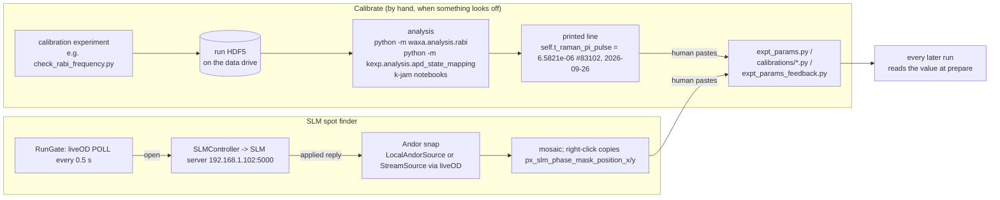

# Agent 12 report: Calibrations and feedback

Scope: `kexp/calibrations/{imaging,magnets,tweezer}.py`, `kexp/calibrations/SLM_spot_finder/**`, `kexp/config/dds_calibration.py`, `waxa/calibrations/cross_section.py`, `kexp/base/feedback.py`, `kexp/analysis/{feedback,rabi_posterior,rabi_posterior_cli,apd_state_mapping}.py`, `kexp/experiments/HF_experiments/feedback/**`, `kexp/experiments/calibration/*`, M-LOOP (`JE/M_LOOP/**`, `Mloop testing/**`), `waxa/analysis/{rabi,lightshift,readout}`, imaging/magnet/tweezer calibration experiments, Andor readout-clock provenance, magnification provenance, and the SLM server in `waxx/control/slm/**` as far as the spot finder and the SLM demon need it.

Repos read at k-exp c8faf77 (2026-09-27) and wax acc4621 (2026-09-27). History in k-exp only goes back to fc47c68 (2026-09-10; 66 commits), so anything older is "before 2026-09-10" at best. Nothing was run. Paths below are relative to `/home/user/k-exp` unless they start with `wax/` (then relative to `/home/user`).

Confidence labels: **confirmed** (the code or a test shows it), **inferred** (strongly implied; the reason is given), **needs a human** (lab procedure, physics, hardware, beacon internals).

---

## operator_summary

1. Many numbers the machine runs on were measured, not derived: coil current per DAC volt, imaging frequency per amp of coil current, Raman pi-pulse time, the Raman transition frequency, the SLM spot position and phase, the APD readout levels, the light shift, the Andor magnification. They live in five places: `kexp/calibrations/*.py` (fits used by code), `kexp/config/expt_params.py` (single values, each tagged with a comment `#<run id>, <date>`), `kexp/config/camera_id.py` (camera magnification and readout settings), `kexp/config/dds_calibration.py` (a D1 attenuator table) and, for the feedback experiments only, `kexp/experiments/HF_experiments/feedback/expt_params_feedback.py`. **confirmed**
2. These numbers drift (the Raman pi time alone was re-measured 11 times between 2026-08-20 and 2026-09-26, from 5.70 to 8.98 us, `kexp/config/expt_params.py:159-169`). Nothing re-measures them automatically and nothing writes them back: you run a calibration experiment, run an analysis (a command-line tool or a notebook), and paste the printed line into the params file by hand. **confirmed**
3. The **SLM spot finder** (`kexp/calibrations/SLM_spot_finder/spot_finder.bat`) is a window that steps the SLM phase spot over a grid of positions and takes one Andor frame at each, so you can see where the spot lands on the atoms' image plane. Right-clicking a tile in the final mosaic copies the two lines `self.px_slm_phase_mask_position_x = ...` / `..._y = ...` for `expt_params.py`. Since 2026-09-26 it refuses to write the SLM while a run is in progress or while it cannot tell (the "run gate"). **confirmed**
4. The **feedback** ("monitored Rabi") experiments run a Bayesian estimator inside the ARTIQ kernel during one shot: Raman pulse, weak APD measurement, update a probability grid over the Raman frequency, choose the next pulse frequency, repeat. They rely on calibrated APD levels, photon numbers and the imaging light shift, which are copied once at the start of the run. Results go only into the run's data file. **confirmed**
5. **M-LOOP** is an experimental optimizer (notebooks under `kexp/experiments/Mloop testing/`) that writes a temporary experiment file, runs it with `artiq_run`, and scores it by the atom number of the newest completed run. It is exploratory and has no safety checks. **confirmed**

---

## mental_model

**Everyday comparison.** A calibration is the conversion chart taped inside the cupboard door: "oven dial 4 = 180 C". Somebody measured it on a certain day (the run id in the comment), the oven ages, and the chart quietly goes stale. Nobody updates it for you; the only sign is that the cakes come out wrong. The chart is used by the recipe (the experiment) every time, whether or not it is still true.

The feedback loop is cruise control within one drive (one shot): it measures, corrects, measures again, but it trusts the speedometer calibration (APD levels, photon number) that was loaded when the car started. The SLM spot finder is aiming a projector while a camera watches the wall; the run gate is the "film in progress, do not touch the projector" light, fed by liveOD.



---

## how_to

All experiment commands are typed in a `kpy` terminal on the experiment PC with `ar <file>.py` from the folder that holds the file (the `ar` shortcut is covered by another agent). Where the analysis is a k-jam notebook, the notebook is not in these repos: **needs a human** for its cells.

### H1. Re-measure the Raman pi time (`t_raman_pi_pulse`)
1. `cd %code%\k-exp\kexp\experiments\HF_experiments\feedback\calibrations` and `ar check_rabi_frequency.py`. It images on the Andor (absorption), scans `t_raman_pulse` over `np.linspace(0.,25.,31)*1.e-6` and images with the F=1,m=-1 detuning `frequency_detuned_hf_f1m1` (`check_rabi_frequency.py:13-31`). It uses `warmup_shots=3` (`:16`). **confirmed**
2. Fit: `python -m waxa.analysis.rabi <run_id> --compare t_raman_pi_pulse --config-line t_raman_pi_pulse` (`wax/waxa-src/waxa/analysis/rabi/__main__.py:1-12,42-44`). The fit reports the **commanded** pi time (the number to paste) separately from pi/Omega and a dead time (`rabi_fit.py:362-366`). **confirmed**
3. The tool prints a line in the lab convention `self.t_raman_pi_pulse = 6.5821e-06 #83102, 2026-09-26` (`rabi_fit.py:343-348`). Comment out the old line in `kexp/config/expt_params.py` (around line 169) and paste the new one under it, as the file already does for ten earlier values. **confirmed**
4. Stricter alternative for the feedback stack: run the randomized pulse-train `HF_experiments/feedback/calibrations/rabi_posterior/rabi_posterior_pulse_train.py` or `apd_joint_calibration.py`, then `python -m kexp.analysis.rabi_posterior_cli RUN_ID --out <dir inside C:\lab\skynet_log\outputs>`. It prints three verdicts (`t_pi`, `nuisances`, `fixed_cal`) and prints a proposed line only when the verdict passes; "Nothing is written back" (`kexp/analysis/rabi_posterior_cli.py:40-50`). **confirmed**

### H2. Re-measure the Raman transition frequency (`frequency_raman_transition`)
1. `ar check_transition_frequency.py` (same folder). Ramsey sequence, scans `frequency_raman_transition` over +-2 kHz in 9 points and `t_ramsey` 10-500 us in 5 points (`check_transition_frequency.py:18-20`). **confirmed**
2. Analysis: **needs a human** (no in-repo tool fits this scan). Paste into `kexp/config/expt_params.py:376` (`self.frequency_raman_transition = 119.4639e6 #80650`). **confirmed** for the location.
3. `kexp/experiments/calibration/find_hf_raman_transition_frequency.py` and `find_raman_transition_frequency.py` (swept-frequency versions) call `self.init_raman_beams()`, which no longer exists anywhere in k-exp or wax: they cannot compile today (see bugs_and_footguns). **confirmed** (no `def init_raman_beams` in either repo).

### H3. Re-measure the imaging light shift (`frequency_lightshift`, feedback only)
1. `ar check_lightshift.py` (same folder). pi/2 - imaging light for `t_ramsey = 5 us` - pi/2 with the second pulse's `relative_phase` scanned over `np.linspace(0, 3*pi, 21)`; `amp_imaging = 0.2`; it uses the feedback `ExptParams` (`check_lightshift.py:14-33`). **confirmed**
2. In a notebook: `from waxa.analysis.lightshift import ramsey_light_shift; ls = ramsey_light_shift(atomdata(RUN)); print(ls.config_line())` (`wax/waxa-src/waxa/analysis/lightshift/__init__.py:12-19`). Output form: `self.frequency_lightshift = 4.061e+04  # Hz, +/- 1.5e+03 Hz, imaging amp 0.2, t_pulse 5 us #80654` (`ramsey_phase.py:185-195`). With `with_imaging` fixed at 1 (as the file is now) the reference phase is assumed (pi), not measured; scan `with_imaging` over `[0,1]` to measure it (`lightshift/__init__.py:1-9`). **confirmed**
3. Paste into `kexp/experiments/HF_experiments/feedback/expt_params_feedback.py:45`. **confirmed**

### H4. Re-measure the APD readout calibration (feedback)
1. `ar apd_voltage_vs_state_2.py` (same folder): Raman pulse of scanned length `t_raman_pulse` in `t_raman_pi_pulse * linspace(0,1,5)`, then 5 integrated dispersive APD pulses (`apd_voltage_vs_state_2.py:14-29`); scope `192.168.1.108` label `PD` records the photodiode trace. **confirmed**
2. `python -m kexp.analysis.apd_state_mapping 83148 83149 83150 --out <subdir>`; outputs only inside `C:\lab\skynet_log\outputs` (`kexp/analysis/apd_state_mapping.py:13-16,69-70,320-327`). It prints a params block "for review; never written anywhere" (`:194-208`) for `v_apd_all_up`, `v_apd_all_down`, `feedback_measurement_midpoint_fraction`, `n_photons_per_shot`, `std_n_photons_per_shot`. **confirmed**
3. Paste into `expt_params_feedback.py:47-57`. **confirmed**
4. The scope photon number depends on `SCOPE_CHAIN` (SRS gain 500, termination 1.0, responsivity 26.5e6 V/W), which is **not recorded in the run file** (`apd_state_mapping.py:54-60`). If the SRS gain or termination changed, fix those numbers first. **confirmed** / physical values **needs a human**.

### H5. Re-measure the SLM spot position with the spot finder GUI
Prerequisites: SLM server running correctly on the SLM PC (`winky`, 192.168.1.102, `kexp/util/network/LAN_devices.csv:27`), started with `server.bat` and showing `LUT Loaded Successfully.` and `SLM Cleared to Blank Pattern.` (Demons page). liveOD running if you want the Andor through liveOD.
1. On the PC with the Andor (kong, per the LiveOD page; **needs a human** to confirm), open File Explorer at `%code%\k-exp\kexp\calibrations\SLM_spot_finder` and double-click `spot_finder.bat`. The batch file runs `Python SLM_andor_main_gui.py %*` with a relative path, so it must be started from that folder (`spot_finder.bat:1-3`). From a terminal: `cd` there first, then `spot_finder.bat` (optionally `--stream` or `--direct`, `SLM_andor_main_gui.py:1544-1558`). **confirmed**
2. **Do not** use `kexp/experiments/tools/SLM_alignment/spot_finder.lnk`: it points at the old tk tool `wax/waxx-src/waxx/control/slm/spot_finder/spot_finding.bat` (checked with `strings`), which has no run gate and holds the SLM server's only connection open (see demon_candidates D4). **confirmed**
3. The window is titled **"SLM Andor preview"** (`SLM_andor_main_gui.py:355`). Wait for the red banner at the top of the sidebar to disappear; it says why writes are blocked (`run state not checked yet -- SLM writes blocked` first, `:397`). A blue/orange banner below it says where frames come from (`Andor through liveOD (...)` or `... -- using the camera directly; release it in liveOD first`, `frame_source.py:1004,1014`). **confirmed**
4. Check the three pills in the "Connections:" row: `andor`, `slm`, `stage` (`:592-601`). Hover for detail. The `slm` pill after the first command says either `it confirms each pattern` or `it does not confirm patterns (old run_server.py)` (`slm_group.py:404-407`). **confirmed**
5. If the "APD Stage" box says `IN: light to APD, Andor blocked`, press **Move Out (Andor)** (`stage_group.py:22-26,49-51`). **confirmed**
6. The pattern starts at the `ExptParams` position (`px_slm_phase_mask_position_x/y`, `slm_group.py:87-89`). Nothing has been sent yet: the orange line says `SLM state unknown -- not written from this window yet` with a **Re-send** button (`SLM_andor_main_gui.py:432,577`). Press **Re-send** or **Apply Center** to put the pattern up. **confirmed**
7. In the "Scan" box set **Range +-R (px)** (default 1), **Step (px)** (default 1), **SLM settle (ms)** (default 150) and **Preview mode** (`final preview only` or `live preview (GUI may lag)`) (`:726-757`). Press **Scan**. Progress reads `Scanning k/N | x.xx s/position | SLM confirmed (server NN ms)` (`:1410-1416`). **confirmed**
8. When it ends, a "Scan Preview (NyxNx)" dialog shows the mosaic. Hover to read `spot position =(x, y)`, left-click a tile to move the spot there, **right-click to copy** the two lines for `expt_params.py` (`:259-319`). The status line and the dialog note summarize: missing frames (red X), positions not reached (blank), unconfirmed SLM positions, and `Pattern left at (x, y); Return now puts it back at (x0, y0).` (`:1418-1457`). **confirmed**
9. Paste into `kexp/config/expt_params.py:82-83` with a comment of your own (the lab convention elsewhere is `#<run ids>, <date>`; the spot finder saves no data file, so there is no run id, `SLM_andor_main_gui.py` has no save call). **confirmed**
10. Press **Return now** if you want the pattern back where the scan started; it never happens by itself (`:760-765,1340-1352`). **confirmed**
11. Keyboard (sidebar focused, no scan, gate open): arrows move 5 px (Ctrl: 1 px); `+`/`-` change radius (grating: size; Shift: spacing); Space rotates the grating 0.5 deg (`:468-534`). **confirmed**

In-run alternative: `kexp/experiments/tools/SLM_alignment/SLM_find_spot.py` scans `px_slm_phase_mask_position_x/y` as xvars (10x10, +-10 px) with the Andor, writing the SLM from the kernel each shot (`SLM_find_spot.py:13-43`). **confirmed**

### H6. Re-measure the SLM phase (`phase_slm_mask`)
1. `ar phase_spot_optimize.py` (`HF_experiments/feedback/calibrations/`). APD run (dispersive), scans `phase_slm_mask` over `np.linspace(0.0,2.6,50)*pi`, 10 repeats; per shot records APD for up, down, dark and superposition into `data.apd` slots 0,1,2,3 and `data.up_first` (`phase_spot_optimize.py:14-45,76-124`). It writes the SLM from the kernel every shot (`:86`). **confirmed**
2. Analysis: **needs a human** (no in-repo notebook for this run type was found). The current value is `2.028 * np.pi #83135-83143, 2026-09-27` (`expt_params.py:79`, commit 4b6f41b). **confirmed**
3. `midpoint_detuning_optimize.py` in the same folder scans `frequency_detuned_hf_midpoint` the same way; it feeds `expt_params.py:57`. **confirmed** (xvar at `midpoint_detuning_optimize.py:26`).

### H7. Re-measure the high-field imaging resonances (`frequency_detuned_hf_f1m1`, `..._midpoint`)
1. `ar find_hf_tweezer_imaging_detuning_from_loss.py` (`default_experiments/`): scans `frequency_detuned_in_trap_imaging` in 0.5 MHz steps over +-5 MHz around `-574.5e6` (F=1,m=-1) and `-462.5e6` (a guess for the other state, "based on midpoint"), with a Raman pi pulse for the second window (`find_hf_tweezer_imaging_detuning_from_loss.py:17-60`). Note it hard-codes `self.f_f1m1 = -574.5e6`, overriding the params value on the line before (`:27-28`). **confirmed**
2. Analysis and the midpoint choice: **needs a human**. Paste into `expt_params.py:47-57` (comment says "hf imaging settings with i_outer = 182"). **confirmed**

### H8. Re-measure imaging frequency vs coil current (the fits in `kexp/calibrations/imaging.py`)
1. High field without PID: `ar calibration/calibrate_hf_imaging.py` scans `i_feshbach_current` 180-200 A (18 points) and `hf_imaging_detuning` -660..-555 MHz in 6 MHz steps on the Andor (`calibrate_hf_imaging.py:25-28`). Or `default_experiments/find_hf_lightsheet_imaging_detuning_direct.py` (xy_basler, current 184-220 A, +-13 MHz around its own inline line `-4.175e6*I + 187e6`, `:23-49`). **confirmed**
2. Low field: `calibrate_lf_imaging.py` (12-20 A, 270-360 MHz) and with PID `calibrate_lf_imaging_pid.py` (`:25-31`). **confirmed**
3. Fit in `k-jam\analysis\measurements\imaging_frequency_vs_iouter.ipynb` (`imaging.py:14`) and replace the slope/intercept (`imaging.py:95-133`). **needs a human** for the notebook.
4. These fits feed `Image.set_high_field_imaging(i_outer, pid_bool)` (`kexp/base/image.py:482-507`) and the experiments that call `high_field_imaging_detuning(...)` directly (273 experiment files mention the name, mostly as an unused import; 11 call it, 7 outside `_old`/`Old`; e.g. `default_experiments/hf_lightsheet_evap.py:71`). About 56 non-commented calls of `set_high_field_imaging(` exist in experiments. **confirmed** (grep counts)

### H9. Re-measure the outer-coil current calibration (`kexp/calibrations/magnets.py`)
1. Set the Keithley DMM6500 (192.168.1.96, "multimeter" in `LAN_devices.csv:23`) to read the 60 A/V transducer (`measure_currents_vs_setpoint_pid_and_supply.py:11-17`). **needs a human** for the wiring.
2. `ar calibration/measure_currents_vs_setpoint_pid_and_supply.py`. It sweeps the supply setpoint DAC 0.1-3.5 V (100 points), then the PID setpoint with the PID engaged, reading the DMM each point, and writes `G:\Shared drives\Tweezers\Measurements\i_current_vs_setpoint_pid_and_supply.csv` in `analyze()` (`:33-107`). No HDF5 is saved (`save_data=False`). **confirmed**
3. Fit in `k-jam\analysis\measurements\current_vs_setpoint_pid_and_supply.ipynb`; replace `slope/offset_i_transducer_per_v_setpoint_supply_outer` and `..._pid_outer` (`magnets.py:4-13`). The same four numbers drive the experiment (`kexp/base/devices.py:136-149`) and the Device Control Composite tab (`kexp/config/composite_devices.py:1420-1432`), so both change together. **confirmed**
4. `measure_i_transducer_per_i_supply.py` (for the "very old" `slope_i_transducer_per_i_supply`, `magnets.py:54-65`) calls `self.outer_coil.supply_current_to_dac_voltage`, which does not exist (the method is `current_to_supply_vdac`, `big_coil.py:124-125`): it cannot compile. **confirmed**

### H10. Re-measure the tweezer frequency-to-position mesh
The recipe in `kexp/calibrations/tweezer.py:126-135` (run `calibration/tweezer_xpf_calibration.py`, analyse with `k-jam/analysis/measurements/tweezer_xgrid_calibration.ipynb`, replace `X_PER_F_*`, `X_TO_F_OFFSET_*`) cannot be followed today: the experiment reads more than ten `ExptParams` names that no longer exist (`i_evap1_current`, `i_evap2_current`, `i_evap3_current`, `t_tweezer_1064_ramp`, `v_pd_tweezer_1064_ramp_end`, `t_lightsheet_rampdown`, `v_pd_lightsheet_rampdown_end`, ... ; `tweezer_xpf_calibration.py:70-128`, all absent or commented out in `expt_params.py`). **confirmed**. The mesh itself is "calibration run 18543" (`wax/waxx-src/waxx/control/tweezer/tweezer_xmesh.py:29`). **confirmed**

### H11. Check the Andor readout clock
`tools/readout_clock_smear_test.py` (probe beam, no atoms, light/light/dark at 30 ms gaps). Its own recipe: set `vs_speed`/`vs_amp` in `kexp/config/camera_id.py`, **restart the liveOD server on kong** so CameraNanny reopens the Andor, run, repeat (`readout_clock_smear_test.py:17-24`). The docstring says `ar andor_readout_smear_test.py`, but the file is `readout_clock_smear_test.py`. **confirmed**

### H12. Run M-LOOP (exploratory)
Open a notebook in `kexp/experiments/Mloop testing/` (e.g. `lf_lightsheet_evap_mloop_run.ipynb`), edit `var_dict` (name, range, initial), run the `main()` cell, which builds `mlc.create_controller(interface, controller_type='neural_net', max_num_runs=1500, ...)` and calls `controller.optimize()` (notebook cells). Each iteration writes `%code%\k-exp\kexp\experiments\ml_expt.py`, runs `%kpy% & artiq_run [--device-db %db%] ml_expt.py`, deletes the file, and scores `-mean` or `-max` of `atomdata(0, roi_id).atom_number` (`integration/hf_exp.py:22-47,262-292`; `integration/lf_lightsheet_exp.py:22-46`). Logs and archives land in `M-LOOP_logs/` and `M-LOOP_archives/` next to the notebook. **confirmed**. Watch the terminal output of each iteration yourself: a failed run is not detected (D8).

---

## reference_facts

### R1. What drifts, how you would notice, how to recalibrate (the brief's main deliverable)

"Symptom" is from where the operator stands; physics interpretations are marked. "Cadence" is what the git history or comments show, not a lab rule (a lab rule **needs a human**).

| Quantity (where it lives) | Current value and provenance | What moves it | How you would notice | Recalibrate with (param it updates) | Conf. |
|---|---|---|---|---|---|
| Raman pi time `t_raman_pi_pulse` (`expt_params.py:169`) | 6.5821 us `#83102, 2026-09-26`; history 8.36 (08-20) ... 5.70 (09-22) ... 7.12 (09-23) in `:159-168` | Raman beam power/alignment, AOM efficiency (**needs a human**) | pi pulses leave residual population in the imaged state; `rabi_posterior_cli` `t_pi` verdict FAIL or `GATE_REF_PULL` warning; feedback posterior sharpens on the wrong frequency | H1: `check_rabi_frequency.py` + `python -m waxa.analysis.rabi ... --config-line t_raman_pi_pulse` | confirmed (history) |
| Raman transition `frequency_raman_transition` (`expt_params.py:376`) | 119.4639 MHz `#80650` (at `i_hf_raman = 182.` A, `:420`); older 147.2593 MHz (1,-1 to 2,-2) `#76037 2026-8-20` kept as `frequency_raman_transition_1m1_2m2` (`:374`) | coil current/field; coil calibration | Ramsey fringes off-centre in `check_transition_frequency`; feedback grid centred off resonance (posterior piles at a grid edge) | H2: `check_transition_frequency.py` (analysis **needs a human**) | confirmed |
| HF imaging resonances `frequency_detuned_hf_f1m1`, `_f2m2`, `_midpoint` (`expt_params.py:47-57`) | -568 MHz (182 A), -710 MHz, -519.5 MHz | field (coil current), beat-lock reference | low OD / atom number in HF absorption; APD up/down contrast shrinks | H7: `find_hf_tweezer_imaging_detuning_from_loss.py`; `midpoint_detuning_optimize.py` for the midpoint | confirmed (location); physics needs a human |
| HF imaging vs coil current fits (`calibrations/imaging.py:95-107,135-139`) | PID: slope -4.093511e6 Hz/A, intercept `1.79155e8 - 7.2e6` (run 74714, valid 174-182 A). No PID: -4.173950e6 Hz/A, 1.887097e8 Hz (184-220 A) | field per amp, beat lock | experiments using `set_high_field_imaging` image off resonance after a field change | H8: `calibrate_hf_imaging.py` / `find_hf_lightsheet_imaging_detuning_direct.py` + k-jam notebook | confirmed |
| LF imaging fits (`imaging.py:109-133`) | quadratic run 23527; LF PID line run 23397 (shims at zero) | field, shims | LF absorption dim | H8: `calibrate_lf_imaging.py`, `calibrate_lf_imaging_pid.py` | confirmed |
| LF free-space detunings `frequency_detuned_imaging_m1/_0/_midpoint` (`expt_params.py:40-44`) | 290 / 322 / 301.3 MHz at `i_spin_mixture = 19.48` A | field | LF tweezer images dim | no dedicated experiment found; **needs a human** | confirmed (values) |
| Outer-coil setpoint to real current (`calibrations/magnets.py:9-13`) | supply 50.8457 A/V, +0.661 A; PID 40.0159 A/V, -0.352 A (undated) | supply/transducer ageing (**needs a human**) | Composite tab "measured" (Keysight .78) differs from the set current; field-dependent frequencies (imaging, Raman) shift together | H9: `measure_currents_vs_setpoint_pid_and_supply.py` + k-jam notebook | confirmed |
| Current to field (`magnets.py:67-102`) | 2.84103112 G/A + 1.33805367 G, run 10575, through a "very old" supply-to-transducer map (`:54-65`: "should be retaken!") | coil geometry is fixed; the old map is the risk | only `JK/coil_test.py` uses it | `measure_i_transducer_per_i_supply.py` (broken, see H9.4) | confirmed |
| PID overhead (`magnets.py:30-52`) | slope 0.4, offset 0: "2025-11-11 fudged to make it work only near I=20A (LF), I=182A (LF)" | MOSFET/shunt behaviour | PID loses regulation away from 20 A / 182 A (**needs a human**) | no experiment; notes in a Google doc (`:40-41`) | confirmed (comment) |
| Inner coil (`magnets.py:15-19`) | 17 A/V nominal, "not a transducer calibration" | n/a | Composite MOT readback vs Keysight .77 | none (nominal) | confirmed |
| Tweezer PID1 to PID2 map (`calibrations/tweezer.py:6-12`) | 71.675 x + (-2.138); squeezer 70.209 x - 0.917 (PID1_vs_PID2.ipynb, undated) | photodiode alignment/gain | power step at the PID1 to PID2 handoff (evap 2, squeeze) | notebook only; **needs a human** | confirmed |
| Tweezer frequency to position mesh (`tweezer.py:137-147`, `tweezer_xmesh.py:29`) | 5.7971e-12 m/Hz (+-), offsets 423 um / -442 um, run 18543 | AOD/objective alignment | Composite Tweezer card positions (um) do not match the Andor image; moves land wrong | H10 (broken experiment) | confirmed |
| SLM spot position `px_slm_phase_mask_position_x/y` (`expt_params.py:82-83`) | 1022 / 843 since f5d288a 2026-09-26 (was 1011/834) | SLM/optics alignment | dispersive/APD signal falls; the spot misses the cloud on the Andor | H5 spot finder (right-click copy) or `tools/SLM_alignment/SLM_find_spot.py` | confirmed |
| SLM phase `phase_slm_mask` (`expt_params.py:79`) | 2.028 pi `#83135-83143, 2026-09-27` (was 0.387097 pi) | LUT, wavelength, what is optimised (**needs a human**) | APD contrast between up/down | H6 `phase_spot_optimize.py` | confirmed |
| SLM spot size `dimension_slm_mask` (`expt_params.py:77`) | 30e-6 (sent as the integer 30; the server treats it as a pixel diameter, see N12) | n/a | n/a | commented xvars in `phase_spot_*` | confirmed |
| APD readout (`expt_params_feedback.py:47-57`) | `v_apd_all_up=-0.12361`, `v_apd_all_down=-0.19702`, `n_photons_per_shot=1336.2`, `std=212.75`, midpoint 0.4719 (run 78309) | imaging power, APD alignment, stage position, SRS gain | `rabi_posterior_cli` `fixed_cal` FAIL ("a finding about the APD calibration", `rabi_posterior_cli.py:44-46`); feedback posterior drifts | H4 | confirmed |
| Light shift `frequency_lightshift` (`expt_params_feedback.py:45`) | 40.61 kHz at imaging amp 0.2, 5 us, `#80654` | imaging power | Ramsey phase jump differs; feedback z-rotation model off | H3 | confirmed |
| Back-action coherence (`expt_params_feedback.py:59-67`) | 0.62, run 78313 replay optimiser, "BOUNDED FROM ABOVE ONLY", "Residuals are still 83x the APD error bars" | model adequacy | replay MSE | `kexp.analysis.FeedbackReplayOptimizer` | confirmed |
| Light shift per integrated APD V/s (`expt_params.py:484-488`) | 2.993 Hz/(V/s), APD run 75914, Ramsey 75913; waxx default 0 = "UNCALIBRATED" (`waxx/config/expt_params.py:24-34`) | imaging power/APD | only used by `stabilize_lightshift`, which is commented out in `check_lightshift.py:84` | none | confirmed |
| Fallback fits `imaging_lightshift(amp)` (run 64467) and `integrator_calibration` (runs 64477/64478) (`calibrations/imaging.py:22-91`) | used only if a feedback param is `None` (`feedback.py:888-973`); no experiment sets them to `None` | n/a (dormant) | a printed `Feedback: using integrator_calibration:` block | none | confirmed (grep) |
| Imaging x power per PID volt (`imaging.py:141-151`) | 5.55e-6 W/V, 2026-01-19 | n/a | unused anywhere | none | confirmed |
| Andor magnification (`camera_id.py:25`) | 16.4 "based on run 49189, updated 2025-11-20" (waxx default 50/3, `camera_param_classes.py:191`); pixel 16 um (`:196`) | imaging optics | atom numbers scale as 1/M^2 and sizes as 1/M (`atomdata_base.py:1294-1300`) | **needs a human** (no in-repo recipe) | confirmed |
| xy_basler magnification (`camera_id.py:46`) | 0.5; x/z/2dmot Baslers inherit waxx default 0.75 (`camera_param_classes.py:126`); pixel 3.45 um (`:136`) | optics | same | `calibration/basler_magnification.py` (a GM TOF `t_tof` scan 10-20 ms on xy_basler; inferred: gravity fall calibrates the scale; analysis **needs a human**) | confirmed / inferred |
| Andor vertical clock (`camera_id.py:9-31`) | `vs_speed=1, vs_amp=3` (0.5 us, +3), "restored 2026-09-24, run 80707/80708"; 0.3 us/Normal transfers no charge | not a drift; a setting | blank light frames | H11 | confirmed |
| Cross sections (`waxa/calibrations/cross_section.py:54-81`) | HF closed sigma- line 2.80668e-13 m^2; LF = lambda^2 placeholder `'low-field-uncalibrated'`; threshold 1 A | physics constants (kamo) | tag in `ad.atom_cross_section_source` | none | confirmed |
| D1 VVA power table (`config/dds_calibration.py:61-134`) | 52 points VVA 0-5 V vs power 0-182 (units unstated), undated | AOM/amp ageing | GM/D1 CMOT power off from the `pfrac_*` request | none in repo; **needs a human** | confirmed |
| DDS amplitude table (`dds_calibration.py:3-59`) | instantiated in `dds_id.py:48`, never used | n/a | n/a | n/a | confirmed |

### R2. `kexp/calibrations/imaging.py` (all SI, Hz and A)

| Name | Value | Used by | Conf. |
|---|---|---|---|
| `I_LF_HF_THRESHOLD` | 45. A | `Image.set_high_field_imaging` picks HF vs LF fit (`image.py:497`) | confirmed |
| `high_field_imaging_detuning(i)` | -4.173950e6 i + 1.887097e8 | `image.py:501`, direct calls | confirmed |
| `high_field_pid_imaging_detuning(i)` | -4.093511e6 i + (1.79155e8 - 7.2e6) | `image.py:499` | confirmed |
| `low_field_imaging_detuning(i)` | 53030.29 i^2 - 1.0615e7 i + 4.6898e8 (run 23527) | `image.py:503` | confirmed |
| `low_field_pid_imaging_detuning(i)` | -8888888.9 i + 4.582222e8 (run 23397) | `image.py:505` | confirmed |
| `imaging_lightshift(amp)` | 54079.54 amp - 2294.63 (run 64467; older 64264 commented) | `feedback.py:965` fallback | confirmed |
| `integrator_calibration(amp, t)` | per-state linear models (runs 64477/64478) | `feedback.py:917` fallback | confirmed |
| `imaging_x_pid_vpd_to_power`, `..._power_to_vpd` | 5.55e-6 W/V, -2.12e-7 W | nothing | confirmed |

All are `@portable`, so they run inside kernels (`imaging.py:25,103,114,129,135,145,149`). `integrator_calibration` is not portable (host only). **confirmed**

### R3. `kexp/calibrations/magnets.py`

| Name | Value | Used by | Conf. |
|---|---|---|---|
| `slope/offset_i_transducer_per_v_setpoint_supply_outer` | 50.84570263 A/V, 0.66099966 A | `devices.py:147-148`, `composite_devices.py:1426-1427` | confirmed |
| `slope/offset_i_transducer_per_v_setpoint_pid_outer` | 40.01587070 A/V, -0.35208108 A | `devices.py:149-150`, `composite_devices.py:1428-1429` | confirmed |
| `slope_i_per_v_setpoint_supply_inner` | 17. A/V (moved here 2026-09-25/26, commit b0b7192) | `devices.py:135`, `composite_devices.py:1442,1577,1607`; test `test_inner_coil_calibration_unchanged` | confirmed |
| `slope/offset_overhead_per_i_transducer` | 0.4, 0. | `compute_pid_overhead` (`big_coil.py:243`), formatted as literals into the Composite PID-on op (`composite_devices.py:1146-1149`; test `test_pid_overhead_check_matches_the_calibration`) | confirmed |
| `slope/offset_i_transducer_per_i_supply` | 1.01688884, 0.64269551 | `i_transducer_to_magnetic_field`, `magnetic_field_to_i_transducer` | confirmed |
| field fit | 2.84103112 G/A, 1.33805367 G (run 10575) | `JK/coil_test.py` only | confirmed |

Reference fields from these numbers (arithmetic, confirmed; physics needs a human): 182 A -> 508 G, 192.7 A -> 538 G, 19.48 A -> 54 G, 12.63 A -> 35 G.

DAC ceilings that interact with these slopes: `outer_coil_supply_current` has `max_v=7.` (`dac_id.py:29`) = 356.6 A with the supply slope; the default `max_v` is 9.99 V (`wax/waxx-src/waxx/control/artiq/DAC_CH.py:16-17`); `v_pd_tweezer_pid2` has `max_v=10.` (`dac_id.py:36`). **confirmed**

### R4. `kexp/calibrations/tweezer.py`
`vpd2_per_vpd1_slope = 71.675`, `v_pd2_y_intercept = -2.1377`; squeezer `70.2086`, `-0.9167`; `F_CE_MAX/MIN = 74.5/70 MHz`, `F_NCE_MAX/MIN = 82/76 MHz`, offsets `0.000423043` / `-0.000442464` m, `X_PER_F_CE/NCE = -/+5.7971e-12` m/Hz; `tweezer_xmesh` built at import (`tweezer.py:108-147`). Used by `awg_tweezer.py:12,26,256,299,339`, `cooling.py:16,126,176`, Composite tab `composite_devices.py:850-876,927-930`. **confirmed**

### R5. SLM spot finder constants

| Constant | Value | Where | Conf. |
|---|---|---|---|
| Run-gate poll period | 0.5 s | `run_gate.py:40` | confirmed |
| Max POLL age | 2.0 s, timed from the send | `run_gate.py:41,164,202` | confirmed |
| Two INIT_RUN times = two runs if apart by | > 1.0 s | `run_gate.py:43,194-196` | confirmed |
| liveOD POLL client | timeout 1000 ms, discovery 2.0 s | `run_gate.py:55` | confirmed |
| GUI gate refresh | 250 ms | `SLM_andor_main_gui.py:336` | confirmed |
| SLM connect timeout | 1.0 s | `slm_group.py:15` | confirmed |
| "Old server" if no receipt within | 1.0 s | `slm_group.py:18` | confirmed |
| "applied" wait | 10.0 s | `slm_group.py:21` | confirmed |
| Settle default | 150 ms | `SLM_andor_main_gui.py:742` | confirmed |
| Frame timeout per snap | 2 x frame period + 2 s | `scan_group.py:174-186` | confirmed |
| Max consecutive missing frames | 3 | `scan_group.py:42` | confirmed |
| Command sent by the spot finder | `{"mask", "center", "dimension": spot_radius, "spacing", "angle", "phase": 3, "initialize": False}` (+`"seq"` for scan moves) | `slm_group.py:242-254,313-316` | confirmed |
| Default spot radius / grating | 10 / size 300, spacing 6, angle 0 | `slm_group.py:89-94` | confirmed |
| StreamSource status poll / max age | 0.5 s / 2.0 s | `frame_source.py:255-258` | confirmed |
| liveOD camera host id | `camera_server:<host>:liveod`, category `andor_emccd`, protocol v2 | `frame_source.py:250-252,945-965` | confirmed |
| Discovery bound | 1.25 s + 2 x 0.6 s | `frame_source.py:270-271` | confirmed |
| Local Andor open | exposure 0.05 s, gain 0, readout from `camera_id.andor` (hs 0, vs 1, vs_amp 3, preamp 2), fallback the same | `SLM_andor_main_gui.py:1493-1541` | confirmed |

### R6. SLM server (`wax/waxx-src/waxx/control/slm/server/`)
`SERVER_IP = '192.168.1.102'`, port 5000, `listen(1)` and one client at a time (`run_server.py:10-11,163-173`); queue 256 (`:16`); REINIT every 3600 s if idle >= 20 s and the queue is empty (`:14-15,134-161`), after which it applies `default_pattern` (dimension 0: blank), **not** the last pattern (`:68-72`); SDK LUT `C:\Program Files\Meadowlark Optics\Blink 1920 HDMI\LUT Files\19x12_8bit_linearVoltage.lut` (`slm_server.py:205`); phase-to-gray table `...\LUT Files\phase_to_gray.txt` loaded at import (`slm_server.py:11-14`), a copy is in `wax/waxx-src/waxx/control/slm/lut/phase_to_gray.txt` (254 rows, phase 0 to 2.711 in units of pi). Reply protocol since 45c0929 (2026-09-26): `queued`, `applied` (with `center`, `mask`, `dimension`, `t_apply_s`), `error`, `dropped`, only for commands carrying an integer `"seq"` (`slm_protocol.py:1-24`). **confirmed**

### R7. Experiment-side SLM writes (`wax/waxx-src/waxx/control/slm/slm.py`)
Sentinels `di = -1`, `dv = 1.` (`:8-9`); `SLM_RPC_DELAY = 0.25` s after each kernel write (`:11,109`); sends `dimension = int(dimension*1e6)`, `phase = phase/np.pi`, fixed `"spacing": 10, "angle": 45`, no `"seq"` (`:64-74`); prints `[slm] spot: 30 um, 2.03 pi @ (1022, 843)` only after a successful send (`:77-79`). `Base.setup_slm` (called in `init_kernel` right after the camera is ready, `base.py:166-171`) writes only when `camera_params.optical_path_key == 'andor'` (Andor or APD): absorption -> `write_phase_mask_kernel(0.,0.)` (blank), dispersive -> the `ExptParams` defaults; fluorescence and every Basler run write nothing (`cameras.py:142-151`). **confirmed**

### R8. Feedback (`kexp/base/feedback.py`, `HF_experiments/feedback/`)
- `Feedback.kernel_invariants` = `m, N_photons_per_shot, std_n_photons_per_shot, v_apd_all_up, v_apd_all_down, v_range, feedback_measurement_midpoint_fraction, feedback_measurement_midpoint_remap_enabled, sin_lut, lut_size, lut_scale, lut_mask, lut_quarter, two_pi, pi_half, inv_two_pi` (`feedback.py:14-31`). **confirmed**
- `FeedbackExpt(Base, Feedback, RandomRamanPulseTimes)`: APD camera, dispersive, `save_on_underflow=True` default (`base_expt_feedback.py:12-27`); `Feedback.__init__` runs in `finish_prepare` (`:47`). **confirmed**
- Grid 21 points over +-5 Omega, 20 pulses (`expt_params_feedback.py:17-21`); `feedback_fast.py` uses 17 pulses, 21 repeats, span 3 Omega, initial offset 2 (`feedback_fast.py:49-60`). **confirmed**
- Per pulse the kernel writes `data.omega_raman`, `data.apd`, `data.t`, `data.s_z` (and `probabilities` in `feedback_fast`) (`base_expt_feedback.py:165,201-203,224`; `data_vault_feedback.py:9-31`). **confirmed**

### R9. IPs and hosts touched here
SLM PC `winky` 192.168.1.102:5000 (`LAN_devices.csv:27`, `run_server.py:10`); Keithley DMM6500 192.168.1.96 (`LAN_devices.csv:23`); Siglent scope 192.168.1.108 (`phase_spot_optimize.py:45`); AWG 192.168.1.83 (`tweezerbalance/balance_tweezer_functions.py:44`). **confirmed**

---

## expert_nuances

N1. **Nothing writes calibrations back.** Every analysis tool prints a paste-ready line and stops: `RabiFit.config_line` (`waxa/analysis/rabi/rabi_fit.py:343-348`), `RamseyLightShift.config_line` (`lightshift/ramsey_phase.py:185-195`), `apd_state_mapping.params_block` ("For review; never written anywhere by this module", `kexp/analysis/apd_state_mapping.py:194-208`), `rabi_posterior_cli` ("Nothing is written back. Proposed lines are printed and saved only when the relevant verdict passes", `rabi_posterior_cli.py:48-50`), the spot finder's right-click copy (`SLM_andor_main_gui.py:315-319`). The CLIs write files only under `C:\lab\skynet_log\outputs` and refuse anything else (`apd_state_mapping.py:69-70,320-327`; test `test_out_dir_allow_list` in both `tests/test_apd_state_mapping.py:84` and `tests/test_rabi_posterior_cli.py:208`). **confirmed**

N2. **Provenance convention.** A calibrated value keeps its predecessors as commented lines above it, each tagged `#<run id>, <date>` (`expt_params.py:159-169`); `config_line` and `params_block` emit exactly that form (`test_compare_and_config_line` `waxa-src/tests/test_rabi_fit.py:106`; `test_proposal_block_follows_the_lab_convention` `tests/test_apd_state_mapping.py:41`). The history is therefore in the file, not in git: k-exp history starts 2026-09-10. **confirmed**

N3. **Values are read at prepare, per run.** `ExptParams()` is built fresh in each experiment's `prepare`, and calibrations in `kexp/calibrations` are module constants imported at load. Editing a file affects the next `ar` run, not one in progress. The Device Control Composite tab imports the same modules (`composite_devices.py:81-87`), so a coil-slope edit reaches it only when the monitor server/GUI process is restarted. **inferred** (Python import semantics; the restart requirement for the GUI process needs checking by the Monitor agent).

N4. **"amp_imaging" means two different things.** Base imaging is `BeatLockImagingPID` (`devices.py:238-252`; any other configuration raises `'Both the xy and x imaging fibers are currently derived from the PID setup (as of 2026-02-17)'`). Its `set_power(x)` writes `x` as the PID photodiode **setpoint voltage** `v_pd` (`wax/waxx-src/waxx/control/beat_lock.py:476-478`), and Base uses `self.camera_params.amp_imaging` for it (`base.py:206`, `image.py:401`). But several calibration experiments write `self.dds.imaging.set_dds(amplitude=self.p.amp_imaging)`, which sets the **DDS amplitude** of the same PID AOM (`calibration/find_hf_raman_transition_frequency.py:61`, `find_raman_transition_frequency.py:45`, M-LOOP `integration/hf_exp.py` generated script). Same name, different quantity. The light-shift fit `imaging_lightshift(amp_imaging)` (`imaging.py:25-33`) and `imaging_x_pid_vpd_to_power` are in the setpoint sense. `amp_imaging` is **not** an `ExptParams` default at all; experiments create it with `self.p.amp_imaging = ...`. **confirmed** (code); which of the two a given past calibration used **needs a human**.

N5. **`self.p.amp_imaging = x` is a no-op unless the kernel uses it.** Base's own imaging code never reads `p.amp_imaging` (`grep` of `kexp/base`: only `camera_params.amp_imaging` and the feedback resolver). E.g. `default_experiments/find_img_amplitude_xy.py:15` sets it and passes it to `set_imaging_detuning(amp=...)` (`:27`), a keyword `set_imaging_detuning` does not have (`image.py:458`). The saved params still show the value. **confirmed**

N6. **HF vs LF imaging-detuning switch is at 45 A; the cross-section switch is at 1 A.** `set_high_field_imaging` uses `I_LF_HF_THRESHOLD = 45.` (`imaging.py:18`, `image.py:497`); analysis switches sigma at `I_OUTER_HF_THRESHOLD_A = 1.0` (`waxa/calibrations/cross_section.py:43-48,54`). The docstring says low-field imaging "happens with the outer coil off (0 A)", but `default_experiments/lf_tweezer_evap.py` images with the outer coil still at `i_lf_tweezer_evap2_current = 12.63` A (`lf_tweezer_evap.py:86-100`; `expt_params.py:406`), and `prepare_lf_tweezers` leaves it at the same current (`cooling.py:246-248`; the PID start is commented out, `:269`, despite the docstring "with PID enabled", `:184-185`). Those shots are tagged `'high-field'` and get the HF sigma. See D6. **confirmed** (code path); whether the HF sigma is wrong at ~35 G **needs a human**.

N7. **`i_outer_imaging` is the commanded current, not a measurement.** `Image.record_imaging_conditions` stores `outer_coil.current_now()` at the first camera trigger (`image.py:62-79`), which is `i_pid` while `pid_on`, else `i_supply` (`big_coil.py:135-145`): the last value the software set, in "transducer amps" through the magnets.py slope. A coil that tripped, or a supply that never reached the setpoint, still records the setpoint. The same value goes to liveOD as `shot_conditions` for its live atom numbers (`waxx/util/live_od/shot_cross_section.py:1-37`). **confirmed**

N8. **A field-dependent calibration chain.** Supply setpoint -> real current (magnets.py slopes) -> field (run 10575 fit) -> imaging and Raman frequencies (imaging.py fits, `frequency_raman_transition`, `frequency_detuned_hf_*`). The frequency fits are expressed per **transducer amp**, so a re-fit of the magnets.py slopes changes the actual current for the same `i_*` param and silently shifts every frequency calibration taken before it. Re-check imaging and Raman frequencies after changing magnets.py. **inferred** (from the units in the comments, `imaging.py:16` "currents set using transducer (not supply set point)", and `big_coil.py:86-97`).

N9. **The PID overhead is formatted into the Composite op as literals.** `pid_on` checks that `i_supply + i_supply*0.4 + 0.` stays below `i_control_dac.max_v` before `start_pid()` (`composite_devices.py:1144-1160`), and a test keeps the literals equal to `compute_pid_overhead` (`tests/test_composite_devices.py:301-307`). Kernels calling `outer_coil.start_pid()` have no such check (`big_coil.py:211-252`): with the 7 V ceiling on `outer_coil_supply_current` (`dac_id.py:29`), a PID target above about 255 A ramps the supply setpoint past 7 V, and `DAC_CH.set` then writes **0 V** instead (`DAC_CH.py:26-37`, message in loud_failures). No current experiment sits there (HF currents are <= 220 A). **confirmed** (code + arithmetic 356.6 A / 1.4).

N10. **The PID1 -> PID2 map multiplies by ~72, close to the DAC ceiling.** Evap 2 starts PID2 at `tweezer_vpd1_to_vpd2(v_pd_hf_tweezer_1064_rampdown_end)` (`cooling.py:122-127`): 0.16 V on PID1 -> 9.33 V on PID2; PID2's `max_v` is 10 V (`dac_id.py:36`). Raising `v_pd_hf_tweezer_1064_rampdown_end` above ~0.169 V puts PID2 over 10 V, and the tweezer ramp's `DAC_CH.set` writes 0 V for those steps (`awg_tweezer.py:150-170`, `DAC_CH.py:26-37`). **confirmed** (arithmetic from `tweezer.py:8-9`).

N11. **Feedback copies its calibration once, then freezes it.** `Feedback._initialize_measurement_calibrations` copies `p.v_apd_all_up/down`, `N_photons_per_shot`, `std_n_photons_per_shot`, the midpoint settings into attributes on the experiment (`feedback.py:778-852`), and those attributes are `kernel_invariants` (`:14-31`), i.e. embedded at compile time. Scanning or live-adjusting those params changes `self.p` only; the posterior keeps the prepare-time values. `self.Omega` is also computed once from `t_raman_pi_pulse` (`_initialize_timing`, `:449-459`) and is not refreshed per shot by `initialize_feedback` (`:391-428`). By contrast `frequency_lightshift` is re-read each shot (`base_expt_feedback.py:124`), and `frequency_raman_transition` feeds the grid each shot (`feedback.py:486-543`). **confirmed** (code); the kernel-invariant embedding is ARTIQ behaviour described in `kexp/util/profiling/KERNEL_INVARIANTS_PLAN.md:23-35`.

N12. **Units on the SLM wire.** The experiment sends `dimension = int(dimension_slm_mask * 1e6)` and prints it as "um" (`slm.py:65,78`), but the server treats `dimension` as a **pixel diameter** (`radius = dimension // 2`, `slm_server.py:60`). The spot finder sends `spot_radius` as `dimension` (`slm_group.py:245`) while its preview and its "Radius (px):" spin box draw a circle of that **radius** (`slm_group.py:425-428`, `SLM_andor_main_gui.py:692`): the real spot is half the diameter the preview shows. `phase` travels in units of pi and is mapped to the nearest LUT gray level; the LUT tops out at 2.711 pi, so larger phases silently use the top gray level (`slm_server.py:33-39`, `lut/phase_to_gray.txt`). The spot finder always sends `"phase": 3`, i.e. the top of the LUT, not `phase_slm_mask` (`slm_group.py:252`). `angle` is cast to `int` by the server (`run_server.py:261`), so the spot finder's 0.5-degree steps (`SLM_andor_main_gui.py:529-532`) are truncated. A `"mask": "cross"` from `slm.py` is treated as a spot by the JSON parser (`run_server.py:263-271`). **confirmed**; the SLM pixel pitch (to turn px into um) **needs a human**.

N13. **What `setup_slm` writes, and what the file says.** For Andor/APD absorption runs `setup_slm` writes a blank (`write_phase_mask_kernel(0.,0.)`); for dispersive runs it writes the `ExptParams` spot; for fluorescence (the source compares `ABSORPTION or ABSORPTION`, a duplicated test) and every Basler run it writes nothing (`cameras.py:142-151`). The run file records `dimension_slm_mask`, `phase_slm_mask`, `px_slm_*` from `ExptParams` in every case, so an absorption run's file shows a 30 um, 2.028 pi spot that was never sent. **confirmed**

N14. **The spot finder's run gate: what opens it.** `RunGate.check()` is open only if the last POLL succeeded, had a boolean `run_in_progress` that is False, and was sent less than 2 s ago (`run_gate.py:162-249`). liveOD sets `_run_in_progress = True` at INIT_RUN (`wax/waxx-src/waxx/util/live_od/live_od_server.py:967`) and returns it in POLL with `run_id` and `init_run_age_s` (`:1452-1471`). A run that came and went between two polls is still counted (new `run_id`, or `init_run_age_s` moved by more than 1 s, `run_gate.py:189-199`; test `test_run_gate_fails_closed_on_stale_or_unreachable`, `tests/test_spot_finder_scan.py:807-883`). With `StreamSource`, a `CombinedGate` also closes on the camera host's own run state, a status older than 2 s, or a preemption until a fresher status (`run_gate.py:252-303`, `frame_source.py:526-556`). **confirmed**

N15. **Runs the gate cannot see.** `suppress_live_od=True` runs never talk to liveOD (`run_gate.py:23-28`). In today's tree every such experiment either passes `setup_slm=False` (monitor, mot_observe, turn_on_*, JP imaging PID tests, init_dds) or uses a Basler camera, for which `setup_slm` writes nothing (`tools/background_field.py`, `JE/trouble_shoot_cooling/ramp_mot_current.py`). Experiments that call `slm.write_phase_mask_kernel` in their scan kernel are not affected by `setup_slm` at all. **confirmed** (grep of `suppress_live_od=True`, 15 files).

N16. **Reply protocol and the "old server" latch.** A scan move carries `"seq"` and waits for `queued` then `applied` (`slm_group.py:296-378`). If nothing at all comes back within 1 s the controller decides the server is the old `run_server.py` and stops waiting for replies (`server_replies = False`, `:369-373`) until the next **Scan** press resets the probe (`SLM_andor_main_gui.py:1318-1320`). A server that says `queued` but never `applied` fails the move after 10 s (`slm_group.py:374-378`). An `applied` reply for a different centre fails the move (`:352-359`). Test: `test_controller_falls_back_once_for_a_server_that_never_replies` (`tests/test_spot_finder_scan.py:403-433`). **confirmed**

N17. **Setters vs the sender thread.** Every setter asks the gate first, and the sender thread asks again just before it connects; a command refused at that point marks the SLM state unknown (`slm_group.py:147-157,296-305,380-388`). Non-reply updates supersede each other in the queue (a dragged slider does not queue hundreds of sends, `:269-279`). Each command uses its own short TCP connection because the server serves one connection at a time (`:56-64`, `run_server.py:167-173`). **confirmed**

N18. **Scan sequencing guarantees.** Per position: gate, send and wait, settle, fresh acquisition, first frame, stop (`scan_group.py:1-30,107-163`). A `Preempted` (a run took the camera, host restart/shutdown/lost, settings changed, host refused) ends the scan with no further SLM write and nothing filed for that position; other failures file a `None` frame (red X) and the scan continues up to 3 in a row (`:139-162`). Through liveOD, every snap must be a fresh `snap` frame at the scan's first settings revision (`frame_source.py:824-907`). **confirmed** (tests `test_preempted_snap_stops_scan_before_next_slm_write` `:642`, `test_settings_changed_by_another_client_stop_the_scan` `:1289`, `test_host_restart_mid_scan_raises_server_restarted_and_closes_gate` `:1346`).

N19. **The APD stage box is not gated by the run gate.** "Move In (APD)" / "Move Out (Andor)" are disabled only while a scan runs or a move is in flight (`stage_group.py:126-140,166-201`). The position shown is the last one the PDXC server commanded, not a sensor reading (`:7-10`). The scan asks before starting only when the position reads `in`; `unknown` or not connected gives no warning (`SLM_andor_main_gui.py:1274-1282`). **confirmed**

N20. **StreamSource runs only fully on liveOD's PC.** Live video (`START_LIVE`) and settings changes are refused "to a program on another PC" (`frame_source.py:300-315`); run the spot finder on the camera host's PC. **confirmed** (docstring; enforcement is in beacon, **needs a human**).

N21. **Andor readout settings for the spot finder come from `kexp.config.camera_id`**, with a hard-coded fallback equal to today's values (`SLM_andor_main_gui.py:1502-1541`, fallback `hs_speed=0, vs_speed=1, vs_amp=3, preamp=2`, "restored 2026-09-24"). The 2026-09-23 change to 0.3 us/Normal was reverted because it transfers no charge (`camera_id.py:9-21`). **confirmed**

N22. **`rabi_posterior_cli` gates are pre-registered.** Constants `GATE_*` (`rabi_posterior_cli.py:94-114`) come from `C:\lab\skynet_log\outputs\2026-09-27_rabi_posterior_plan\PLAN.md` and are not to be changed "to make a run pass". Its tests encode what each verdict catches: stale APD cal fails `fixed_cal` but not joint; stale Bloch constants pass GOF but fail RP-vs-joint; inverted readout; in-run drift; wrong turn-on delay; no light on APD (`tests/test_rabi_posterior_cli.py:100-254`). **confirmed**

N23. **The APD affine map rewrites the params under their own names.** With `feedback_apd_map_enabled = True`, `p.v_apd_all_up/down` are overwritten with the mapped values and the originals kept in `p.v_apd_all_up_reference/..._down_reference` (`feedback.py:806-829`). The saved params then show mapped values under the calibrated name. Disabled today (`expt_params_feedback.py:72`). **confirmed**

N24. **Posterior collapse is repaired silently.** If every grid point underflows, `generate_posterior` resets the prior to uniform and increments `_degenerate_posterior_counter` (`feedback.py:301-317`); the comment says the counter "makes the event visible after the run", but nothing reads, prints or saves it (grep). **confirmed**

N25. **`update_rabi_frequency=1` replaces the Rabi rate by a posterior width.** `feedback_loop` assigns the third return value to `self.Omega` (`base_expt_feedback.py:179-183`); with `update_rabi_frequency=1` that value is the posterior standard deviation of the *transition frequency* (`feedback.py:356-369`). `FeedbackExpt` always passes 0 (`base_expt_feedback.py:103`), so this is latent. **confirmed**

N26. **MRO and `kernel_invariants`.** ARTIQ reads `kernel_invariants` by ordinary attribute lookup, and a class that declares its own set replaces its parents' (`KERNEL_INVARIANTS_PLAN.md:30-32`). Today `Feedback` is the only kexp class with a set, so `FeedbackExpt(Base, Feedback, ...)` gets it. If `Base` (or anything earlier in the MRO) ever declares one, as Stage 4 of the plan proposes, it will silently replace `Feedback`'s set (`KERNEL_INVARIANTS_PLAN.md:145-148`). Assigning a declared invariant inside a kernel is a hard compile error (`:24-25`). **confirmed** (plan + code); ARTIQ internals **inferred** from the plan's citations.

N27. **`kexp.base.feedback` imports an experiment file.** Constructed without `expt_params` and without an existing `self.p`, `Feedback` imports `kexp.experiments.HF_experiments.feedback.expt_params_feedback` (`feedback.py:33-38`), so the library depends on a personal experiment folder. **confirmed**

N28. **Fallback calibrations are dormant.** `integrator_calibration` / `imaging_lightshift` are used only when a feedback field is `None` (`feedback.py:888-973`); no experiment sets them to `None`. When they do fire they print a block starting `Feedback: using integrator_calibration:` and the photon count is scaled by `feedback_photon_count_scale` (`:926-948`). **confirmed**

N29. **Magnification is per run and stored.** `camera_params` (including `magnification` and `pixel_size_m`) is saved in each file (`waxa/data/data_saver.py:210`) and unpacked on load (`atomdata_base.py:2731`), and atom number uses `pixel_size_m / magnification` (`:1294-1300`). Changing `camera_id.py` affects runs taken afterwards; old runs keep their stored value. **confirmed**

N30. **The D1 power fractions are converted through the VVA table at `compute_derived`.** `pfrac_d1_c_gm`, `pfrac_d1_r_gm`, `pfrac_d1_c_d1cmot` and the GM ramp lists become `v_pd_*` via `np.interp` on `dds_calibration.p_vs_vva` (`expt_params.py:492-509`), and `compute_derived` runs again after every xvar update (`wax/waxx-src/waxx/base/scanner.py:523,673,705`), so scanning a `pfrac_*` works. `np.interp` clamps outside 0..1 without warning (a `pfrac` of 1.2 gives the 5 V top of the table). **confirmed**

N31. **Duplicate assignment.** `frequency_raman_transition_nf_1m1_20` is assigned twice (`expt_params.py:379` 460.7 MHz, `:382` 459.87 MHz); the second wins. **confirmed**

N32. **The HF PID imaging intercept carries an undocumented -7.2 MHz.** `yintercept_imaging_frequency_per_i_transducer_hf_pid = 1.79155e8 - 7.2e6` (`imaging.py:97`). **confirmed**; the reason **needs a human**.

N33. **`set_high_field_imaging` docstring vs code.** It says it "Also sets the imaging DDS amplitude" and documents an `amp_imaging` argument; the code has no such argument and sets no amplitude (`image.py:482-507`). **confirmed**

---

## loud_failures

Each entry: verbatim text (template, then an example where it is an f-string), where it is raised or printed, cause, fix.

### Spot finder window ("SLM Andor preview")

L1. Red banner (first letter capitalised by the window, `SLM_andor_main_gui.py:943-949`):
```
Run 80713 in progress -- SLM writes blocked during runs
```
Template `f"{who} in progress -- SLM writes blocked during runs"`, `who` = `run <id>` or `a run (no run id)` (`run_gate.py:237-240`). Cause: liveOD's POLL says a run is in progress. Fix: wait for the run to end; nothing is queued for later. **confirmed**

L2.
```
LiveOD unreachable (ConnectionError: no response from liveOD) -- SLM writes blocked until liveOD answers
LiveOD unreachable (no reply yet) -- SLM writes blocked until liveOD answers
LiveOD unreachable: no run state for 2.5 s (limit 2.0 s) -- SLM writes blocked until liveOD answers
```
`run_gate.py:225-236` (the window capitalises "liveOD" to "LiveOD" in the red banner because it uppercases the first character, `SLM_andor_main_gui.py:948`). Cause: liveOD server down, discovery failing, or its REP loop busy (e.g. an END_RUN save). Fix: start/restart the LiveOD server; wait for a long save to finish. A POLL that liveOD answers with `ok: False` reads `liveOD unreachable (RuntimeError: liveOD refused POLL: {...}) -- ...` (`run_gate.py:72-73`). **confirmed**

L3. Initial banner before the first poll: `Run state not checked yet -- SLM writes blocked` (`SLM_andor_main_gui.py:397`, capitalised at `:948`). Normal for up to ~2 s at start. **confirmed**

L4. Through liveOD's camera host (StreamSource), additional gate reasons (`frame_source.py:538-555`):
```
run 83150 holds liveOD's Andor -- SLM writes blocked during runs
liveOD's camera host unreachable (no reply yet) -- SLM writes blocked until it answers
liveOD's camera host: no status for 3.1 s (limit 2.0 s) -- SLM writes blocked until it answers
a run took liveOD's Andor -- SLM writes blocked until liveOD's camera host reports its run state again
```
**confirmed**

L5. Status bar / terminal when a click is refused: `SLM not written: <reason>` (`SLM_andor_main_gui.py:852-857`) and, once per distinct reason, `[slm] write refused: <reason>` (`slm_group.py:153-157`). **confirmed**

L6. Scan box messages (`SLM_andor_main_gui.py`): `Not scanning: <gate reason>` (`:1269`), `Connect the Andor first (andor button).` (`:1272`), `Center is off canvas; nothing to scan.` (`:1289`), `Not returned: <reason>` (`:1349`); tile dialog `Not moved: <reason>` (`:1372`), `Scan still running -- click again once it finishes.` (`:1367`). Dialog "APD stage is in": `The APD stage was last sent IN: the beamsplitter sends the light to the APD and the Andor is blocked.\n\nScan anyway? (Move Out in the APD Stage box clears the Andor.)` (`:1276-1280`). **confirmed**

L7. Scan outcomes, printed as `[scan] Scan <outcome>. ...` and shown in the Scan box (`scan_group.py:121-163`, `SLM_andor_main_gui.py:1418-1441`):
```
Scan stopped at (1023, 843), 4/9 done: SLM command failed -- server received the command but did not report it applied within 10 s.
Scan stopped at (1023, 843), 4/9 done: SLM command failed -- no reply from the server within 10 s.
Scan stopped at (1023, 843), 4/9 done: SLM command failed -- server applied center (1022, 843), not the requested (1023, 843).
Scan stopped at (1023, 843), 4/9 done: SLM command failed -- server replied 'error': malformed command.
Scan stopped at (1023, 843), 4/9 done: SLM command failed -- ConnectionRefusedError: [WinError 10061] ...
Scan stopped before (1023, 843), 4/9 done: run 80713 in progress -- SLM writes blocked during runs.
Scan camera taken by run 80713 at (1023, 843), 4/9 done: <detail>.
Scan stopped: no camera frame at 3 positions in a row (last: acquisition ended without a frame).
Scan finished: 9/9 positions.
```
Templates: `slm_group.py:356-366,374-377`, `scan_group.py:125-163`, `preempt_text` `:87-104`. Fix per cause: restart the SLM server (applied timeout: see D1), check the SLM PC is reachable, wait for the run, reconnect the Andor. **confirmed** (the WinError text is an example of an `OSError` string, **inferred**).

L8. Summary add-ons (`SLM_andor_main_gui.py:1427-1441`): `N position(s) have no frame (red X).`, `N position(s) not reached (blank).`, `SLM application unconfirmed at N position(s): old SLM server, settle 150 ms from send.`, `Pattern left at (x, y); Return now puts it back at (x0, y0).` and the orange line `The SLM server does not confirm patterns (old run_server.py), so the settle time counts from the send and has to cover the server's own processing too. Restart the SLM server with the updated run_server.py for confirmed timing.` (`:1404-1409`). **confirmed**

L9. Source selection (`frame_source.py:985-1015`, printed as `[camera] source: <kind> -- <banner>`, `SLM_andor_main_gui.py:1009`):
```
liveOD does not serve the Andor (camera host off) -- using the camera directly; release it in liveOD first
liveOD does not serve the Andor (camera host off) -- --stream was given, so the Andor is not opened directly
cannot look for liveOD's camera host: beacon.camera is not importable (No module named 'beacon') -- using the camera directly; release it in liveOD first
--direct: using the Andor directly (liveOD's camera host is not asked); release it in liveOD first
Andor through liveOD (camera_server:kong:liveod): liveOD keeps the camera and its settings; a run takes it
```
The window capitalises the first letter of non-"liveOD" banners (`SLM_andor_main_gui.py:938-939`). **confirmed** (host name in the example is illustrative).

L10. StreamSource errors: `not attached to liveOD's Andor (click the andor button)` (`frame_source.py:433`); `liveOD's Andor is closed on its camera host: open it in liveOD first (the spot finder does not open liveOD's camera)` (`:847-848`); `run 83150 holds liveOD's Andor; not scanning` (`:841-843`); `StreamSource needs beacon: beacon.camera is not importable (...)` (`:328`); settings refusals `Camera params not applied: run 83150 holds liveOD's Andor, which takes no settings during a run (...)` (`:607-610`). **confirmed**

L11. Legacy copies in `SLM_spot_finder/test/`: `RuntimeError: superseded -- use the main spot finder GUI (k-exp/kexp/calibrations/SLM_spot_finder/spot_finder.bat). This old copy is kept for reference and refuses to run.` (`test/SLM_andor.py:11-17`; test `test_legacy_copies_refuse_to_run`, `tests/test_spot_finder_scan.py:919-941`). **confirmed**

L12. APD stage box (`stage_group.py:96,100,145,161`): `[stage] PDXC server did not answer: <error>`, `[stage] PDXC server not found. It runs under the Server Dashboard.`, `[stage] Move failed: <error>`, `[stage] Position query failed: <error>`; from the client `[PDXC] WARNING: no connection to the PDXC stage server: <e>` (`pdxc_apd_stage.py:41-43`). **confirmed**

### SLM server window (SLM PC)

L13. `Error: Failed to load LUT!` (`slm_server.py:211`), followed by `exit()` (`:213`). Cause: the SDK cannot reach the SLM, e.g. started from Remote Desktop (Demons page). Fix: restart with `server.bat` at the console session; wait for `LUT Loaded Successfully.` and `SLM Cleared to Blank Pattern.` (`:209,218`). The listener keeps running (see D1). **confirmed**

L14. `Ignoring malformed command.` (`run_server.py:207`); `Unknown mask; set to default spot.` (`:270`); `Plaintext 3-arg parse failed.` / `Plaintext 7-arg parse failed.` / `Wrong plaintext format length.` (`:284,298,302`); `Queue full: dropped one stale task to enqueue latest APPLY.` (`:238`); `Error handling task APPLY: <e>` (`:99`); `Error while handling client: <e>` (`:198`). **confirmed**

L15. `server.bat` (`server.bat:52-61`): `The session is still not on the PC's own screen (rdp-tcp#0). Not starting the server.` and `Windows sees only 1 display(s): the SLM is not showing up as a monitor.` followed by `Not starting the server, since it could not reach the SLM. Check the HDMI cable,` / `the controller LED (solid green = OK), and Settings - Display - Detect.` **confirmed** (session name illustrative).

### Experiment terminal

L16. `[slm] Error sending phase mask: [WinError 10061] No connection could be made because the target machine actively refused it` (template `f"[slm] Error sending phase mask: {e}"`, `slm.py:81-82`). Printed and swallowed; the run continues without the SLM write (see D3). **confirmed** (error text illustrative).

L17. `ValueError: mask_type must be one of 'spot', 'grating', or 'cross'.` (`slm.py:61-62`, raised before the `try`). **confirmed**

L18. Beat-lock limits reached through a calibration fit (`wax/waxx-src/waxx/control/beat_lock.py:125-129`):
```
ValueError: The beat lock is unhappy at a lock point below the minimum offset.
ValueError: You tried to set the DDS to a negative frequency!
```
Cause: a detuning (e.g. `high_field_imaging_detuning(i)` extrapolated outside its fitted range) maps to a beat reference below `frequency_minimum_offset_beatlock = 250e6 / N` or below 0. Fix: check the current passed to the fit and the fit range. **confirmed**

L19. DAC ceiling (template `DAC_CH.py:23`, printed asynchronously by `max_voltage_error`, `:40-42`):
```
Attempted to set dac ch outer_coil_supply_current to a voltage > specified maximum voltage (7.000) for that channel. DAC voltage was replaced by zero for these instances.
```
Reached through a calibration when a slope/overhead pushes a setpoint over the channel ceiling (N9, N10). The run continues with 0 V on that channel. **confirmed**

L20. Feedback calibration checks (`kexp/base/feedback.py`):
```
ValueError: APD calibration range is zero; cannot normalize APD.
ValueError: std_n_photons_per_shot must be positive; got 0.0.
ValueError: feedback_measurement_midpoint_fraction must be finite.
ValueError: feedback_measurement_midpoint_fraction must be between 0 and 1 inclusive.
ValueError: feedback_apd_map_a and feedback_apd_map_b must be finite.
ValueError: feedback_apd_map_a must be nonzero when feedback_apd_map_enabled is True.
ValueError: APD calibration values must be finite.
ValueError: Missing calibration fields require amp_imaging and t_img_pulse for integrator_calibration fallback.
ValueError: Missing frequency_z_lightshift requires amp_imaging for imaging_lightshift fallback.
```
Lines `:842,849-852,860,862,984,986,1002,913-915,961-963`. Raised in `finish_prepare` (before INIT_RUN? **inferred**: `Feedback.__init__` runs in `FeedbackExpt.finish_prepare` before `super().finish_prepare`, `base_expt_feedback.py:47,65`). Fix: correct the value in `expt_params_feedback.py`. **confirmed**

L21. `ValueError: The length of the cateye list and position list are not the same.` (`tweezer_xmesh.py:58-59`). **confirmed**

L22. Device Control Composite checks that come from calibrations (`composite_devices.py:850-864,1154-1159`):
```
amplitudes sum to 1.050 > 1 (the AWG output would clip; add_tweezer_list refuses this too)
outside the calibrated position mesh (cateye 70-74.5, non-cateye 76-82 MHz): 75.000 MHz -- positions extrapolated
the PID overhead would take the supply DAC past its limit
```
**confirmed**

L23. Analysis CLIs: `ValueError: run 83150: expected the single xvar 't_raman_pulse', got ['t_ramsey']` (`apd_state_mapping.py:106-108`); `--out must be inside C:\lab\skynet_log\outputs: D:\tmp` (SystemExit, `:320-327`); `ValueError: runs disagree on the number of APD pulses: [4, 5]` (`:268`). `python -m waxa.analysis.rabi` prints `Rabi fit FAILED (<reason>)` and exits 1 (`rabi_fit.py:351-352`, `__main__.py:57-62`). **confirmed**

L24. Cross-section import fallback (warning, analysis side): `kamo.imaging.cross_sections not found: update k-amo. Using waxa's built-in copy of the absorption cross sections (same values).` (`waxa/calibrations/cross_section.py:63-69`). **confirmed**

L25. Andor readout lookup in the spot finder: `[camera] kexp camera_id unavailable (<e>); using waxx AndorParams defaults` and `[camera] could not read AndorParams (<e>); using known-good fallback {...}` (`SLM_andor_main_gui.py:1527,1539-1540`). **confirmed**

L26. Broken calibration experiments fail at kernel compilation with ARTIQ's "host object does not have an attribute" type of error (exact text not verified here, **inferred**): `init_raman_beams` (`calibration/find_hf_raman_transition_frequency.py:65`, `find_raman_transition_frequency.py:51`, `rabi_oscillations.py:47`), `supply_current_to_dac_voltage` (`measure_i_transducer_per_i_supply.py:57`), and the missing `ExptParams` names in `tweezer_xpf_calibration.py:70-128`. Fix: port them to current names; nothing in the tree does this yet. **confirmed** (the names do not exist).

---

## demon_candidates

D1. **SLM server: listener alive, writer thread dead.** `initialize_slm` calls `exit()` after `Error: Failed to load LUT!` (`wax/waxx-src/waxx/control/slm/server/slm_server.py:208-213`). `exit()` raises `SystemExit`, which `slm_worker`'s `except Exception` does not catch (`run_server.py:52-59,66-102`), so the worker thread ends silently (no `Error during initial init` line either) while `start_server` in the main thread keeps accepting (`:163-173`). Every command is then parsed, printed (`Received command: ...`, `Mask: spot`) and queued, and for a `"seq"` client acknowledged with `queued` (`:224-228`), but never applied. The same happens if the LUT load fails during the hourly REINIT (`:68-72`, the `finally: cmd_q.task_done()` runs, then the thread dies). Visible traces in the server window after that: no `-> mask: ...` lines, `Skipped: command queue not empty.` at each hourly tick (`:153-155`), and after 256 commands `Queue full: dropped one stale task to enqueue latest APPLY.` (`:230-238`). Experiments cannot tell (D3); the spot finder can: its scan move fails with `server received the command but did not report it applied within 10 s` (`slm_group.py:374-377`). First seen 2026-09-26 (Demons page). *Seen and confirmed* for "keeps accepting, applies nothing" (code); Remote Desktop as the trigger remains *best explanation — still needs checking*.

D2. **The hourly REINIT blanks the SLM.** After a REINIT the server applies `default_pattern` (dimension 0: blank), not `last_pattern` (`run_server.py:68-72` vs `:21-38`). It fires only if the server was idle >= 20 s at the hourly tick and the queue was empty (`:134-161`), i.e. typically between runs. Consequences: (a) a run started with `init_kernel(setup_slm=False)` (e.g. `default_experiments/hf_tweezer_LOAD.py:175`, an Andor absorption run) inherits whatever is on the SLM: the previous run's pattern, or a blank if a REINIT happened in between, and its file cannot say which; (b) the spot finder's "SLM state" line does not know about it (it only marks unknown after runs and liveOD outages, `SLM_andor_main_gui.py:872-917`); (c) a run's `setup_slm` arriving while a REINIT is in progress waits behind `Delete_SDK/Create_SDK/Load_lut/clear/sleep(1)` (`slm_server.py:196-219`) although the experiment only allows `SLM_RPC_DELAY = 0.25` s (`slm.py:11,109`). *Seen and confirmed* in code for (a)(b) mechanism; the practical impact of (c) is *best explanation — still needs checking* (the MOT load after `setup_slm` probably covers it).

D3. **Experiment SLM writes: no acknowledgement, error only printed, metadata is the request.** `SLM.write_phase_mask` wraps the send in `try/except Exception: print(f"[slm] Error sending phase mask: {e}")` and continues (`slm.py:64-82`); it never sends `"seq"`, so it never learns whether the pattern was applied (`slm_protocol.py:11-24`). The success line `[slm] spot: 30 um, 2.03 pi @ (1022, 843)` means only "TCP send returned" (`:76-79`). The run file stores `dimension_slm_mask`, `phase_slm_mask`, `px_slm_*` from `ExptParams` regardless, and for Andor/APD absorption runs the kernel actually sent a blank (`cameras.py:147-149`). *Seen and confirmed*.

D4. **The old tk spot finder blocks every experiment's SLM command.** `kexp/experiments/tools/SLM_alignment/spot_finder.lnk` targets `%code%\wax\waxx-src\waxx\control\slm\spot_finder\spot_finding.bat` (from `strings` on the .lnk), which runs `spot_finding_tool.py`. That tool opens one TCP connection to 192.168.1.102:5000 at start and keeps it (`spot_finding_tool.py:27-38`), and has no run gate. The SLM server serves one connection at a time (`run_server.py:167-173`), so experiments' commands wait unread in the backlog until the tool is closed (the new controller's docstring describes exactly this for the old GUI: `slm_group.py:60-64`). The experiment still prints its `[slm] spot: ...` success line (D3). Unlike the kexp legacy copies (which refuse to run, test `test_legacy_copies_refuse_to_run`), the waxx copies are not guarded. *Best explanation — still needs checking* on the lab PC (the mechanism is confirmed in code; whether anyone still uses the .lnk needs a human).

D5. **"Old server" latch in the spot finder on a busy new server.** If a scan move gets no bytes back within `RECEIPT_TIMEOUT_S = 1.0` s, the controller sets `server_replies = False` for the rest of the scan (`slm_group.py:369-373`) and from then on returns right after sending (`:318-319`). A new server that was merely busy with another client (it serves one connection at a time) looks like the old one: the GUI then says `SLM unconfirmed` and shows the orange "old run_server.py" line (`SLM_andor_main_gui.py:1404-1410`), and the settle time counts from the send. Resets only at the next **Scan** press (`:1318-1320`). Test `test_unconfirmed_slm_is_wrong_when_settle_is_shorter_than_the_slm_delay` (`tests/test_spot_finder_scan.py:236`) shows that frames are then filed under the wrong position if settle is too short. *Best explanation — still needs checking* (code path confirmed; not reported seen).

D6. **Low-field tweezer shots get the high-field cross section and tag.** `waxa.calibrations.cross_section` treats `i_outer_imaging >= 1 A` as high field (`cross_section.py:54,105`) on the assumption that low-field imaging happens at 0 A (`:43-48`), but `lf_tweezer_evap.py` and `prepare_lf_tweezers` image with the outer coil at 12.63 A (N6). `ad.atom_cross_section_source` reads `'high-field'` for those shots, which looks right at a glance. Introduced with the per-shot record, 2026-09-16 (`cross_section.py:10-12`). *Seen and confirmed* (code); whether 2.80668e-13 m^2 is wrong at ~35 G is *best explanation — still needs checking* by a physicist.

D7. **`i_outer_imaging` is the setpoint, not the field.** `current_now()` returns the last commanded `i_pid`/`i_supply` (`big_coil.py:135-145`). A coil that tripped or never reached its setpoint still records the setpoint, and the cross section, liveOD's live atom number and the analysis tag follow it (`image.py:62-79`, `shot_cross_section.py:1-37`). *Seen and confirmed* (code pattern: metadata records the request).

D8. **M-LOOP optimises on a stale run.** Each iteration runs `%kpy% & artiq_run ml_expt.py`, prints the return code, and ignores it (`integration/hf_exp.py:41-47`); the cost is `-np.average(atomdata(0, 55799).atom_number)` (`:22-32`), with `bad = False` hard-coded (`:287`). If the run fails (compile error, liveOD refusal, abort), `atomdata(0)` loads the newest *completed* run, i.e. the previous iteration's data, and M-LOOP is told the new parameters scored the old number. `hf_exp.py` calls `artiq_run` without `--device-db` (`:43`), unlike `lf_lightsheet_exp.py:42` (`--device-db %db%`), so it depends on a `device_db.py` in the working directory (ARTIQ default, **inferred**); when that is missing every iteration fails the same way. *Best explanation — still needs checking* (code confirmed; "newest completed run" semantics are server_talk's, reported by the data agent).

D9. **Scanning a feedback calibration does nothing.** `v_apd_all_up/down`, `N_photons_per_shot`, `std_n_photons_per_shot`, midpoint settings are copied once in `finish_prepare` and are `kernel_invariants` (N11). An `xvar('v_apd_all_down', ...)` or an Adjust-panel change shows per-shot values in the file while every shot used the prepare-time value. The same holds for `t_raman_pi_pulse` -> `self.Omega`. *Seen and confirmed* (code).

D10. **Posterior collapses are counted and never reported.** `_degenerate_posterior_counter` (`feedback.py:55-59,301-317`) is not printed, saved or read anywhere (grep). A shot whose posterior underflowed resets to uniform mid-train; the data look like a slow convergence. *Seen and confirmed* (code).

D11. **`p.amp_imaging` recorded but not applied.** In experiments that set `self.p.amp_imaging` without passing it to `imaging.set_power`/`set_dds`, the run uses `camera_params.amp_imaging` and the file records the unused `amp_imaging` (N4, N5). Worse, where it is used it means a PID setpoint in some files and a DDS amplitude in others. *Seen and confirmed* (code); impact on past calibrations needs a human.

D12. **APD stage moves from the spot finder are not run-gated.** **Move In (APD)** during an Andor run blocks the Andor; the run's frames go dark while liveOD reports nothing unusual (`stage_group.py:126-140`). *Best explanation — still needs checking* (code confirmed; no report of it happening).

D13. **APD photon number depends on an unrecorded gain chain.** `SCOPE_CHAIN` (SRS gain 500, termination 1.0, 26.5e6 V/W) is a module constant "NOT recorded in the run file" (`apd_state_mapping.py:54-60`). A changed SRS gain silently rescales `n_photons_per_shot`. *Seen and confirmed* (comment).

D14. **Tweezer PID2 ceiling reached through the PID1->PID2 map** (N10): the handoff setpoint sits at 9.33 V of a 10 V ceiling; a 6% increase of the PID1 end point replaces PID2 steps with 0 V and prints only the async DAC message (L19). *Best explanation — still needs checking* (arithmetic confirmed).

D15. **Cross-section fallback on a shape mismatch.** A recorded current whose size does not match the scan shape is discarded and the whole run gets `'fallback-no-record'` (`cross_section.py:150-157`; test `test_shape_mismatch_falls_back`, `waxa-src/tests/test_cross_section.py:96`). Only the tag shows it. *Seen and confirmed* (code/test).

D16. **The spot finder aims a different pattern from the one the experiment uses.** It sends `phase: 3` (top of the LUT, 2.711 pi) and its "Radius" as the server's diameter, while experiments send `phase_slm_mask` (2.028 pi) and `dimension_slm_mask` (30 px diameter) (N12). The preview circle is twice the diameter of what is on the SLM. *Seen and confirmed* (code); whether the lab intends the max-phase spot for finding **needs a human**.

D17. **Tweezer positions extrapolate silently in experiments.** `tweezer_xmesh.x_to_f`/`f_to_x` apply the linear map outside `F_CE_MIN..F_CE_MAX` / `F_NCE_MIN..F_NCE_MAX` without warning (`tweezer_xmesh.py:48-80`); only the Composite tab warns (`composite_devices.py:855-862`). *Seen and confirmed* (code).

D18. **Andor fluorescence runs leave the SLM as it was.** `setup_slm` tests `imaging_type == ABSORPTION or imaging_type == ABSORPTION` (duplicated) and `DISPERSIVE`; fluorescence writes nothing (`cameras.py:147-151`), so the previous run's spot stays up. *Seen and confirmed* (code); intent **needs a human**.

D19. **Two copies of the HF imaging line.** `find_hf_lightsheet_imaging_detuning_direct.py` centres its scan on an inline `-4.175e6*I + 187.e6` (`:45`) rather than `high_field_imaging_detuning` (`imaging.py:100-107`, -4.17395e6, 1.887097e8); `find_hf_tweezer_imaging_detuning_from_loss.py` overrides `frequency_detuned_hf_f1m1` with a literal `-574.5e6` (`:27-28`). After a re-fit the finders stay centred on the old values. *Seen and confirmed* (code).
