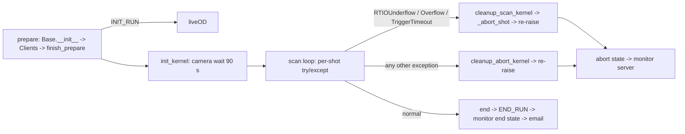

# Consolidated research report B: areas 14 (loud failures / Error Message Index), 15 (demons and wiki audit), 13 (experiments catalog)

Written 2026-09-28 by consolidation agent B for the next editor-in-chief. k-exp HEAD c8faf77 (+ docs commits), wax HEAD acc4621. Read-only research; nothing in the repos was changed.

## Coverage

| Area | Source | Depth |
|---|---|---|
| 14 Loud failures / Error Message Index | Fresh research. The salvaged transcript (`SP/salvage/14_loud_failures_transcript.md`) has 185 tool calls, no notes and no draft, so it was used only as a list of files to read. Other agents' `loud_failures` sections (reports 01, 03, 06, 08, 09, 10, 12) were cross-read and are referenced by ID. | Full index: 136 verified rows plus a troubleshooting skeleton. The 15 sections are otherwise reduced. |
| 15 Demons and wiki audit | Fresh research plus the salvaged transcript (no notes or draft). The demon sections of reports 01, 03, 08, 09 and 12 are merged here into one register by reference, not repeated. | Register, re-verification of the SLM entry, the regression-test map, and a verdict line for each of the 36 pages. Claim-level detail only for pages that no finished report audited. |
| 13 Experiments catalog | Salvaged transcript: no notes, but the stopped agent left artifacts that were reused after re-checking: `SP/a13/filestats.tsv` (per-file commit counts, first and last dates, authors from full history), `SP/a13/lint_all.json` (heuristic lint of all 488 experiment files), and full-history partial clones `SP/a13/kexp_full.git` (4334 commits) and `SP/a13/wax_full.git` (681 commits). Plus fresh reading. | Folder classification, a per-file table for the canonical folders, the main experiments, the template, ExptBuilder, OPX status and the question-bank answers. |

Conventions:
- **[C]** means confirmed (I read the code or test). **[I]** means inferred, with the reason given. **[H]** means it needs a human.
- Paths are shortened: `kexp/` = `/home/user/k-exp/kexp`, `waxx/` = `/home/user/wax/waxx-src/waxx`, `waxa/` = `/home/user/wax/waxa-src/waxa`.
- "Report NN Dk" points at demon k in `SP/reports/NN_*.md`. "B-Dk" is a demon in this report (Area 15).
- The local clones are shallow: k-exp history starts 2026-09-10 and wax history starts 2026-09-24. For older dates I used `SP/a13/*_full.git`. `git log -S` works there, and it fetches blobs lazily over the network.

---

## Area 14 — Loud failures and the Error Message Index

### 1. operator_summary
When something breaks in a way that prints a message, the message tells you which layer failed and roughly why. Most messages start with a tag in square brackets: `[LiveOD]`, `[LiveODClient]`, `[Scanner]`, `[scan]`, `[Monitor]`, `[device state]`, `[PDXC]`, `[slm]`, `[dds init]`, `[adjust]`, `[warmup]`, `[abort]`, `[end_wax]` or `[server_talk]`. The tag names the part of the code that printed it. Messages appear in four places:
- the experiment terminal (the window where you typed `ar ...`);
- the LiveOD Server window and its log;
- the Server Dashboard log dock (monitor server, interlock and other servers);
- the notebook, when you load data.

The Error Message Index below lists 136 of these messages alphabetically. Each row gives the file:line that prints it, the cause and the fix. The troubleshooting skeleton after it walks the machine from power-on to analysis. Some failures print nothing, or print something reassuring; those are demons, and they are covered in Area 15.

### 2. mental_model
Think of a run as a relay race with four runners:
1. The experiment process (host Python plus the kernel on the core device).
2. liveOD, which owns the cameras and the data file.
3. The monitor server, which owns the device-state file.
4. The hardware servers.

A loud failure is a runner shouting when the baton is dropped. Where the shout is heard tells you who dropped it. A liveOD problem is often shouted twice: once in the experiment terminal as `[LiveODClient] ...`, and once in the liveOD log with the underlying reason.


### 3. how_to
1. **Read a failed run.** Scroll up in the experiment terminal to the first tagged line, not the last traceback. For an RTIO error, the last lines of the traceback name the channel, the timestamp and the line in your experiment file. This behavior has been guaranteed since 2026-09-27 (`waxx/base/scanner.py:314-326`, commit 3a25319) [C].
2. **Find the liveOD side.** The run-tagged liveOD log is described in report 08 §3. The LiveOD Server window prints the same lines. Its terminal ignores Ctrl+C and prints `Ctrl+C ignored -- close the liveOD window to quit` (`waxx/util/live_od/console_guard.py:87`) [C].
3. **Profile a slow start.** Type `art <file>.py` instead of `ar <file>.py`. `art` is `kexp/_bat/shortcuts/art.bat`, which runs `waxx/util/profiling/startup_timer.py` with the kexp host steps. It prints a `STARTUP TIMELINE (t = seconds since this process started)` table, a `SUMMARY`, the counts of `kernels compiled:` and `RPCs served:`, the RPC bursts, and `COMPILED FUNCTIONS BY MODULE` (`startup_timer.py:306-376`) [C]. `art --check-hooks` verifies the hooks without running anything. A missing hook prints `[startup_timer] WARNING: hook targets not found (ARTIQ changed?): [...]` (:426) [C].
4. **Get more or less output.** Pass `Base(verbosity=0|1|2)` or set `WAX_VERBOSITY` (`waxx/util/console.py`). Warnings are never gated by the level [C].
5. **A run hangs after it ends.** Wait: after 60 s (30 s after an abort) the process prints every thread's stack to stderr (`waxx/base/expt.py:29-50, 430`) [C]. Send that output to a maintainer.

### 4. reference_facts
**Timeouts** (two files with overlapping names: `waxx/config/timeouts.py` and `waxa/config/timeouts.py`) [C]:

| Constant | Value | Bounds | Message when it fires | Used by |
|---|---|---|---|---|
| `INIT_KERNEL_CAMERA_CONNECTION_TIMEOUT` (waxx) | 90 s | camera-ready wait in `init_kernel` | `[LiveODClient] Camera ready timed out after 90 s (server: ...)` | `kexp/base/base.py:166` |
| `CAM_READY_SLICE_S` | 0.5 s | one WAIT_CAM_READY request (so a Reset gets through) | — | `live_od_client.py:40` |
| LiveODClient default RCVTIMEO | 5 s | every request not listed below | `[LiveODClient] No response from liveOD server at tcp://...` | `live_od_client.py:53` |
| INIT_RUN receive timeout | 60 s | file creation on the data drive | same | `live_od_client.py:262` |
| END_RUN receive timeout | 600 s | save with drive retries | same | `live_od_client.py:390` |
| `EXIT_NOTICE_TIMEOUT_MS` | 2 s | RUN_EXITED notice at exit | `[LiveODClient] exiting without END_RUN, and could not tell liveOD ...` | `live_od_client.py:42` |
| `DATA_SAVER_TIMEOUT` (waxx) | 120 s | image writer finish/release | `DataHandler did not finish within 120 s — proceeding anyway.` | `live_od/data/run_file.py:107,179` |
| `CAMERA_GRAB_TIMEOUT_BASLER_INIT` / `_RUN` | 20 s / 8 s | wait for a Basler frame | `No Basler image within ... Camera not triggered?` | `basler_usb.py:300`, `camera_host/legacy.py` |
| `CAMERA_GRAB_TIMEOUT_ANDOR` | 60 s | wait for an Andor frame | `No Andor image within 60 s (got n/N). Camera not triggered?` | `andor.py:287` |
| `CAMERA_OPEN_TIMEOUT` | 30 s | **nothing: defined (2026-07-21, ba00f0d) but no code reads it** | — | none (B-D8) |
| `CAMERA_MOTHER_CHECK_DELAY`, `_LOG_UPDATE_INTERVAL`, `UPDATE_EVERY`, waxx `DEFAULT_TIMEOUT` 120 | — | unused | — | none |
| waxa `DEFAULT_TIMEOUT` | 45 s | legacy HDF5 wait | — | `waxa/base/scribe.py:7` |
| `REMOVE_DATA_TIMEOUT` (waxa) | 10 s | legacy delete of an incomplete file | `Could not delete incomplete data within 10 s ...` | `scribe.py:165` |
| camera nanny retry | 2 s per try, a warning every 10 tries | camera open | `Can't reach camera {key}...` (forever) | `camera_nanny.py:11-13,132` |
| `T_OPX_HANDBACK_TIMEOUT` | 2 s | OPX hand-back edge | `[opx] no hand-back edge ...` | `kexp/base/control.py:33` |
| `T_ABORT_EXIT_HANG_DUMP` / `T_END_EXIT_HANG_DUMP` | 30 s / 60 s | stack dump if the process outlives abort/end | `[abort] if this process has not exited in ...` (abort only) | `waxx/base/expt.py:29-32` |
| notifications exit wait | 20 s | run-done email at exit | `Failed to send run-done notification: ...` | `waxx/util/notifications.py` (per `expt.py:30-31`) |

**Exception types a user meets** [C]:
- `TriggerTimeout` is defined in `waxx/control/exceptions.py:7`. It is kernel-raisable and carries a constant message plus int parameters.
- `RunFieldRefused` (a `ValueError`) is in `camera_param_classes.py:7`.
- The camera errors are `DeviceBusy` (`device_lock.py:49`), `FrameLostError` (a `TimeoutError`, `cameras/errors.py:1`), `HostRefused` (`camera_host/host.py:146`), and `ApplyRefused` and `ApplyMismatch` (`emccd_backend.py`).
- `LinkDownError` is in `waxx/util/link_latch.py:47`.
- The `WRITE_FAILURES` set is `("RTIOUnderflow", "RTIODestinationUnreachable", "ValueError")` (`waxx/base/scanner.py:25`).

**Which cleanup runs after an exception in a shot** (`waxx/base/scanner.py:432-490`) [C]:

| Exception in `scan_kernel` | Cleanup | Data | Re-raised? | Device state sent |
|---|---|---|---|---|
| RTIOUnderflow, RTIOOverflow, TriggerTimeout | `cleanup_scan_kernel` (writes that shot's data) | ABORT_RUN, and liveOD deletes the file (`live_od_server.py:860`). With `save_on_underflow=True` the run ends normally with n of N shots | yes, unless `save_on_underflow` | snapshot; UNTRUSTED for RTIOUnderflow (WRITE_FAILURES) |
| anything else | `cleanup_abort_kernel`: kexp's warm-up cleanup (coils off, 1064 off, raman shutter closed; commit db740a6). No shot data | the file is left open, then handled by the RUN_EXITED path (report 09 D4) | yes | snapshot; UNTRUSTED if ValueError or RTIODestinationUnreachable |
| liveOD Abort (RuntimeError from `_check_for_abort_signal` or `TerminationRequested`) | none extra | ABORT_RUN, file discarded | yes | snapshot, trusted |

### 5. expert_nuances
- **Raise vs warn for a missing liveOD depends on the internal `setup_camera`, not the one you typed.** `resolve_run_config` sets `capture_frames = setup_camera and not is_apd and not suppress_live_od` (`kexp/base/cameras.py:79-81`) and passes it to Expt as `setup_camera` (`base.py:41-45`). `Clients` raises only if that value is true (`clients.py:37-50`). An APD run therefore only warns, and the warning says `setup_camera=False` [C]. See B-D3.
- **`suppress_live_od=True` forces `save_data=False`** (`cameras.py:79-80`) [C]. So `suppress_live_od` runs never save and never print the "not saved" warning.
- **The shot handler cleans up first and then re-raises, so the traceback survives.** A caught exception cannot be passed to an RPC, so the handlers bind no names (`scanner.py:421-430`) [C]. **Exception**: if `cleanup_scan_kernel` itself raises inside the RTIOUnderflow handler, that new exception replaces the underflow. The known case is `Incorrect number of PWA acquired during the shot.` (`kexp/base/image.py:451`) when the underflow hit before the images [I from the code path; report 03 D1].
- **`raise_underflow` is ignored since 2026-09-27**, and it prints a note (`scanner.py:369-372`). Two docstrings still describe the old behavior: `waxx/control/exceptions.py:15-16` ("or it is re-raised under scan(raise_underflow=True)") and `cleanup_abort_kernel` [C].
- **`_send_abort_to_server`'s RuntimeError branch (`waxa/base/scribe.py:350-353`) is dead code.** `aborted_bool` is set only when `_abort_shot` returned True, which needs `save_on_underflow and save_data`, and the same condition makes `_send_abort_to_server` return early [I from reading `_scan` at scanner.py:387-499 and scribe.py:295-353].
- **An error before `scan()` gets no abort handling.** A camera-ready timeout, an exception in `init_kernel`, or an exception in your `run()` before `scan()` produces no abort-state report and no monitor restart. Only the Abort-during-camera-wait path restarts the monitor (`scribe.py:269-284`) [C; report 03 D9].
- **RTIO underflow causes specific to this codebase** [C where cited]:
  - **Zotino-heavy ramps.** Commit 22313b2 (2026-09-27) cut the ramp step counts (gm ramp 200→100, lightsheet 1000→200, tweezer 1000→200, rf sweep 1000→300, d1 cmot sweep 200→100). Its stated reason is to fit one hf_bec shot into the analyzer's 16,384-event ring (~25.9k → ~8.3k events), not an underflow. Fewer DAC events also means less slack consumed [I].
  - **Per-shot host work** runs during the `t_recover` slack banked by `delay(self.params.t_recover)` at the end of each shot (`scanner.py:401-407, 485`). A slow RPC (param push, liveOD SHOT_COMPLETE, adjust) eats that slack.
  - **`init_scan_kernel` drains the timeline and then calls `core.reset` at its top** (commit 4217db1, 2026-09-27).
  - **Stale TTL input events.** `cleanup_scan_kernel_wax` calls `self.ttl.clear_input_events()` every shot, because a stale event in a TTLInOut FIFO makes the next gate return at once and the following trigger wait underflow (`waxx/base/expt.py:211-219`). This answers E19.
  - **Line-trigger waits** now raise `TriggerTimeout` instead of the underflow the old re-gating loop produced (`TTL.py:121-135`).
  - **SLM writes** park the kernel: `SLM_RPC_DELAY = 0.25` s after `wait_until_mu(now_mu())` (`waxx/control/slm/slm.py:11,107-109`).
- **Terminal output is ASCII-only in several places, because ExptBuilder pipes stdout through cp1252.** See `live_od_client.py:46,202,221`, `expt.py:284`, `scanner.py:753`, and Area 13 §5.
- **The camera-override banner is printed twice**: at INIT_RUN, and again once the camera is armed (`live_od_client.py:273, 314`) [C].
- **`[Monitor] ... UNTRUSTED` is decided on the host from the exception name** (`expt.py:355`). With `save_on_underflow=True` the handler does not re-raise, so the run's end state goes through `end()` and is **trusted** even though a write underflowed [I; report 03 D8].

### 6. loud_failures — the Error Message Index

**Where you see it:**
- T = experiment terminal
- L = LiveOD Server window/log
- M = monitor server log (Server Dashboard log dock)
- I = interlock panel/log
- D = Device Control GUI
- G = other GUI dialog
- S = SLM server window on the SLM PC (192.168.1.102)
- N = notebook/analysis

Every row is **[C]**: I read the line that raises or prints it, except the ARTIQ-runtime row, which is marked. `{x}` marks an f-string field, and ⏎ marks a newline in the message. The rows are sorted by the first distinctive word, ignoring `[tag]`, `!!`, `***` and a leading `WARNING:`. "Related" points to a demon (B-Dk in Area 15, NN-Dk in report NN) or a question-bank item.

| # | Message (template) | Where you see it | Raised / printed at | Cause | Fix | Related |
|---|---|---|---|---|---|---|
| 1 | `A lite copy does not exist for run ID {rid}. Load the regular data or create a lite copy first.` | N (ValueError) | server_talk.py:102-103 |  |  |  |
| 2 | `A monitor server for '{server_id}' is already running at {ip}:{port}. Refusing to start a second server for the same hardware.` | G (dialog `Monitor server already running`) | waxx/util/guis/monitor_server_gui.py:1010-1015 | Windowed monitor server while the headless one runs. | Use the dashboard's. | 01-D12 |
| 3 | `A move of {t_move} s at dt = {dt} s needs {N} AWG steps (max {M}).` | T (ValueError) | spectrum_DDS_tweezer.py:387 |  |  |  |
| 4 | `Abort requested {n} s ago and no answer from the experiment (limit {m} s, from the shot period): its process may be gone or hung. It is still told to stop; the next run start discards its file, as for any abort.` | L (status `No reply`) | live_od_server.py:1324-1329 | Experiment died/hung (run 83110). | Kill the process. |  |
| 5 | `Acquisition for run {rid} aborted.` | T (RuntimeError) | waxa/base/scribe.py:261 | liveOD Abort seen at the top of the scan loop. | Expected; state reported via scan handler. |  |
| 6 | `adiabatic ramp cannot go to zero power` | T (ValueError) | waxx/control/artiq/ramp_math.py:142 | End power 0. |  |  |
| 7 | `Warning: adjust key 't_tof' is already an xvar; skipping adjust registration.` | T | waxx/base/scanner.py:195 | adjust() after xvar() on the same key (since 2026-07-16, f7de097). | Nothing: the xvar wins; remove the adjust. |  |
| 8 | `adjust key 'x' already registered.` | T (ValueError) | waxx/base/scanner.py:193 | Two adjust() calls. | Remove one. |  |
| 9 | `[adjust] WARNING: adjustable params detected with save_data=True. Values changed in the Adjust panel between shots will NOT be reflected in saved data.` | T; liveOD logs `Adjustable params are active with save_data=True. ...` | waxx/base/expt.py:195-199; live_od_server.py:1021 | adjust() used on a saving run. The file stores one end-of-run value per param. | Use save_data=False for tuning, or xvar for a record. | E16 |
| 10 | `amplifier mode {described} is not available on this camera; nothing was sent. (hs_speed, preamp) offered for output amp {amp}: {offered}` | L (AmpModeUnavailable) | waxx/control/cameras/andor.py:633-634 | hs_speed/preamp pair not offered. | Pick an offered pair in camera_id. | E20 |
| 11 | `Andor frame(s) {lost} of {N} were overwritten in the SDK ring buffer before they were read (got {n}); later frames kept their own index.` | L (FrameLostError) | andor.py:307-309 |  |  |  |
| 12 | `AndorParams.frame_transfer = 1 is refused: frame transfer is never used: with an external trigger the exposure becomes the time between triggers, so the recorded exposure_time would be false (Andor SDK2 manual p.55)` | T (RunFieldRefused, a ValueError) | waxx/control/cameras/camera_param_classes.py:12 (template), :97-101 | Raised in prepare_image_array inside init_xvars, before INIT_RUN (scanner.py:714-722; expt.py:160 vs :174): no run id used. | Set frame_transfer=0 (kexp/config/camera_id.py). | E15 |
| 13 | `AndorParams.sensor_roi = (...) is refused: binning 2x2 is not accepted, only bin 1 (binning scales the atom number by the bin factor); the only accepted value is (...)` | T (RunFieldRefused) | camera_param_classes.py:104-112 (also `only the full frame ... is accepted in this build (a crop moves every analysis ROI)`) | Crop or binning requested. | Full frame, bin 1. |  |
| 14 | `AndorParams.trigger_mode = 'int' is refused: runs accept only ... (one frame per TTL edge); ext_start free-runs after the first edge, ext_exp exposes while the TTL is high, and the other modes are unsupported` | T (RunFieldRefused) | camera_param_classes.py:85-89 | Non-`ext` trigger for a run. | trigger_mode='ext'. |  |
| 15 | `Another interlock_server is already running (mutex held)` | I | interlock_service.py:215 |  |  |  |
| 16 | `Attempted to set dac ch {key} to a voltage > specified maximum voltage ({max_v:1.3f}) for that channel. DAC voltage was replaced by zero for these instances.` | T (async print, run continues) | waxx/control/artiq/DAC_CH.py:23 (text), printed via :40-42 from set() :30-32 and ramps :70-72 | v > max_v (9.99 V default; e.g. outer_coil_supply_current 7 V, kexp/config/dac_id.py:29). set() WRITES 0 V; a ramp is skipped. | Fix the value; treat that run's channel as 0 V. | B-D4 |
| 17 | `Both the xy and x imaging fibers are currently derived from the PID setup (as of 2026-02-17)` | T (ValueError) | kexp/base/devices.py:252 | Unsupported imaging configuration. |  |  |
| 18 | `camera host: Persist ON for {key} at {t}: {shown} will replace the experiment's camera_params in every run on {key} until Persist is turned off (restarting liveOD turns it off)` | L (host mode only) | waxx/util/live_od/camera_host/host.py:1397-1399 |  |  |  |
| 19 | `Camera is {n} frame(s) behind after shot {i}/{N} ({got} received, {due} due from the shots before it). A trigger the camera was not ready for leaves no gap: every later frame lands one slot early. If this does not clear, the run will be saved as incomplete.` | L | live_od_server.py:1204-1210 |  |  | 08 |
| 20 | `CAMERA OVERRIDE: run {rid} on {camera}: {key} requested {req!r} -> applied {app!r} ({origin}); camera_params in the file stay the request` | L | live_od_server.py:397-399, :715-718 | Camera clamped a value. | Read camera_overrides. | N17 |
| 21 | `[LiveODClient] Camera ready failed: {error}` | T (ValueError) | live_od_client.py:318-321 | Fast failure from liveOD: `camera failed before it was ready: ...` (live_od_server.py:1063-1064), `Basler previous grab-loop exit timeout` (:1083), an arm error, or stale_run. | Fix the named camera problem (E20). | E20 |
| 22 | `[LiveODClient] Camera ready timed out after 90 s (server: Camera ready timeout).` | T (ValueError from init_kernel) | live_od_client.py:297-301; wait = INIT_KERNEL_CAMERA_CONNECTION_TIMEOUT 90 s (waxx/config/timeouts.py:27, kexp/base/base.py:166) | Camera never armed (not open, held elsewhere, grab-drain). | Look in the liveOD log for the camera line; then Run MOT Observe (the monitor is not restarted on this path). | 03-D9, 08-D5 |
| 23 | `!! CAMERA SETTINGS DIFFER FROM camera_params ({camera}): ⏎ !!   {key}: requested {req!r} -> applied {app!r} ({origin}) ⏎ !! The run file records this in its root attribute camera_overrides; ⏎ !! camera_params/ in the file is the request, not what the camera ran.` | T | live_od_client.py:199-214 |  |  | N17 |
| 24 | `{camera}: camera timed out. {e} Ending this run's grab. The frames that arrived are kept; the run will be saved as incomplete.` | L | waxx/util/live_od/camera_mother.py:362-363 |  |  |  |
| 25 | `CAMERA_CONTROL rejected ({key} -> {action}): run in progress (uses {cam})` | L | live_od_server.py:1406 |  |  |  |
| 26 | `Can't open data. Is another process using it?` | T | waxa/base/scribe.py:74, :187 | HDF5 file busy. | Close HDFView/notebooks. | 09-D11 |
| 27 | `Can't reach camera {key}. Make it available to continue, or abort the run.` | L (every ~20 s) | waxx/util/live_od/camera_nanny.py:132 | Camera cannot open; retried forever (CAMERA_OPEN_TIMEOUT 30 s is defined but unused). | Free/plug the camera or Abort. | 08-D5, B-D8 |
| 28 | `[Monitor] composite op {op} #{seq} refused: {message}` | M; Device Control Composite tab | waxx/base/monitor.py:671; refusal texts in kexp/config/composite_devices.py (e.g. `coil is on` :1177, `coil PID is on` :1109, `the PID overhead would take the supply DAC past its limit` :1160, `z shim is not at 0 V` :1503, `H-bridge is in Helmholtz` :1625, `inner coil above the MOT current` :1630, `beat reference above the DDS's 400 MHz` :370, `Raman AO frequency outside the DDS range` :530) | Guard refused the op. | Change state first. |  |
| 29 | `[Monitor] composite ops DISABLED for this monitor session: {reason}. The Composite tab will refuse ops; channel control is unaffected.` | M | waxx/base/monitor.py:531-532 | Bad composite definition etc. |  |  |
| 30 | `[Monitor] note: could not announce this run to the monitor server ({e!r}); composite ops are not fenced for it.` | T | waxx/base/expt.py:208-209 (also monitor.py:285-286 `... (server unreachable) ...`) | announce_run failed. | GUI composite ops may run during your run: don't click. | 03-D6 |
| 31 | `Could not apply the run's settings to camera {key}: {e}` | L | camera_nanny.py:256 | Refused/unsupported setting → DummyCamera → WAIT_CAM_READY fails at once. | Fix kexp/config/camera_id.py. | E20 |
| 32 | `[LiveOD] Could not connect to LiveOD server: {e} ⏎ Check that the LiveOD server window is running on the control PC. ⏎ To run without a LiveOD server, pass suppress_live_od=True (and setup_camera=False) to Base.__init__.` | T (RuntimeError in prepare) | kexp/base/clients.py:45-50 | LiveODClient() discovery/connect failed while this run captures frames (camera + setup_camera=True). | Start LiveOD Server on kong; check it beacons as `live_od:<octet>` for your `%db%`; or `suppress_live_od=True` for a no-imaging run. | B-D3 |
| 33 | `[LiveOD] WARNING: Could not connect to LiveOD server: {e} ⏎ Running experiment without LiveOD (setup_camera=False).` | T | kexp/base/clients.py:38-43 | Same failure, but capture_frames is False: setup_camera=False OR camera_select=cameras.apd (resolve_run_config, kexp/base/cameras.py:79-81). | If you wanted data: start liveOD and rerun. An APD run prints this although you passed setup_camera=True. | B-D3 |
| 34 | `Could not delete incomplete data within 10 s (still held open by another handle): {path}` | T (TimeoutError) | waxa/base/scribe.py:165-167 | Legacy delete path, file open elsewhere (run 80704). |  |  |
| 35 | `[device state] *** could not read the device state from the monitor server ({error}); nothing was checked before this run. ***` | T | kexp/base/base.py:133-134 + waxx/util/device_state/run_stamp.py:69-71 | Pre-run stamp could not reach the monitor server. (hazard/untrusted lines kept off the terminal since 2026-09-27, commit 163c232). | Check the Monitor server; the run itself is unaffected. |  |
| 36 | `[Monitor] WARNING: could not report run {rid}'s device state at the abort ({e!r}); the device state stays untrusted.` | T | waxx/base/expt.py:368-370 |  | Run MOT Observe. |  |
| 37 | `Ctrl+C ignored -- close the liveOD window to quit` | L | waxx/util/live_od/console_guard.py:87 (template `{name} ignored -- ...`) | Ctrl+C/Ctrl+Break in the liveOD console. | Close the window. |  |
| 38 | `DAC ch {ch} not assigned in dac_id.` | T (ValueError) | waxx/config/dac_id.py:61 | Lookup of unassigned channel. |  |  |
| 39 | `DAC channel {ch} is forbidden.` | T (ValueError) | waxx/config/dac_id.py:41 | Forbidden channel in frame. |  |  |
| 40 | `Data dir ({dir}) not found. Attempting to re-map network drives.` | T/L/N | server_talk.py:149 (then `Data dir still not found. Are you connected to the physics network?` :153) | B: not mapped. | Map B:. | 09-D6 |
| 41 | `Data file creation took {dt} s — is the data drive slow?` | L | live_od_server.py:919 |  |  |  |
| 42 | `Data file with run ID {rid} was not found.` | N (ValueError) | server_talk.py:105, :406 |  |  |  |
| 43 | `Data file {filepath} has no 'data' group — file creation never completed, so no run data can be saved.` | L (ValueError) | data_saver.py:656-658 |  |  |  |
| 44 | `Derived parameters were not updated.` | T (after `print(e)`) | waxx/base/scanner.py:671-677 | compute_derived failed on the xvar lists at end of run. | Saved derived params are those of the last shot. | B-D6 |
| 45 | `EM gain {g} is outside 0..{max} (never above {max}, never advanced mode)` | L (ApplyRefused) | emccd_backend.py:283-284 |  |  |  |
| 46 | `END_RUN: run {rid} was reset — discarding data.` | L | live_od_server.py:1223 | Abort pressed (even just after the last shot). |  | 08-D2 |
| 47 | `END_RUN: run_id={rid} saved INCOMPLETE ({reason}). The file is marked data_complete=False; its images are in arrival order and do not line up with the shots.` | L; T `!! RUN SAVED INCOMPLETE: ...` block | live_od_server.py:1260-1263; live_od_client.py:400-409 |  | Do not analyze as complete. |  |
| 48 | `END_RUN: save of run {rid} failed: {error}` | L; T `[LiveODClient] END_RUN failed: {error}` | live_od_server.py:1247; live_od_client.py:393-395 |  | Check B:; a stash may exist. | 09-D16 |
| 49 | `Entering SAFE MODE: {reason}` | I (CRITICAL); panel `SAFE MODE` | interlock_service.py:253; reasons interlock_safe_mode.py:38-40 | Bad COM port / relay unreachable at boot / watchdog. |  |  |
| 50 | `[slm] Error sending phase mask: {e}` | T | waxx/control/slm/slm.py:81-82 | TCP connect/send to 192.168.1.102:5000 failed; swallowed. | Start the SLM server; the run continued with the old pattern. | SLM |
| 51 | `Error: Failed to load LUT!` | S | waxx/control/slm/server/slm_server.py:211 (then exit() :213) | SDK in simulation mode (Remote Desktop) — worker thread dies, listener keeps accepting. | See Demons: SLM. | SLM |
| 52 | `[LiveODClient] exiting without END_RUN ({reason}); liveOD was told.` | T | live_od_client.py:183-185 (failure variant :186-188) | atexit notice. |  |  |
| 53 | `exponential ramp needs 0 < \|tau\| < 1000*t` | T (ValueError) | waxx/control/artiq/ramp_math.py:96 | Bad tau. |  |  |
| 54 | `{label} *** {what} FAILED -- hardware NOT updated ({type}: {e}) ***` | T | waxx/control/misc/sdg6000x.py:197 | Siglent LAN write failed; re-sent when the link returns (test_sdg6000x_link). | Check the Siglent link. |  |
| 55 | `Failed to connect to HMR Magnetometer server: {e}` | T | kexp/base/clients.py:31 | HMR server unreachable; HMRDummy substituted (clients.py:32). | Start HMR Magnetometer server; field is recorded as 0 for this run. | 03-D7, 09-D14 |
| 56 | `Failed to connect to Monitor: {e}` | T | kexp/base/clients.py:22 | Monitor() construction failed. | Start the Monitor server (Server Dashboard). The run goes on with no fence, no stamp, no end state. | 03-D6 |
| 57 | `Failed to send run-done notification: {exc}` | T (logger warning) | waxx/util/notifications.py:115 | Gmail credentials/network. |  | 03-D14 |
| 58 | `GM ramp v_pd lists must be of the same length.` | T (ValueError) | kexp/base/cooling.py:789 |  |  |  |
| 59 | `hs_speed {h} with preamp {p} is not an amplifier mode of this camera (output amp 0; offered (hs_speed, preamp): [...])` | L (ApplyRefused, host mode) | waxx/control/cameras/emccd_backend.py:295-297 |  |  | E20 |
| 60 | `[abort] if this process has not exited in {s} s, its thread stacks will be printed here to show what is holding it up.` | T (stderr), then Python thread stacks | waxx/base/expt.py:45-47 (abort: 30 s, :29); after end() armed silently at 60 s (:32, :430) | Hang after an abort/end (run 83102). | Send the stacks. |  |
| 61 | `Ignoring malformed command.` | S | run_server.py:207 |  |  |  |
| 62 | `Incorrect number of PWA acquired during the shot.` | T (ValueError) | kexp/base/image.py:451 | cleanup_image_count: the shot's image count does not match N_pwa_per_shot (no abs_image, two images) — or a shot underflowed before its image and the cleanup in the underflow handler raised this, hiding the underflow. | Count image calls in scan_kernel; if the shot underflowed, see 03-D1. | 03-D1 |
| 63 | `{label} init failed: {reason}` | T (RuntimeError) | awg_connection.py:191-192 |  |  |  |
| 64 | `[LiveODClient] INIT_RUN failed: {error}` | T (RuntimeError) | waxx/util/live_od/live_od_client.py:264-266 | liveOD refused the run: e.g. `INIT_RUN refused (no run id used): camera andor: ...` (live_od_server.py:596-597) or the data file could not be created (:912). | Read the liveOD log line with the same text. |  |
| 65 | `INIT_RUN refused before a run id was reserved: camera {key}: {reason}` | L | live_od_server.py:594-597 | Camera host could not lock the camera. |  |  |
| 66 | `INIT_RUN while run {rid} is still in progress: that run is superseded; its further messages will be ignored.` | L | waxx/util/live_od/live_od_server.py:926-927 | A second run started (hung old process). |  | E10 |
| 67 | `INIT_RUN: could not create data file: {exc}` | L | live_od_server.py:912 |  | Check %data% / B:. | 09-D12 |
| 68 | `interlock snapshot: {message}` | D (measured field) | kexp/util/guis/device_state_gui/telemetry_providers.py:95 (liveOD: `liveOD POLL: {reply!r}` :128) |  |  |  |
| 69 | `{description} is held by pid {pid} ({exe}, {label}) since {time}` | L/G (DeviceBusy) | waxx/control/cameras/device_lock.py:204-205 | Another process (Basler server, Camera Viewer, spot finder) holds the camera. | Close that holder. | 08-D7, 08-D8 |
| 70 | `{label} is in use ({holder}); waiting up to {t} s for it to be released` | T / M | waxx/control/tweezer/awg_connection.py:178 | Another process holds the Spectrum card. | Close the holder (monitor server holds the AWG between runs). |  |
| 71 | `[Monitor] JSON has new device keys not known to running monitor — DDS: [...], DAC: [...], TTL: [...]. Signaling restart — the restart reconciles the state file against the device frames.` | M | waxx/base/monitor.py:995-998 |  |  |  |
| 72 | `Key contains forbidden characters.` | T (ValueError) | waxx/base/scanner.py:152 | xvar key contains one of `: , . space - + ( ) @ # $ % ^ & * = ! [ ] ; / \\ ` ~` (list :150). | Use an identifier. |  |
| 73 | `*** {name}: link down ({error!r}). Calls will be skipped and retried every {n} s. ***` | T | waxx/util/link_latch.py:55 (`{name}: link back.` :64; LinkDownError :47) | LinkLatch tripped (Siglent, wavemeter). | Readings in between are 0./skipped. | 09-D14 |
| 74 | `[LiveODClient] {error} -- liveOD is serving a newer run; this run is stopped and nothing more of it is recorded.` | T | live_od_client.py:358-364 (`liveOD does not know this run (was it restarted?)` :359) | Run token superseded. |  | E10 |
| 75 | `!! liveOD: THE CAMERA STOPPED RECORDING THIS RUN ⏎ !!   {reason} ⏎ !! The frames of the shots from here on are NOT recorded. The run is not ⏎ !! stopped by this: END_RUN will save what arrived, marked ⏎ !! data_complete=False. Abort the run if its images matter.` | T (once per run) | live_od_client.py:216-231 | Grab ended early (camera timeout/lost frame). | Abort if images matter. |  |
| 76 | `Monitor cannot be started as configured: {problem}` | M | waxx/util/guis/monitor_server_headless.py:80 (gui :1051) | Preflight (paths). |  |  |
| 77 | `MonitorController could not reach the monitor server. Make sure the monitor server is running on the experiment PC.` | T / N (RuntimeError) | waxx/util/device_state/monitor_controller.py:178-181 |  |  |  |
| 78 | `[hardware_id] No 'monitor' server discovered on the subnet and no hardware id available (env var 'db' unset). Start the server, or set 'db' to this branch's device_db.py.` | T/G (RuntimeError) | waxx/util/comms_server/hardware_id.py:169-172 (multiple servers: :174-177) |  | Set %db%. | 01-D9 |
| 79 | `No camera TTL mapping found for camera key '{key}'.` | T (ValueError) | kexp/base/cameras.py:134-137 | New camera key without a TTL case. | Add it to choose_camera. |  |
| 80 | `No completed data files were found.` | N (ValueError) | server_talk.py:97, :114 |  |  | E11 |
| 81 | `[PDXC] WARNING: no connection to the PDXC stage server: {e} ⏎        APD stage control is disabled for this run. Start the PDXC server on the control PC if you need it.` | T | kexp/control/misc/pdxc_apd_stage.py:41-43 | PDXC server not discovered. | Start PDXC Picomotor in the Server Dashboard. | 01-D7, 03-D15 |
| 82 | `No device-state config path was passed: state reads/writes from the Device Control GUI will all fail with 'no config path'. ...` | M | monitor_server_headless.py:69-75 | Unset env var / unmapped drive. | Map B:, restart. |  |
| 83 | `[opx] no hand-back edge on quantum_machines_receive_trigger within T_OPX_HANDBACK_TIMEOUT of the trigger: the OPX job is not running, is not seeing the trigger, or its shot is longer than the timeout. ARTIQ RF and the handoff TTL are back off.` | T, then TriggerTimeout `no OPX hand-back edge on ttl{0} within the timeout` | kexp/base/control.py:317-324 (T_OPX_HANDBACK_TIMEOUT = 2 s, :33) | OPX program not running / not triggered / too long. | Start the OPX job (needs a human: OPX side not on main). |  |
| 84 | `No liveOD server connection found. Start the liveOD GUI before running experiments.` | T (RuntimeError) | waxx/base/expt.py:183-187 | Only when save_data and setup_camera are both true and no client exists; in kexp Clients raises first (clients.py:45), so unreachable for Base. | — |  |
| 85 | `[LiveOD] WARNING: No liveOD server connection — data will not be saved (setup_camera=False).` | T | waxx/base/expt.py:188-192 | save_data=True, no liveOD client. Nothing is saved; run id stays 0. | Start liveOD, rerun. | B-D3 |
| 86 | `[LiveODClient] No response from liveOD server at tcp://{ip}:{port}. Is liveOD running?` | T (ConnectionError) | live_od_client.py:127-130 | No reply within RCVTIMEO (5 s default :53; 60 s INIT_RUN :262; 600 s END_RUN :390); client rediscovers. | Check liveOD; an INIT_RUN that timed out may leave an orphan run. | 08-D6 |
| 87 | `no rising edge on ttl{0} within the gate window` | T (TriggerTimeout) | waxx/control/artiq/TTL.py:133-135 | Line trigger missing within one ~60 Hz window. | Check the line-trigger cable/TTL input. | E19 |
| 88 | `No {key} image within {t} s (got {got}/{n}). Camera not triggered?` | L (TimeoutError) | camera_host/legacy.py:188; Basler basler_usb.py:300; Andor andor.py:287 (grab timeouts 20/8/60 s, waxx/config/timeouts.py:36-39) | No trigger reached the camera. | Check trigger TTL/cable. |  |
| 89 | `[PDXC] WARNING: not connected -- skipping {what}.` | T | kexp/control/misc/pdxc_apd_stage.py:52 | Stage move skipped because the server was absent at start. | As above; the stage is wherever it was. | 03-D15 |
| 90 | `Only one of default_detuning and default_freq must be set in dds_id.py.` | T (ValueError) | waxx/config/dds_id.py:139 | dds_assign given both. |  |  |
| 91 | `param 'x' does not already exist, so a dtype or default_val must be provided` | T (ValueError) | waxx/base/scanner.py:182-184 | adjust() on a new param with no default. | Pass default_val. |  |
| 92 | `[DataSaver] WARNING: params/{key} not stored ({type} value): {exc}` | L | waxa/data/data_saver.py:558 (camera_params: :567) | h5py cannot store the value (test_params_store_warnings). |  | 09-D5 |
| 93 | `PLC data stale: age={age}s threshold={thr}s` | I (ERROR) | interlock_service.py:645 | No valid PLC frame. | Check COM5/PLC. |  |
| 94 | `Queue full: dropped one stale task to enqueue latest APPLY.` | S | waxx/control/slm/server/run_server.py:238 | 256 queued commands (CMD_QUEUE_MAXSIZE :16): the worker is dead or stuck. | Restart the server with server.bat. | SLM |
| 95 | `[OP] {op} refused: the monitor is {state} ({sub}) -- composite ops run only ...` | M | waxx/util/guis/monitor_server_gui.py:420-442 | Monitor not READY / run fenced. |  |  |
| 96 | `Requested siglent freuqency exceeds configured maximum, setting to max.` | T (aprint; sic) | waxx/control/misc/sdg6000x.py:296 (min: :299) | Clamp; the params keep the request. | Check the channel limits. |  |
| 97 | `reset refused (PLC still tripped) from {addr}` | I | interlock_service.py:447 (safe mode: :439) |  |  |  |
| 98 | `RTIOUnderflow (ARTIQ core-device exception: channel, timestamp, slack)` | T (core traceback, re-raised) | ARTIQ runtime [exact text needs a human]; handled at waxx/base/scanner.py:432-441 | An event was submitted after its timestamp: too little slack (heavy ramps, RPCs, missing break_realtime). Causes seen here: see RTIO block below. | Read the kernel line in the traceback; add slack; fewer ramp steps (22313b2). | 03-D1 |
| 99 | `[Scanner] RTIOUnderflow on run {rid}: save_on_underflow=True — proceeding to analyze() to save partial data.` | T | waxa/base/scribe.py:344-345 | save_on_underflow run ends normally with the shots taken. | Check `run id ... ended ... after n of N shots`. | 03-D8 |
| 100 | `[Scanner] RTIOUnderflow: run {rid} aborted after cleanup; the original exception and its traceback follow.` | T | waxa/base/scribe.py:314-315 | Shot ended on RTIOUnderflow/RTIOOverflow/TriggerTimeout without save_on_underflow: ABORT_RUN sent, liveOD deletes the file (live_od_server.py:860). | Fix the cause; or Base(save_on_underflow=True) to keep shots taken. | E5 |
| 101 | `run id file at {path} is empty -- extracting from latest data file` | L | server_talk.py:467 |  |  |  |
| 102 | `run id {rid} ended at {date time} after {n} of {N} shots  ({expt})` | T | waxx/base/expt.py:437-442 | Partial run (save_on_underflow). | — |  |
| 103 | `[server_talk] WARNING: run ID {rid} maps to {n} data files: [...]. Loading {first}. This indicates a run_id collision.` | N | waxa/data/server_talk.py:380-384 | Two files with one id (two liveOD servers, edited run_id.py). | Load by path. | E12 |
| 104 | `[Monitor] run {rid} aborted ({cause}): its device state at the abort went to the monitor server (trusted).` | T | waxx/base/expt.py:365-367 | Clean abort (Abort button, TriggerTimeout, RTIOOverflow...). |  |  |
| 105 | `[Monitor] run {rid} aborted ({cause}): its last commanded device state went to the monitor server, marked UNTRUSTED -- a channel write that raised {failed} may not have reached the hardware, so that channel can differ. Check that channel, then Trust state on the Device Control GUI.` | T | waxx/base/expt.py:361-364; WRITE_FAILURES = RTIOUnderflow, RTIODestinationUnreachable, ValueError (scanner.py:25) | Run ended on a write failure. | Check the channel; Trust state or Run MOT Observe. | E14 |
| 106 | `!! RUN {rid} IS INCOMPLETE: {reason}` | N | waxa/atomdata_base.py:481-495 | data_complete=False. |  |  |
| 107 | `Run {rid} reset while waiting for the camera -- aborting.` | T, then RuntimeError `Acquisition for run {rid} aborted.` | waxa/base/scribe.py:283-284 | Abort pressed during the camera wait. | Expected. Device state stays untrusted (no scan handler). |  |
| 108 | `!! run {rid}: camera settings differ from ad.camera_params (the request): {key} {req} -> {app} ({origin})` | N | waxa/atomdata_base.py:511-513 |  |  | N17 |
| 109 | `RUN_EXITED: run {rid}: The experiment's process exited without END_RUN ({why}). Its file is left as it was: not saved, not deleted.` | L (status `Exited`) | live_od_server.py:1361-1364 | Crash/Ctrl+C/no analyze(). |  |  |
| 110 | `[scan] scan(raise_underflow=True) is no longer needed and is ignored: an aborted shot is always cleaned up, and the original exception is re-raised with its traceback (2026-09-27).` | T | waxx/base/scanner.py:369-372 | Old argument. | Remove it. |  |
| 111 | `[end_wax] WARNING: scope_data.close() raised: {e} — continuing.` | T | waxx/base/expt.py:393 |  |  |  |
| 112 | `[Monitor] WARNING: setting {dtype}.{name} {what} raised on the core (underflow or bad value). The state file shows the requested value; the hardware may not have it -- use Force update on that channel.` | M | waxx/base/monitor.py:1152-1154 |  | Force update. | 07 |
| 113 | `[scan] shot aborted: a triggered wait saw no edge (TriggerTimeout, see the line above). Cleaning up and ending the run.` | T | waxx/base/scanner.py:444-446 | Gated input wait closed with no edge. | See the TriggerTimeout text above it. |  |
| 114 | `[scan] shot aborted: an RTIO input FIFO overflowed (RTIOOverflow) -- a TTL input is toggling far faster than expected. Cleaning up and ending the run.` | T | waxx/base/scanner.py:457-459 | Bouncing/free-running TTLInOut inside a gate. | Check the input signal. |  |
| 115 | `[{name}] siglent read failed, recording 0.: {e!r}` | T | kexp/control/rydberg_lasers.py:116 (wavemeter: :126) | Lock read failed; 0. stored (test_rydberg_lock_read). | Treat 0. as 'not read'. | 09-D14 |
| 116 | `Skipped: command queue not empty.` | S (hourly) | run_server.py:154 | Hourly REINIT skipped: commands pending (dead worker if persistent). |  | SLM |
| 117 | `The amplitudes in the trap list sum to a value >1 ({ampsum})` | T (ValueError) | waxx/control/tweezer/spectrum_DDS_tweezer.py:753 |  |  |  |
| 118 | `Warning: The argument 'absorption_image' is depreciated -- change it out for 'imaging_type' ⏎ Defaulting to absorption imaging.` | T | waxx/base/expt.py:81-83 | Legacy kwarg; its value is ignored (absorption_image=False does not give fluorescence). | Pass imaging_type=. |  |
| 119 | `[Monitor] WARNING: the monitor server did not accept this run's end state ({msg}); the device state file still describes the hardware as it was BEFORE this run.` | T | waxx/base/monitor.py:196-198 |  | Run MOT Observe. |  |
| 120 | `[device state] WARNING: the pre-run device-state check failed ({e!r}); nothing was checked and nothing is stamped.` | T | kexp/base/base.py:130-131 | Exception inside pre_run_report. | Report; run proceeds. |  |
| 121 | `The requested camera with key {key} was not found.` | T (ValueError) | kexp/base/cameras.py:37 | camera_select string not a key of `cameras`. | Use a key in kexp/config/camera_id.py. |  |
| 122 | `the {label} is not connected ({state}: {detail})` | D (ConnectionRefusedError) | waxx/util/device_state/connections.py:286-288 | Held connection (AWG) not up. |  |  |
| 123 | `There was an issue opening the requested camera (key: {key}): {e}` | L | camera_nanny.py:293 |  |  |  |
| 124 | `Timeout before Grabber frame available` | T (GrabberTimeoutException) | waxx/control/artiq/Grabber.py:67 |  |  |  |
| 125 | `TRIPPING INTERLOCK: {reason}` | I (CRITICAL) | kexp/util/guis/interlock/interlock_service.py:678 | PLC `I TRIPPED` or stale data. | Find the cause; Reset (refused while PLC tripped, :447). |  |
| 126 | `Unable to extract fit parameters. The gaussian fit must have failed` | N | waxa/atomdata_base.py:2505-2506 |  |  |  |
| 127 | `[adjust] unit detection failed for 'x': {exc}` | T | waxx/base/scanner.py:231 | Display-unit guess failed; value stays SI. | Pass unit=. |  |
| 128 | `Unknown mask; set to default spot.` | S | run_server.py:269-271 | mask 'cross' (allowed by the client, slm.py:59-60) is not known to the server. |  |  |
| 129 | `[DataSaver] WARNING: 'unshuffle_in_progress' is set on {filepath} — a previous save died partway through the in-place rewrite, so shot ordering of data/images and of externally-written DataVault arrays is UNRELIABLE. ...` | L | data_saver.py:678-682 |  |  |  |
| 130 | `[dds init] WARNING: urukul {u} ch {ch} failed its check ({reason}, raw {raw}) -- running the full AD9910 init on it.` | T | waxx/control/ad9910_fast_init.py:254-255 | Fast-init check failed (only when force_dds_init=False; default is True since 2026-09-22). | None; informational. | 03-D2 |
| 131 | `wait_for_camera_ready: no LiveOD server connection (live_od_client is not set) but setup_camera=True. The legacy HDF5-polling path is no longer supported ...` | T (RuntimeError) | waxa/base/scribe.py:94-100 | Only with a hand-built Base that skipped Clients. | Start liveOD. |  |
| 132 | `[PDXC] WARNING: {what} failed: {e} ⏎        Continuing without APD stage control.` | T | kexp/control/misc/pdxc_apd_stage.py:68-69 | Stage call failed on a suppress_live_od run (other runs raise, :66-67). | Check the PDXC server. |  |
| 133 | `{label}: *** {state} within {timeout} s{when}. Not waiting any longer; the netbox frees the card when this process's connection drops. ***` | T | awg_connection.py:256-258 | spcm close hung (run 83101). | Exit the process. |  |
| 134 | `xvar key 't_tof' is already registered as an adjust param.` | T (ValueError) | waxx/base/scanner.py:131 | adjust('t_tof') came before xvar('t_tof'). | Use one or the other. |  |
| 135 | `xvar of key t_tof is assigned more than once.` | T (ValueError) | waxx/base/scanner.py:134 | Two xvar() calls with one key. | Remove one. |  |
| 136 | `You indicated more than one PWA per shot, but the analysis is set to absorption imaging. Setting # PWA to 1.` | T | waxx/base/scanner.py:686-688 | N_pwa_per_shot>1 with ABSORPTION. | Use fluorescence for multi-PWA. |  |

**ARTIQ runtime errors as they reach our code** (exact texts come from ARTIQ, which is not installed in this container: [H] for the literal wording):

| Error | Our handling | Our usual causes | First thing to check |
|---|---|---|---|
| `RTIOUnderflow` | shot cleanup, ABORT_RUN, re-raise; the state is UNTRUSTED (table above) | slack eaten by host RPCs between shots; many Zotino events (ramps; 22313b2); events scheduled right after a gated wait; a kernel that syncs to real time without `break_realtime` | the kernel line in the traceback; `art` timings |
| `RTIOOverflow` | the same, plus `[scan] shot aborted: an RTIO input FIFO overflowed ...` | a TTL input toggling during a gate | the input signal |
| `RTIODestinationUnreachable` | `cleanup_abort_kernel`, re-raise, UNTRUSTED | DRTIO satellite link lost | crate power and fibres; the ethernet relay controls satellite power [H] |
| `TerminationRequested` | raised by `shot_complete` after an Abort (`expt.py:262-265`) | the liveOD Abort button | expected |
| compile errors (unification, missing attribute) | none: host traceback before any kernel runs | e.g. `default_experiments/hf_raman.py` reads `self.p.t_raman_pulse`, which is not defined in ExptParams at HEAD (grep of `kexp/config`, `waxx/config`: no assignment) [C: attribute absent; I: fails at compile] | the attribute named |
| `kernel_invariants` violations | none today: the plan is not implemented | rules 1-6 in `kexp/util/profiling/KERNEL_INVARIANTS_PLAN.md:24-39` (e.g. assigning an invariant attribute in a kernel is a compile error) | the plan's "Never invariant" table (:41-60) |

**Troubleshooting skeleton by symptom, in machine-flow order** (the `#n` are the index rows above, generated from the table):
1. **Power and PCs**: B: missing #40; dashboard logs go local (report 01 D3, D14).
2. **Servers and GUIs**: monitor already running #2; monitor preflight #76; no state-file path #82; no monitor discovered #78; interlock trip #125; PLC stale #93; safe mode #49; reset refused #97; SLM LUT #51; SLM queue full #94.
3. **Devices**: AWG in use #70; AWG init #63; AWG close hang #133; link down #73; Siglent write failed #54; lock read 0. #115; DAC over max #16; PDXC absent #81; PDXC skip #89; magnetometer #55; siglent clamp #96.
4. **Experiment prepare**: liveOD raise #32; liveOD warn #33; not saved #85; monitor #56; device-state stamp #35; stamp failed #120; not fenced #30; xvar after adjust #134; adjust after xvar #7; forbidden key #72; Andor frame transfer #12; Andor trigger #14; Andor ROI #13; camera key #121; camera TTL #79; INIT_RUN failed #64; INIT_RUN refused #65; file not created #67; adjust saves #9.
5. **Experiment kernel**: camera timeout #22; camera failed #21; reset during wait #107; underflow #98; underflow abort #100; save_on_underflow #99; partial run #102; TriggerTimeout #113; line trigger #87; OPX #83; input FIFO #114; image count #62; abort state untrusted #105; abort state trusted #104.
6. **Cameras (liveOD log)**: cannot open #27; settings refused #31; held elsewhere #69; amp mode #10; amp mode (host) #59; no trigger #88; frames behind #19; grab stopped #75; clamp (log) #20; clamp (terminal) #23; superseded #74.
7. **Saved data**: aborted run discarded #46; incomplete #47; save failed #48; process exited #109; no reply to abort #4; exit notice #52; derived params #44; unstorable param #92; torn save #129; hang at exit #60.
8. **Analysis**: collision #103; run not found #42; nothing completed #80; incomplete banner #106; override banner #108; fit failed #126.

(If an editor re-sorts the table, link the skeleton by message text instead of row number.)

### 7. demon_candidates
These messages are loud but misleading. Full entries are in Area 15.
- `[LiveOD] WARNING: ... (setup_camera=False)` on an APD run where you passed `setup_camera=True`, with nothing saved (B-D3).
- `Attempted to set dac ch ...` is printed asynchronously while the channel is written to 0 V and the run goes on (B-D4).
- `Derived parameters were not updated.` scrolls by and the saved derived params are silently those of the last shot (B-D6).
- `Incorrect number of PWA acquired during the shot.` hides an underflow (03 D1).
- `Can't reach camera` repeats forever although `CAMERA_OPEN_TIMEOUT` suggests 30 s (B-D8, 08 D5).

### 8. symptoms
- **Terminal, at `ar`:** a RuntimeError about LiveOD before anything runs. You expected the MOT to load. Start liveOD (#29). Misleading: on an APD run you get only a WARNING, and the run proceeds and saves nothing (#119, #122).
- **Terminal, about 90 s after start:** `[LiveODClient] Camera ready timed out after 90 s`. You expected the first shot. The real reason is in the liveOD log (#25, #28, #64). Misleading: the Device Control GUI still shows the monitor as stopped, because nothing restarts it on this path.
- **Terminal, mid-run:** `[Scanner] RTIOUnderflow: run N aborted after cleanup; ...`, then a core traceback. You expected N shots. The file is deleted unless `save_on_underflow=True` (E5). The Device Control GUI shows the state UNTRUSTED.
- **Terminal, end:** `!! RUN SAVED INCOMPLETE` block. The run is saved, but its images may be shifted (#42).
- **SLM window:** `Error: Failed to load LUT!`, then only `Received command` / `Mask: spot` lines. The experiment terminal shows the normal `[slm] spot: ...` (Area 15, SLM).

### 9. terms_used
- **Traceback:** the list Python prints of which function called which when an error happened. The last lines name the line that failed. Example: an RTIOUnderflow traceback names the line in your `scan_kernel`.
- **Exception / raise:** an error object that stops the program unless code catches it. "Raise" means to signal one, as in `raise ValueError("Key contains forbidden characters.")`.
- **Warning (printed):** a message that does not stop the run. Example: `[PDXC] WARNING: not connected -- skipping ...`.
- **RTIO / timeline cursor / slack:**
  - RTIO: the core device's timestamped output system.
  - Cursor: "now" on the experiment timeline (`now_mu()`).
  - Slack: how far the cursor is ahead of the real clock. Negative slack at submission is an **underflow**, like mailing a letter dated yesterday.
- **Gate / input FIFO:** a window during which a TTL input records edges into a queue (FIFO). The queue can overflow, which gives `RTIOOverflow`.
- **INIT_RUN / WAIT_CAM_READY / SHOT_COMPLETE / END_RUN / ABORT_RUN / RUN_EXITED:** the messages the experiment sends liveOD (`live_od_client.py`).
- **Run token:** a random id liveOD gives each run, so a stale run's messages are ignored (E10).
- **Abort state / trusted / UNTRUSTED:** what the monitor server records as the hardware state after a run ends early. Untrusted means "may not match the hardware".
- **Clamp / camera_overrides:** the camera ran a different value from the one asked for. The file records it in `camera_overrides`.
- **Timeout:** the maximum time the code waits before giving up (§4 table).
- **Async print (`aprint`, `@rpc(flags={'async'})`):** a message the kernel sends without waiting. It can appear later than the event.

### 10. prerequisites
Run and shot; the kernel versus the host; the timeline cursor and slack; liveOD's role (it owns the file); the monitor server and the device-state file; `setup_camera`, `save_data` and `suppress_live_od`; the xvar and adjust concepts.

### 11. wiki_audit (troubleshooting sections only)
- **LiveOD page, Troubleshooting (L471-511):** partially stale. It uses "baby born" and "Reset", and lacks No reply, Exited and DeviceBusy. Audited claim by claim in report 08 §11.1 [C there].
- **Monitor page, "Hazards to know" and troubleshooting:** owned by consolidation A (area 07); not repeated here.
- **Network-and-Firewall-Setup, Troubleshooting (L291-299):**
  - The `WinError 10060/10061` rows are generic and plausible [H].
  - The "stale cached port ... GUI auto-rediscovers within ~1 s" row is beacon-internal [H]. The client code does rediscover on a timeout (`live_od_client.py:121-126`), but the delay is not "~1 s": `_rediscover(timeout=2.0)`, :105 [C].
  - The `_get_local_ip()` row names a function that is not in waxx or kexp (it moved to beacon) [C: grep finds none].
  - The beacon example output shows `"server_id": "monitor"`, but monitor and liveOD ids are scoped `monitor:<octet>` / `live_od:<octet>` (`waxx/util/comms_server/hardware_id.py:119-127`) [C].
  - UDP 50100 (the monitor state broadcast, `state_broadcast.py:26`) appears nowhere on the page (report 01 D8).
- **Starting-up-the-experiment:** no troubleshooting section.
  - L70-71 states the raise condition wrongly: it raises when frames are captured, not on `save_data`. See report 08 §11.2.
  - L106 recommends `fix_run_id.bat`, whose target `waxa/data/increment_run_id.py` does not exist (`ls waxa/data/`) [C].
- **Scan-loop-and-parameter-scanning:** contrary to the recon's guess, it says **nothing** about underflows, abort cleanup or `raise_underflow` (grep: no match) [C]. It is missing content, not wrong content. The only wiki text on the abort path is the Monitor page's L331-347 abort-state section.
- **Base-experiment-parent-class L88:** "`save_on_underflow` ... keep data even if an RTIO underflow occurs" is correct, but omits that the run then stops at that shot and the state is trusted (03 D8).
- **No wiki page has an error index.** No page lists the timeouts either.

### 12. needs_a_human
- The exact ARTIQ texts of RTIOUnderflow, RTIOOverflow and RTIODestinationUnreachable and of compile errors on this ARTIQ build. Paste one of each for the index.
- Is `run_id.py` ever edited by hand now that `fix_run_id.bat` is broken? What should the fix procedure be?
- Interlock: what an operator should physically check after `TRIPPING INTERLOCK` (PLC panel, water flow?).
- Whether anyone reads the liveOD log files, or only the window.

### 13. proposed_topics
- **Error Message Index** (expert lookup, tier 3). Generated from the table above. Keep the file:line column.
- **Troubleshooting by symptom** (newcomer and experimenter, tier 1). The skeleton above, one page, linking to index rows.
- **What happens when a shot fails** (experimenter, tier 2). The cleanup table, save_on_underflow, trusted/untrusted, and what to click next.
- **Timeouts reference** (maintainer, tier 3). The §4 table, including the unused constants.
- **Profiling a slow start with `art`** (maintainer, tier 3).
- **RTIO underflow: causes seen here** (experimenter, tier 2).

### 14. question_bank_answers
- **E1** [C]. `Clients.__init__` raises `RuntimeError("[LiveOD] Could not connect to LiveOD server: ...")` iff the internal `self.setup_camera` (= `capture_frames`) is true (`kexp/base/clients.py:34-50`). `capture_frames` is false for `setup_camera=False`, for `camera_select=cameras.apd`, and for `suppress_live_od=True` (`kexp/base/cameras.py:79-81`); those cases print the WARNING instead. In the warn case with `save_data=True`, `finish_prepare_wax` prints `[LiveOD] WARNING: No liveOD server connection — data will not be saved (setup_camera=False).` (`waxx/base/expt.py:188-192`). The run id stays 0 (never set, since INIT_RUN is not sent), and `end_wax`'s fallback writes nothing because `setup_camera` is false (`expt.py:396-409`). Nothing is saved. `expt.py:183-187`'s `RuntimeError("No liveOD server connection found...")` is unreachable under kexp's `Base`.
- **E3** [C]. `xvar()` raises `ValueError("xvar key 't_tof' is already registered as an adjust param.")` if `adjust` came first (`waxx/base/scanner.py:130-131`). `adjust()` after `xvar()` prints `Warning: adjust key 't_tof' is already an xvar; skipping adjust registration.` and returns (`:194-196`; since 2026-07-16, f7de097). Rule: **the xvar always wins; order decides whether you get an error or a warning.**
- **E5** [C]. Shot 7 underflows. The `except RTIOUnderflow` handler runs `core.break_realtime()` and then `cleanup_scan_kernel()` (`scanner.py:432-435`). That is the full per-shot cleanup, and it records shot 7's data. Then `_abort_shot("RTIOUnderflow")` (`waxa/base/scribe.py:295-316`):
  - Without `save_on_underflow`, it sends ABORT_RUN (liveOD `_finalize_reset_run` calls `self._run_file.discard()`, deleting the file: `live_od_server.py:834-866`) and prints `[Scanner] RTIOUnderflow: run N aborted after cleanup; ...`. The underflow is re-raised with its core traceback. `scan()`'s outer handler snapshots every channel and reports it through `_report_abort_state` as UNTRUSTED, because RTIOUnderflow is in `WRITE_FAILURES` (`scanner.py:25, 336-338`; `expt.py:338-375`). The terminal prints `[Monitor] run N aborted (RTIOUnderflow in a shot): ... marked UNTRUSTED -- ...`, and the Device Control GUI shows the untrusted state (GUI details: consolidation A).
  - With `Base(save_on_underflow=True)` (and `save_data`), `_abort_shot` returns True. The loop finishes the iteration and exits, `_send_abort_to_server` pads scope data and returns (`scribe.py:340-346`), `post_scan` → `analyze` → `end()` saves 7 shots, and the terminal prints `run id N ended at ... after 7 of 20 shots` (`expt.py:437-442`). The end state goes through `end()` and is marked trusted (03 D8).
- **E10** [C]. Another INIT_RUN reached liveOD while your run was open (a second `ar`, or the run loop). liveOD logged `INIT_RUN while run N is still in progress: that run is superseded; its further messages will be ignored.` (`live_od_server.py:926-927`). At your next SHOT_COMPLETE the reply carried `stale_run`, and the client printed the message and stopped the run like a reset (`live_od_client.py:356-364`). Your file is left as it was, since a superseded run's END_RUN and ABORT_RUN are ignored. The newer run's file is untouched (tests `test_a_superseded_runs_end_run_is_ignored_and_the_new_file_survives`, `test_a_superseded_runs_abort_does_not_discard_the_new_runs_file` in `waxx-src/tests/test_liveod_run_token.py`).
- **E14** [C]. `WRITE_FAILURES = ("RTIOUnderflow", "RTIODestinationUnreachable", "ValueError")` (`scanner.py:21-25`). The comment explains why: `DAC_CH.set` updates its cached value before it writes (`DAC_CH.py:29-36`) and the ramps cache only after the last point, so the failed channel's cache and hardware can differ. The liveOD Abort ends on a RuntimeError/TerminationRequested that no channel write raised, so the kernel's snapshot is exact and trusted (`expt.py:354-367`; `test_abort_state.py::test_an_abort_on_a_possible_failed_write_stays_untrusted`).
- **E15** [C]. `AndorParams.frame_transfer = 1 is refused: ...` is raised by `prepare_for_run` (`camera_param_classes.py:258-275`). It is called first in `prepare_image_array` (`scanner.py:714-722`), inside `init_xvars` (`:703`), from `finish_prepare_wax` (`expt.py:161`) **before** `init_run` (`:176`). So no run id is consumed and no file is created. Frame transfer is refused because with an external trigger the exposure becomes the time between triggers, so the recorded `exposure_time` would be false (Andor SDK2 manual p.55, cited in the message).
- **E19** [C]. A TTLInOut input FIFO kept edges from an earlier gate. The next `wait_for_edge` saw a stale timestamp and returned at once, and the next trigger wait then underflowed. `cleanup_scan_kernel_wax` drains every input with `self.ttl.clear_input_events()` each shot (`waxx/base/expt.py:211-219`; `TTL.py:138-143`).
- **E20** [C]. Refused outright:
  - the amplifier pair (`hs_speed`, `preamp`) if the camera does not offer it: `AmpModeUnavailable` at `andor.py:633`, or `ApplyRefused` at `emccd_backend.py:295` in host mode;
  - the run-owned fields: trigger other than `ext`, frame transfer, crop or binning (`camera_param_classes.py:85-112`);
  - EM gain outside 0..max, a shutter other than open/closed, a pinned field changed, and an out-of-range temperature or vs index (`emccd_backend.py:283-336`).

  Clamped and recorded: exposure/gain limits reported by the driver (`last_clamps`, `camera_nanny.py:250-253`). EM gain changed by the camera is recorded as a clamp (commit 959c3ca). These land in `camera_overrides`, logged as `CAMERA OVERRIDE: ...` (`live_od_server.py:397`).

  When apply fails, the nanny logs `Could not apply the run's settings to camera {key}: {e}` and returns a DummyCamera (`camera_nanny.py:255-258`). WAIT_CAM_READY then fails at once (test_fixa_camera_lock). Fix the values in `kexp/config/camera_id.py`.
- **N9** [C for the code, H for kong specifics]. The run stops at `Base.__init__` if frames were to be captured. To fix it:
  1. Open the LiveOD Server on kong: `live_od.bat` → `kexp/util/live_od/gui/main_window.py`, the "LiveOD Server" shortcut.
  2. If it is open, check that your PC's `%db%` gives the same hardware octet (ids are `live_od:<octet>`, `live_od_client.py:54`).
  3. Check UDP 50099 in the firewall (Network page).
  4. For a quick run without imaging, pass `suppress_live_od=True`, which also turns saving off (`cameras.py:79-80`).
- **N20** [C]. Check these in order:
  1. Did the terminal print `[LiveOD] WARNING: No liveOD server connection — data will not be saved`? (E1.) Did you pass `suppress_live_od=True` (forces `save_data=False`) or `save_data=False`?
  2. Did the run end with `[Scanner] ... aborted` (file deleted) or with an Abort (`END_RUN: run N was reset — discarding data.`)?
  3. Look in the `_lite` subfolder? No: lite files are copies (report 09).
  4. Is the file in another date folder? Folders are named by the run's local date (`data_saver.py:343-345`).
  5. Did liveOD report `RUN_EXITED` (a crash, or no `analyze()`/`end()`)? Then the file is "not saved, not deleted".
  6. Read the liveOD log for the run id; `GET_LOG` (report 08).
- **Missing from the banks:**
  - "What does `Incorrect number of PWA acquired during the shot.` mean when my sequence has one `abs_image`?" (03 D1).
  - "Why did `art` print `[startup_timer] WARNING: hook targets not found`?"
  - "My run ended with `Camera ready timed out` and the Device Control GUI still says the monitor is stopped. What now?" (03 D9: Run MOT Observe or Start the monitor.)

### 15. bugs_and_footguns
| Where | What happens | Hurts operators |
|---|---|---|
| `kexp/_bat/fix_run_id.bat:3` | runs `waxa\data\increment_run_id.py`, which does not exist (`ls waxa/data`) [C]; the Starting-up page recommends it | medium |
| `waxx/config/timeouts.py:31-34` | `CAMERA_OPEN_TIMEOUT` is documented as capping camera-open retries, but it is unused; the nanny retries forever [C] | medium |
| `waxx/config/timeouts.py` vs `waxa/config/timeouts.py` | duplicate constants with different `DEFAULT_TIMEOUT` (120 vs 45), several unused [C] | low |
| `waxa/base/scribe.py:350-353` | dead RuntimeError branch (§5) [I] | low |
| `waxx/control/exceptions.py:15-16`; `scanner.py` `cleanup_abort_kernel` docstring | still describe `raise_underflow=True` re-raising [C] | low |
| `waxx/control/artiq/DAC_CH.py:43-47` | `handle_dac_error` is never called (grep) [C] | low |
| `kexp/base/image.py:451` | a raise inside cleanup can mask the underflow [I] | medium |
| `waxx/control/misc/sdg6000x.py:296,309` | typos "freuqency", "Amplitdue" in user-facing text [C] | low |
| `waxx/control/slm/slm.py:59-60` vs `server/run_server.py:263-271` | the client accepts `mask_type='cross'`; the server maps it to spot and prints `Unknown mask; set to default spot.` [C] | low |
| `waxx/base/expt.py:81-83` | `absorption_image=` is ignored whatever its value [C] | low |

---

## Area 15 — Demons (Job A) and the wiki audit (Job B)

### 1. operator_summary
A demon is a failure that is quiet, or that says something reassuring and false. The machine seems fine, but the data or the hardware state is not what the log implies.

The code has many small patterns that produce demons:
- errors caught and only printed;
- fallbacks to dummies that record 0;
- commands sent without acknowledgement;
- metadata that stores what was asked, not what happened.

Most are now surfaced by banners and state flags added between 2026-09-24 and 2026-09-27. A handful are still open (register below). The current wiki has one Demons entry, the SLM over Remote Desktop. Its code claims still hold, but they need two updates: the reply-when-applied protocol exists but experiments do not use it, and the hourly re-init blanks the SLM.

### 2. mental_model
A demon is a smoke detector with a dead battery: the house is quiet, so everyone assumes it is safe.

The fix pattern used in this codebase:
- make the silence loud (a `!!` banner, an UNTRUSTED flag, a `RUN_EXITED` state);
- record what was applied next to what was asked (`camera_overrides`);
- pin it with a regression test.

### 3. how_to
1. **Add a Demons entry** in the existing format: symptom heading; date first seen; a confidence line (*seen and confirmed* / *best explanation — still needs checking*); What you see; What is going on; Why it matters; What to do; How sure are we. Only candidates marked "wiki" below qualify. The rest go to needs_a_human.
2. **Confirm a code-level demon** without the machine: find the pattern (file:line), find a regression test that would fail if the fix regressed (the table in §4), and find the commit that introduced the fix (`git -C SP/a13/wax_full.git log main -S'<text>'`).

### 4. reference_facts

**Demon register.** The IDs from other reports are kept; this table de-duplicates them. Status: "wiki" means ready for the Demons page (confirmed in code and user-visible); "H" means it needs a human first.

| ID | Symptom as the user says it | First seen / window | Confidence | Status | Also in |
|---|---|---|---|---|---|
| B-D1 | "The SLM ignores every pattern" (SLM server started over Remote Desktop) | 2026-09-26 | code confirmed; RDP cause best explanation | wiki (exists; update) | 01 D13, 12 D1 |
| B-D2 | "The SLM went blank partway through a long run" (hourly re-init applies the default pattern) | code since ≤2025-10 [I] | best explanation — needs checking | wiki | 12 D2 |
| B-D3 | "My APD run saved nothing, and the terminal said setup_camera=False although I wrote True" | code as of HEAD | seen in code, confirmed | wiki | 08 D1, 03 D4, 03 D17 |
| B-D4 | "A coil/beam went to zero instead of the value I asked for" (DAC over max → 0 V) | ≤2025-10-16 (in wax's first commit deea180) | confirmed in code | wiki | — |
| B-D5 | "The docstring says DDS init is fast by default, but every run does the full init" | 2026-09-22 (68d8dcb8 set the default to True) | confirmed | wiki (low impact) | 03 D2 |
| B-D6 | "The derived params in my file don't match the scan" (`Derived parameters were not updated.`) | ≤2025-10-16 | best explanation — needs checking how often it fires | H | — |
| B-D7 | "My experiment's compute_new_derived did nothing" | ≤2025-10-16 to fixed 2026-09-23 (1de4e22) | confirmed (test_scanner_derived) | Archaeology | — |
| B-D8 | "liveOD says Can't reach camera forever" (the 30 s cap is not wired) | CAMERA_OPEN_TIMEOUT added 2026-07-21 (ba00f0d), never read | confirmed | wiki | 08 D5 |
| B-D9 | "I ran mot_tof but the file is named gm_tof" (file name = class name) | as of HEAD | confirmed | wiki (short) | — |
| B-D10 | "Changing detunings in mot_tof.py has no effect" (`self.detune_... =` instead of `self.p.`) | as of HEAD | confirmed | wiki (short) | 03 D3 |
| B-D11 | "An experiment's SLM write failed and the run went on with the old mask" (`[slm] Error sending phase mask`) | ≤2025-10 | confirmed | merge into B-D1 | 12 D3 |
| B-D12 | "The Siglent frequency I scanned past the limit shows in my params but not on the device" (clamp, request recorded) | as of HEAD | best explanation | H | — |
| 03 D1 | underflow hidden by `Incorrect number of PWA` | — | per 03 | wiki | index row 62 |
| 03 D6 / 01 D6 | run without monitor server: no fence, no end state | — | per 03 | wiki | — |
| 03 D7 / 09 D14 | magnetometer down → B = 0 every shot | — | per 03/09 | wiki | — |
| 03 D8 | save_on_underflow marks the state TRUSTED | — | per 03 | wiki | — |
| 03 D9 | failure before scan() never restarts the monitor | — | per 03 | wiki | — |
| 08 D2 | Abort just after the last shot deletes a complete run | — | per 08 | wiki | — |
| 08 D3 | viewer "Abort run / skip ID" leaves a stuck reset flag | — | per 08 | wiki | — |
| 08 D7 / D8 | Basler server or spot finder holds the camera | — | per 08 | wiki | — |
| 09 D1 | unrelated array params permuted at save | — | per 09 | wiki | — |
| 09 D3 | container not written in a shot repeats the last value | — | per 09 | wiki | — |
| 09 D12 / D13 | wrong `%data%` starts new numbering; future-dated folders invisible | — | per 09 | wiki | — |
| 12 D6 / D7 / D15 | cross-section tag and field are setpoint-based | — | per 12 | H | — |
| 12 D8 | M-LOOP optimises on a stale run (return code ignored) | — | per 12 | wiki | Area 13 |

**Re-verification of the existing SLM entry** (`Demons.md`) [C unless marked]:

| Page claim (line) | Code | Verdict |
|---|---|---|
| `Blink SDK was successfully initialized.` / `SLM Width: 1920, Height: 1200` / `Error: Failed to load LUT!` (L20-24) | `slm_server.py:196-211` print these in this order. "Successfully initialized" is printed unconditionally after `Create_SDK()` | correct |
| after that it prints `Received command:` and `Mask: spot` but no `-> mask:` line (L26-34) | `run_server.py:202, 265` are on the listener thread; `-> mask: ...` and `Waiting for next task...` are on the worker (`:125-132`). On LUT failure `initialize_slm` calls `Delete_SDK(); exit()` (`slm_server.py:212-213`), which raises `SystemExit` inside `slm_worker`. That is not caught by `except Exception` (`run_server.py:58`), so the daemon worker thread ends. Python's threading prints nothing for SystemExit [I: Python semantics]. The listener (`start_server`, main thread) keeps accepting | correct; add the mechanism |
| "Experiments send the pattern and move on without waiting for a reply" (L58-59) | still true after 2026-09-26: `waxx.control.slm.SLM._send_command` sends JSON **without `"seq"`** and closes (`slm.py:64-76, 111-116`). Replies go only to clients that send `"seq"` (`slm_protocol.py:14-23`; commit 45c0929: "existing clients -- waxx.control.slm.SLM in experiments -- see no change"). Only the kexp spot finder uses them (`kexp/calibrations/SLM_spot_finder/slm_group.py:312-316`) | correct; state that the reply protocol exists and experiments do not use it |
| server.bat hands the RDP session back and waits for 2 displays (L73-78) | `server.bat` (tscon `/dest:console` with RunAs; waits for `Screen.AllScreens.Count >= 2`, up to 20 tries; refuses otherwise), commit 7003175 | correct |
| "re-loads the SLM and its LUT once an hour ... should go quiet" (L102-105) | `REINIT_INTERVAL_SEC = 3600`, enqueued only if idle ≥ 20 s and the queue is empty (`run_server.py:14-15, 134-161`). REINIT → `initialize_slm()` → same `exit()` path | mechanism confirmed; not observed [H] |
| (missing) after a REINIT the server applies `default_pattern` (dimension 0, blank), not the last pattern (`run_server.py:68-72` vs `:21-38`) | — | add as B-D2 |
| (missing) visible hints of a dead worker: after 256 queued commands `Queue full: dropped one stale task to enqueue latest APPLY.` (`:16, 233-238`); every hour `Skipped: command queue not empty.` (`:153-154`) | — | add to "What you see" |
| (missing) an experiment-side send failure prints only `[slm] Error sending phase mask: {e}` and the run continues (`slm.py:81-82`) | — | add (B-D11) |
| HDMI/USB wiring, Blink "simulation mode", LED meanings, the manual path (L36-37, L44-49, L85-91) | not in code | [H] |

**Regression tests and the failure each one pins** (docstrings read) [C]:

| Test | Pins | Could it recur? |
|---|---|---|
| `waxx-src/tests/test_scanner_derived.py` | `compute_new_derived` method overrides run every step. Scanner used to shadow them with an instance attribute | only if `Scanner.__init__` reassigns it again |
| `test_expt_file_stem.py` | experiment file stem found under ARTIQ's `file_import`. It used to fall back to the class name in liveOD/monitor | low |
| `test_liveod_abort_reply.py` | RUN_EXITED and `no_reply` for a dead experiment (run 83110, 2026-09-26) | low |
| `test_frame_alignment.py` | what frame times can prove (a 1-slot shift is not provable) | the limit is inherent (08 D14) |
| `test_liveod_run_token.py` | superseded runs cannot touch the new run's file; the client sends the token | only with old clients (no token → accepted, 08 D11) |
| `test_notifications_exit.py` | the run-done email cannot hang exit | low |
| `k-exp/tests/test_rydberg_lock_read.py` | a failed lock read stores 0., never the previous value, and never raises | by design: 0. means "not read" |
| `test_fixa_camera_lock.py` | refused camera settings fail WAIT_CAM_READY at once; one thread per camera | low |
| `test_fixb_*.py` (window, server, init_run, live_view) | replaced-run threads, fast failure, overrides never block the save, refused INIT_RUN leaves the run alone, the live stream stops when unwatched | low; `test_fixb_init_run` skips unless the guarded edits are applied (docstring) |
| `k-exp/tests/test_live_od_reset.py` | Reset answered at once; slices; old-server compatibility | low |
| `waxa-src/tests/test_params_store_warnings.py` | unstorable params are named (`[DataSaver] WARNING: params/...`) | printed only in the liveOD console (09 D5) |
| `test_incomplete_run_attrs.py`, `test_incomplete_banner.py` | incomplete runs are finalized and flagged; the `!!` banner text | low |
| `test_camera_overrides_banner.py` | analysis-side overrides banner and vault disagreement | low |
| `test_sdg6000x_link.py`, `test_wavemeter_link.py` | a down link costs no timeout per call; writes re-sent; reads give 0. | readings during an outage are 0. (09 D14) |
| `test_device_lock.py` | one process per camera; the message names the holder | by design (08 D7/D8) |
| `test_tweezer_card_close.py` | AWG close bounded; STOPDMA (spcm_vClose hung for good, run 83101) | low |
| `test_run_loop.py` | the run loop latches off on abort/incomplete/lost core | low |
| `test_abort_state.py`, `k-exp/tests/test_abort_state_compiles.py` | abort snapshot, trust decision, handler compiles | save_on_underflow still trusted (03 D8) |

### 5. expert_nuances
- **The fixes cluster in 2026-09-24..27 (wax commits 311a823, d772b3c, 5b76811, 0bce942, 3a25319, 0a5eb82).** Runs taken before these dates lack the banners and flags. Demons that are "closed" at HEAD are still live for older data:
  - completion fast path dead until 2026-09-24 (`waxa/data/server_talk.py:254-256`, E11);
  - SLM commands joined/split in one `recv` rejected until 2026-09-26 (45c0929; mostly the spot finder's persistent connection [I]);
  - `compute_new_derived` shadowed until 2026-09-23 (B-D7);
  - camera_params recorded as the request with no overrides record until 2026-09-26 (08 D10).
- **"Printed" is not "seen".** Many warnings go to the LiveOD Server console or the dashboard log dock, not to the experiment terminal (09 D5). A demon entry must say which window.
- **Dummies record zeros:**
  - `HMRDummy` (`kexp/base/clients.py:28-32`);
  - wavemeter/Siglent failure value 0. (`rydberg_lasers.py:108-127`);
  - scope padding with zeros (09 D15).

  A 0 in a data container is ambiguous: it is either "not measured" or a real zero.
- **Several saved values record the request, not what was applied:**
  - `params` (SLM mask, Siglent clamp, adjusted values: E16);
  - `camera_params` (covered by `camera_overrides` since 2026-09-26);
  - `i_outer_imaging`, which is the coil setpoint (12 D7).

### 6. loud_failures
See Area 14.

### 7. demon_candidates (entries not already written up in other reports; Demons-page format, terse)

**B-D2 — "The SLM went blank partway through a long run."** *Best explanation — still needs checking; mechanism in code since at least 2025-10.*
- **What you see:** nothing in the experiment terminal. The SLM server window shows `Reinitializing SLM...`, `Restoring default pattern after reinitializing...` and `-> mask: spot, dimension=0 um, ...` (`run_server.py:69-72, 125-131`) mid-run. Atom signals that depend on the SLM change from one shot onward.
- **What is going on:** once an hour the server re-initializes the SDK if it has been idle ≥ 20 s and the queue is empty (`run_server.py:134-161`). Afterwards it applies `default_pattern` (dimension 0: a blank mask), not `last_pattern` (`:68-72` vs `:21-38`). An experiment writes the mask once, in `init_kernel` (`kexp/base/base.py:169-170` → `setup_slm`), so any run longer than 20 s since its SLM write is exposed.
- **Why it matters:** shots after the tick ran with a blank SLM, while the saved `params` still show the requested mask.
- **What to do:** check the server window's timestamps against the run. To fix, restore `last_pattern` after REINIT, or skip REINIT while a run holds the machine.

**B-D3 — "My APD run saved nothing, and the terminal said setup_camera=False although I wrote True."** *Seen in code; confirmed.*
- **What you see:** in the experiment terminal, `[LiveOD] WARNING: Could not connect to LiveOD server: ... Running experiment without LiveOD (setup_camera=False).` and later `[LiveOD] WARNING: No liveOD server connection — data will not be saved (setup_camera=False).` The run proceeds and the APD reads normally.
- **What is going on:** for `cameras.apd`, `capture_frames` is False (`kexp/base/cameras.py:76-81`), and that value becomes the internal `setup_camera` (`base.py:41-45`). The raise-or-warn check reads it (`clients.py:37-50`). `end_wax` without a client saves only `if self.setup_camera` (`waxx/base/expt.py:401-409`).
- **Why it matters:** the APD data of every such run is lost, and the run id stays 0.
- **What to do:** start liveOD before APD runs. To fix, raise when `save_data` is set and no client exists, whatever the detector.

**B-D4 — "A coil/beam went to zero instead of the value I asked for."** *Confirmed in code; in wax's first commit (2025-10-16).*
- **What you see:** one line, printed asynchronously in the experiment terminal: `Attempted to set dac ch outer_coil_supply_current to a voltage > specified maximum voltage (7.000) for that channel. DAC voltage was replaced by zero for these instances.` The run continues and saves.
- **What is going on:** `DAC_CH.set` with `v > max_v` sets `self.v = 0.` and **writes 0 V** (`waxx/control/artiq/DAC_CH.py:29-36`). The ramps skip the whole ramp and hold the previous value (`:70-72`). Only positive over-voltage is checked. Per-channel maxima: 9.99 V by default, 7 V for `outer_coil_supply_current` and 10 V for `v_pd_tweezer_pid2` (`kexp/config/dac_id.py:29,36`).
- **Why it matters:** the shots of that run did not have the field or power the params say.
- **What to do:** search the run's terminal output for "replaced by zero". To fix, clamp to max and raise, or record the applied value.

**B-D6 — "The derived parameters in my file don't match the scan."** *Best explanation — needs checking how often it fires.*
- **What you see:** at the end of a run, a bare exception text followed by `Derived parameters were not updated.` (`waxx/base/scanner.py:671-677`), easily lost in the output.
- **What is going on:** `cleanup_scanned` replaces each xvar with its full value list and recomputes derived parameters. If `compute_derived` cannot handle arrays, the exception is printed and the derived values keep the last shot's numbers.
- **Why it matters:** analysis that reads derived params from the file sees one shot's value for the whole run.
- **What to do:** a human should grep old logs for the message to see how often it fires.

**B-D7 (Archaeology) — "My experiment's compute_new_derived did nothing."** Before 2026-09-23 (wax 1de4e22), `Scanner.__init__` assigned `self.compute_new_derived = nothing`, which shadowed any method override. Per-experiment derived params were never recomputed per shot (docstring of `waxx-src/tests/test_scanner_derived.py`) [C]. Affected: runs of experiments that defined the method, from at least 2025-10-16 (wax creation) to 2026-09-23.

**B-D8 — "liveOD says Can't reach camera forever."** *Confirmed.* `CAMERA_OPEN_TIMEOUT = 30.` carries a comment promising a DummyCamera after 30 s (`waxx/config/timeouts.py:31-34`), but nothing reads it (grep). The nanny retries every 2 s and warns every ~20 s (`camera_nanny.py:11-13, 120-133`). The experiment's own 90 s camera wait is what ends the run. See 08 D5 for the rest.

**B-D9 — "I ran mot_tof but the file is named gm_tof."** *Confirmed.* The data file name is `<7-digit run id>_<datetime>_<expt_class>.hdf5` (`waxa/data/data_saver.py:334-345`), and `expt_class` is the Python class name (`waxa/data/run_info.py:40`). In `default_experiments/`, classes are reused across files: `gm_tof` is defined in 7 files (`gm_tof.py`, `mot_tof.py`, `cmot_tof.py`, `align_gm.py`, `hybrid_mot.py`, `scan_2d_mot.py`, `gm_tof_basler_Fk.py`), `mag_trap` in 8 (including `lightsheet_load.py`, `hf_lightsheet_evap.py`, `hf_tweezer_LOAD.py`), `hf_bec` in 6 (including `hf_tweezer_bec.py`, `hf_raman.py`, `align_raman.py`), `tweezer_load` in 3, and `hf_raman` in 3 (grep `^class`). The experiment file stem is known (`Expt._expt_file_stem`, `expt.py:458`) but is not in the file name. What to do: identify a run by the stored experiment source text, not the file name (report 09).

**B-D10 — "Changing the MOT detunings in mot_tof.py has no effect."** *Confirmed.* `mot_tof.py` sets `self.detune_d2_r_mot = -6.14` and similar attributes on the experiment, not on `self.p` (lint `misassign`: `detune_d2_c_hmot, detune_d2_c_mot, detune_d2_r_hmot, detune_d2_r_mot`). The sequences read `self.p.*` (report 03 D3). The same file sets `v_xshim_current` three times in a row on `self`.

### 8. symptoms
See the entries above. Common thread: the experiment terminal looks normal, and the evidence is in another window (SLM server, liveOD console, the file name).

### 9. terms_used
- **Demon:** a failure that is silent or misleading. Compare "troubleshooting", where the message tells you the cause.
- **Fallback / dummy:** a stand-in object used when the real device is missing (e.g. `HMRDummy`, `DummyCamera`). Dummies usually return 0.
- **Acknowledgement (ack):** a reply saying a command was done. Example: the SLM `{"status": "applied"}` reply, which experiments do not ask for.
- **Swallowed exception:** `try: ... except Exception: print(...)`. The error is shown once and forgotten.
- **Request vs applied:** what the code asked the hardware for, versus what the hardware did.
- **Regression test:** a test written after a bug, so the bug cannot come back unnoticed.
- **Thread:** a second line of work inside one program. It can die while the main one keeps going (the SLM worker).

### 10. prerequisites
liveOD run lifecycle; monitor trust; DataVault and params in the file; the SLM client/server; DAC channels; xvars and derived params.

### 11. wiki_audit (Job B)

**Page verdicts (all 36).** "owner" is the research area that audits the page claim by claim. "A" = consolidation A (areas 04/05/07). Where the owner's report was cut off before its wiki_audit section (01, 02, 03, 06, 10, 11, 12), I give the checkable claims I verified.

| Page (lines, last edit) | Owner | Verdict | Checkable claims found stale/wrong (evidence) |
|---|---|---|---|
| ARTIQ-basics (178, 07-20) | 03 | mostly correct (conceptual) | link to `.../wiki/Compiler-Quirks` (L24): **that page does not exist** [C]; RPC-at-CPU-time statement correct (03 N8) |
| Adding-new-hardware (206, 08-05) | A (05) | pending A | — |
| Base-experiment-parent-class (119, 09-10) | 03, 08 | **stale** | kwargs block (L81-89) lacks `warmup_shots`, `verbosity` (`kexp/base/base.py:22-34`) [C]; "Control: wires up the composite devices" is **wrong**: `Devices.prepare_devices` builds them (`kexp/base/devices.py:61-66, 121-231`), while `Control` holds misc kernels (reset_coils, prep_raman, OPX handoff; `control.py:96-300`) [C]; Clients raise condition (L73) and `camera` attribute wrong (report 08 §11.4); intro paragraph duplicated verbatim in `_Commonly-used-kexp-objects` L1 [C] |
| Changing-data-directory (15) | 09 | see 09 | — |
| Climate-data-(Zabbix)-in-analysis (85, 09-26) | 10/11 | content unaudited; **orphan** | not in `_Sidebar`, no inbound links [C]; links `ucsb-amo/weldwiki` while 3 other pages use `weldlabucsb/weldwiki` (one org is wrong [H]); code names exist (`waxa/climate/client.py:173` `max_gap_s`) [C] |
| Code-architecture---kexp-waxa-waxx (58, 09-21) | 02 | correct in substance, incomplete | all table paths exist [C]; "DataVault is in waxx.config, not waxa.data" correct, but `waxa/config/data_vault.py` also exists (empty placeholders) [C]; missing seqview, device_state, dashboard, liveOD camera host, `waxa.analysis`, beacon (recon) |
| Composite-system-control-classes (439, 07-20) | 03/05/06/07 | pending A/06 | **terminology clash**: "composite" here means kexp/control classes (coils, tweezer), while Monitor page/`composite_devices.py` "Composite tab/ops" mean GUI-level device definitions [C] |
| DataVault---Saving-experiment-data (227) | 09 | see 09 | — |
| Demons (109, 09-26) | 06/12/15 | **correct**, needs additions | §4 re-verification table |
| Device-Frames (10) | A | pending A | stub |
| Device-configuration-reference (104) | A | pending A | — |
| Fast-DDS-freuqency-updates-‐‐-pre‐staged-register-writes (180, 06-11) | A/06 | pending | misspelled name with U+2010 (below) |
| Fitting-classes (474) | 10 | class names verified | every `*Fit` class named exists in `waxa/fitting/` except the example `MyFit` [C]; no mention of `waxa.analysis.{rabi,lightshift,readout}` (recon) |
| Home (6, 07-20) | 01/02/13 | correct, thin | links resolve [C] |
| LiveOD---Camera-acquisition-and-previewer (525) | 08 | partially stale | report 08 §11.1 |
| Miscellaneous-Archaeology (1 link) | 06 | unverifiable | one Google Doc (Siglent SDG6000X waveform upload) [H]; linked from `_Sidebar` by absolute URL [C] |
| Network-and-Firewall-Setup (299) | 01/11 | partially stale | Area 14 §11 (scoped ids, `_get_local_ip` gone, 50100 missing) |
| Networking-intro (322, 05-20) | 01 | stale in liveOD parts | report 08 §11.6 (liveOD "on analysis PC 192.168.1.79", unscoped id) |
| Numerology-‐-which-parameters-do-what (79) | A (04) | pending A | odd name (below) |
| PC-Setup (265, 09-27) | 01 | current, with gaps | refers to `code\setup\setup.ps1`, `setup.bat`, `pc_setup.json`, not in k-exp or wax [C absent; location H]; `WAXA_DATA_UNC` (L101) is referenced nowhere in code (report 02) |
| Placeholder-objects-and-shared-references (305, 01-05) | A/03 | pending A | oldest page |
| Quick-Start---anatomy-of-an-experiment (115, 09-10) | 03/08/13 | template correct; details stale | Area 13 §11 |
| Real-Time-Device-Control-(Monitor) (1021) | A (07) | pending A | in sidebar (the recon's parenthesis concern is fine: GitHub resolves `(Monitor)`) |
| Repositories-and-design-philosophy (296, 07-20) | 02/13 | **stale/wrong in places** | Area 13 §11 |
| Restoring-the-code-environment-from-a-backup (141, 09-26) | 01 | current (references resolve) [C] | — |
| Saving-and-loading-data (24) | 09 | see 09 | title line reads "# Scanning variables" |
| Scan-loop-and-parameter-scanning (657) | A (04) | pending A | **correction to recon**: it contains no text about underflow/abort/`raise_underflow` at all (grep) [C] |
| SLM-spot-finder---run-gate (74, 09-26) | 12 | current as far as checked | host-mode StreamSource described as conditional ("when liveOD's camera host is on"), correct: flag off at HEAD (`kexp/config/live_od.py:81`) [C]; gaps per 12 D4, D5, D12, D16 |
| Standard-terminology (20) | 03/08/09 | see 08 §11.5 | fold into glossary |
| Starting-up-the-experiment (108, 07-21) | 01/08/09/11 | **stale (highest risk)** | see list below |
| Unit-conventions-and-parameter-naming (324) | A (04)/10 | pending A | — |
| _Commonly-used-kexp-objects (22) | 02/04 | **stale** | "`camera`: BaslerUSB or AndorEMCCD" is wrong: `self.camera = DummyCamera()` in the experiment (`kexp/base/image.py:46`) [C]; missing `ry_405`, `ry_980`, `integrator`, `imaging`, `data`, `run_info`, `camera_params`, `slm`, `monitor`, `live_od_client`, `pdxc`, `magnetometer` (`devices.py:201-241`, `clients.py`) [C] |
| _DDS-Objects (33) | A | pending A | — |
| _Ethernet-Relay-Control (26) | 06 | procedural, mostly [H] | code claim correct (`kexp/control/ethernet_relay.py:3,17` subclasses the waxx class) [C]; never gives the configured relay address `192.168.1.109:2101` (`kexp/config/ip.py:82-83`) [C] |
| _Sidebar (49, 09-26) | 15 | nearly complete | links every page except **Climate** [C]; Misc-Archaeology by absolute URL [C] |
| slice_atomdata---Slicing-along-Xvar-Axes (91) | 10 | signature correct | kwargs match `waxa/atomdata.py:103-105` [C] |

**Starting-up-the-experiment, claims verified here** [C]:
- "use the Start Menu shortcut" for the Server Dashboard (L27): **stale**. The Client and Server Dashboard shortcuts were removed 2026-09-27 (c04c97b). `server_dashboard.bat` starts `pythonw` with no console (`kexp/_bat/server_dashboard.bat:7`).
- The server table (L43-53):
  - "Basler Cameras" is now `Basler server · Camera Viewer` (`kexp/util/dashboard/server_registry.py:144`).
  - **TPI Signal Generators** is missing (`server_registry.py:200`).
  - `basler` and `tpi` autostart on **every** host (`"*"` in `kexp/util/dashboard/dashboard_hosts.py:24-27`), not only kong (report 01 D15).
- "no tray launcher / no artiq_master" (L7-10): the files still ship: `_bat/tray_launcher.bat`, `_start_all_tray_launcher_scripts.bat` and its siblings, the Start-menu `.lnk`s in `_bat/shortcuts/`, and `_bat/dashboard/start_artiq_master_only.bat`, `start_artiq_dashboard*.bat`. The page is right about practice [H] but should say these are legacy.
- L77 `python -m kexp.util.live_od.gui.main_window`: works through the alias. `live_od.bat` runs `main_window.py` from `kexp\util\live_od\gui` [C].
- L106 `fix_run_id.bat` is broken (Area 14 §15). L108 `mot_observe.bat` = `ar mot_observe.py` in `experiments/tools` [C].

**Cross-page contradictions** [C]:
1. **Install method.** Repositories L295 says `pip install -e <package-dir> --config-settings editable_mode=compat`; PC-Setup L220 and Restoring L10-76 say `uv sync` and warn against `uv pip install`.
2. **When a missing liveOD raises.** Starting-up L70, Quick-Start L82 and Base L73 all say `save_data=True`; the code says capture_frames (E1). The LiveOD page L14 says "the experiment will fail at startup", which is also incomplete.
3. **Where liveOD runs.** Networking-intro (analysis PC .79) contradicts Starting-up and the LiveOD page (kong .76) (report 08 §11.6).
4. **weldwiki org.** `ucsb-amo/weldwiki` (Climate) vs `weldlabucsb/weldwiki` (Demons, PC-Setup ×2, Restoring).
5. **"composite"** means different things on the Composite-system page and the Monitor page.
6. **Reset.** The LiveOD page describes the Reset button (L232-248); the Monitor page's Reset state button was renamed "Run MOT Observe" (wiki commit 3ca29cd). Two different "resets"; the terminology needs one glossary entry.

**Duplication:**
- `_Commonly-used-kexp-objects` ≈ Base "Attributes quick-reference" (same first paragraph and list).
- `Standard-terminology` overlaps `Unit-conventions` and the LiveOD page.
- The experiment template appears 3 times: Quick-Start, Repositories L174-199, Base L8-13.
- `setup_camera`/`save_data`/`suppress_live_od` are explained on 4 pages (LiveOD, Base, Quick-Start, Starting-up).
- Device locks and camera host are on both the LiveOD and SLM spot-finder pages.

**Names, links, special pages** [C]:
- Non-ASCII hyphens:
  - `Numerology-‐-which-parameters-do-what` has one U+2010 HYPHEN (UTF-8 `e2 80 90`).
  - `Fast-DDS-freuqency-updates-‐‐-pre‐staged-register-writes` has three U+2010 (UTF-8 `e2 80 90` each), plus the misspelling "freuqency".
  - Base-experiment links to the Fast-DDS page by the percent-encoded URL `...Fast-DDS-freuqency-updates-%E2%80%90%E2%80%90-pre%E2%80%90staged-register-writes`. Renaming needs redirect stubs.
- 31 links use absolute `https://github.com/ucsb-amo/k-exp/wiki/...` URLs (they break in the `docs/wiki` copy). One broken internal link (Compiler-Quirks). All 9 `#anchor` links resolve (checked against headings). One Google Doc (Misc-Archaeology). Five weldwiki links.
- `_`-prefixed pages: `_Sidebar` is GitHub-special; `_Commonly-used-kexp-objects`, `_DDS-Objects` and `_Ethernet-Relay-Control` are ordinary pages whose underscore only sorts them first [I: GitHub wiki convention].
- Pages with no inbound links except the sidebar: ARTIQ-basics, Climate, Composite, Demons, Device-configuration-reference, Fitting, Numerology, Placeholder, Monitor, SLM spot finder, Saving-and-loading, Standard-terminology, `_Commonly-used`, `_Ethernet-Relay`, slice_atomdata.

**Corrections to the recon's staleness ranking:**
- #5 Scan-loop: not "describes old raise_underflow behaviour"; it describes none, so the underflow/abort content is **missing**. Its shuffle/shot_order claims are A's question.
- #1 Starting-up stays the highest risk, with the additional stale items above (TPI, "*" autostart, removed shortcuts).
- Add **_Commonly-used-kexp-objects** (wrong `camera` claim) and **Repositories-and-design-philosophy** (template without `analyze`; install contradiction) at MEDIUM.
- Networking-intro should rise to MEDIUM-HIGH: its liveOD host and ids are wrong (08 §11.6).
- Demons is current but incomplete (B-D2, B-D11).

### 12. needs_a_human
- Has the SLM hourly re-init blanked a run (B-D2)? Compare SLM server window timestamps with run times.
- Was the server.bat hand-back tried on the SLM PC? (Demons page L99-101.)
- How often does `Derived parameters were not updated.` appear in real runs (B-D6)?
- Which weldwiki org is right?
- Where do `code\setup\setup.ps1` / `pc_setup.json` live (a separate repo?)?
- Should the legacy `_bat/dashboard/start_artiq_*` and tray launchers be deleted or kept as archaeology?

### 13. proposed_topics
- **Demons page:** the SLM entry updated, plus B-D2, B-D3, B-D4, B-D8, B-D9, B-D10, 03 D1, 03 D6/D8/D9, 08 D2/D3/D7, 09 D1/D3/D12 (all audiences, tier 1-3).
- **"Request vs applied: what your data file can and cannot tell you"** (experimenter, tier 2).
- **Archaeology: fixes by date and which runs they affect** (expert, tier 4). The §5 list.
- **Glossary entries:** composite (two meanings), reset (two meanings), dummy.

### 14. question_bank_answers
- **E9** [C for code, H for the RDP cause]. The listener thread printed `Received command: ...` (`run_server.py:202`) and `Mask: spot` (`:265`). The worker thread that prints `-> mask: spot, dimension=...` after `Write_image` (`:125-131`) is dead. The LUT load failed and `exit()` (`slm_server.py:211-213`) ended it. The pattern was **not applied**. The saved SLM settings are the experiment's request (`params` / `setup_slm` arguments). Experiments do not ask for the 2026-09-26 "applied" reply: they send no `"seq"` (`slm.py:66-76`; `slm_protocol.py:14-23`; commit 45c0929). Treat those runs' SLM parameters as unknown. Only the spot finder waits for "applied".
- **E11** [C]. `atomdata(0)` resolves the newest *completed* run. `_is_completed_run` (`waxa/data/server_talk.py:237-262`) accepts a file whose `run_complete` is true, or whose `run_complete` is false but `run_finalized` is true (an incomplete but finalized run). A file with `run_complete=False` and no `run_finalized` (a run in flight, or a crash/RUN_EXITED file) is skipped, so an older run loads. Before 2026-09-24 the fast path never matched, because h5py returns `numpy.bool_` and the code tested `is True` (comment at :254-256), and every file fell through to the xvar check.
- **E12** [C]. `get_data_file` scans date folders newest first. When several files start with the same `<run id>_` prefix it prints `[server_talk] WARNING: run ID N maps to k data files: [...]. Loading <first>. This indicates a run_id collision.` and returns `matches[0]` (`server_talk.py:360-386`), which is the first in `os.scandir` order, not a defined order [I: scandir order is filesystem-dependent]. Causes: two liveOD servers numbering into one data dir, or a hand-edited run-id counter (09 D8, D12).
- **E16** [C]. The file stores `params` as the host `ExptParams` at END_RUN (after `cleanup_scanned`): for an adjusted parameter, that is **one value, the last one set** (`expt.py:222-265` receives adjust values per shot; `apply_pending_adjust_values` at :376-384 overwrites the attribute). Nothing records per-shot adjusted values; only xvars are per-shot. That is why `[adjust] WARNING: ...` (`expt.py:195-199`) is printed, and liveOD repeats it (`live_od_server.py:1021`).
- **New demon questions for the expert bank:**
  - "Your APD run printed `(setup_camera=False)` though you passed True. Was anything saved?" (B-D3.)
  - "The SLM server shows `Reinitializing SLM...` at 14:02 during your 14:00-14:10 run. Which shots had the mask?" (B-D2.)
  - "The terminal said `DAC voltage was replaced by zero`. What did the coil do?" (B-D4.)
  - "Why is my mot_tof run's file named `..._gm_tof.hdf5`?" (B-D9.)
  - "A run from 2026-09-20 used compute_new_derived. Were the derived params per shot?" (B-D7.)

### 15. bugs_and_footguns
| Where | What | Hurts |
|---|---|---|
| `waxx/control/slm/server/slm_server.py:212-213` | `exit()` inside a worker kills the thread silently | high (B-D1) |
| `waxx/control/slm/server/run_server.py:68-72` | REINIT restores the blank default, not the last pattern | medium (B-D2) |
| `waxx/control/artiq/DAC_CH.py:30-32` | over-max writes 0 V | medium (B-D4) |
| `kexp/base/base.py` `init_kernel` docstring vs `force_dds_init = True` | docstring says the default is False [C] | low |
| `kexp/experiments/default_experiments/mot_tof.py` | class `gm_tof`; parameters set on `self` | medium (B-D9/B-D10) |
| `waxx/base/scanner.py:671-677` | derived-param failure only printed | medium (B-D6) |
| `waxx/config/timeouts.py:31-34` | unused `CAMERA_OPEN_TIMEOUT` | medium (B-D8) |

---

## Area 13 — Experiments catalog

### 1. operator_summary
Experiments are Python files under `kexp/experiments/`. You run one by typing `ar <file>.py` in a terminal opened in its folder.

Only a few folders are meant for everyone:
- `default_experiments/` holds the standard sequences: MOT, gray molasses, magnetic trap, lightsheet, tweezer BEC and imaging calibrations.
- `tools/` holds machine utilities: MOT Observe, the monitor experiment, the BEC TOF loop, and the turn-on tools.
- `calibration/`, `measurements/` and `qm/` hold specific measurements.

Most other folders are personal or in-progress work, named by initials or by project (`HF_experiments/`, `JP/`, `JE/`, ...). Start from a file in `default_experiments/` (e.g. `gm_tof.py`) and copy it; do not edit someone else's folder.

### 2. mental_model
`default_experiments/` is the lab's recipe book. `tools/` holds the kitchen appliances, including one (`monitor.py`) that runs by itself when nobody is cooking. The initial-named folders are people's notebooks.

Every recipe has the same four parts:
1. `prepare`: choose the camera and what to scan.
2. `scan_kernel`: one shot.
3. `run`: set up, then loop over shots.
4. `analyze`: save.

### 3. how_to
1. **Run a standard experiment** [C for the mechanics, H for kong specifics]. Open a terminal (cmd) and `cd %code%\k-exp\kexp\experiments\default_experiments`, then type `ar gm_tof.py`.
   - `ar` is `kexp/_bat/shortcuts/ar.lnk`, whose target is `%code%\.venv\Scripts\artiq_run.exe --device-db %db%` (read from the .lnk bytes). `setup_shortcuts.ps1` puts the shortcuts folder on PATH and adds `.LNK` to PATHEXT, so typing `ar` works (`setup_shortcuts.ps1:6, 116-130`).
   - `art` is the timed variant (Area 14 §3).
   - Pre-flight: the LiveOD Server and the Server Dashboard (monitor) are running on kong.
2. **Make a new experiment.** Copy the template (§4) or a close default experiment into your own folder. Give the class a unique name: it becomes the data file name (B-D9). Set parameters on `self.p`, not on `self` (B-D10).
3. **Put the machine in a known idle state.** `ar mot_observe.py` in `experiments/tools`, or `_bat/mot_observe.bat`, or Device Control GUI → **Run MOT Observe** (it runs the same file through the monitor server: `kexp/config/ip.py:67`) [C].

### 4. reference_facts

**Folder classification** (file counts, last-edit spread and authors from `SP/a13/filestats.tsv` over the full history; "lint" is a heuristic AST check of every file against current ExptParams keys, Base methods and imports, `SP/a13/lint_all.json`. It flags *possible* breakage and is [I], not proof):

| Folder | Files | Last edits (min / median / max) | Class | Evidence |
|---|---|---|---|---|
| `default_experiments/` | 34 + `Old/` 14 | 2025-01-23 / 2026-06-16 / 2026-09-27 | **canonical** (Old/: legacy) | most-edited files (gm_tof 58, mag_trap 59, hf_tweezer_bec 54, lightsheet_load 36 commits); recon list; `Old/` files: 1 commit each, imports of the removed `kexp.control.slm.slm`, calls to removed `init_raman_beams` |
| `tools/` | 24 | 2025-01-23 / 2026-06-15 / 2026-09-26 | **canonical** (operational), with legacy subfolders | `monitor.py`, `mot_observe.py` and `auto_tof.py` are named in `kexp/config/ip.py:64-72`; `stage_dev/` and `tweezerbalance/` import removed modules (`kexp.control.BaslerUSB`) → legacy |
| `calibration/` | 13 | 2025-05-16 / 2025-06-15 / 2026-09-10 | mixed: `apd_voltage_vs_state.py` (22 commits, to 2026-09-10) and `imaging_intensity_ramsey*.py` (2026-04/05) current; the 2025 raman/imaging calibrations legacy (removed `init_raman_beams`) | lint, dates |
| `measurements/` | 13 | 2025-01-23 / 2026-05-11 / 2026-09-22 | `trap_frequency*.py` current (2026-09); `old/` legacy | lint (removed params/imports in `old/`) |
| `qm/` | 3 | all 2026-09-24 | **in progress** (OPX) | §5 OPX status |
| `test/` | 76 | 2025-01-23 / 2025-10-14 / 2026-09-27 | scratch and diagnostics; a few worth knowing (§5) | 7 bad imports, 15 unknown calls |
| `HF_experiments/` (feedback, Rydberg, monitored_rabi, squeeze, Hansel_and_Gretel, loose files) | 89 | 2026-01-11 / 2026-08-17 / 2026-09-27 | **in progress** (the most active research) | top recent edit counts (feedback/calibrations/check_rabi_frequency.py 16 since 2026-08-01, ...) |
| `JE/`, `JK/`, `JP/`, `JWY/`, `MBL/` | 62, 13, 89, 12, 5 | medians 2025-06 .. 2026-07 | **personal** (initials [H who]) | commits are almost all by the `jpagett` account, so authorship does not identify the person [I] |
| `LF_experiments/`, `NF_experiments/` | 6, 2 | 2025-12 .. 2026-07 | personal/in progress, small | |
| `Mloop testing/` | 8 (+ logs) | to 2026-09-24 | **in progress** (M-LOOP overnight runs) | hpbroida commits 2026-09-24 "Setting up overnight mloop run w lf lightsheet evap", "Mloop reading" |
| `_old/` | 24 | 2023-11 .. 2025-12 | **legacy** | 17/24 read params that no longer exist |
| root | `__init__.py`, `requirements.txt` (a pip freeze: `anyio==4.13.0`, ...) | 2023 | leftover | [C] |

**The experiments operators actually run** [C for code facts; evidence of use = commit counts, `ip.py`, `_bat`; "what to look at" and runtimes are [H]]:

| File | Purpose [I from code] | Detector / imaging | Scan as committed | Notable |
|---|---|---|---|---|
| `tools/mot_observe.py` | reset/idle: MOT loading state, inner coil on at `i_mot`, imaging light on | none (`setup_camera=False, suppress_live_od=True`) | no scan; `init_kernel(force_dds_init=True, setup_awg=False, setup_slm=False, init_shuttler=False)` then `mot_observe()` | the Device Control "Run MOT Observe" runs this; its end state marks the device state trusted (docstring :1-13; `ip.py:67`; test `test_state_reset_expt.py`); prints an unconditional `Done!` |
| `tools/monitor.py` (class `testcrate_base`) | the monitor experiment (between-run device control) | none | runs forever | started by the monitor server only (`ip.py:64`); `_is_monitor = True` |
| `tools/auto_tof.py` | "BEC TOF loop": the Device Control card runs it back to back | Andor, absorption, `warmup_shots=2` | `t_tof` 1-4 ms × 9, `N_repeats=5` → 45 shots (docstring) | `end(notify=False, restart_monitor=False)`: **run by hand, it leaves the monitor stopped** (docstring :11-12; `ip.py:71-72`) |
| `default_experiments/gm_tof.py` | gray-molasses cloud expansion (temperature) | xy_basler, absorption | `t_tof` 0.5-2 ms × 10, `N_repeats=3` → 30 shots / 90 images | `init_kernel(setup_awg=False)`; 58 commits; "runs cmot/gm/gm_ramp again" (49c06a6, 2026-09-27) |
| `default_experiments/mot_tof.py` (class **gm_tof**) | MOT time of flight | xy_basler | xvar commented out: dummy xvar × `N_repeats=2` → 2 shots at `t_tof` 50 µs | ends `run()` with `self.mot_observe()`; sets detunings on `self` (B-D10); file named `..._gm_tof.hdf5` (B-D9) |
| `default_experiments/cmot_tof.py` (class gm_tof) | compressed-MOT TOF | xy_basler | `t_tof` 4-8 ms × 10, no shuffle | |
| `default_experiments/mag_trap.py` | magnetic-trap TOF | xy_basler | `t_tof` 5-10 ms × 7, `N_repeats=2` | 59 commits |
| `default_experiments/lightsheet_load.py` (class mag_trap) | lightsheet loading | xy_basler | `t_tof` 200-700 µs × 9 | 36 commits |
| `default_experiments/hf_lightsheet_evap.py` (class mag_trap) | high-field lightsheet evaporation | Andor, absorption | `t_tof` 200-1100 µs × 9, `N_repeats=5` | `adjust('hf_imaging_detuning')` / `adjust('use_imaging_calibration')` with save_data → the adjust WARNING (E16) |
| `default_experiments/hf_tweezer_LOAD.py` (class mag_trap) | live tuning of tweezer loading | Andor | `save_data=False`, `N_repeats=1000`, `adjust('t_tweezer_hold')` | a no-save tuning loop |
| `default_experiments/hf_tweezer_bec.py` (class hf_bec) | high-field tweezer BEC, TOF image | Andor, absorption, `warmup_shots=4` | no xvar at HEAD: dummy × `N_repeats=5` → 5 shots | `end(expt_filepath, restart_monitor=False)` (:80): **leaves the monitor stopped** (03 D11); 54 commits, 22 since 2026-08-01 |
| `default_experiments/lf_tweezer_evap.py` (class tweezer_load) | low-field tweezer evaporation | Andor | 1 shot | 1 commit (2026-08-10) |
| `default_experiments/align_gm.py`, `align_raman.py` | live alignment with many `adjust()` knobs | xy_basler / Andor | `save_data=False`, `N_repeats=1000` | |
| `default_experiments/find_hf_lightsheet_imaging_detuning_direct.py`, `find_hf_tweezer_imaging_detuning_*.py` | calibrate the high-field imaging detuning | xy_basler / Andor | e.g. `i_hf_lightsheet_evap1_current` × 9 by `frequency_offset_hf_detuning` × 11 = 99 shots | inline copy of the HF imaging line (12 D19) |
| `tools/SLM_alignment/SLM_find_spot.py` | SLM spot scan | — | `px_slm_phase_mask_position_x/y` | 20 commits; superseded by the spot-finder GUI? [H] |
| `default_experiments/hf_raman.py` (class hf_bec) | Raman pulse on the tweezer BEC | Andor | — | **reads `self.p.t_raman_pulse`, which is not defined anywhere in kexp/waxx config at HEAD** [C by grep]; `align_raman.py` defines it via `adjust(... default)`; `qm/qm_rabi_frequency.py` via xvar. As committed it should fail at compile [I] |

Plausible prerequisite chain for a fresh day [I from the names and sequences; H to confirm]: `mot_tof` → `cmot_tof` → `gm_tof` → `mag_trap` → `lightsheet_load` → `hf_lightsheet_evap` → `hf_tweezer_LOAD` (tuning) → `hf_tweezer_bec`.

**Experiment file template** (matches Quick-Start and every current default experiment) [C]:
```python
from artiq.experiment import *
from kexp import Base, img_types, cameras        # lazy public names (kexp/__init__.py:1-40)
import numpy as np

class my_unique_name(EnvExperiment, Base):        # class name = data file name suffix
    def prepare(self):
        Base.__init__(self, camera_select=cameras.xy_basler,
                      imaging_type=img_types.ABSORPTION, save_data=True)   # + warmup_shots=, verbosity=
        self.xvar('t_tof', np.linspace(100, 500, 5) * 1.e-6)              # SI units
        self.p.N_repeats = 2
        self.finish_prepare(shuffle=True)

    @kernel
    def scan_kernel(self):          # one shot
        self.mot(self.p.t_mot_load)
        self.release()
        delay(self.p.t_tof)
        self.abs_image()

    @kernel
    def run(self):
        self.init_kernel()          # Basler runs in default_experiments pass setup_awg=False
        self.load_2D_mot(self.p.t_2D_mot_load_delay)
        self.scan()

    def analyze(self):
        import os
        self.end(os.path.abspath(__file__))   # end(path, notify=True, restart_monitor=True), kexp/base/base.py:370
```

### 5. expert_nuances
- **ExptBuilder** [C].
  - It is not a library class. The same ~15-line class is copied into `Mloop testing/integration/*.py` (7 files), `HF_experiments/Rydberg/expt_builders/ry_scan_expt_builder.py`, `HF_experiments/Rydberg/test/big_run_builder.py` and `tools/tweezerbalance/Set_VPID1_Expt_Builder.py`. The old `util/guis/_old/*_ExptBuilder.py` are dead.
  - It writes a generated experiment to `%code%\k-exp\kexp\experiments\ml_expt.py`, runs it with `%kpy% & artiq_run --device-db %db% <path>` (Mloop) or `%kpy% & ar <path>` (Rydberg) via `subprocess.run(..., stdout=PIPE, stderr=PIPE, universal_newlines=True, shell=True)`, prints the captured output **after** the run, deletes the file, and returns the return code (`Mloop testing/integration/lf_lightsheet_exp.py:35-46`; `ry_scan_expt_builder.py:7-22`).
  - Piped output on Windows uses the locale code page (cp1252). That is why waxx keeps terminal text ASCII-only: `live_od_client.py:46` "ExptBuilder pipes stdout through cp1252: print ASCII only.", `expt.py:284`, `scanner.py:753` [C comment; I mechanism].
  - Consequences [I]:
    - no live output while the run is going;
    - two builders at once overwrite the same `ml_expt.py`;
    - `ml_expt.py` is not in `.gitignore` (grep), so a crash leftover could be committed;
    - M-LOOP ignores failures (12 D8).
- **OPX / Quantum Machines status** [C unless marked]:
  - k-exp **main** has the ARTIQ half:
    - `Control.handoff_to_quantum_machines` / `wait_for_quantum_machines_handback` (`kexp/base/control.py:193-324`), with the hand-back timeout 2 s (`:33`);
    - the handshake TTLs (`kexp/config/ttl_id.py:64-66`, `quantum_machines_*`);
    - the timing params (`kexp/config/expt_params.py:434-478`; split into three params 2026-09-27, b2c3210);
    - three `qm/` experiments (2026-09-24) that call the handoff.
  - The **OPX program side is not on main**. `kexp/control/opx/` (builder, manager, opx_config, params_bridge, sequence, bench, viewer...) exists only on the remote branch `jep/opx-integration`. Its last commit is cace6ab 2026-09-27 "Merge main into jep/opx-integration: OPX branch = main + the OPX work", and it is **not merged** into main (`git merge-base --is-ancestor` false in `SP/a13/kexp_full.git`).
  - Stale pointers on main: `expt_params.py:434-438` points at `kexp.control.opx.builder` and `opx_config.CONFIG_TIME_PARAMS`, which do not exist here. wax's `seqview` (merged in wax 2026-09-26, 827ce77) names `kexp.control.opx.viewer` as its producer (`waxx/util/seqview/__init__.py:6-7`), which also does not exist on k-exp main.
  - Running a `qm/` experiment needs an OPX job started from the branch or by hand [H]. Without one, expect `[opx] no hand-back edge ...` and `TriggerTimeout` (Area 14 index).
  - `expt_params.py:442` notes the handshake timing is "ASSUMPTION, NOT MEASURED (milestone M1)".
- **`test/` experiments worth knowing** (docstrings) [C]:
  - `underflow_traceback_test.py`: forces an RTIOUnderflow to check the abort path (cleanup, then the original traceback). Nothing saved; commit e7836c3, 2026-09-27.
  - `analyzer_fetch_test.py`: does fetching the RTIO analyzer buffer (port 1382) while a kernel runs lose events? It touches only ttl84 and rtio_log (2026-09-26).
  - `hf_bec_event_count.py`: counts RTIO events per device in one hf_tweezer_bec shot, to size analyzer recording. This measurement led to 22313b2.
  - `sampler_data_saver_test.py`: no docstring.
- **Monitor-restart conventions:** `hf_tweezer_bec.py` and `auto_tof.py` pass `restart_monitor=False`. After a hand-launched run the monitor stays stopped until someone presses Start/Run MOT Observe (03 D11) [C].
- **`warmup_shots`** is used by `hf_tweezer_bec` (4), `auto_tof` (2) and `hf_lightsheet_evap` (0). Every other experiment prints `[warmup] none: first shot likely ~25% low (Base(warmup_shots=2) to fix).` (`kexp/base/base.py:89`; 03 D16) [C].

### 6. loud_failures
- `hf_raman.py`: compile-time attribute error on `t_raman_pulse` [I; exact ARTIQ text H].
- `Old/` and legacy files: `ModuleNotFoundError` for `kexp.control.slm.slm` / `kexp.control.BaslerUSB` [I from lint].
- `qm/`: `[opx] no hand-back edge ...` (index).

### 7. demon_candidates
- B-D9 (file named after the class).
- B-D10 (`self.detune_... =`).
- `auto_tof`/`hf_tweezer_bec` leave the monitor stopped when run by hand.
- M-LOOP optimises on stale runs (12 D8).
- `hf_lightsheet_evap` saves one value for adjusted params (E16).

### 8. symptoms
- "I ran `ar mot_tof.py` and looked for a mot_tof file; there is only `..._gm_tof.hdf5`" (B-D9).
- "After my hf_tweezer_bec run the Device Control GUI shows the monitor stopped" (restart_monitor=False).
- "`ar hf_raman.py` fails before anything runs" (t_raman_pulse).
- "The M-LOOP loop keeps going although runs fail" (12 D8).

### 9. terms_used
- **Experiment file:** a `.py` file defining one class that inherits `EnvExperiment` and `Base`.
- **Class:** a named bundle of code. Here its name also names the data file.
- **`ar` / `artiq_run`:** the program that compiles and runs an experiment on the core device. `ar` is our shortcut to it.
- **Kernel (`@kernel`):** code compiled for the core device (timing-exact). Everything else runs on the PC ("host").
- **xvar:** a scanned parameter: `self.xvar('t_tof', values)`.
- **N_repeats:** how many times each xvar value is repeated.
- **Shot:** one run of `scan_kernel`.
- **Dummy xvar:** the `dummy=[0]` xvar added when you scan nothing (`scanner.py:690-691`).
- **adjust:** a parameter you can change live from liveOD's Adjust panel between shots.
- **warm-up shot:** an imaging-free preparation before the first real shot.
- **Monitor experiment:** the background experiment that holds the hardware between runs.
- **Run loop:** the monitor server running one experiment back to back (the BEC TOF loop).
- **ExptBuilder:** a script that writes and launches experiment files automatically (M-LOOP, Rydberg scans).
- **OPX / QUA / handoff:** Quantum Machines' pulse controller and its language. ARTIQ hands the RF switches to it for part of a shot, and it hands them back with a trigger.
- **Lint:** an automatic scan of source code for likely mistakes, without running it.

### 10. prerequisites
Run / shot / scan; ExptParams (`self.p`) and SI units; kernel vs host; liveOD and the data file; monitor server; cameras (`cameras.xy_basler`, `cameras.andor`).

### 11. wiki_audit
- **Quick-Start---anatomy-of-an-experiment** (2026-09-10) [C]:
  - The template (L4-46) is **correct** against HEAD: the names `mot`, `release`, `abs_image`, `load_2D_mot`, `t_mot_load` and `t_2D_mot_load_delay` exist (`kexp/base/cooling.py:338,399,977`; `image.py:317`; `expt_params.py:89-90`).
  - Stale or missing: L63 "preallocate a many GB file" (08 §11.3); L82 raise condition (E1).
  - Not mentioned: `warmup_shots`, `init_kernel(setup_awg=False)` as used by Basler runs, the class-name/file-name link, `end(restart_monitor=...)`, and that `N_repeats` repeats the xvar values (shot count printed as `Scan: N x t_tof -> N shots (M images)`, `scanner.py:754,775-776`).
  - The page has no H1 title (L1 is blank).
  - The list at L90-96 is misnumbered: "1." at L95 after 5.
- **Repositories-and-design-philosophy** (2026-07-20) [C]:
  - Its example experiment (L174-199) has **no `analyze()`**. `end()` is never called, so liveOD gets no END_RUN and the file ends "Exited: not saved, not deleted" (`live_od_server.py:1361-1364`).
  - It imports only `EnvExperiment` but uses `kernel`, `delay` and `np`.
  - The `Scanner.scan` pseudo-code (L78-89) omits the per-shot exception handling (since 2026-09-26/27).
  - L295 install instructions contradict PC-Setup (`uv sync`).
  - It gives **no conventions for `kexp/experiments/`**: the k-jam rules (L284-290: "never modify files in another user's folder") are the only folder rules on the wiki. They should be stated for the experiments folder too.
  - The `Monitor` description (L97-104) is generic and correct.
  - `Dealer` "handles shuffling/unshuffling" (L46-54) is consolidation A's question (04).
- **Home** (6 lines): correct. It does not point to `default_experiments/` or to how to run `ar` [C].

### 12. needs_a_human
- Which ~10 experiments are actually run weekly, and their typical runtimes and "what to look at in liveOD".
- Who JE/JK/JP/JWY/MBL/LF/NF are; whether their folders may be archived.
- Is `tools/SLM_alignment/SLM_find_spot.py` superseded by the spot-finder GUI?
- Is `hf_raman.py` expected to run as is?
- Where is the OPX job launched from, and when will `jep/opx-integration` merge?
- Should `restart_monitor=False` stay in `hf_tweezer_bec.py`?

### 13. proposed_topics
- **"Which experiment do I run to...?"** (newcomer, tier 1): a lookup table:
  - put the machine in a known state → `tools/mot_observe.py` / Run MOT Observe;
  - see a MOT → `mot_tof.py`;
  - measure molasses temperature → `gm_tof.py`;
  - check the magnetic trap → `mag_trap.py`;
  - load the lightsheet → `lightsheet_load.py`;
  - make a high-field BEC in the tweezer → `hf_tweezer_bec.py` (or the BEC TOF loop card);
  - tune tweezer loading live → `hf_tweezer_LOAD.py`;
  - align GM / Raman live → `align_gm.py` / `align_raman.py`;
  - calibrate the HF imaging detuning → `find_hf_*_imaging_detuning_*.py`;
  - check APD alignment → `tools/check_apd_alignment.py`;
  - turn a beam or magnet on by hand → `tools/turn_on_*.py` (or Device Control).
- **Experiments folder map and conventions** (experimenter, tier 2): the classification table above.
- **Writing your first experiment** (newcomer, tier 1): the template plus the class-name and `self.p` rules.
- **OPX integration status** (maintainer, tier 3).
- **ExptBuilder and M-LOOP** (maintainer, tier 3).
- **Test and diagnostic experiments** (maintainer, tier 4).

### 14. question_bank_answers
- **N3** [C]. In a Windows terminal, from the folder of the file (e.g. `cd %code%\k-exp\kexp\experiments\default_experiments`), type `ar mot_tof.py`. `ar` is `kexp/_bat/shortcuts/ar.lnk` → `%code%\.venv\Scripts\artiq_run.exe --device-db %db%`, on PATH via `setup_shortcuts.ps1`, which adds the folder to PATH and `.LNK` to PATHEXT. `art` is `art.bat`, the same run with a startup timeline (`waxx/util/profiling/startup_timer.py`). The `.lnk` calls the venv's `artiq_run.exe` directly, so activating `%kpy%` is not required for `ar` itself [I from the target]. `_bat/mot_observe.bat` shows the pattern: `call %kpy%`, `cd ...\experiments\tools`, `ar mot_observe.py`.
- **N4** [C].
  - Run `ar mot_tof.py` (a 2-shot TOF at `t_tof` = 50 µs as committed), or `ar gm_tof.py` for a real 10-point TOF scan.
  - The data goes to `%data%\<run date>\<7-digit run id>_<datetime>_<class name>.hdf5` (`waxa/data/data_saver.py:334-345`; `%data%` via `kexp/config/ip.py:9`). For mot_tof the class name is `gm_tof` (B-D9). On kong `%data%` is the BananaStand share, e.g. `B:\_K\PotassiumData\` [H; PC-Setup].
  - liveOD creates the file at INIT_RUN, writes images as they arrive, and saves params and data at END_RUN.
- **N6** [C]. Call `self.xvar('t_tof', np.linspace(...)*1.e-6)` in `prepare`, before `finish_prepare`. Shots = product of all xvar lengths × `N_repeats` (the repeats multiply the first xvar, `waxa/base/dealer.py:36-60`). With no xvar there is one dummy value (`scanner.py:690-691`). Images per shot: 3 for absorption; `N_pwa_per_shot + 2` otherwise (`scanner.py:767-771`). At prepare the terminal prints `Scan: 30 x t_tof -> 30 shots (90 images)` (the count shown already includes the repeats; the images part only when frames are captured; `scanner.py:754, 775-777`).
- **N18** [C for the files, A for the GUI]. Without writing an experiment:
  - Device Control GUI → **Run MOT Observe** runs `tools/mot_observe.py` through the monitor server (`ip.py:67`). That file puts the MOT light, 2D MOT, push beam and inner coil on at their ExptParams MOT settings (docstring :1-13; `Cooling.mot_observe`, `kexp/base/cooling.py:1031`).
  - Or type `ar mot_observe.py` in `experiments/tools`, or double-click `_bat/mot_observe.bat`.
  - Or use the Composite tab's MOT card (consolidation A, area 07).
  - The `tools/turn_on_*.py` experiments do similar jobs for imaging, magnet, Raman, tweezer and Rydberg beams.
- **Missing questions:**
  - "My mot_tof data file is named gm_tof. Did I run the wrong file?" (B-D9.)
  - "Which folder should my new experiment go in, and may I edit `default_experiments/`?" [H conventions].
  - "Why does `hf_raman.py` fail at compile?"
  - "How do I run an OPX (qm/) experiment?" [H].

### 15. bugs_and_footguns
| Where | What | Hurts |
|---|---|---|
| `default_experiments/mot_tof.py` | class `gm_tof` (file-name confusion); `self.detune_*`/`self.v_xshim_current` set on the experiment, not on `self.p`, so they have no effect | medium |
| `default_experiments/hf_raman.py` | reads undefined `self.p.t_raman_pulse` | medium |
| `default_experiments/hf_tweezer_bec.py:80`, `tools/auto_tof.py:59` | `restart_monitor=False` leaves the monitor stopped after hand runs | medium |
| ExptBuilder copies | fixed temp path `kexp/experiments/ml_expt.py`, not gitignored; output captured until the end | low/medium |
| `kexp/config/expt_params.py:434-438` | points to OPX modules not on main | low |
| `kexp/experiments/requirements.txt` | a stray pip freeze inside the experiments package | low |
| `tools/tweezerbalance/`, `tools/stage_dev/`, `default_experiments/Old/`, `measurements/old/`, `_old/` | import removed modules or read removed params [I lint] | low (legacy) |
